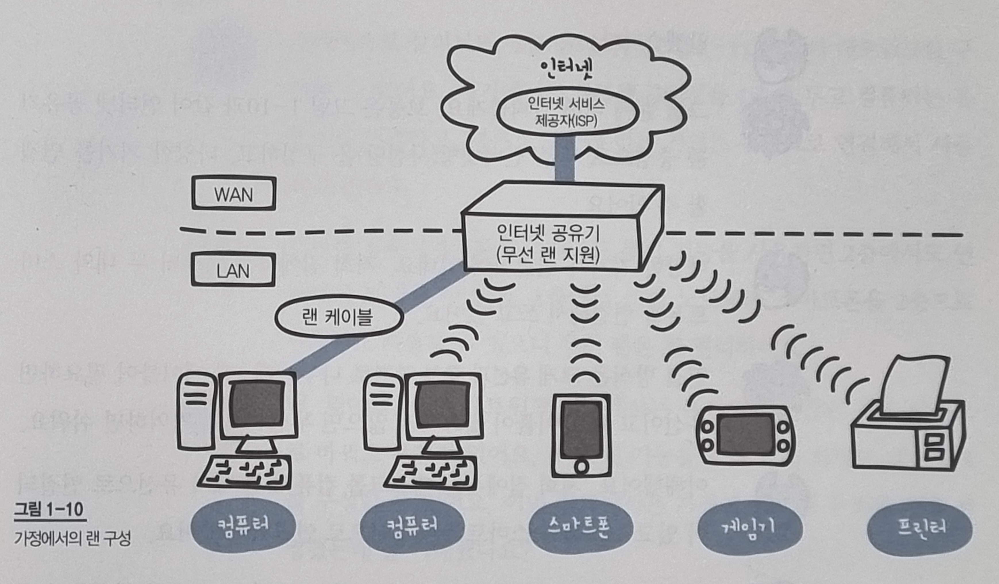

[프로그, "공유기는 어떻게 IP를 할당할까 - 인터넷 공유기 원리", 2020.04.19](https://m.blog.naver.com/kim04099/221917309214)
위 포스팅을 참고하여 작성하였습니다.

- **WAN 측**
  - 공인 IP 주소: 인터넷 서비스 제공자(ISP)가 IP관리 기관(IANA)로부터 받은 공인 IP를 공유기마다 할당
  - 인터넷 회선: 광 케이블 등의 회선으로 인터넷 서비스 제공자(ISP)가 가진 인터넷 인프라에 연결
- **LAN 측**
  - 사설 IP 주소: 공유기와 같은 네트워크 장비에 개별적으로 할당되어 해당 네트워크 장비에 연결된 로컬 네트워크 상에서만 통용되는 IP주소
  - 이더넷 케이블(랜선): LAN을 구축하기 위해 사용되는 케이블
- **NAT(Network Address Translation)**
  - 여러개의 사설 IP주소를 하나의 공인 IP주소에 매핑하는 기능
    - 장점: 제한된 IP주소(IPv4)를 효율적으로 사용할 수 있고, 외부에 드러나는 IP주소를 다르게 유지함으로써 보안기능을 가진다.
    - 단점: 패킷의 IP주소와 IP 주소를 바탕으로 생성된 정보를 재기록해야하기 때문에 지연이 발생한다.
- **PAT(Port Address Translation)**
  - 하나의 공인 IP주소로 여러개의 사설 IP주소로 분배해주기 위한 기능
  - 출발지와 목적지의 IP주소와 포트번호를 분석하여, 해당 통신을 식별할 수 있는 0~65535범위의 번호를 부여한다.
