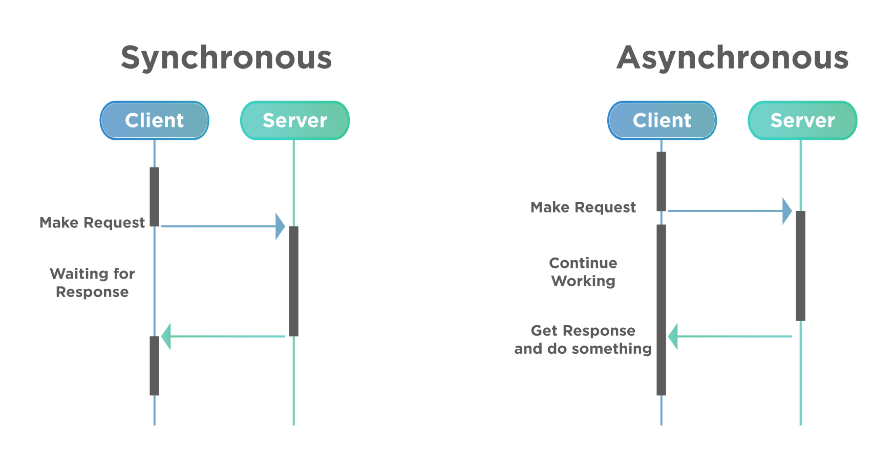
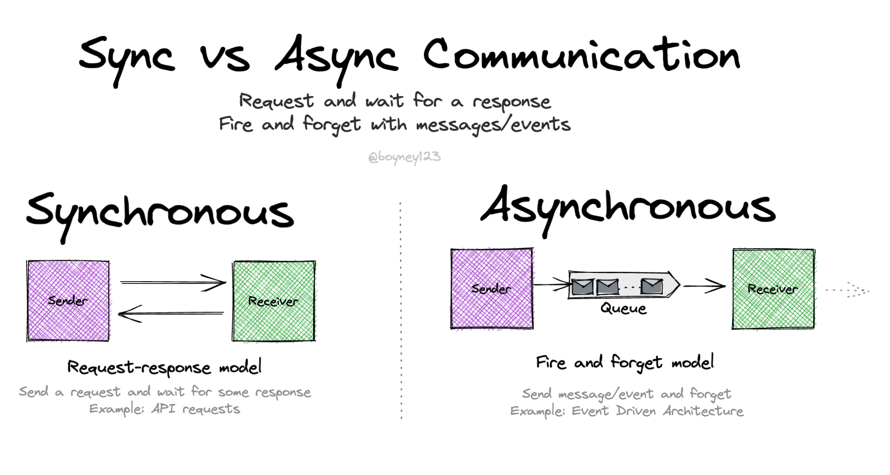
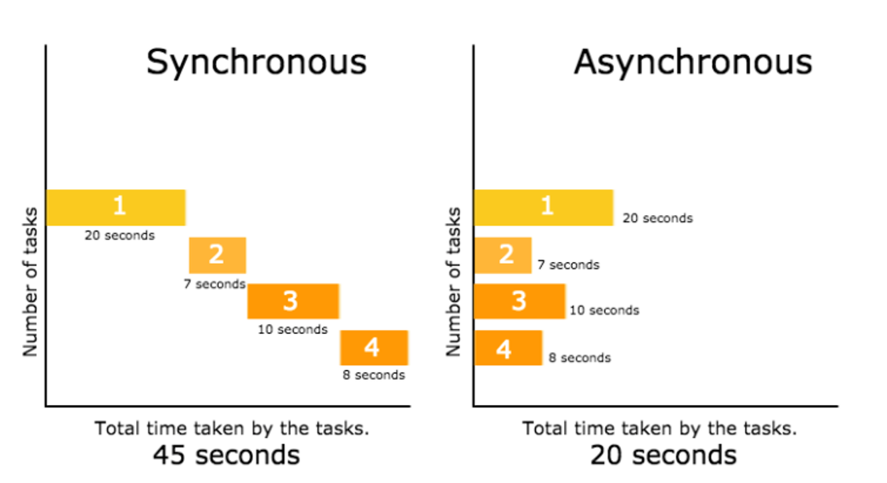
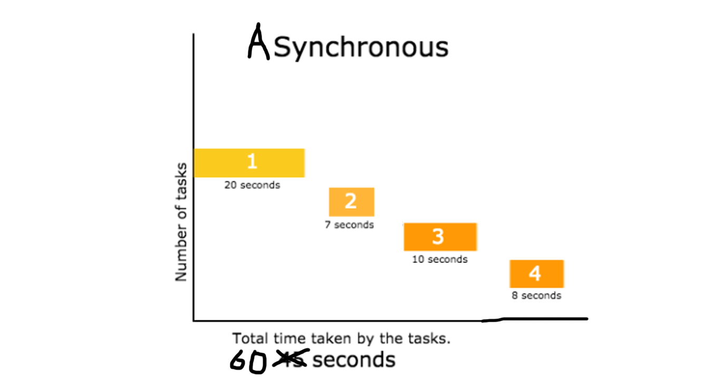
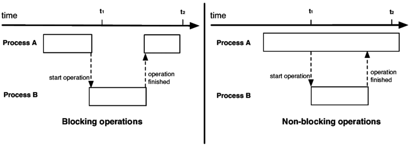
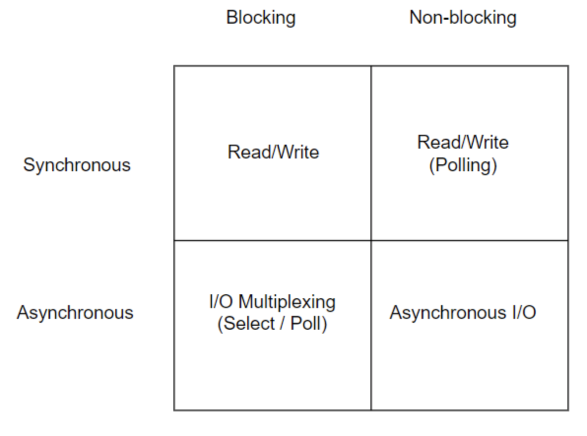
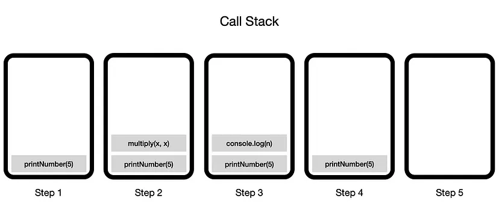
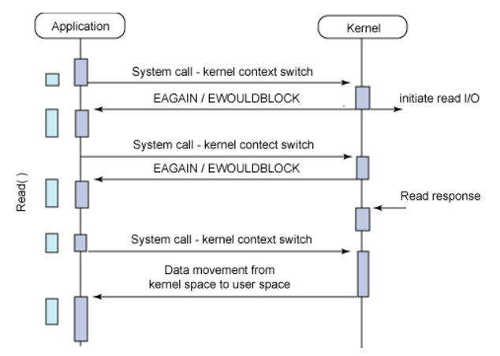
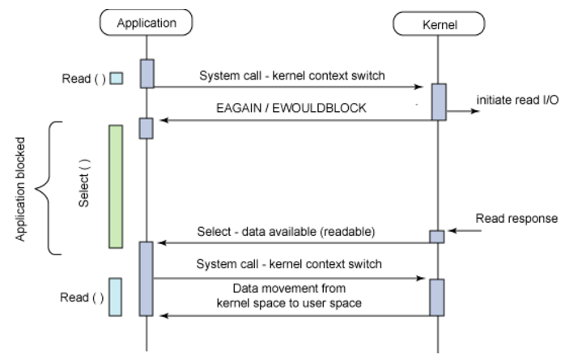

# 1. 핵심 요약

각 용어의 핵심 개념을 정리하면 다음과 같다.

- **Sync**
  - 두 작업 간의 문맥 교환이 동시적으로 이뤄지는 것을 말한다
- **Async**
  - 두 작업 간의 문맥 교환이 비동시적으로 이뤄지는 것을 말한다
- **Blocking**
  - 한 작업이 진행되는 동안 다른 작업이 대기하는 것을 말한다
- **Non-blocking**
  - 한 작업이 진행되는 동안 다른 작업이 대기하지 않고 진행되는 것을 말한다

위와 같이 Sync/Async와 Blocking/Non-Blocking의 개념적 차이가 있기는 하지만, <mark>일반적으로 Sync & Blocking 그리고 Async & Non-Blocking은 짝을 이룬다.</mark> 따라서 이들 간의 차이점보다 유사점에 주목하는 것이 실질적으로 프로그래밍에 더 도움이 될 것 같다.

# 2. Sync / Async

<mark>두 작업 간의 문맥 교환이 동기적으로 일어나는지 여부를 말한다.</mark>

## 2.1. sync / async 예시

동기/비동기를 다음 두가지 예시로 설명할 수 있다. 서로 다른 두 예시의 공통점에 주목하길 바란다.

- 호출자와 피호출자의 관점에서 보자면, **피호출자 작업이 끝남과 동시에 호출자의 작업이 재개**되는 것을 말한다.  
  아래 그림에서 Server의 작업이 끝나고, Client가 작업을 재개하는 데 <mark>시간차</mark> 있음을 주목하자
  

- 통신의 관점에서 보자면, **두 통신 주체의 정보교환 동기화** 되었는지를 말한다.
  

## 2.2. sync / async 예시..?

아래 그림은 'Sync/Async'를 검색했을 많이 나오는 그림인데, 나는 이 그림이 '동기/비동기' 개념을 이해하는데 혼동을 불러일으킨다고 생각한다. 아래 그림은 '동기/비동기'보다 **'싱글 프로세스/멀티 프로세스'에 더 적합한 그림**이다.

그렇다고 위 그림이 틀렸다는 말은 아니다. 내가 하고 싶은 말은, 멀티 태스킹이 비동기 프로그래밍에서 빈번하게 발생하지만, 그렇다고 **멀티 태스킹이 곧 비동기 프로그래밍은 아니라는 것**이다. 예를 들어 아래같은 상황도 비동기 프로그래밍의 한 예시이다.

# 3. Blocking / Non-blocking

<mark>한 작업이 진행되는 동안 다른 작업이 대기하는지 여부를 말한다.</mark>

## 3.1. Blocking / Non-blocking 예시

- 호출자와 피호출자의 관점에서 보자면, **피호출자 작업이 진행되는 동안 호출자의 작업이 대기**하는 것을 말한다.

    

# 4. Cross Over Table

이렇게 4가지 개념을 정리하고 나면, 높은 확률로 아래 테이블을 마주하게 된다. 보자마자 들었던 생각은 'Synchronous & Non-blocking 하고 Asynchronous & Blocking은 대체 뭐지?'였는데, 결론만 말하면 그 정도로 드문 케이스라는 것이다.

# 4.1. Synchronous & Blocking

<mark>일반적으로 프로그래밍 언어는 Synchronous하고 Blocking하게 동작한다.</mark> 코드가 실행되면서 호출되는 함수들은 콜 스택에 쌓이게 된다. 이름이 "스택"인 만큼 LIFO으로 동작한다. 즉 **나중에 호출된 함수가 완료되고 나서야, 그 전에 호출했던 함수가 이어서 동작**된다. 비동기 & 블로킹 방식의 특징과 동일하다.

## 4.2. Asynchronous & Non-blocking

<mark>대부분의 프로그래밍 언어는 I/O작업과 같이 오랜 시간이 걸리는 작업에 대해 Asynchronous하고 Non-blocking하게 동작한다.</mark> 콜 스택 방식으로 I/O 작업을 처리할 경우, 뒤의 작업들이 오랜 시간 지연된다. 그래서 대부분의 프로그래밍 언어는 I/O과 같은 작업을 커널에 넘긴다.

커널이 I/O 작업을 다루는 동안 **메인 프로세스 뒤의 작업을 이어나간다 (논 블로킹)**. I/O 작업 완료 되면 **이벤트 핸들러 함수나 콜백 함수를 통해 처리한다 (비동기)**.

## 4.3. Synchronous & Non-blocking

<mark>두 작업이 동시에 일어나면서, 끊임없이 서로의 작업상태를 동기화하는 것을 말한다.</mark> 이련 경우가 뭐가 있나 했는데, [Inpa Dev님](https://inpa.tistory.com/entry/%F0%9F%91%A9%E2%80%8D%F0%9F%92%BB-%EB%8F%99%EA%B8%B0%EB%B9%84%EB%8F%99%EA%B8%B0-%EB%B8%94%EB%A1%9C%ED%82%B9%EB%85%BC%EB%B8%94%EB%A1%9C%ED%82%B9-%EA%B0%9C%EB%85%90-%EC%A0%95%EB%A6%AC#%EB%8F%99%EA%B8%B0synchronous_/_%EB%B9%84%EB%8F%99%EA%B8%B0asynchronous)이 적절한 예시를 들어주셨다. 바로 **게임 로딩 화면**이다. 클라이언트가 계속해서 화면을 렌더링하는 와중에(논브로킹), 로딩 진행률을 서버와 동기화해야한다(동기).

## 4.4. Asynchronous & Blocking

<mark>작업 상태를 동기화하지도 않을 거면서, 상대 작업이 끝나길 대기하는 괴상한 상태이다.</mark> [Ryan](https://interconnection.tistory.com/141)님이 예시로 **I/O Multiplexing을 위한 시스템 콜 Select와 Poll**을 들어주셨는데, 솔직히 뭔 말인지 잘 모르겠다. 아무튼 Asynchronous & Blocking의 작업 효율은 Synchronous & Blocking과 비슷하며, 대부분의 경우 **의도치 않은 개발 실수**일 것 이란다.

# 5. 참고자료

- [Blocking or Non-Blocking, Synchronous and Asynchronous](https://interconnection.tistory.com/141)
- [👩‍💻 완벽히 이해하는 동기/비동기 & 블로킹/논블로킹](https://inpa.tistory.com/entry/%F0%9F%91%A9%E2%80%8D%F0%9F%92%BB-%EB%8F%99%EA%B8%B0%EB%B9%84%EB%8F%99%EA%B8%B0-%EB%B8%94%EB%A1%9C%ED%82%B9%EB%85%BC%EB%B8%94%EB%A1%9C%ED%82%B9-%EA%B0%9C%EB%85%90-%EC%A0%95%EB%A6%AC)
- [WTF is Synchronous and Asynchronous!](https://medium.com/from-the-scratch/wtf-is-synchronous-and-asynchronous-1a75afd039df)
- [[10분 테코톡] 🐰 멍토의 Blocking vs Non-Blocking, Sync vs Async](https://www.youtube.com/watch?v=oEIoqGd-Sns&t=413s)
- [[10분 테코톡] 땡칠의 Blocking vs Non-Blocking과 Sync vs Async](https://www.youtube.com/watch?v=ohz7uHnza6A)
