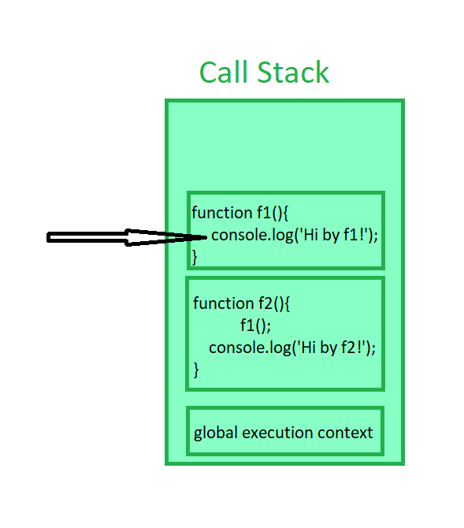
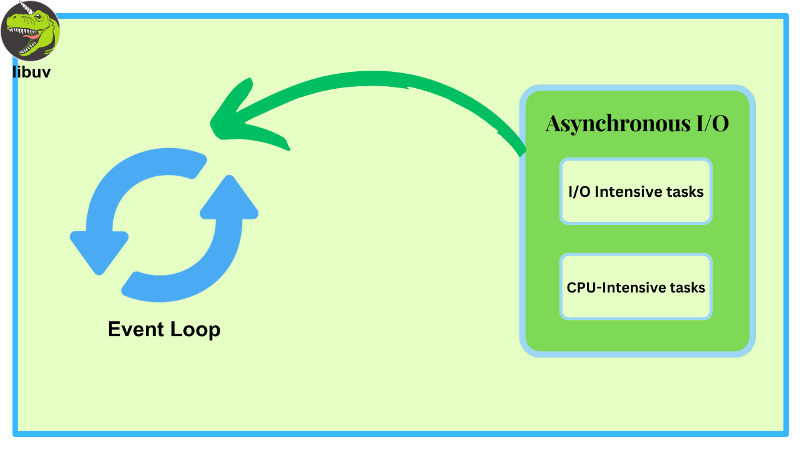

# 1. 핵심 요약

각 용어의 핵심 개념을 정리하면 다음과 같다.

- **Sync**
  - 두 작업 간의 문맥 교환이 동시적으로 이뤄지는 것을 말한다
- **Async**
  - 두 작업 간의 문맥 교환이 비동시적으로 이뤄지는 것을 말한다
- **Blocking**
  - 한 작업이 진행되는 동안 다른 작업이 대기하는 것을 말한다
- **Non-blocking**
  - 한 작업이 진행되는 동안 다른 작업이 대기하지 않고 진행되는 것을 말한다

그런데 희한하게 이 개념들에 대한 공식적인 정의를 찾아볼 수 없었다. 그나마 [Node.js 공식문서](https://nodejs.org/en/docs/guides/blocking-vs-non-blocking)에서 Blocking의 개념을 정의했는데, 이조차도 Node.js에서의 JavaScript로 범위가 매우 제한적이었다.

> Blocking is when the execution of additional JavaScript in the Node.js process must wait until a non-JavaScript operation completes. This happens because the event loop is unable to continue running JavaScript while a blocking operation is occurring. [Node.js]

내 결론은 Sync/Async와 Blocking/Non-Blocking의 개념 차이가 있지만, **이 들의 차이를 분석하려고 애쓰는 것 보다는 유사점에 주목하는 것이 실질적으로 프로그래밍에 더 도움이 될 것 같다.** 물론 아래 글 부터는 차이점에 집착할 얘정이다

# 2. Sync / Async

<mark>두 작업 간의 문맥 교환이 동기적으로 일어나는지 여부를 말한다.</mark>

## 2.1. sync / async 예시

- **호출자와 피호출자의 관점에서 보자면, 피호출자 작업이 끝남과 동시에 호출자의 작업이 재개**되는 것을 말한다.  
  아래 그림에서 Asynchronous의 Continue Working 보다, Server의 작업이 끝난 시간과 Client가 작업을 시작하는 시간에 gap이 있음에 주목하자
  

- **통신의 관점에서 보자면, 두 통신 주체의 정보교환 동기화 되어있는지**를 말한다.
  

위 두 개의 예시가 서로 상호배타적이지는 않지만, 동기/비동기의 개념을 잘 설명할 수 있을 것 같다.

## 2.2. sync / async 예시..?

아래와 같은 그림은 '동기/비동기' 개념의 의미를 잘 담았다고 생각하지 않는다. 'Sync/Async'를 검색했을 많이 나오는 그림이다. 그런데 딱 봐도 아래 그림은 **오히려 싱글 프로세스와 멀티 프로세스**에 더 적합한 그림이다.

비동기 프로그래밍에서 멀티 태스킹이 일어나는 경우가 빈번하지만, 멀티 태스킹이 비동기 프로그래밍의 필요조건은 아니다.

# 3. Blocking / Non-blocking

<mark>한 작업이 진행되는 동안 다른 작업이 대기하는지 여부를 말한다.</mark>

## 3.1. Blocking / Non-blocking 예시

- **호출자와 피호출자의 관점에서 보자면, 피호출자 작업이 진행되는 동안 호출자의 작업이 대기**하는 것을 말한다.

    

# 4. Cross Over Table

이렇게 4가지 개념을 정리하고 나면, 아래의 괴상망측한 테이블을 마주하게 된다.

보자마자 드는 생각이 **Synchronous & Non-blocking 하고 Asynchronous & Blocking이 뭐지**일텐데, 그 말인 즉슨 그만큼 쓰잘데기없다는 뜻이다.

# 4.1. Synchronous blocking

**일반적인 경우 대부분의 프로그래밍 언어는 Synchronous하고 Blocking하게 동작한다.**

코드가 실행되는 동안 호출되는 함수들은 Call stack에 쌓이게 된다. 이름이 Stack인 만큼 Last in, First Out으로 동작하기 때문에, **나중에 피호출된 함수가 완료되고 나서야, 해당 함수를 호출했던 함수가 바로 이어서 재개**된다.

## 4.2. Asynchronous Non-blocking

**역시 대부분의 프로그래밍 언어는 I/O작업과 같이 오랜 시간이 걸리는 작업에 대해 Asynchronous하고 Non-blocking하게 동작한다.**

앞 서 말한, 콜 스택 방식의 작업으로 I/O작업을 처리할 경우 너무 많은 시간이 낭비된다. 실질적으로 대부분의 작업은 커널에서 일어나는데, 그 시간 동안 코드를 읽는 작업이 놀고 먹는다는 말이다.

따라서 대부분의 언어, 진짜 거의 모든 언어는 **I/O 작업을 대기하지 않고 Non-blocking 방식으로 처리하며, 작업 완료 시 이벤트나 콜백을 사용하여 결과를 비동기적으로 처리한다.** 아래는 Node.js의 libuv 라이브러리를 이용한 비동기 처리를 나타낸 그림이다.

## 4.3. Synchronous Non-blocking

**두 작업이 동시에 일어나면서, 끊임없이 서로의 작업상태를 동기화하는 것을 말한다.**

이런 경우가 뭐가 있나 했는데, [Inpa Dev님](https://inpa.tistory.com/entry/%F0%9F%91%A9%E2%80%8D%F0%9F%92%BB-%EB%8F%99%EA%B8%B0%EB%B9%84%EB%8F%99%EA%B8%B0-%EB%B8%94%EB%A1%9C%ED%82%B9%EB%85%BC%EB%B8%94%EB%A1%9C%ED%82%B9-%EA%B0%9C%EB%85%90-%EC%A0%95%EB%A6%AC#%EB%8F%99%EA%B8%B0synchronous_/_%EB%B9%84%EB%8F%99%EA%B8%B0asynchronous)이 아주 직관적인 예시를 들어주셨다. 바로 **게임 로딩 화면**이다. 렌더링 프로세스는 **계속해서 화면을 렌더링**하는 와 중에, **로딩 진행사항을 전달받아 동기화**해야한다.

## 4.4. Asynchronous Blocking

**작업 상태를 동기화하지도 않을 거면서, 다른 작업이 끝나기까지 대기하는 괴상한 상태이다.**

[Ryan](https://interconnection.tistory.com/141)님이 I/O Multiplexing을 위한 OS의 **Select와 Poll 시스템 콜**을 예시로 들어주셨는데, 솔직히 뭔 말인지 잘 모르겠다.

뒤 이어 나온 설명이 그나마 도움이 되었다. Asynchronous Blocking의 작업 효율은 Synchronous Blocking과 비슷하며, **대부분의 경우 의도치 않은 개발 실수**라고 한다.

# 5. 참고자료

- [Blocking or Non-Blocking, Synchronous and Asynchronous](https://interconnection.tistory.com/141)
- [👩‍💻 완벽히 이해하는 동기/비동기 & 블로킹/논블로킹](https://inpa.tistory.com/entry/%F0%9F%91%A9%E2%80%8D%F0%9F%92%BB-%EB%8F%99%EA%B8%B0%EB%B9%84%EB%8F%99%EA%B8%B0-%EB%B8%94%EB%A1%9C%ED%82%B9%EB%85%BC%EB%B8%94%EB%A1%9C%ED%82%B9-%EA%B0%9C%EB%85%90-%EC%A0%95%EB%A6%AC)
- [WTF is Synchronous and Asynchronous!](https://medium.com/from-the-scratch/wtf-is-synchronous-and-asynchronous-1a75afd039df)
- [[10분 테코톡] 🐰 멍토의 Blocking vs Non-Blocking, Sync vs Async](https://www.youtube.com/watch?v=oEIoqGd-Sns&t=413s)
- [[10분 테코톡] 땡칠의 Blocking vs Non-Blocking과 Sync vs Async](https://www.youtube.com/watch?v=ohz7uHnza6A)
