# 1. CI/CD 구상도

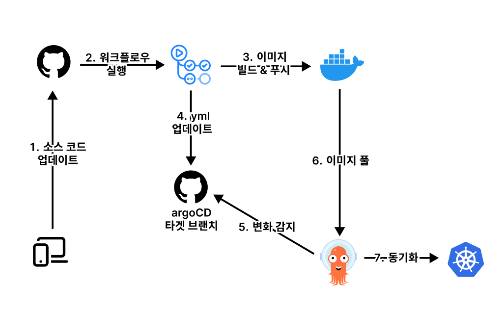

개인적으로 CI/CD를 구축하는 데 있어 가장 큰 어려움은, 기술적인 난이도보다 전체 아키텍쳐 구성의 이해에 있는 것 같다. 위 아키텍쳐의 실제 동작 순서는 아래와 같다.

1. Github 레포지토리에 이벤트가 발생한다.
2. Gtihub Actions 워크플로우가 동작한다.
   1. 프로젝트를 Docker 이미지로 빌드하고 DockerHub에 푸시한다.
   2. argoCD가 바라보는 타겟 폴더의 yaml 파일을 업데이트 한다.
3. argoCD가 변화를 자동으로 감지하고, 쿠버네티스 클러스터를 업데이트 한다.

## 1.1. argoCD 란?

argoCD는 <mark>git 레포지토리의 어플리케이션 상태에 쿠버네티스 클러스터를 동기화시키는 도구</mark>이다. argoCD가 git 레포지토리의 특정 브랜치의 특정 폴더를 바라보도록 할 수 있다. 만일 해당 경로에 쿠버네티스 설정(yml)파일이 있다면, argoCD는 이를 자동으로 클러스터에 배포한다. 또한 기본값으로 3분마다 파일 변화를 관측하여 클러스터를 동기화한다.

argoCD는 이 모든 설정이 의심스러울 정도로 간단한다. Jenkins를 사용할 때는 git에서 Webhook을 날리기 위해 상호 간 token을 등록해야 했는데, argoCD는 그런 것도 없다. argoCD 측에서 일방적으로 git 레포지토리를 관측하도록 설정할 수 있다.

## 1.2. kustomize 란?

kustomize는 <mark>원본 쿠버네티스 설정 파일을 유지한 채, 손쉬운 편집을 도와주는 도구</mark>이다. git이 업데이트 되면 프로젝트가 다시 빌드되고 도커 이미지 버전이 업데이트된다. 그러면 쿠버네티스 설정 파일의 이미지 버전 또한 수정해줘야한다. 다른 설정은 유지한 채 어떻게 이미지 버전만 업데이트할 수 있을까? CLI 명령어로 장인정신을 발휘해야하나 고민하던 찰나 kustomize를 알게 되었다.

**argoCD에는 기본적으로 kustomize가 탑재되어 있다.** 따라서 타겟 폴더에 `kustomization.yml`파일이 있다면, 자동으로 `kustomize` 명령어를 활용해서 클러스터를 동기화한다.

### 1.2.1. 도커 이미지 업데이트

kustomize로 기존 설정파일을 유지한 채 손쉽게 이미지 버전을 업데이트 할 수 있다. 아래와 같이 설정파일을 작성하고 `kustomize` 명령어를 실행하면 8.0버전의 mySQL 파드가 실행된다.

```yml
# mysql.yml
apiVersion: apps/v1
kind: Deployment
metadata:
  name: mysql-dp

spec:
  selector:
    matchLabels:
      app: mysql
  template:
    metadata:
      labels:
        app: mysql
    spec:
      containers:
        - image: mysql:latest
          name: mysql
          env:
            - name: MYSQL_ROOT_PASSWORD
              value: 'password'

---
apiVersion: v1
kind: Service
metadata:
  name: mysql-svc
spec:
  ports:
    - port: 3306
  selector:
    app: mysql
```

```yml
# kustomization.yml
apiVersion: kustomize.config.k8s.io/v1beta1
kind: Kustomization

resources:
  - mysql.yml # 타겟 파일

images:
  - name: mysql
    newTag: 8.0 # 타겟 태그
```

```bash
kubectl kustomize { kustomization 파일 위치 }
```

# 2. argoCD 구성

argoCD를 구성하기 위해서는 사전에 쿠버네티스 클러스터가 구성되어 있어야 한다. [argoCD 공식문서](https://argo-cd.readthedocs.io/en/stable/getting_started/)를 따라 argoCD를 설치한다.

## 2.1. argoCD 설치

`argocd` 네임스페이스를 생성하여 argoCD 관련 리소스를 모아 관리한다.

```bash
kubectl create namespace argocd
kubectl apply -n argocd -f https://raw.githubusercontent.com/argoproj/argo-cd/stable/manifests/install.yaml
```

## 2.2. argoCD 노출

argoCD 웹 대쉬보드에 접근하기 위해서는 서비스를 외부로 노출시켜야 한다. [공식문서](https://argo-cd.readthedocs.io/en/stable/getting_started/#3-access-the-argo-cd-api-server) 상황에 따라 다양한 방법을 알려주고 있다. 나는 k3s의 Traefik Ingress를 사용했기 때문에 [IngressRoute](https://argo-cd.readthedocs.io/en/stable/operator-manual/ingress/#ingressroute-crd)를 띄워 접근하려고 했으나 잘 동작하지 않았다. (지금 다시 보니까 URL prefix 관련 설정을 커스텀하지 않아서일 수도...)

고민 끝에 다음과 같은 임시방편을 사용했다. 아래 명령어를 돌리면 외부에서 임시적으로 웹 대시보드에 접근할 수 있다. 하지만 CLI 프로세스가 중지되면 곧바로 닫힌다. 참고로 웹 대시보드에 접근하지 못할 뿐이지 argoCD는 정상 작동한다.

```bash
# "IP주소:8080"로 접근
kubectl port-forward --address=0.0.0.0 svc/argocd-server -n argocd 8080:443
```

## 2.3. argoCD 로그인

기본 ID는 `admin`이고, 비밀번호는 아래 명령어로 찾을 수 있다.

```bash
kubectl get secret -n argocd argocd-initial-admin-secret -o jsonpath="{.data.password}" | base64 -d
```


# 3. CI/CD 구축

## 3.1. argoCD 타겟 브랜치 생성

타겟 브랜치란 argoCD가 쿠버네티스가 클러스트 동기화를 위해 바라보는 곳이다. 소스 코드가 빌드된 뒤에 타겟 브랜치에 있는 `yaml`파일이 업데이트 된다. 원본 소스코드 레포지토리와 동일해도 상관은 없지만, 나는 커밋 내역을 분리하기 위해 별도 브랜치를 생성했다.

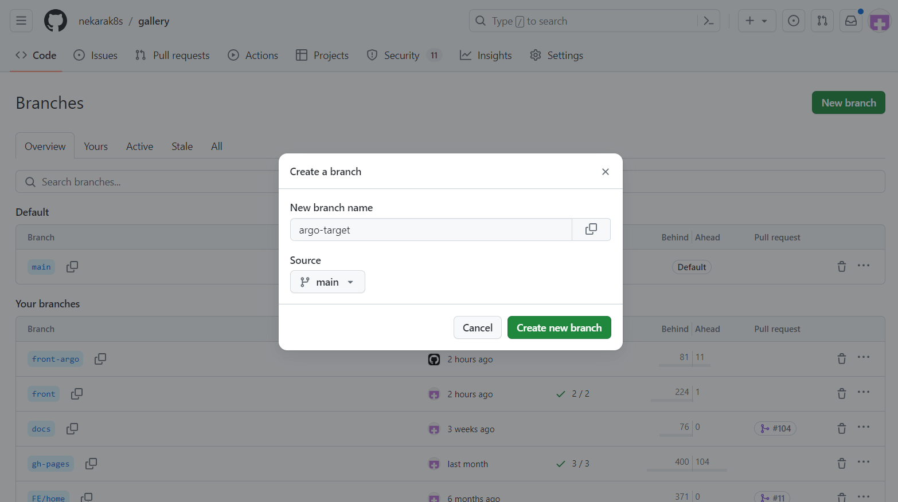

그리고 `/config/deploy` 경로에 프로젝트마다 폴더를 만들어 yml파일이 관리했다. 참고로 우리는 프론트 1개, 백엔드 게이트웨이 1개, 스프링부트 MSA 3개 총 5개의 프로젝트를 관리했다.


### 3.1.1. React 예시

```yml
# react.yml
apiVersion: apps/v1
kind: Deployment
metadata:
  name: react-dp
spec:
  selector:
    matchLabels:
      app: react
  template:
    metadata:
      labels:
        app: react
    spec:
      containers:
        - image: byongho/gallery-react:1.0.0
          name: react
          ports:
            - containerPort: 80

---
apiVersion: v1
kind: Service
metadata:
  name: react-svc
spec:
  ports:
    - port: 80
  selector:
    app: react
```

```yml
# kustomization.yml
apiVersion: kustomize.config.k8s.io/v1beta1
kind: Kustomization

resources:
  - react.yml

images:
  - name: byongho/gallery-react
    newTag: 2196905e2ca3c8fd756293eb6565a393f433e91b # github-actions 워크플로우에서 생성하는 해쉬값으로, 초기값은 아무거나 집어 넣는다.
```

### 3.1.2. SpringBoot 예시

```yml
# gateway.yml
apiVersion: apps/v1
kind: Deployment
metadata:
  name: gateway-dp

spec:
  selector:
    matchLabels:
      app: gateway
  template:
    metadata:
      labels:
        app: gateway
    spec:
      containers:
        - image: chancehee/gallery-gateway
          name: gateway
          env:
            - name: GALLERY_MEMBER_HOST
              value: 'member-svc:8001'
            - name: GALLERY_GALLERY_HOST
              value: 'gallery-svc:8002'
            - name: GALLERY_POST_HOST
              value: 'post-svc:8003'
          ports:
            - containerPort: 8000

---
apiVersion: v1
kind: Service
metadata:
  name: gateway-svc
spec:
  ports:
    - port: 8000
  selector:
    app: gateway
```

```yml
# kustomization.yml
apiVersion: kustomize.config.k8s.io/v1beta1
kind: Kustomization

resources:
  - gateway.yml

images:
  - name: chancehee/gallery-gateway
    newTag: 6919d288ad46de5a0129f0883fb9bf3ed2b8c4a5 # github-actions 워크플로우에서 생성하는 해쉬값으로, 초기값은 아무거나 집어 넣는다.
```

## 3.2. argoCD 연동

이제 argoCD 웹 대쉬보드에 접속하여 앱을 생성한다. 위에서 만든 git 레포지토리의 타겟 브랜치와 폴더를 바라보도록 설정해준다.


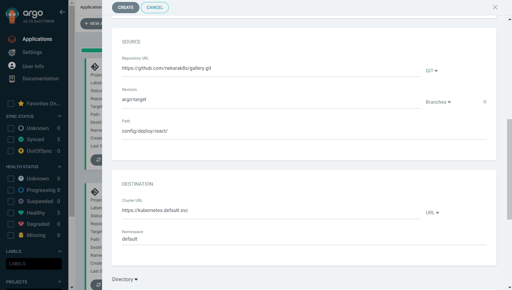

## 3.3. Github Actions 워크플로우 Secret 등록

Secret는 Github Actions에서 사용되는 **비밀 환경변수**이다. key-value 형식으로 접근할 수 있으며, 외부에 공개되지 않기 때문에 application.properties와 같은 민감정보를 담을 수 있다.

### 3.3.1. Docker 토근 등록

Github Actions에서 Dockerhub에 이미지를 푸시하기 위해서는 Dockerhub 토큰을 등록해줘야 한다.

1. Dockerhub에 로그인 한 후 계정 정보에 들어간다.
   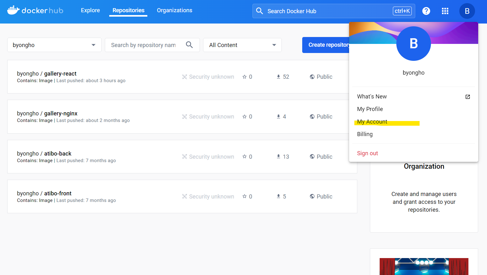

2. Write 권한을 포함하는 토큰을 생성한다.
   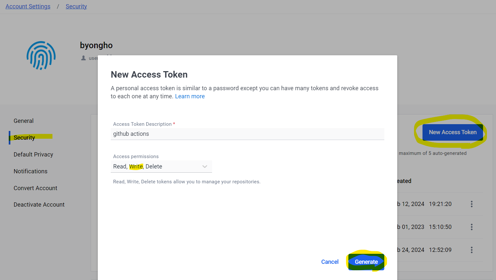

3. Git 레포지토리 Secret 설정 화면에 들어간다.
   

4. Dockerhub 토큰을 등록한다. Key 값은 원하는대로 지정하고 나중에 워크플로우에서 잘 참조하면 된다.
   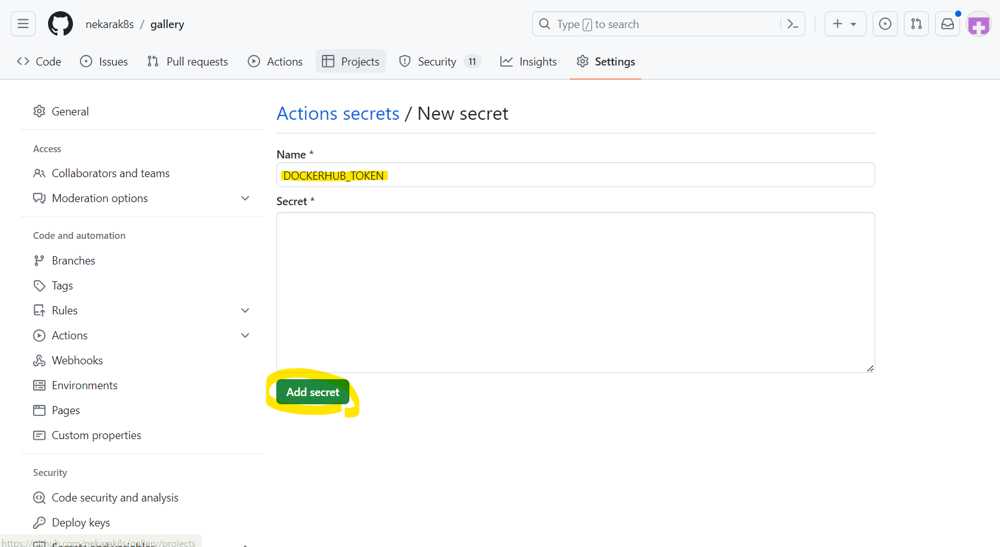

### 3.3.2. 환경변수 (.env, application.yml)

.env나 application.yml 같은 파일 단위의 환경 변수는 **그대로 등록해주면 된다**. 이후 워크플로우 내에서 그대로 출력하여 파일로 생성할 것이다.

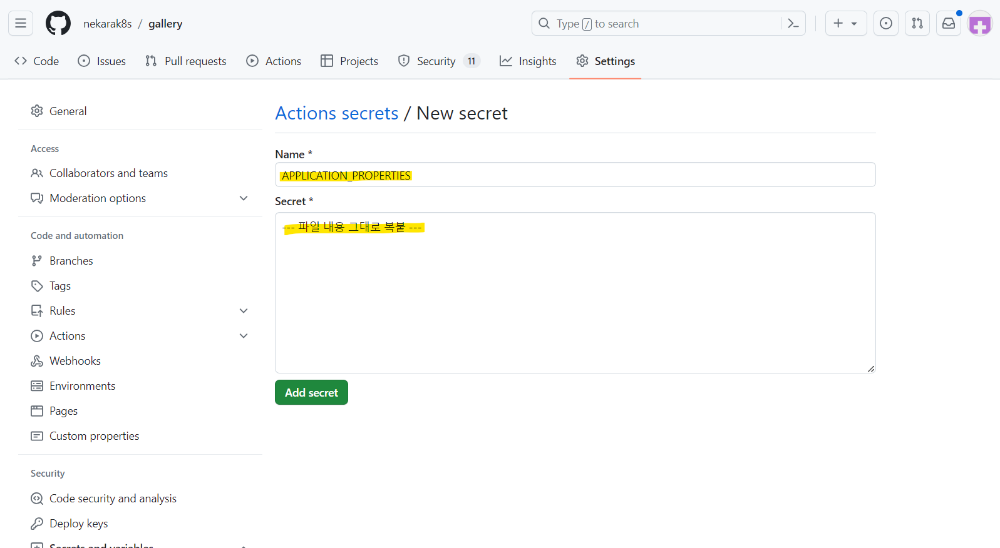

## 3.4. Github Actions 워크플로우 작성

앞서 등록한 Secret을 참조하여 워크플로우의 상세내용은 각자 커스텀하면 된다. 전체적인 플로우는 <mark>**"프로젝트 빌드 -> 도커 이미지 생성 -> 도커 이미지 푸시 -> argoCD 타겟 브랜치 yml파일 업데이트"**</mark>를 따른다.

한가지 주의할 점은 아래 워크 플로우의 `secrets.GITHUB_TOKEN`는 따로 등록해준 Secret이 아니다. 이는 워크플로우가 자체적으로 생성하는 토큰값으로, 워크플로우가 트리거된 레포지토리에 재접근할 수 있는 권한을 부여한다. 다만 이를 위해서는 'Settings > Actions > General'에서 다음과 같이 체크되어 있어야 한다.

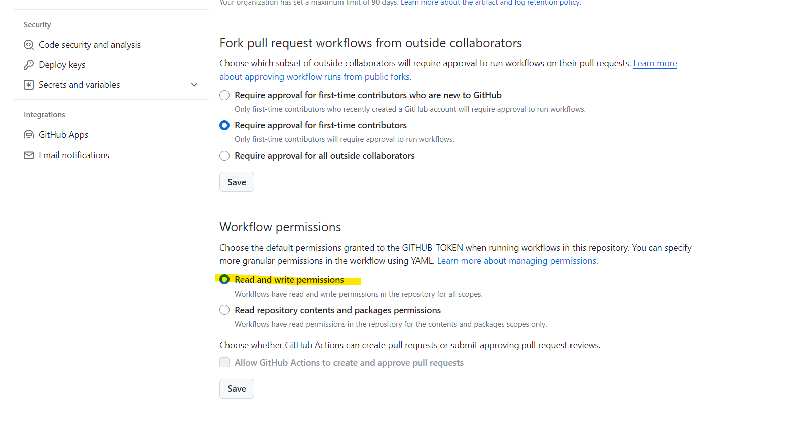

### 3.4.1. React 예시

```yml
name: CI

on:
  push:
    branches:
      - front # 워크 플로우를 트리거할 브랜치

env:
  IMAGE_NAME: gallery-react

jobs:
  docker-build-and-deploy:
    runs-on: ubuntu-latest

    defaults:
      run:
        shell: bash
        working-directory: ./frontend

    steps:
      - name: Checkout code
        uses: actions/checkout@v3

      - name: Setup Node # Node 환경 셋팅
        uses: actions/setup-node@v3
        with:
          node-version: '18'

      - name: Cache dependencies # 패키지 정보 캐싱 (선택 사항)
        uses: actions/cache@v3
        with:
          path: ~/.npm
          key: ${{ runner.os }}-node-${{ hashFiles('**/package-lock.json') }}
          restore-keys: D
            ${{ runner.os }}-node-

      - run: npm ci # 패키지 설치
      - run: npm run build # 프로젝트 빌드

      - name: Login to Docker Hub # Dockerhub 로그인
        uses: docker/login-action@v1
        with:
          username: ${{ secrets.FRONT_DOCKER_USERNAME }}
          password: ${{ secrets.FRONT_DOCKER_TOKEN }}

      - name: Build Docker image # Docker 이미지 빌드
        run: docker build -t ${{ secrets.FRONT_DOCKER_USERNAME }}/${{ env.IMAGE_NAME }}:${{ github.sha }} .

      - name: Push Docker image # Docker 이미지 푸시
        run: docker push ${{ secrets.FRONT_DOCKER_USERNAME }}/${{ env.IMAGE_NAME }}:${{ github.sha }}

  kustomize-update:
    runs-on: ubuntu-latest
    needs: docker-build-and-deploy # 전 단계 완료 후 진행 (순서 보장)

    steps:
      - name: Checkout repository
        uses: actions/checkout@v2

      - name: Switch to front-argo branch # 타겟 브랜치로 변경
        run: |
          git fetch
          git checkout front-argo

      - name: Set Kustomize # Kustomize 셋팅
        uses: yokawasa/action-setup-kube-tools@v0.9.2
        with:
          kustomize: '3.7.0'

      - name: Update kubernetes manifest # kustomization.yml 파일의 도커 이미지 버전 업데이트 후 커밋
        run: |
          cd config/deploy/react/
          kustomize edit set image ${{ secrets.FRONT_DOCKER_USERNAME }}/${{ env.IMAGE_NAME }}:${{ github.sha }}
          git config user.name "GitHub Actions"
          git config user.email "<>"
          git add .
          git commit -m 'k8s manifest for ${{ github.sha }}'

      - name: Push changes # 커밋 내역 푸시
        uses: ad-m/github-push-action@master
        with:
          github_token: ${{ secrets.GITHUB_TOKEN }} # 워크 플로우 자체 생성 토큰
          branch: front-argo
```

### 3.4.2. SpringBoot 예시

```yml
name: CI

on:
  push:
    branches:
      - back-gateway # 워크 플로우를 트리거할 브랜치

env:
  IMAGE_NAME: gallery-gateway

jobs:
  docker-build-and-deploy:
    runs-on: ubuntu-latest

    defaults:
      run:
        shell: bash
        working-directory: ./backend/gateway

    steps:
      - name: Checkout code
        uses: actions/checkout@v3

      - name: Set up JDK 11 # JDK 환경 셋팅
        uses: actions/setup-java@v2
        with:
          distribution: 'adopt'
          java-version: '11'

      - name: Retrieve application properties # Secret 정보 application.yml 파일로 추출
        env:
          APPLICATION_PROPERTIES: ${{ secrets.GATEWAY_APPLICATION_PROPERTIES }}
        run: |
          mkdir ./src/main/resources
          touch ./src/main/resources/application.yml
          echo "${APPLICATION_PROPERTIES}" > ./src/main/resources/application.yml

      - name: Build Spring Boot application # 프로젝트 빌드
        run: ./gradlew clean build -x test

      - name: Login to Docker Hub # Dockerhub 로그인
        uses: docker/login-action@v1
        with:
          username: ${{ secrets.BACK_DOCKER_USERNAME }}
          password: ${{ secrets.BACK_DOCKER_TOKEN }}

      - name: Build Docker image # Docker 이미지 빌드
        run: docker build -t ${{ secrets.BACK_DOCKER_USERNAME }}/${{ env.IMAGE_NAME }}:${{ github.sha }} .

      - name: Push Docker image # Docker 이미지 푸시
        run: docker push ${{ secrets.BACK_DOCKER_USERNAME }}/${{ env.IMAGE_NAME }}:${{ github.sha }}

  kustomize-update:
    runs-on: ubuntu-latest
    needs: docker-build-and-deploy # 전 단계 완료 후 진행 (순서 보장)

    steps:
      - name: Checkout repository
        uses: actions/checkout@v2

      - name: Switch to gateway-argo branch # 타겟 브랜치로 변경
        run: |
          git fetch
          git checkout gateway-argo

      - name: Set Kustomize # Kustomize 셋팅
        uses: yokawasa/action-setup-kube-tools@v0.9.2
        with:
          kustomize: '3.7.0'

      - name: Update kubernetes manifest # kustomization.yml 파일의 도커 이미지 버전 업데이트 후 커밋
        run: |
          cd config/deploy/gateway/
          kustomize edit set image ${{ secrets.BACK_DOCKER_USERNAME }}/${{ env.IMAGE_NAME }}:${{ github.sha }}
          git config user.name "GitHub Actions"
          git config user.email "<>"
          git add .
          git commit -m 'k8s manifest for ${{ github.sha }}'

      - name: Push changes # 커밋 내역 푸시
        uses: ad-m/github-push-action@master
        with:
          github_token: ${{ secrets.GITHUB_TOKEN }} # 워크 플로우 자체 생성 토큰
          branch: gateway-argo
```

# 4. 실행화면

1. **github-actions 워크플로우 실행**  
   git 레포지토리의 특정 브랜치에 소스코드가 푸시되면, 해당 브랜치에 연결된 워크플로우가 자동으로 실행된다.  
   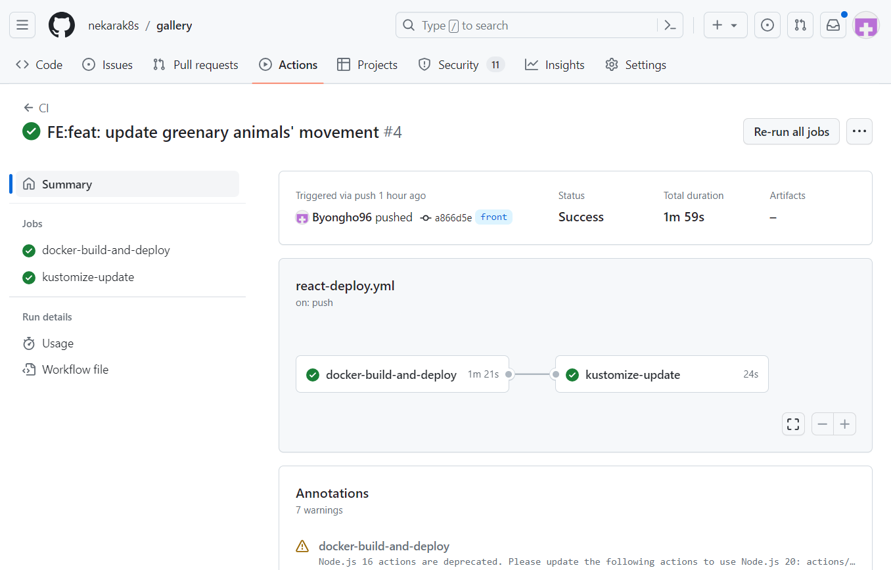
2. **kustomization.yml 파일 업데이트**  
   argoCD 타겟 브랜치에 있는 kustomization 파일의 이미지 버전이 업데이트 된 것을 확인할 수 있다.  
   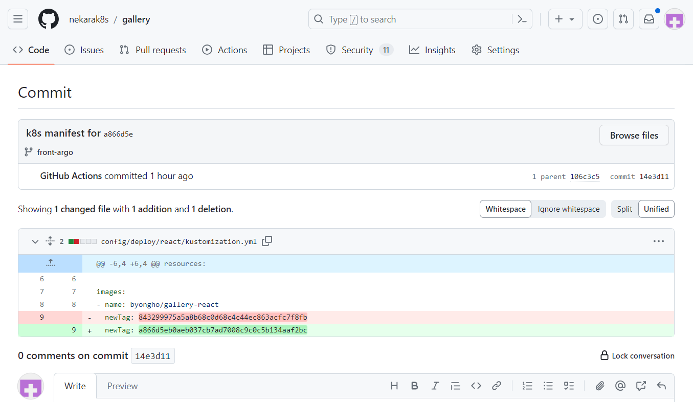
3. **Dockerhub 이미지 푸쉬**  
   kustomization 파일과 동일한 이미지 버전이 Dockerhub에 푸시되었다.  
   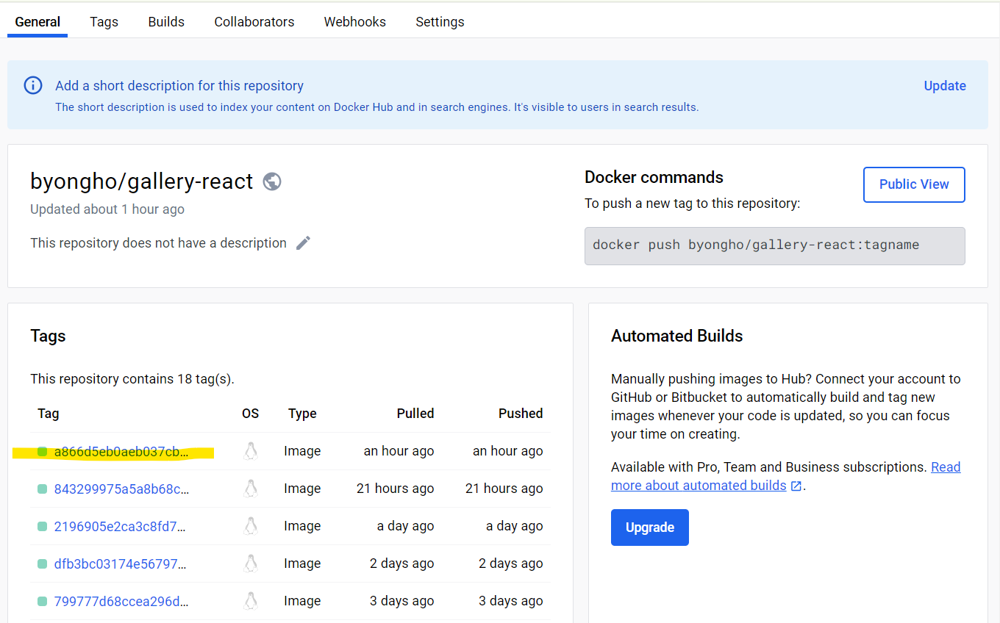
4. **argoCD 자동 실행**  
   3분 이내에 argoCD가 타겟 브랜치의 설정파일과 쿠버네티스를 동기화한다. 파드는 자동으로 교체되지만, 레플리카 셋은 기본으로 최근 10개까지를 기억한다.  
   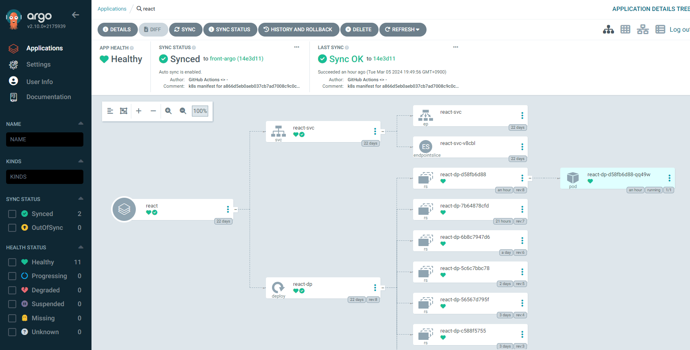

# 참고자료

- [argoCD 공식문서: Getting Started](https://argo-cd.readthedocs.io/en/stable/getting_started/#getting-started)
- [악분의 블로그: Kustomize 빠르게 시작하기](https://malwareanalysis.tistory.com/402)
