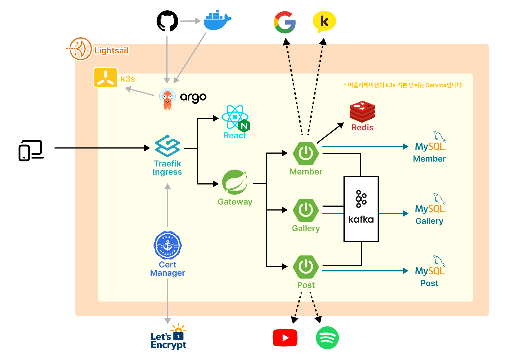
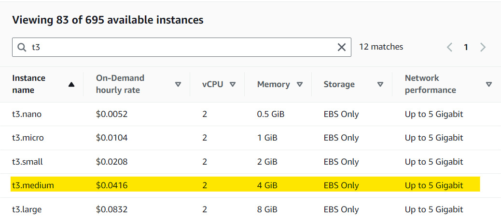
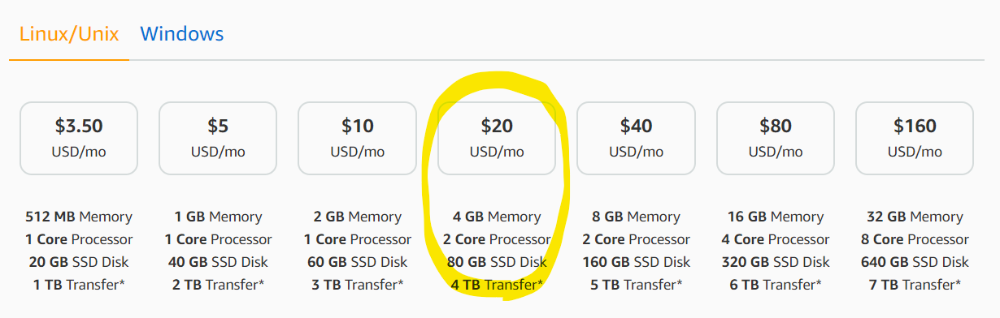
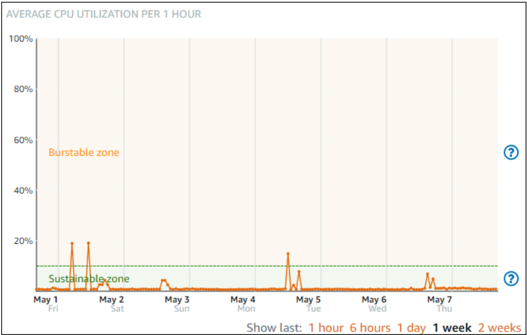

# 1. 프로젝트 개요


백엔드 개발자 친구와 함께 **쿠버네티스를 연습하기 위한 토이프로젝트**를 만들었다. 명색이 쿠버네티스 프로젝트인데 MSA를 안할 수 없었다. 백엔드가 MSA를 적용하느라 바쁜데, 나라고 놀고 있을 수만은 없어 Three.js를 적용했다. 당초 한달만에 마무리하기로한 프로젝트는 어쩌다보니 반년 가까이 이어졌다. 오늘(2024.01.21) 기준으로 접속은 가능한데 아직 자잘한 에러가 많아서 수정 중이다.

# 2. 아키텍쳐 구상도



<mark>AWS Lightsail 인스턴스에 k3s를 직접 설치해서 클러스터를 구성했다</mark>. 이러한 결정에는 금전적인 요인이 크게 작용했다. EKS의 시간당 사용료가 0.1달러에서 시작했는데, 한달을 서비스하면 최소 72달러(약 97000원)이다. 안그래도 요즘 주머니 사정이 안좋아 유튜브 프리미엄도 해지했는데 말이다. 그래서 우리가 생각해낸 것이 바로 Lightsail과 k3s다! 24시간 운영한다 가졍했을 때 Lightsail은 EC2보다 더 저렴했고, k3s는 쿠버네티스의 경량화 버전으로 메모리 사용량이 적다.

## 2.1. Lightsail 이란?

지금까지 항상 EC2를 사용했는데 이번 기회로 Lightsail을 구매했다. EC2는 사용량(시간, 트래픽)에 따라 과금되는 방식이라면, Lightsail은 구독형 서비스처럼 월 요금에 따라 가용자원이 달라진다. 단순 계산 결과만 보면 CPU 2 코어, 메모리 4GB를 24시간 30일 구동했을 때, <mark>EC2는 30달러 / Ligthsail은 20달러이다.</mark> 거기에 Ligthsail의




물론 모든 것이 다 좋을 수는 없다. Ligthsail은 CPU 사용에 대해서만큼은 아주 엄격하다. Lightsail은 기본적으로 CPU 사용량을 Burst Zone과 Sustainable Zone을 나눈다. CPU 사용량에 높아져 Burst zone에 들어서게 되면 나에게 할당된 CPU 크레딧을 줄어들기 시작한다. 그리고 CPU 크레딧이 0까지 모두 소모하게 되면 인스턴스가 멈춘다😱. 반대로 CPU 사용량이 Sustainable Zone에 있을 때는 소모된 CPU 크레딧이 채워진다.

따라서 Lightsail은 CPU 사용량이 많은 서비스에는 적합하지 않다고 한다. 우리도 한번 Burst Zone에 계속 머무르면서 인스턴스가 한 번 멈췄다. Kafka같은 프로그램이 무한루프에 빠진 것인지, 아니면 외부 공격이 있었는지 모르겠다. 일단 다시 재가동했을 때 Sustainable Zone에 있어서 한 번 더 믿어보기로 했다. 또 다시 인스턴스가 멈추면 EC2로 넘어갈 예정이다.



## 2.2. k3s 이란?

k3s는 쉽게 말해 쿠버네티스(k8s)의 경량화 버전이다. 기존 쿠버네티스보다 절반밖에 메모리를 사용하지 않으며, 가볍고 ARM 아키텍처를 지원하는 탓에 IoT 디바이스에도 적합하다고 한다.

|     | CPU 최소 | CPU 권장 | RAM 최소 | RAM 권장 |
| --- | -------- | -------- | -------- | -------- |
| k3s | 1 코어   | 2 코어   | 512MB    | 1GB      |
| k8s | 2 코어   |          | 2GB      |          |

기본적인 아키텍쳐는 쿠버네티스와 동일하다. 쿠버네티스와 똑같이 마스터 노드와 워커 노드가 있다. k3s에서는 이것을 서버 노드와 에이전트 노드라고 부른다. 하지만 우리는 어차피 인스턴스가 하나밖에 없으므로 마스터 노드 하나로 단일 클러스터를 구성했다. 그 외 쿠버네티스의 일부 기능을 포함하지 않는다고는 하는데, 이제 막 입문하는 수준에서는 차이를 경험하지 못했다.


재밌는 것은 가볍기 때문에 기존 쿠버네티스의 일부 기능을 포함하지 않지만, 반대로 일부 편의 기능은 이미 구현되어 있다. 대표적으로 인그레스가 기본 탑재되어 있다. 이걸 몰랐던 우리는 엄청난 삽질과 좌절의 시간을 거쳐야만 했다. k3s를 사용하면 쿠버네티스가 아닌 [k3s 공식문서](https://docs.k3s.io/)를 보도록 하자...

# 3. 사전 준비

## 3.1. Lightsail 구매

[Inpa Dev님의 "Lightsail 사용법 총정리"](https://inpa.tistory.com/entry/AWS-%F0%9F%93%9A-Amazon-Lightsail-%EC%82%AC%EC%9A%A9%EB%B2%95-%EC%9B%B9%EC%84%9C%EB%B9%84%EC%8A%A4%EB%A5%BC-%EB%9A%9D%EB%94%B1-%EA%B5%AC%EC%B6%95%ED%95%98%EC%9E%90) 문서에 너무나도 잘 정리되어 있다. 우리는 20달러 플랜, Ubuntu 20.04, 추가구성 없이 구매했다.

## 3.2. k3s 설치

> 최신 내용은 꼭 [k3s 공식문서](https://docs.k3s.io/quick-start)를 확인하기 바람

다음 명령어로 손쉽게 k3s를 설치할 수 있다. 기본적으로 마스터노드 하나로 이루어진 **단일 노드 클러스터**를 만든다.

```sh
curl -sfL https://get.k3s.io | sh -
```

만약 에이전트 노드를 구성하고자 하면 아래 명령어를 실행한다. (에이전트 노드이기 때문에 마스터 노드가 이미 구성되어 있어야 한다.) `K3S_URL`은 마스터 노드의 URL을 의미하며, `K3S_TOKEN`은 일종의 인증토큰으로 마스터 서버의 `/var/lib/rancher/k3s/server/node-token` 경로에서 확인할 수 있다.

```sh
# 예시코드
curl -sfL https://get.k3s.io | K3S_URL=https://myserver:6443 K3S_TOKEN=mynodetoken sh -
```

# 4. 참고자료

- [k3s 공식문서](https://docs.k3s.io/)
- [Inpa Dev : "Lightsail 사용법 총정리"](https://inpa.tistory.com/entry/AWS-%F0%9F%93%9A-Amazon-Lightsail-%EC%82%AC%EC%9A%A9%EB%B2%95-%EC%9B%B9%EC%84%9C%EB%B9%84%EC%8A%A4%EB%A5%BC-%EB%9A%9D%EB%94%B1-%EA%B5%AC%EC%B6%95%ED%95%98%EC%9E%90)
