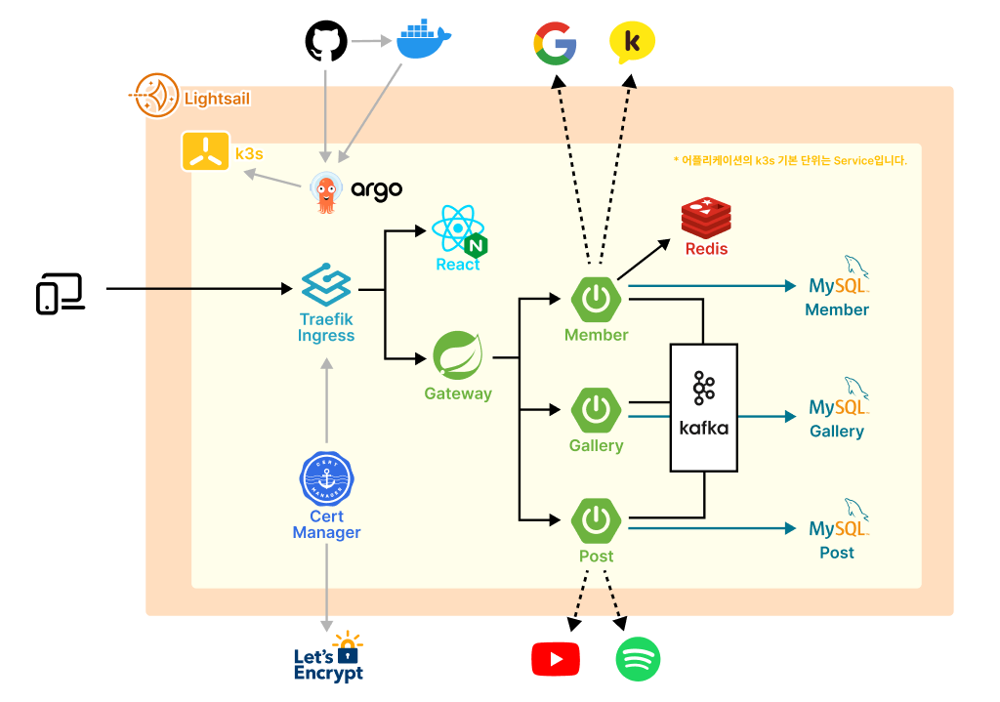
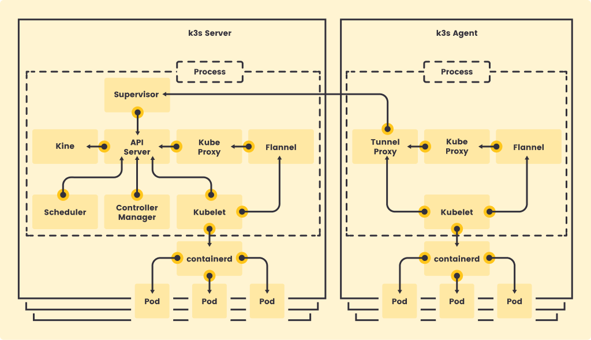

# 1. 프로젝트 개요


백엔드 개발자 친구와 함께 **쿠버네티스를 연습하기 위한 토이프로젝트**를 만들었다. 명색이 쿠버네티스 프로젝트인데 MSA를 안할 수 없었다. 백엔드가 MSA로 바쁜데, 프론트가 가만히 있을 수 없어 Three.js를 적용했다. 당초 한 달 만에 끝내려던 프로젝트가 반년 가까이 이어졌다. 오늘(2024.01.21) 기준으로 접속은 가능한데 아직 자잘한 에러가 많아서 수정 중에 있다.

# 2. 아키텍쳐 구상도



<mark>AWS Lightsail 인스턴스에 k3s를 직접 설치해서 클러스터를 구성했다</mark>. 이러한 결정에는 금전적인 요인이 크게 작용했다. EKS의 시간당 사용료가 0.1달러에서 시작했는데, 한 달을 서비스하면 최소 72달러(약 97000원)이다. 안그래도 요즘 유튜브 프리미엄도 해지하는 마당에 터무니없는 금액이었다. 그래서 우리가 생각해낸 것이 Lightsail과 k3s이다.

## 2.1. Lightsail 이란?

지금까지는 항상 EC2를 사용했는데 이번 기회로 Lightsail을 접할 수 있었다. EC2가 사용량에 따라 과금되는 방식이라면, Lightsail은 구독형 서비스처럼 월별 요금으로 플랜을 선택한다. 단순 계산으로 CPU 2 코어, 메모리 4GB를 24시간 30일 구동했을 때, <mark>EC2는 30달러 / Ligthsail은 20달러이다.</mark>


그러나 완벽한 제품이란 없는 것 같다. Ligthsail은 CPU 사용에 유난히도 엄격다. CPU 사용량을 특정 퍼센티지 기준으로 Burst Zone과 Sustainable Zone을 나누는데, CPU 사용량에 높아져 Burst zone에 들어서게 되면 나에게 할당된 CPU 크레딧을 줄어들기 시작한다. CPU 크레딧이 감소해 0에 도달하면 인스턴스가 멈춘다😱. CPU 크레딧을 다시 채우기 위해서는 CPU 사용을 Sustainable Zone에 두어야 한다.


따라서 Lightsail은 CPU 사용량이 많은 서비스에는 적합하지 않다. 우리도 한 번 CPU 크레딧을 모두 소모하여 인스턴스가 작동을 멈췄다. 다시 재가동했을 때 Sustainable Zone에 머물러 있어서, 일단 한 번 더 믿어보기로 했다. 또 다시 인스턴스가 멈추면 EC2로 넘어갈 예정이다.

## 2.2. k3s 이란?

k3s는 쉽게 말해 **쿠버네티스(k8s)의 경량화 버전**이다. 기존 쿠버네티스보다 메모리를 절반 밖에 사용하지 않으며, 가볍고 ARM 아키텍처를 지원하는 덕에 IoT 디바이스에도 적합하다고 한다.

|     | CPU 권장 | RAM 권장 |
| --- | -------- | -------- |
| k3s | 2 코어   | 1GB      |
| k8s | 2 코어   | 2GB      |

기본적인 아키텍쳐는 쿠버네티스와 동일하다. 쿠버네티스와 똑같이 서버 노드(마스터 노드)와 에이전트 노드(워커 노드)로 분산 클러스트를 구성할 수 있다. 하지만 우리는 인스턴스가 하나 밖에 없으므로 마스터 노드 하나로 단일 클러스터를 구성했다. 그 외 쿠버네티스의 일부 기능을 포함하지 않는다고는 하는데, 입문하는 수준에서는 아무런 차이를 경험하지 못했다.



주의할 것은 경량화 버전이지만, **오히려 일부 편의기능은 기본 탑재되어 있다.** 대표적으로 Helm이나 Ingress가 기본 탑재되어 있다. 이걸 몰랐던 우리는 엄청난 삽질과 좌절의 시간을 거쳐야만 했다. k3s를 사용하면 쿠버네티스가 아닌 [k3s 공식문서](https://docs.k3s.io/)를 보도록 하자...

# 3. 사전 준비

## 3.1. Lightsail 구매

[Inpa Dev님의 "Lightsail 사용법 총정리"](https://inpa.tistory.com/entry/AWS-%F0%9F%93%9A-Amazon-Lightsail-%EC%82%AC%EC%9A%A9%EB%B2%95-%EC%9B%B9%EC%84%9C%EB%B9%84%EC%8A%A4%EB%A5%BC-%EB%9A%9D%EB%94%B1-%EA%B5%AC%EC%B6%95%ED%95%98%EC%9E%90) 문서에 너무나도 잘 정리되어 있다. 우리는 20달러 플랜, Ubuntu 20.04, 별도 추가구성 없이 구매했다.

## 3.2. k3s 설치

> 최신 내용은 꼭 [k3s 공식문서](https://docs.k3s.io/quick-start)를 확인하기 바람

다음 명령어로 손쉽게 k3s를 설치할 수 있다. 서버 노드(마스터 노드)가 구현된다.

```sh
curl -sfL https://get.k3s.io | sh -
```

만약 에이전트 노드(워커 노드)를 구성하고자 하면 아래 명령어를 실행한다. (에이전트 노드이기 때문에 마스터 노드가 이미 구성되어 있어야 한다.) `K3S_URL`은 마스터 노드의 URL을 의미하며, `K3S_TOKEN`은 일종의 인증 토큰으로 마스터 서버의 `/var/lib/rancher/k3s/server/node-token` 경로에서 확인할 수 있다.

```sh
# 예시코드
curl -sfL https://get.k3s.io | K3S_URL=https://myserver:6443 K3S_TOKEN=mynodetoken sh -
```

# 4. 참고자료

- [k3s 공식문서](https://docs.k3s.io/)
- [Inpa Dev : "Lightsail 사용법 총정리"](https://inpa.tistory.com/entry/AWS-%F0%9F%93%9A-Amazon-Lightsail-%EC%82%AC%EC%9A%A9%EB%B2%95-%EC%9B%B9%EC%84%9C%EB%B9%84%EC%8A%A4%EB%A5%BC-%EB%9A%9D%EB%94%B1-%EA%B5%AC%EC%B6%95%ED%95%98%EC%9E%90)
