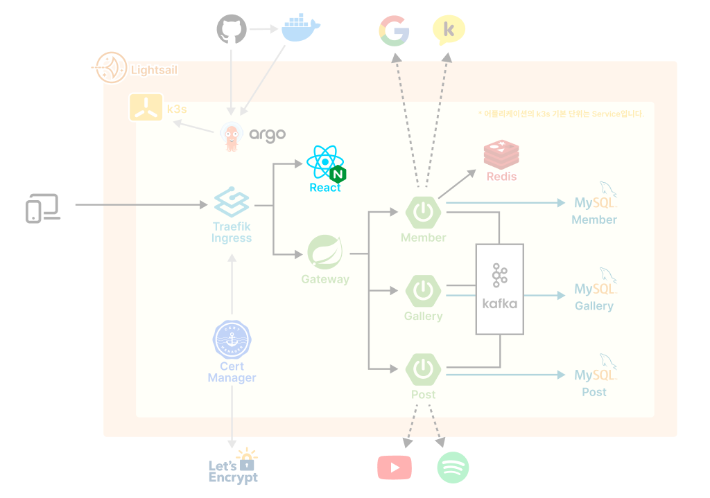
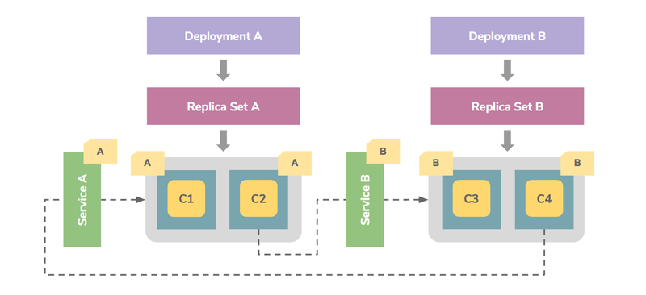

> 프론트는 너무 간단하다. Next.js같은 풀스텍 프레임워크를 사용하면 좀 더 흥미로울 것 같다.

# 1. 도커 이미지

리액트 프로젝트를 빌드하면 정적 파일이 생성된다. 이러한 정적 컨텐츠를 서비스하기 위해서는 웹서버가 필요하다. 그래서 Nginx 이미지를 이용해서 리액트 도커를 만들었다.

## 1.1. nginx.conf

먼저 nginx 설정 파일부터 작성한다. `빌드 폴더 복사 위치`는 nginx 이미지 내부 경로를 말하며, 임의로 지정해주고 이후 Dockefile과 일치시키면 된다.

```conf
server {
    listen 80;
    server_name localhost;

    location / {
        root {빌드 폴더 복사 위치};
        index index.html;
        try_files $uri $uri/ /index.html;
    }
}
```

## 1.2. Dockerfile

리액트 앱 빌드는 이미 완료한 채로 Dockerfile을 작성했다. 이후 구축할 CI/CD 파이프라인이 빌드 작업을 담당할 것이기 때문이다.

```Dockerfile
# nginx 이미지를 베이스 이미지로 사용
FROM nginx:alpine

# 리액트 빌드 파일 복사
COPY {빌드 폴더 상대경로} {빌드 폴더 복사 위치}

# 기존 nginx 설정 제거
RUN rm /etc/nginx/conf.d/default.conf

# 커스텀 nginx 설정 복사
COPY {nginx 설정 상대경로} /etc/nginx/conf.d/

# 80번 포트로 수신
EXPOSE 80

# 컨테이너 생성 시, nginx 실행
CMD ["nginx", "-g", "daemon off;"]
```

## 1.3. 이미지 빌드 & 푸시

Dockerhub 계정을 만들고, 계정 이름을 이미지 이름앞에 붙여줘야 한다. `Dockerhub계정/이미지이름` 형식으로 이미지 이름을 지어야한다.

```sh
# 이미지 빌드
docker build -t {이미지 이름} {Dockerfile 위치}
```

```sh
# 이미지 푸시
docker push {이미지 이름}
```

# 2. k3s 등록



Deployment 설정 파일로 Replica Set과 Pod까지 다룰 수 있다. 우리는 현재 Pod을 하나 씩만 띄어도 메모리가 간당간당하기 때문에 따로 Replica Set을 늘리지는 않았다. 또한 기본적으로 모든 어플리케이션은 Service 오브젝트를 두어 서비스 이름으로 통신할 수 있도록 했다.

```yml
apiVersion: apps/v1
kind: Deployment
metadata:
  name: react-dp
spec:
  selector:
    matchLabels:
      app: react
  template:
    metadata:
      labels:
        app: react
    spec:
      containers:
        - image: { 이미지 이름 }
          name: react
          ports:
            - containerPort: 80

---
apiVersion: v1
kind: Service
metadata:
  name: react-svc
spec:
  ports:
    - port: 80
  selector:
    app: react
```

```sh
# 쿠버네티스 등록
kubectl apply -f react.yml
```
