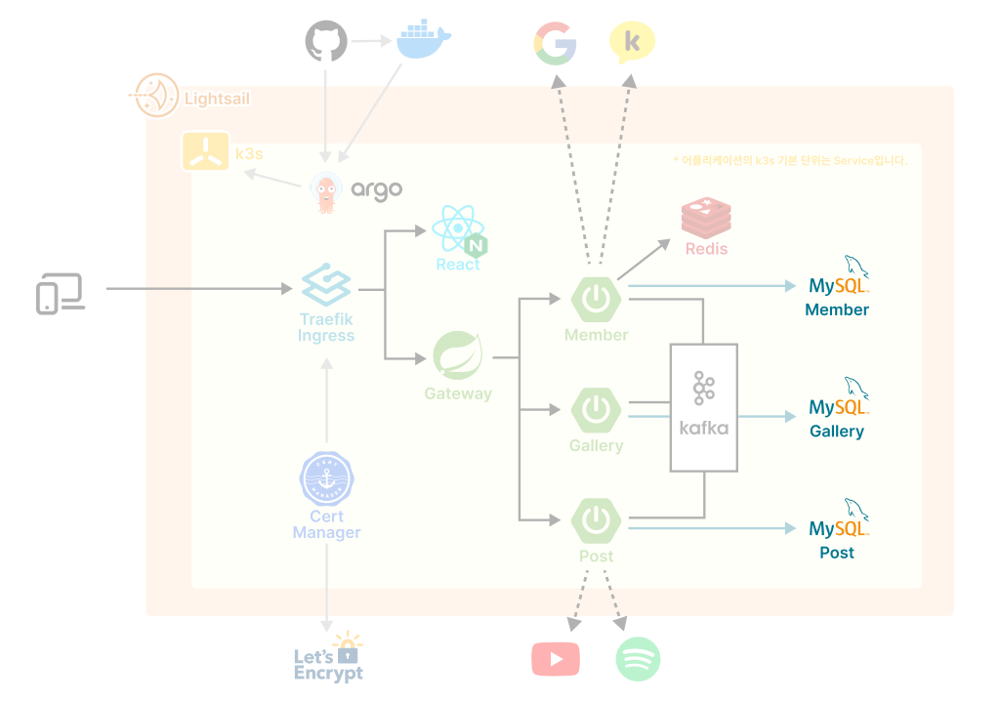
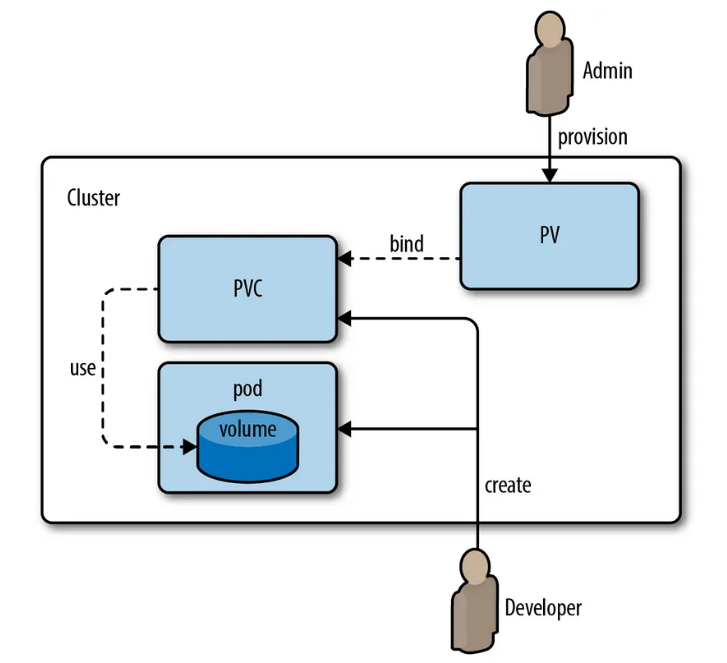

> 본래 DB의 아이디와 패스워드는 쿠버네티스에서 Secret으로 관리하는 것을 권장한다. Secret 생성과 적용은 [이후 포스팅](https://byongho96.github.io/TIL/posts/DevOps/Kubernetes/k3s_7_secret/)에서 따로 다룰 예정이다.

# 1. PV, PVC



쿠버네티스에서는 파드가 죽으면 알아서 다시 띄워준다. 그런데 MySQL같이 파드가 어떤 이유로 재생성되었을 때, 기존의 데이터베이스가 모두 지워진다면 정말 난감할 것이다. 이를 방지하기 위해 <b>PV(Persist Volume)</b>과 <b>PVC(Persist Volume Claim)</b>을 사용한다. <mark>도커의 볼륨과 대응하는 개념이다.</mark>

## 1.1. PV

Persist Volume은 클러스터에서 공유하는 실제 스토리지를 정의한다. 특정 경로의 물리적인 스토리지뿐 아니라, 네트워크 기반의 스토리지도 사용할 수 있다. 우리는 인스턴스의 특정 경로에 매핑하여 생성했다.

```yml
apiVersion: v1
kind: PersistentVolume
metadata:
  name: mysql-pv
spec:
  capacity:
    storage: 20Gi
  accessModes:
    - ReadWriteMany
  storageClassName: mysql
  hostPath:
    path: { 매핑할 호스트 인스턴스 경로 }
  persistentVolumeReclaimPolicy: Retain
```

- **accessMode**  
  PV가 어떻게 접근되는지를 정의한다.

  - `ReadWriteOnce` : 한 번에 하나의 Pod만 읽고 쓸 수 있음.
  - `ReadOnlyMany` : 여러 Pod에서 읽기만 가능.
  - `ReadWriteMany` : 여러 Pod에서 읽고 쓸 수 있음.

- **storageClassName**  
  PV에 할당된 스토리지 클래스를 나타내며 PVC에서 해당 PV를 요청할 때 사용된다.

- **persistentVolumeReclaimPolicy**  
  PV가 더 이상 사용되지 않을 때 어떻게 처리될지 정의한다.

  - `Retain` : 내부 데이터를 유지한다.
  - `Recycle` : 내부 데이터를 삭제하고 재사용 한다.
  - `Delete` : AWS EBS, GCE PD, Azure Disk 또는 OpenStack Cinder 볼륨과 같은 관련 스토리지 자산까지 삭제된다.

## 1.2. PVC

PVC는 파드가 사용할 PV를 요청하는데 사용한다. 요청하려는 PV가 있으면 바인딩 되고, 없으면 동적으로 PV를 할당한다. 하지만 이러한 동적 프로비저닝을 활성화 하려면 'DefaultStorageClass 어드미션 플러그인'을 활성화해야 한다. 자세한 사항은 [쿠버네티스 공식문서](https://kubernetes.io/ko/docs/concepts/storage/persistent-volumes/#%ED%81%B4%EB%9E%98%EC%8A%A4-1)에서 확인할 수 있다. 보통 관리자가 PV를 정의하고, 개발자가 PVC를 생성해서 파드에 연결하는 구조인 것 같다.

```yml
apiVersion: v1
kind: PersistentVolumeClaim
metadata:
  name: mysql-pvc
spec:
  accessModes:
    - ReadWriteMany
  resources:
    requests:
      storage: 20Gi
  storageClassName: mysql # PV와 동일하게
```

- **storage**  
  요청하는 스토리지는 PV의 용량을 초과해서는 안된다.
- **storageClassName**  
  요청된 클래스의 PV(PVC와 동일한 storageClassName을 갖는 PV)만 PVC에 바인딩될 수 있다.

# 2. k3s 등록

아래 파일에서는 환경변수로 root유저의 패스워드만 설정했는데, [MySQL 도커 이미지 문서](https://hub.docker.com/_/mysql)를 보면, 아이디와 패스워드 등을 추가 설정할 수 있다.

PVC로 볼륨을 생성하고, 파드에 볼륨 마운트한다. 파드에 마운트할 때는 데이터를 가지고 있는 `/var/lib/mysql` 경로에 매핑해준다.

또 MySQL을 외부 워크벤치에서 사용하고자 하면 nodePort를 정의해서 열어줄 수 있다. 추가로 인바운드 규칙에서 해당 포트를 열어줘야한다.

```yml
apiVersion: apps/v1
kind: Deployment
metadata:
  name: mysql-dp

spec:
  selector:
    matchLabels:
      app: mysql
  template:
    metadata:
      labels:
        app: mysql
    spec:
      containers:
        - image: mysql
          name: mysql
          env:
            - name: MYSQL_ROOT_PASSWORD
              value: { root 유저 비밀번호 }
          volumeMounts:
            - name: mysql-persistent-storage
              mountPath: /var/lib/mysql
      volumes:
        - name: mysql-persistent-storage
          persistentVolumeClaim:
            claimName: mysql-pvc

---
apiVersion: v1
kind: Service
metadata:
  name: mysql-svc
spec:
  type: NodePort
  ports:
    - port: 3306
      nodePort: { 오픈할 노드포트 }
  selector:
    app: mysql
```

```bash
# 쿠버네티스 등록
kubectl apply -f mysql.yml
```

# 참고자료

- [쿠버네티스 공식문서 : "퍼시스트 볼륨"](https://kubernetes.io/ko/docs/concepts/storage/persistent-volumes/)
- [MySQL 도커 이미지](https://kubernetes.io/ko/docs/concepts/storage/persistent-volumes/)
