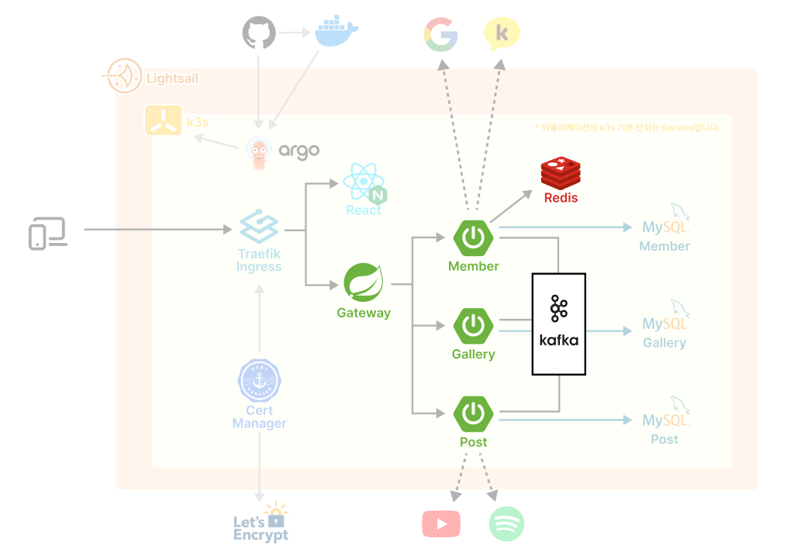

> 본래 DB의 아이디와 패스워드는 쿠버네티스에서 Secret 등으로 관리해야 한다. Secret 생성과 적용은 이후 포스팅에서 따로 다룰 예정이다.

# 1. MSA 구조

백엔드는 MSA 구조로 설계되어 총 3개의 Spring Boot 앱을 사용한다. 앞단에서 Spring Cloud 게이트웨이가 사용자 요청을 Prefix에 따라 라우팅해준다.

처음 사용자가 로그인에 성공하면 Member 서비스가 JWT 토큰을 발급하고, 이를 Redis에 저장한다. 그리고 다른 서비스들은 Redis에서 JWT 토큰을 확인함으로써 사용자를 인식한다.

그 외 서비스간 소통은 Kafka를 통해 이루어진다. 원래는 API를 직접 호출하도록 설계했는데, 이렇게 하니까 서비스간 결합도가 높아져 MSA를 도입한 의미가 옅어졌다. 그러던 중 우아콘의 [Kafka를 이용한 이벤트 기반 아키텍쳐 구축 영상](https://www.youtube.com/watch?v=DY3sUeGu74M)을 접하게 되었고, 이를 적용하기로 했다.

# 2. Redis

Redis 도커 이미지를 이용해서 간편하게 실행했다. 이미지 설명에 비밀번호 설정에 대한 설명이 없어 방황하는데, [누군가가 올린 Github 이슈](https://github.com/docker-library/redis/issues/176#issuecomment-1620310639)에서 방법을 찾을 수 있었다.

```yml
apiVersion: apps/v1
kind: Deployment
metadata:
  name: redis-dp
spec:
  selector:
    matchLabels:
      app: redis
  template:
    metadata:
      labels:
        app: redis
    spec:
      containers:
        - name: redis
          image: redis:latest
          ports:
            - containerPort: 6379
              protocol: TCP
          env:
            - name: REDIS_PASSWORD
              value: { Redis 패스워드 }

---
apiVersion: v1
kind: Service
metadata:
  name: redis-svc
spec:
  selector:
    app: redis
  ports:
    - protocol: TCP
      port: 6379
```

# 3. Spring

3개의 Spring Boot 마이크로 서비스 어플리케이션과, Spring Cloud 게이트웨이 하나로 이루어져 있다. 각각의 도커 이미지는 빌드하여 도커허브에 푸쉬했다.

## 3.1. 도커 이미지 빌드

Spring Boot의 Dockerfile은 다음과 같은 형식이다.

```Dockerfile
# 기반 이미지 선택
FROM openjdk:11

# 작업 디렉토리 생성
WORKDIR /app

# 빌드된 JAR 파일을 Docker 이미지 내 /app 디렉토리로 복사
COPY build/libs/gallery-0.0.1-SNAPSHOT.jar /app/app.jar

# 특정 포트로 Listen
EXPOSE { 포트 번호 }

# JAR 파일 실행
CMD ["java", "-jar", "app.jar"]
```

## 3.2. 환경변수 정의

다른 서비스에 접근하기 위해서는 IP/Port를 알아야한다. 예를 들어, 게이트웨이가 라우팅을 하려면 각 Spring Boot 서버의 IP 주소 정보가 있어야 한다. 그런데 쿠버네티스에는 IP 주소가 동적으로 할당되기 때문에 service 이름으로 접근한다. 그런데 어플리케이션 수준에서 쿠버네티스의 정보(서비스 이름)를 사용하는 것은 이상하다. 그래서 반대로 가기로 했다.

먼저 SpringBoot의 application.properties 파일에서 필요한 정보를 <mark>하드코딩하지 않고 환경변수로 정의했다.</mark>

```properties
spring.redis.host=${REDIS_HOST}
spring.redis.port=${REDIS_PORT}
```

그리고 이후에 쿠버네티스의 yaml 파일을 쟉성할 때, 환경 변수에 대응하는 값을 넘겨주었다.

```yml
apiVersion: apps/v1
kind: Deployment
metadata:
  ...
spec:
  selector:
    matchLabels:
      ...
  template:
    metadata:
      ...
    spec:
      containers:
        - env:
          - name: REDIS_HOST
            value: { redis 서비스 이름 } # 위 3번 항목 설정대로라면 "redis-svc"
          - name: REDIS_PORT
            value: { redis 클러스터 포트 } # 위 3번 항목 설정대로라면 6379
        ...
```

## 3.3. Spring Boot 마이크로 서버

아래 예시 코드에서 환경변수는 application.properties에서 어떤 식으로 정의했느냐에 따라 달라진다. 예를 들어, REDIS는 Host(IP주소)와 Port를 따로따로 정의했지만, MySQL같은 경우에는 한번에 내려줬다.

```yml
apiVersion: apps/v1
kind: Deployment
metadata:
  name: member-dp
spec:
  selector:
    matchLabels:
      app: member
  template:
    metadata:
      labels:
        app: member
    spec:
      containers:
        - image: { Member 마이크로 서버 이미지 }
          name: member
          env:
            - name: REDIS_HOST
              value: { Redis 서비스 이름 } # 위 3번 항목 설정대로라면 "redis-svc"
            - name: REDIS_PORT
              value: { Redis 클러스터 포트 } # 위 3번 항목 설정대로라면 6379
            - name: REDIS_PASSWORD
              value: { Redis 패스워드 }
            - name: MYSQL_SERVER
              value: { MySQL 서비스 이름: MySQL 클러스터 포트 }
            - name: MYSQL_USER
              value: { MySQL 아이디 }
            - name: MYSQL_PASSWORD
              value: { MySQL 패스워드 }
            - name: KAFKA_SERVER
              value: { Kafka 서비스 이름: Kafka 클러스터 포트 }
          ports:
            - containerPort: 8001

---
apiVersion: v1
kind: Service
metadata:
  name: member-svc
spec:
  ports:
    - port: 8001
  selector:
    app: member
```

## 3.4. Spring Cloud 게이트웨이

Spring Cloud도 Spring Boot 서버와 동일한 방식으로 작성했다.

```yml
apiVersion: apps/v1
kind: Deployment
metadata:
  name: gateway-dp

spec:
  selector:
    matchLabels:
      app: gateway
  template:
    metadata:
      labels:
        app: gateway
    spec:
      containers:
        - image: { 게이트웨이 이미지 }
          name: gateway
          env:
            - name: MEMBER_SERVER
              value: { Member 마이크로 서비스 이름: 클러스터 포트 } # 위 4.3.번 항목 설정대로라면 "member-svc:8001"
            - name: GALLERY_SERVER
              value: { Gallery 마이크로 서비스 이름: 클러스터 포트 }
            - name: POST_SERVER
              value: { Post 마이크로 서비스 이름: 클러스터 포트 }
            - name: REDIS_HOST
              value: { Redis 서비스 이름 } # 위 3번 항목 설정대로라면 "redis-svc"
            - name: REDIS_PORT
              value: { Redis 클러스터 포트 } # 위 3번 항목 설정대로라면 6379
            - name: REDIS_PASSWORD
              value: { Redis 패스워드 }
          ports:
            - containerPort: 8000

---
apiVersion: v1
kind: Service
metadata:
  name: gateway-svc
spec:
  ports:
    - port: 8000
  selector:
    app: gateway
```

# 4. Kafka

Kafka를 쿠버네티스에 올리는 것은 다른 어플리케이션과 다른 모양이다. 이를 위해서
Confluent나 Strimzi와 같은 오픈소스 프로젝트도 따로 제공된다. 따라서 이 부분에서는 아직 부족한점이 있을 것으로 생각된다. 일단 [Confluent 도커 설정](https://docs.confluent.io/platform/current/installation/docker/config-reference.html)을 참고하여 작성했다.

## 4.1. Zookeeper

`ZOOKEEPER_CLIENT_PORT`는 Kafka의 요청을 수신할 포트로, Zookeeper 자기 자신의 클러스터 포트와 일치시키면 된다. `ZOOKEEPER_TICK_TIME`는 주키퍼 하트비트로 시간(ms)로, 이 클럭에 따라 주키퍼 내의 각 서버(노드) 간에 정보가 교환된다.

```yml
apiVersion: apps/v1
kind: Deployment
metadata:
  name: zookeeper-dp

spec:
  replicas: 1
  selector:
    matchLabels:
      app: zookeeper
  template:
    metadata:
      labels:
        app: zookeeper
    spec:
      containers:
        - name: zookeeper
          image: confluentinc/cp-zookeeper:7.0.1
          ports:
            - containerPort: 2181
          env:
            - name: ZOOKEEPER_CLIENT_PORT
              value: 2181 # Zookeeper 자신의 서비스 포트와 일치
            - name: ZOOKEEPER_TICK_TIME
              value: 2000

---
apiVersion: v1
kind: Service
metadata:
  name: zookeeper-svc
spec:
  selector:
    app: zookeeper
  ports:
    - protocol: TCP
      port: 2181
```

## 4.2. Kafka Broker

`KAFKA_ZOOKEEPER_CONNECT`는 연결할 Zookeeper 의 IP/Port 정보를 기입한다. `KAFKA_ADVERTISED_LISTENERS`는 외부에서 접근할 수 있는 Kafka의 IP/Port 정보를 기입한다.

```yml
apiVersion: apps/v1
kind: Deployment
metadata:
  name: kafka-dp

spec:
  replicas: 1
  selector:
    matchLabels:
      app: kafka
  template:
    metadata:
      labels:
        app: kafka
    spec:
      containers:
        - name: broker
          image: confluentinc/cp-kafka:7.0.1
          ports:
            - containerPort: 9092
          env:
            - name: KAFKA_BROKER_ID
              value: '1'
            - name: KAFKA_ZOOKEEPER_CONNECT
              value: { Zookeeper 서비스 이름: 클러스터 포트 } # 위 5.1 항목 설정대로라면 "zookeeper-svc:2181"
            - name: KAFKA_LISTENER_SECURITY_PROTOCOL_MAP
              value: PLAINTEXT:PLAINTEXT,
            - name: KAFKA_ADVERTISED_LISTENERS
              value: PLAINTEXT://{ Kafka 서비스 이름: 클러스터 포트 } # 현재 설정대로라면 "kafka-svc:9092"
            - name: KAFKA_OFFSETS_TOPIC_REPLICATION_FACTOR
              value: '1'
            - name: KAFKA_TRANSACTION_STATE_LOG_MIN_ISR
              value: '1'
            - name: KAFKA_TRANSACTION_STATE_LOG_REPLICATION_FACTOR
              value: '1'
---
apiVersion: v1
kind: Service
metadata:
  name: kafka-svc
spec:
  selector:
    app: kafka
  ports:
    - protocol: TCP
      port: 9092
```

# 참고자료

- [Redis 도커 패스워드 설정 Issue](https://github.com/docker-library/redis/issues/176#issuecomment-1620310639)
- [Confluent 플랫폼 도커 사용 설명서](https://docs.confluent.io/platform/current/installation/docker/config-reference.html#)
- [Confluent : "Apache Kafka on Kubernetes – Could You? Should You?"](https://www.confluent.io/blog/apache-kafka-kubernetes-could-you-should-you/)
- [오몰내알 : "쿠버네티스에서 카프카(kafka on k8s) 정말 좋은 선택일까?"](https://kgw7401.tistory.com/106)
