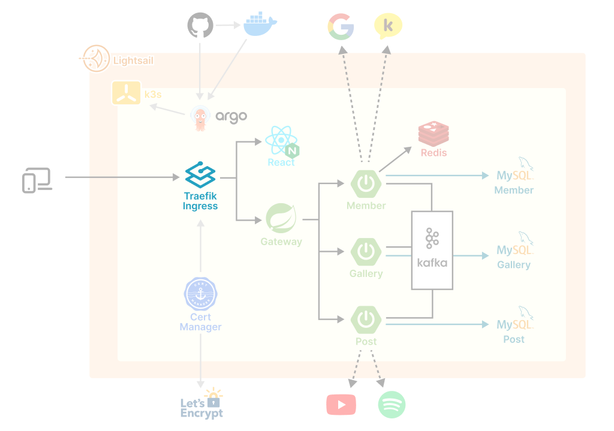

# 1. 인그레스 삽질기⚒️

> 이 항목은 k3s를 사용할 경우 참고하지 않아도 되는 삽질기입니다.

우리는 k3s가 그저 쿠버네티스의 경량화 버전인줄로만 알았다. 그래서 **추가 편의 기능이 구현**되어있을 줄 꿈에도 몰랐다. 그저 쿠버네티스 공식문서를 따라 인그레스 컨트롤러를 설치했을 뿐인데 희한한 에러를 경험했고, 나중에 가서야 <mark>이것이 k3s의 기본 탑재된 Traefik 인그레스 컨트롤러 때문이었음을 깨달았다.</mark>

## 1.1. 인그레스 컨트롤러 설치

[쿠버네티스 공식문서](https://kubernetes.io/docs/concepts/services-networking/ingress-controllers/)를 보면, 인그레스 사용하기 위해서는 인그레스 컨트롤러를 추가 설치하라고 한다. 많은 컨트롤러 중에 가장 익숙해 보이는 Nginx Ingress Controller를 선택했다.

Nginx Ingress Controller는 사용 환경에 따라 다양한 설치방법을 제공한다. 그 중에서 AWS와 Bare Metal 두가지 방식이 있는데, AWS 인스턴스에 직접 클러스트를 구성하는 경우에는 어떤 것을 선택해야하는지 아직도 확신이 안선다. 일단 우리는 [Bare Metal 방식](https://kubernetes.github.io/ingress-nginx/deploy/#bare-metal-clusters)으로 진행했다.

아래 명령어를 실행하면 30000-32767 중 임의의 NodePort로 인그레스가 노출된다.

```sh
kubectl apply -f https://raw.githubusercontent.com/kubernetes/ingress-nginx/controller-v1.8.2/deploy/static/provider/baremetal/deploy.yaml
```

## 1.2. 인그레스 컨트롤러 NodePort 고정

MetalLB를 사용해서 인그레스가 열리는 NodePort를 80번으로 고정시킬 수 있다. 그런데 [문서](https://kubernetes.github.io/ingress-nginx/deploy/baremetal/)를 읽어보면 신세계가 열린다. Layer2 설정까지 내려가는데 무엇인가 잘못되었음을 직감했다.

이 때 잠시 멈춰 되돌아 보았어야 했는데, 우리는 열심히 직진 페달을 밟았다. 위에 1.1 항목의 `deploy.yml`파일을 다운받아 분석한 다음, 일부를 수정해서 인그레스가 열리는 NodePort를 30000번으로 고정해내고야 만다. (NodePort는 30000번 이상의 포트로만 열수 있기 때문에 80번 포트로는 열지 못했다.)

```yml
# deploy.yml 356번째 줄
nodePort: 30000 # 30000번 포트로 고정해서 오픈
```

## 1.2. 간이 로드 밸런서 구현

[로드 밸런서](https://kubernetes.io/docs/tasks/access-application-cluster/create-external-load-balancer/#external-load-balancer-providers)는 쿠버네티스의 외부에서 동작하며, 보통 클라우드 서비스 EKS, GKE 등에서 제공한다. 하지만 우리는 Ligthsail 인스턴스에서 단일 노드 클러스터를 구축했다. 그리고 1.2.항목에서 MetalLB를 사용하지 않고 인그레스를 30000번으로 열어두었다. 또 한번의 질주로 결심하고, 호스트에 Nginx를 설치해 80번 포트로 수신하는 모든 요청을 인그레스로 넘겨주기로 했다.

```bash
# Nginx 설치
sudo apt-get update
sudo apt-get install -y nginx
```

```conf
# nginx.conf
upstream ingress {
	server 127.0.0.1:30000; # 30000번으로 열린 인그레스로 전달
}

server {
	listen 80;
	listen [::]:80;

	server_name 3.35.238.150 thegallery.site;

	location / {
		proxy_pass http://ingress;
		proxy_set_header Host $host;
		proxy_set_header X-Real-IP $remote_addr;
		proxy_set_header X-Forwarded-For $proxy_add_x_forwarded_for;
		proxy_set_header X-Forwarded-Proto $scheme;
	}
}
```

## 1.3. 이상 동작과 원인

그런데 요청이 아예 호스트 Nginx에 도달하지 않았다. 프로세스를 검색해봐도 80번 포트를 점유하고 있는 것은 호스트에 설치한 Nginx 뿐이었다. 몇 번의 테스트 끝에, k3s가 실행되는 즉시 Nginx의 80번 포트 수신이 막히는 것을 확인했다. 구글링한 결과 알게 된 사실은 <mark>'k3s에는 Traefik 인그레스 컨트롤러가 기본 탑재되어 80과 443 포트를 점유한다는 것'이었다..</mark>

# 2. Traefik 인그레스 컨트롤러

[Traefik 인그레스 컨트롤러](https://docs.k3s.io/kr/networking)는 포트 80과 443을 사용하는 로드밸런서 서비스를 배포한다. 이를 이용해서 HTTP 역방향 프록시 및 로드밸런서가 손쉽게 구현된다. 서버를 시작할 때 기본적으로 Traefik이 실행되기 때문에 80과 443포트는 다른 서비스에서 사용할 수 없다. 이를 비활성화 하려면 `--disable=traefik` 플래그를 사용해서 k3s를 시작해야한다.

## 2.1. Traefik 인그레스 규칙

[Traefik 공식문서](https://doc.traefik.io/traefik/providers/kubernetes-ingress/)에서 쿠버네티스 인그레스 설정을 확인할 수 있다. Nginx 파일과 유사한 형식으로 쉽게 설정할 수 있다.

```yml
# traefik-ingress.yml

apiVersion: networking.k8s.io/v1
kind: Ingress
metadata:
  name: myingress
  annotations:
    traefik.ingress.kubernetes.io/router.entrypoints: web
spec:
  rules:
    - host: { 도메인 네임 }
      http:
        paths:
          - path: /
            pathType: Prefix
            backend:
              service:
                name: react-svc # 프론트 서비스 이름
                port:
                  number: 80
          - path: /api
            pathType: Prefix
            backend:
              service:
                name: gateway-svc # 백엔드 게이트웨이 서비스 이름
                port:
                  number: 8000
```

```bash
# 인그레스 규칙 적용
kubectl apply -f traefik-ingress.yml
```

# 참고자료

- [kubernetes : "Intress Controllers"](https://kubernetes.io/docs/concepts/services-networking/ingress-controllers/)
- [Ingress Nginx : "Getting Started"](https://kubernetes.github.io/ingress-nginx/deploy/#bare-metal-clusters)
- [k3s : "Networking"](https://docs.k3s.io/networkings)
- [traefiklabs : "Traefik & Kubernetes"](https://doc.traefik.io/traefik/providers/kubernetes-ingress/)
- [Stack Overflow : "Ingress vs Load Balancer"](https://stackoverflow.com/questions/45079988/ingress-vs-load-balancer)
