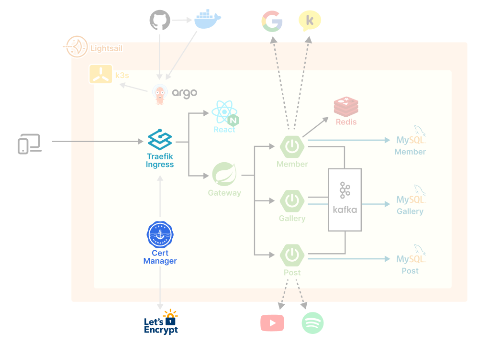

# 1. Cert Manager

Cert Manager는 쿠버네티스에서 SSL/TLS 인증서를 관리하기 위한 오픈 소스 도구이다. Let's Encrypt와 같은 인증 기관을 사용하여 인증서를 발급하고 갱신하는 작업을 자동화한다. 개인적으로 Certbot의 쿠버네티스 클러스터 버전이라고 생각한다.

아래 명령어로 Cert Manager 컴포넌트를 설치하고 실행할 수 있다.

```bash
# 공식문서의 최신 명령어를 따를 것을 권장
kubectl apply -f https://github.com/cert-manager/cert-manager/releases/download/v1.13.3/cert-manager.yaml
```

Cert Manager 컴포넌트는 아래처럼 총 3개의 파드를 띄운다.

```bash
# Cert Manager 관련 파드 확인
$ kubectl get pods --namespace cert-manager

NAME                                       READY   STATUS    RESTARTS   AGE
cert-manager-5c6866597-zw7kh               1/1     Running   0          2m
cert-manager-cainjector-577f6d9fd7-tr77l   1/1     Running   0          2m
cert-manager-webhook-787858fcdb-nlzsq      1/1     Running   0          2m
```

# 2. Cluster Issuer 등록

[Cert Manager 공식문서](https://cert-manager.io/docs/concepts/issuer/)를 보면 Isseur와 Cluser Issuer는 모두 인증서를 생성할 수 있는 인증 기관(CA)을 나타내는 Kubernetes 리소스이다. Issuer는 특정 네임스페이스 내에서만 사용 가능하고, Cluster Issuer는 클러스터 전체에 적용되는 인증서를 발급한다. 우리는 Let's Encrypt를 인증기관으로 지정하는 Cluser Issuer를 생성했다.

```yml
# cluster-issuer.yaml

apiVersion: cert-manager.io/v1
kind: ClusterIssuer
metadata:
  name: { 클러스터 이슈어 이름 } # 원하는 대로 지정
  namespace: default
spec:
  acme:
    server: https://acme-v02.api.letsencrypt.org/directory # Let's Encrypt 인증기관
    email: { 이메일 등록 } # 유효한 이메일 주소 입력
    privateKeySecretRef:
      name: letsencrypt
    solvers:
      - selector: {}
        http01:
          ingress:
            class: traefik
```

```bash
# Cluster Issuer 등록
kubectl apply -f cluster-issuer.yaml
```

```bash
# 등록된 Cluster Issuer 확인
kubectl get ClusterIssuer -A

# 특정 Cluster Issuer 상세정보 조회
kubectl describe clusterissuer { 클러스터 이슈어 이름 }
```

# 3. Traefik Ingress 적용

등록한 Cluser Issuer를 바로 Traefik 인그레스 설정에 적용할 수 있다. 다음과 같이 `annotations`과 `tls` 항목을 입력해서 TLS 인증서를 발급받고, HTTPS 연결을 활성화할 수 있다.

```yml
apiVersion: networking.k8s.io/v1
kind: Ingress
metadata:
  name: myingress
  annotations:
    cert-manager.io/cluster-issuer: { 클러스터 이슈어 이름 } # 위의 2번 항목에서 등록한 이름과 일치
    kubernetes.io/ingress.class: traefik
spec:
  tls:
    - secretName: { TLS 인증서 이름 } # 원하는대로 지정
      hosts:
        - { 도메인 네임 }
  rules:
    - host: thegallery.site
      http:
        paths:
          - path: /
            pathType: Prefix
            backend:
              service:
                name: react-svc
                port:
                  number: 80
          - path: /api
            pathType: Prefix
            backend:
              service:
                name: gateway-svc
                port:
                  number: 8000
```

# 참고자료

- [Cert Manager : "Installation"](https://cert-manager.io/docs/installation/kubectl/#steps)
- [Cert Manager : "Issuer"](ttps://cert-manager.io/docs/concepts/issuer/)
- [Albert Colom : "Easy steps to install K3s with SSL certificate by traefik, cert manager and Let’s Encrypt"](https://levelup.gitconnected.com/easy-steps-to-install-k3s-with-ssl-certificate-by-traefik-cert-manager-and-lets-encrypt-d74947fe7a8)
