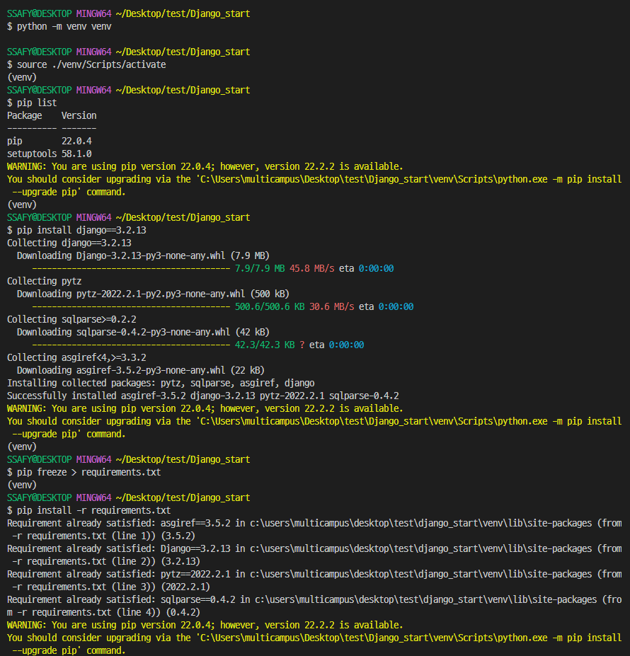

# Django Basics: MTV Design Pattern

## Index

- [1. Django](#1-django)
  - [1.1. Framework](#11-framework)
  - [1.2. Django](#12-django)
- [2. MTV Design Pattern](#2-mtv-design-pattern)
  - [2.1. Design Pattern](#21-design-pattern)
  - [2.2. MTV Design Pattern](#22-mtv-design-pattern)
  - [3. Start Django](#3-start-django)
- [4. Django Folder Structure](#4-django-folder-structure)
  - [4.1. Project Structure](#41-project-structure)
  - [4.2. App Structure](#42-app-structure)
- [5. Models](#5-models)
  - [5.1. models.py](#51-modelspy)
  - [5.2. Migration](#52-migration)
  - [5.3. Modifying Model](#53-modifying-model)
- [6. Template](#6-template)
  - [6.1. Django Template Language(DTL)](#61-django-template-language-dtl-)
  - [6.2. Template Inheritacne](#62-template-inheritacne)
- [7. View](#7-view)
  - [7.1 ORM](#71-orm)
    - [7.1.1. QuerySet API](#711-queryset-api)
    - [7.1.2. QuerySet](#712-queryset)
- [8. Request and Get](#8-request-and-get)
  - [8.1. URL Mapping](#81-url-mapping)
    - [8.1.1. App URL mapping](#811-app-url-mapping)
    - [8.1.2. View URL mapping](#812-view-url-mapping)
  - [8.2. render()](#82-render)
  - [8.3. with Data](#83-with-data)
    - [8.3.1. Sending Data](#831-sending-data)
    - [8.3.2. Retrieving data](#832-retrieving-data)
    - [8.3.3. Variable routing](#833-variable-routing)
- [9. Namespaces](#9-namespaces)
  - [9.1. URL Namespace](#91-url-namespace)
  - [9.2. App Namespace](#92-app-namespace)
  - [9.3. Template namespace](#93-template-namespace)
- [10. Admin Page](#10-admin-page)
  - [10.1. Make Admin Account](#101-make-admin-account)
  - [10.2. Admin Page URL](#102-admin-page-url)
  - [10.3. Register Model to Admin Page](#103-register-model-to-admin-page)

---

# 1. Django

## 1.1. Framework

**Collection of codes for developing specific service.** In a way, it's similar to a library, but it's much bigger and more sophisticated. Therefore developers should follow the design pattern of the framework.

## 1.2. Django

**Dynamic Web framework made with Python, <mark>especially specialized for back-end</mark>**

Dynamic means that data(ex.html) is processed according to the users' requests

---

# 2. MTV Design Pattern

## 2.1. Design Pattern

**Generalized method being used frequently** (Ex. Client-Server structure)

## 2.2. MTV Design Pattern

Django follows the **Model-Template-View(MTV) design pattern** which is based on Model-View-Template(MVT) design pattern.

- **MVC(Mode-View-Controlloer)**

  - **Model**: manages the data and is represented by a database
  - **View**: represents the visualization(html) of the data that model contains
  - **Controller**: intermediating user request, model and view

* **MVC and MTV**

  | MVC        | MTV      |
  | ---------- | -------- |
  | Model      | Model    |
  | View       | Template |
  | Controller | View     |

---

## 3. Start Django

1. **Make Virtual Environment**  
    Usually, a project sets up the modules needed in its own virtual environment.

     

   1. `python -m venv venv` : Create venv folder
   2. `source ./venv/Scripts/activate` : Activate venv
   3. `pip install django` : Install django in the venv (recommended to use LTS version)
   4. `pip freeze > requirements.txt` : save the pip status

2. **Make project**

   - `django-admin startproject firstpjt`

     - `./firstpjt/firstpjt/`
     - `./firstpjt/manage.py`

   * `django-admin startproject firstpjt .`
     - `./firstpjt/`
     - `./manage.py`

3. **Make Application**
   One project can have multiple apps(functions)

   1. `python manage.py startapp articles`

      - `./articles/`

   2. Register the app to the project
      

4. **Run server**
   1. `python manage.py runserver`

---

# 4. Django Folder Structure

## 4.1. Project Structure

- **manage.py**
  - cmd utility interacting with the Django project
- **db.sqlite3**
  - Django Base Database
- **project/asgi.py**
  - Asynchoronous Server Gateway Interface
- **project/wsgi.py**
  - Web Server Gateway Interface
- **project/settings.py**
  - Django project settings
- **project/urls.py**
  - Map url request to views
- **folder/\_\_pycache\_\_/**
  - Folder for temporary files
- **folder/\_\_init\_\_.py**
  - State that the current folder is a Python package

## 4.2. App Structure

- **app/migrations/**
  - Save model changes
- **app/admin.py**
  - Settings about administrator page
- **app/apps.py**
  - nformation about the app
- **app/models.py**
  - Define models
- **app/tests.py**
  - Write code to test the project
- **app/views.py**
  - Define views

---

# 5. Models

## 5.1. models.py

**The class corresponds to the table.**  
**The instance corresponds to row of the table**

Developers can define not only fields (columns) but also methods. Through [**Object Relational Mapping(ORM)**](#71-orm), DB's data can be treated like an object.

```python
# app/models.py

from django.db import models

class Article(models.Model):
    title = models.CharField(max_length=10)
    content = models.TextField()
```

## 5.2. Migration

**Creating DB based on models**

1. `python manage.py makemigrations`

   - Make a blueprint(python file in 'migrations' folder) of DB

2. `python manage.py migrate`

   - Create DB based on the blueprint

- `python manage.py showmigrations`

  - If `[X]` is showed, it means that migration is completed

* `python manage.py sqlmigrate [app_name] [migration.file_name]`
  - Show SQL query of the migration file

## 5.3. Modifying Model

1. Modify the model
2. `python manage.py makemigrations`

   - If the modification requires an initial value for the existing data, additional setting is required.
     - Option 1. Django recommends default value
     - Option 2. The developer directly enters the default value into the model.

3. `python manage.py migrate`

---

# 6. Template

**HTML file for rendering data dynamically**

## 6.1. Django Template Language(DTL)

**Built-in Django template language which is similar to Python syntax**

[DTL 공식 문서](https://docs.djangoproject.com/en/4.1/ref/templates/language/)

## 6.2. Template Inheritacne

**Templates can be inherited.** Usually the base html is created in `BASE_DIR / templates /`, and other templates inherit the base html.

- Base html
  ```html
  <!DOCTYPE html>
  <html lang="en">
    <head>
      <meta charset="UTF-8" />
      <meta http-equiv="X-UA-Compatible" content="IE=edge" />
      <meta name="viewport" content="width=device-width, initial-scale=1.0" />
      <title>Document</title>
    </head>
    <body>
      <div class="container"> </div>
    </body>
  </html>
  ```

* Ohter html

  ```django
    위에 주석도 있으면 안됨 

  
    <h1>Hi!</h1>
  
  ```

# 7. View

**View mediates users, DB, and templates.** It receives a request from the user and performs the corresponding logic and returns the result.

```python
def index(request):
    articles = Article.objects.all()
    context = {
        'articles': articles,
    }
    return render(request, 'articles/index.html', context)
```

---

## 7.1 ORM

**Due to ORM, Django can handle DB in Python grammar.**

- Transfer **QuerySet API** into **SQL queries**
- Transfer **DB data** into **QuerySet**


### 7.1.1. QuerySet API

**Methods that return new QuerySets**, `models.Model` and `models.Manager()` have various QuerySet API

[QuerySet API 공식문서](https://docs.djangoproject.com/en/4.1/ref/models/querysets/)

### 7.1.2. QuerySet

**A QuerySet is a collection of data from a database.**

**A QuerySet is built up as a list of objects.**

- Queryset is accessible by index.
- Query object is accessible by key.

---

# 8. Request and Get

**URL request** -- URL Mapping --> **View** -- render --> **Template**

## 8.1. URL Mapping

**Execute the corresponding view function according to url request.**

### 8.1.1. App URL mapping

The URL received by the project is classified according to the app

```python
# project/urls.py
from django.contrib import admin
from dajngo.urls import path, include

urlpatterns = [
  path('admin/', admin.stie.urls),
  path('app1/', inlcude(app1.urls)),
  path('app2/', inlcude(app2.urls)),
]
```

### 8.1.2. View URL mapping

```python
# app1/urls.py
from dajngo.urls import path
from . import views

urlpatterns = [
  path('index/', views.index) # http://127.0.0.1:8000/app1/index/
]
```

## 8.2. render()

**Function that render html files**

- `render(request, template_path, context)`
  - request
    - user request
  - template_path
    - path of the template
  - context
    - data transferred to the template (dynamic web page)

## 8.3. with Data

### 8.3.1. Sending Data

```django

  <form action = "/catch/" method = "GET">
    <label for="message">message</label>
    <input type="text" id="message" name="message">
    <input type="submit">
  </form>


```

- **action**

  - Where to send(URL)

  * URL rules
    - front /:
      - Indicating the beginning of the url.
    * back /
      - Trailing slash
      * Indicating a directory
      - Thesedays, this's optional but Django uses it `settings.trailing slash == True`

- **method**
  - How to send
    - GET is for reading the data -> query string is exposed in url
    - POST is for modifying the database

* **name**

  - The **key** of the data

  * Data is transmitted in json format. {key: value}

### 8.3.2. Retrieving data

- views.py
  ```python
  def catch(request):
    print(request) # <WSGIRequest: GET '/catch/?message=data'>
    print(type(request)) # <class 'django.core.handlers.wsgi.WSGIReqeust'>
    print(request.GET) # <QueryDict: {'message': ['data']}>
    message = request.GET.get('message')
    context = {
      'message': message,
    }
    return render(request, 'catch.html', context)
  ```

* template
  ```django
  
    <h2>I got {{message}}</h2>
  
  
  ```

### 8.3.3. Variable routing

**Use part of url address as a variable**

- **\<type:variable_name>**
  - **type**
    - str: default
    - int
    - slug
    - uuid
    - path

**Example**

- urls.py

  ```python
  # urls.py
  urlpatterns = [
    paht('hello/<str:name>/', views.hello),
  ]
  ```

- views.py

  ```python
  # views.py
  def hello(request, name):
    context = {
      'name': name,
    }
    return render(request, 'hello.html', context)
  ```

* template

  ```python
  # hello.html
  <h1>Hello {{name}}!</h1>
  ```

---

# 9. Namespaces

## 9.1. URL Namespace

- **urls.py**

  ```python
  # app1/urls.py
  from dajngo.urls import path
  from . import views

  urlpatterns = [
    path('index/', views.index, name='index'),
    path('greeting/', views.greeting, name='greeting'),
    path('throw/', views.throw, name='throw'),
  ]
  ```

- **template**

  ```django
  
    <form action = "" method = "GET">
      <label for="message">message</label>
      <input type="text" id="message" name="message">
      <input type="submit">
    </form>
  
  
  ```

## 9.2. App Namespace

By dividing the app namespace, url with the same name can be used in other apps.

- **urls.py**

  ```python
  # app1/urls.py
  from dajngo.urls import path
  from . import views

  app_name = 'app1'
  urlpatterns = [
    path('index/', views.index, name='index'),
    path('greeting/', views.greeting, name='greeting'),
    path('throw/', views.throw, name='throw'),
  ]
  ```

- **template**

  ```django
  <!-- catch.html -->
  
    <form action = "" method = "GET">
      <label for="message">message</label>
      <input type="text" id="message" name="message">
      <input type="submit">
    </form>
  
  
  ```

## 9.3. Template namespace


According to `'APP_DIRS': True`, Django find the corresponding templates in the `app/templates/` in the order registered with the `INSTALLED_APPS`.

Therefore, to use the same name of templates in different apps, you need to apply the sandwich structure

**Sandwich structure**

- `app_name/templates/app_name/index.html`

  ```python
  # articles/views.py
  return render(request, 'articles/index.html')
  ```

---

# 10. Admin Page

**Page for administrator provided by Django, by default.**

## 10.1. Make Admin Account

`python manage.py createsuperuser`

## 10.2. Admin Page URL

url = `/admin/`

## 10.3. Register Model to Admin Page

```python
# app/admin.py
from django.contrib import admin
from .models import Article

admin.site.register(Article)
```
