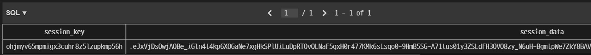
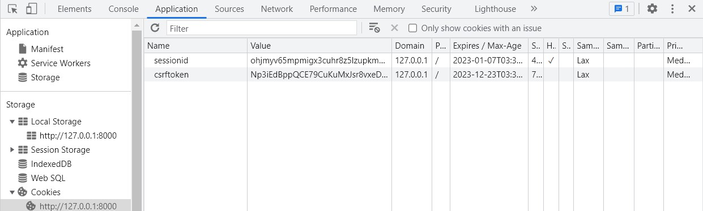

- [1. Overview](#1-overview)
  - [1.1. Authentication](#11-authentication)
  - [1.2. Authorization](#12-authorization)
  - [1.3. accounts App](#13-accounts-app)
- [2. Custom User Model](#2-custom-user-model)
  - [2.1. User Model](#21-user-model)
  - [2.2. Custom User Model](#22-custom-user-model)
  - [2.3. User Model Rendering](#23-user-model-rendering)
- [3. Session Authentication with Cookie](#3-session-authentication-with-cookie)
  - [3.1. Session Table](#31-session-table)
  - [3.2. What is Cookie](#32-what-is-cookie)
  - [3.3. Sessionid in Cookie](#33-sessionid-in-cookie)
- [4 User CRUD](#4-user-crud)
  - [4.1. Create (Sign Up)](#41-create-sign-up)
  - [4.2. Update](#42-update)
    - [4.2.1. User Information](#421-user-information)
    - [4.2.2. Password](#422-password)
  - [4.3. Delete (Withdrawl)](#43-delete-withdrawl)
- [5. Session CRUD](#5-session-crud)
  - [5.1. Create (Login)](#51-create-login)
  - [5.2. Delete (Logout)](#52-delete-logout)
- [6. Access Limitations](#6-access-limitations)
  - [6.1. View](#61-view)
  - [6.2. Template](#62-template)

---

# 1. Overview

## 1.1. Authentication

Authentication is the process of verifying who the user is

## 1.2. Authorization

Authorization is the process of verifying what specific applications, files, and data the user has access to

## 1.3. accounts App

Django strongly recommends that apps that manage User Model be named accounts

# 2. Custom User Model

## 2.1. User Model

[Django User Model 공식문서](https://docs.djangoproject.com/en/4.1/ref/contrib/auth/)  
Built-in model with authentication-related features in Django

## 2.2. Custom User Model

**Django strongly recommends developers to make a Custom User Model by inheriting AbstractUser.** Otherwise, it becomes difficult to modify the User Model during development.

1. **Make a Custom User Model**

   ```python
   # accounts/models.py
   from djagno.contrib.auth.models import AbstarctUser

   class User(AbstractUser):
       pass
   ```

2. **Register the Model to the Setting**

   ```python
   # settings.py

   # the vairable 'AUTH_USER_MODEL' is announced in global_settings.py whih settings.py inherited
   AUTH_USER_MODEL = 'accounts.User'   # default = 'auth.User'
   ```

3. **Register the Model to the Admin Page**

   ```python
   # accounts/admin.py
   from .models import User
   from django.contirb.auth.admin import UserAdmin

   # It should be registered to the admin site as same as the other models
   admin.site.register(User, UserAdmin)
   ```

## 2.3. User Model Rendering

Since the User model is registered in the template option, **the user variable can be used in the django template** without any additional procedures.

- settings.py

  ```python
  # settings.py

  TEMPLATES = [
    {
      'BACKEND': 'django.template.backends.django.DjangoTemplates',
      'DIRS': [BASE_DIR / 'templates',],
      'APP_DIRS': True,
      'OPTIONS': {
          'context_processors': [
              'django.template.context_processors.debug',
              'django.template.context_processors.request',
              'django.contrib.auth.context_processors.auth', # <<< this one
              'django.contrib.messages.context_processors.messages',
          ],
      },
    },
  ]
  ```

* templates
  ```html
  <p>Hello, {{user}}</p>
  ```
  If the user is not authenticated, it shows 'AnonymousUser'

# 3. Session Authentication with Cookie

## 3.1. Session Table

[Django Session Data에 대한 블로그 글](https://codingdog.tistory.com/entry/djangosession-%ED%85%8C%EC%9D%B4%EB%B8%94%EC%97%90-%EC%A0%80%EC%9E%A5%EB%90%98%EC%96%B4-%EC%9E%88%EB%8A%94-%EC%84%B8%EC%85%98%EC%9D%80-%EC%96%B4%EB%96%A4-%EA%B0%92%EB%93%A4%EC%9D%84-%EA%B0%80%EC%A7%80%EA%B3%A0-%EC%9E%88%EC%9D%84%EA%B9%8C%EC%9A%94)

- **Session key** is a randomly issued string.
- **Session data** is an encoded data of user.id, expired data, and etc.

## 3.2. What is Cookie


Cookie s a small piece of data that works on a web service. It's **issued by the server**, and the **browser stores cookies and automatically sends back** whenever the user sends a request to the server.

## 3.3. Sessionid in Cookie

`from django.contrib.auth import login`

- Generate session_key and session_data, and save data in django.session table  
  
- Set session cookie {'sessionid':session_key}  
  

# 4 User CRUD

## 4.1. Create (Sign Up)

- **forms.py**

  ```python
  # accounts/forms.py
  from django.contrib.auth import get_user_model
  from django.contrib.auth.forms import UserCreationForm

  class CustomUserCreationFrom(UserCreationForm):

      class Meta(UserCreationForm.Meta):
          model = get_user_model()
  ```

* **urls.py**

  ```python
  # accoutns/urls.py

  app_name =  'accounts'
  urlpatterns = [
      path('signup/', views.signup, name='signup'),
  ]
  ```

- **views.py**

  ```python
  from django.contrib.auth import login as auth_login
  from .forms import CustomUserCreationForm

  def login(request):
      if request.method  == 'POST':
          form = CustomUserCreationFrom(request.POST)
          if form.is_valid():
              # 곧바로 회원가입
              # save가 로그인 후 user을 반환
              user = form.save()
              auth_login(reqeust, user)
              return redirect('articles:index')
      else:
          form = CustomUserCreationForm()
      context = {
          'form': form
      }
      return render(request, 'accounts/signup.html', context)
  ```

* **signup.html**

  ```django
  <h1>Signup</h1>
  <form action="" method="POST">
      
      {{ form.as_p }}
      <input type="submit">
  </form>
  ```

## 4.2. Update

### 4.2.1. User Information

- **forms.py**

  ```python
  from django.contrib.auth import get_user_model
  from django.contrib.auth.forms import UserChangeForm

  class CustomUserChangeForm(UserChangeForm):

    class Meta(UserChangeForm.Meta):
        model = get_user_model()
        fields = ('email', 'first_name', 'last_name',)
  ```

* **urls.py**

  ```python
  # accoutns/urls.py

  app_name =  'accounts'
  urlpatterns = [
      path('update/', views.update, name='update'),
  ]
  ```

* **views.py**

  ```python
  from .forms import CustomUserChangeForm

  def update(request):
      if request.method  == 'POST':
          form = CustomUserChangeForm(request.POST, instance=request.user)
          if form.is_valid():
              form.save()
              return redirect('articles:index')
      else:
          form = CustomUserChangeForm(instance=request.user)
      context = {
          'form': form
      }
      return render(request, 'accounts/update.html', context)
  ```

- **update.html**

  ```django
  <h1>ChangeInfo</h1>
  <form action="" method="POST">
      
      {{ form.as_p }}
      <input type="submit">
  </form>
  ```

### 4.2.2. Password

- **urls.py**

  ```python
  # accoutns/urls.py

  app_name =  'accounts'
  urlpatterns = [
      path('password/', views.chage_password, name='change_password'),
  ]
  ```

- **views.py**

  ```python
  from django.contrib.auth.forms import PasswordChangeForm
  from django.contrib.auth import update_session_auth_hash

  def update(request):
      if request.method  == 'POST':
          form = PasswrodChangeForm(request.user, request.POST)
          if form.is_valid():
              form.save()
              # 비밀변경 후 변경 된 사용자 객체와 세션을 업데이트
              update_session_auth_hash(request, form.user)
              return redirect('articles:index')
      else:
          form = PasswordChangeForm(request.user)
      context = {
          'form': form
      }
      return render(request, 'accounts/change_password.html', context)
  ```

- **change_password.html**

  ```django
  <h1>Change Password</h1>
  <form action="" method="POST">
      
      {{ form.as_p }}
      <input type="submit">
  </form>
  ```

## 4.3. Delete (Withdrawl)

- **urls.py**

  ```python
  # accoutns/urls.py

  app_name =  'accounts'
  urlpatterns = [
      path('delete/', views.delete, name='delete'),
  ]
  ```

- **views.py**

  ```python
  def delete(request):
      # 탈퇴 후 로그아웃
      # 로그아웃 후 탈퇴 시, 요청 객체 정보가 사라져서 탈퇴할 수 없음
      request.user.delete()
      auth_logout(request)
      return redirect('articles:index')
  ```

# 5. Session CRUD

## 5.1. Create (Login)

- **urls.py**

  ```python
  # accoutns/urls.py

  app_name =  'accounts'
  urlpatterns = [
      path('login/', views.login, name='login'),
  ]
  ```

* **views.py**

  ```python
  from django.contrib.auth.forms import AuthentifcationFrom
  from django.contrib.auth import login as auth_login

  def login(request):
      if request.method  == 'POST':
          form = AuthentificationForm(request, request.POST)
          # 쿠키를 보내기 위해서 request를 같이 넣어줌
          if form.is_valid()
              auth_login(request, form.get_user())
              return redirect('articles:index')
      else:
          form = AuthentificationForm()
      context = {
          'form': form
      }
      return render(request, 'accounts/login.html', context)
  ```

- **login.html**

  ```django
    <h1>Login</h1>
    <form action="" method="POST">
        
        {{ form.as_p }}
        <input type="submit">
    </form>
  ```

## 5.2. Delete (Logout)

- **urls.py**

  ```python
  # accoutns/urls.py

  app_name =  'accounts'
  urlpatterns = [
      path('logout/', views.logout, name='logout'),
  ]
  ```

- **views.py**

  ```python
  from django.contrib.auth import logout as auth_logout

  def logout(request):
      auth_logout(request)
      return redirect('articles:index')
  ```

# 6. Access Limitations

## 6.1. View

- **user.is_authenticated**
  ```python
  # articles.views.py
  # 로그인 된 사용자는 또다시 로그인 못하도록
  def login(request):
      if request.user.is_authenticated:
          return redirect('articles:index')
  ```
- **@login_required**

  - In the case of the '@login_required' decorator, the first address to be accessed is stored in the next query.

    ```python
    # articles.views.py
    from django.contrib.auth.decorators import login_required

    @login_required
    @request_http_methods(['GET', 'POST'])
    def create(request):
        pass

    # /accounts/create/로 강제 접속 시 해당 url이 next 쿼리로 저장
    # /accounts/login/?next=/accounts/create/
    ```

    ```python
    def login(request):
    if request.user.is_authenticated:
        return redirect('articles:index')

    if request.method == 'POST':
        form = AuthenticationForm(request, request.POST)
        if form.is_valid():
            auth_login(request, form.get_user())
            # next 쿼리가 있으면 바로 그곳으로 redirect 시킴, 없을 경우에는 index 페이지로
            return redirect(request.GET.get('next') or 'articles:index')
    else:
        form = AuthenticationForm()
    context = {
        'form': form,
    }
    return render(request, 'accounts/login.html', context)
    ```

    ```html
    <h1>Login</h1>
    <!--
    next쿼리를 유지시켜 주기 위해 요청 url 주소를 자기 자신으로 설정
    -->
    <form action="" method="POST">
       {{ form.as_p }}
      <input type="submit" />
    </form>
    ```

  - However, the next query is not available, if the function doesn't allow GET method.

    ```python
    # 아래를 위의 예시처럼 next쿼리를 다루더라도
    # GET으로 next쿼리를 처리하는 과정에서 @request_POST를 넘지 못함
    @login_required
    @request_POST
    def delete(request):
        article = Article.objects.get(pk=pk)
        article.delete()
        return redirect('articles:index')
    ```

    ```python
    @request_POST
    def delete(request):
        if request.user.is_authenticated:
            article = Article.objects.get(pk=pk)
            article.delete()
            return redirect('articles:index')
    ```

## 6.2. Template

- **user.is_authenticated**

  ```html
  <div class="container">
    
    <h3>{{ user }}</h3>
    <form action="" method="POST">
      
      <input type="submit" value="Logout" />
    </form>
    <form action="" method="POST">
      
      <input type="submit" value="회원탈퇴" />
    </form>
    <a href="">회원정보수정</a>
    
    <a href="">Login</a>
    <a href="">Signup</a>
    
    <hr />
     
  </div>
  ``
  ```
