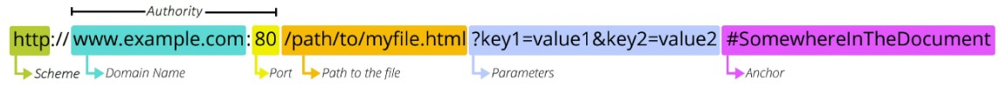

- [1. HTTP](#1-http)
  - [1.1. HTTP 정의](#11-http-정의)
  - [1.2. HTTP의 특징](#12-http의-특징)
  - [1.3. HTTP Request Methods](#13-http-request-methods)
  - [1.3. HTTP Response Status Code](#13-http-response-status-code)
  - [1.4. URI(Uniform Resource Indentifier)](#14-uriuniform-resource-indentifier)
  - [1.5. URL 구조](#15-url-구조)
- [2. REST API](#2-rest-api)
  - [2.1. API](#21-api)
  - [2.2. REST(Restpresentational State Trasfer)](#22-restrestpresentational-state-trasfer)
  - [2.3. JSON](#23-json)
- [3. Response JSON](#3-response-json)
  - [3.1. HTML 응답](#31-html-응답)
  - [2.2. JsonResponse()를 사용한 JSON 응답](#22-jsonresponse를-사용한-json-응답)
  - [2.3. Django Serializer를 사용한 JSON 응답](#23-django-serializer를-사용한-json-응답)
  - [2.4. Django의 REST framework를 사용한 JSON 응답](#24-django의-rest-framework를-사용한-json-응답)
    - [2.4.1. Django REST framework](#241-django-rest-framework)
    - [2.4.2. ModelSerializer](#242-modelserializer)
    - [2.4.3. Example](#243-example)
    - [2.4.4. Client의 JSON 수신](#244-client의-json-수신)
- [3. Django REST Framework, Single Model](#3-django-rest-framework-single-model)
- [4. Django REST Framework, N:1 Relationship](#4-django-rest-framework-n1-relationship)
- [5. Django REST Framework, N:1 Relation, Dereference](#5-django-rest-framework-n1-relation-dereference)

---

# 1. HTTP

## 1.1. HTTP 정의

웹 상에서 리소스를 주고받는 규칙(프로토콜), 클라이언트와 서버는 요청과 응답을 주고 받는다.

- **요청(request)**
  - 클라이언트에 의해 전송되는 메시지
- **응답(response)**
  - 서버에서 응답으로 전송되는 메시지

## 1.2. HTTP의 특징

- **Stateless(무상태)**
  - 동일한 연결에서 연속적으로 수행되는 두 요청 사이에 링크가 없음

* **쿠키와 세션**
  - 쿠키와 세션을 사용해 서버 상태를 요청에 함께 보냄

## 1.3. HTTP Request Methods

클라이언트 요청 시, 리소스(데이터)에 대한 행위를 구분한다.

- **GET**
  - 서버에 리소스의 표현을 요청
- **POST**
  - 데이터를 지정된 리소스에 제출
- **PUT**
  - 요청한 주소의 리소스를 수정
- **POST**
  - 지정된 리소스를 삭제

## 1.3. HTTP Response Status Code

[HTTP Response Status Code Docs](https://developer.mozilla.org/en-US/docs/Web/HTTP/Status)  
특정 HTTP 요청에 대한 서버의 처리결과를 나타내며, 크게 5개의 그룹으로 나뉜다.

- Informational Responses (100~199)
- Successful Responses (200~299)
- Redirection Responses (300~399)
- Client Error Responses (400~499)
- Server Error Responses (500~599)

## 1.4. URI(Uniform Resource Indentifier)

**인터넷에서 하나의 리소스를 가리키는 문자열**

- **URN(Uniform Resource Name)**
  - 고유한 이름
- **URL(Uniform Resource Locator)**
  - 리소스의 주소(위치)

## 1.5. URL 구조



- **Schema**
  - 브라우저가 리소스를 이용하는 데 사용해야할 프로토콜
  - Ex: https:, mailto:, ftp:
- **Authority**
  - **Domain Name(IP 주소)**
    - 요청중인 웹 서버를 나타냄
    - Domain Name 대신 IP주소를 사용해도 된다.
  - **Port**
    - 웹 서버의 리소스에 접근하는데 사용되는 기술적인 문
    - HTTP 프로토콜의 표준 포트는 생략 가능하다.
      - HTTP - 80
      - HTTPS - 443
    - Django의 경우 8000이 기본 포트로 설정되어 있다.
- **Path**
  - 웹 서버의 리소스 경로, 물리적 주소가 아닌 설계자에 의해 추상화된 경로
- **Parameters**
  - 웹 서버에 제공하는 추가적인 데이터
  - '&'기호로 구분되는 key-value 쌍 목록
- **Anchor**
  - 리소스 내부 일정의 북마크를 나타내며, 브라우저의 해당 북마크 지점에서 콘텐츠를 표시
  - '#'(부분 식별자)이후 부분은 서버에 전송되지 않고, 브라우저가 사용

# 2. REST API

## 2.1. API

**API(Application Programming Interface)**  
애플리케이션과 프로그래밍으로 소통하는 방법. 복잡한 코드를 추상화하여 사용할 수 있는 쉬운 구문을 제공

- **Web API**
  - 웹 서버 또는 웹 브라우저를 위한 API
  - 주로 JSON 타입의 데이터를 응답
- **Open API**
  - 개발자라면 누구나 사용할 수 있도록 공개된 API

## 2.2. REST(Restpresentational State Trasfer)

**API Server를 개발하기 위한 일종의 소프트웨어 설계 방법론**

- **특징**

  - **자원의 식별**
    - URI(URL)
  - **자원의 행위**
    - HTTP Method
  - **자원의 표현**
    - JSON

## 2.3. JSON

**JavaScript의 표기법을 따른 단순 문자열**로, 파이썬의 Dictionary 자바스크립트의 object처럼 C계열의 언어가 갖고 있는 자료구조로 쉽게 변환할 수 있는 key-value 형태의 구조를 가지고 있다.

# 3. Response JSON

Django는 현업에서 주로 백엔드 Framework로 쓰인다. 따라서 프론트엔드와 소통할 때 html 문서가 아닌 json으로 응답한다.

## 3.1. HTML 응답

- **urls.py**

  ```python
  from django.urls import path
  from . import views

  urlpatterns = [
      path('html/', views.article_html),
  ]
  ```

- **views.py**

  ```python
  from django.shortcuts import render
  from .models import Article

  def article_html(request):
      articles = Article.objects.all()
      context = {
        'articles': articles,
      }
      return render(request, 'articles/article.html', context)
  ```

- **article.html**
  ```html
  ...
  <body>
    <h1>Article List</h1>
    <hr>
    <p>
      
        <h2>{{ article.pk }}번 글. {{ article.title }}</h2>
        <p>{{ article.content }}</p>
        <hr>
      
    </p>
  </body>
  ```

## 2.2. JsonResponse()를 사용한 JSON 응답

**Serilaize**  
Queryset 및 Model Instance와 같은 복잡한 데이터를 JSON, XML과 같은 쉽게 변환 할 수 있는 원시 데이터타입으로 변환시키는 것

- **JsonResponse()**
  - JSON-encoded response를 만드는 클래스
  - **safe**
    - Default: True
    - False로 설정 시 모든 타입의 객체를 serialization할 수 있음, True일 경우 dictionary만 가능

* **urls.py**

  ```python
  from django.urls import path
  from . import views

  urlpatterns = [
      path('json1/', views.jsonresponse),
  ]
  ```

* **views.py**

  ```python
  from django.http.response import JsonResponse
  from .models import Article

  def jsonresponse(request):
      articles = Article.objects.all()
      articles_json = []

      for article in articles:
          # 리스트[딕셔너리] 형태로 데이터를 형성
          articles_json.append(
              {
                  'id': article.pk,
                  'title': article.title,
                  'content': article.content,
                  'created_at': article.created_at,
                  'updated_at': article.updated_at,
              }
          )
      return JsonResponse(articles_json, safe=False)
  ```

## 2.3. Django Serializer를 사용한 JSON 응답

- **serializers.serialize(format, object)**

  - object를 format으로 변환해줌
  - **format**
    - 'xml' / 'json' / 'jsonl' / 'yaml'

- **urls.py**

```python
from django.urls import path
from . import views

urlpatterns = [
    path('json2/', views.django_serializer),
]
```

- **views.py**

```python
from django.http.response import JsonResponse, HttpResponse
from django.core import serializers
from .models import Article

def django_serializer(request):
    articles = Article.objects.all()
    data = serializers.serialize('json', articles)
    return HttpResponse(data, content_type='application/json')
```

## 2.4. Django의 REST framework를 사용한 JSON 응답

### 2.4.1. Django REST framework

**Django에서 RESTful API서버를 쉽게 구축할 수 있도록 도와주는 오픈소스 라이브러리**

- **특징**

  - Django의 Form, ModelForm과 유사하게 사용 가능하다.

- **설치 과정**
  1. `pip install djangorestframework`
  2. `INSTALLED_APPS = [ 'rest_framework' ]`

### 2.4.2. ModelSerializer

**ModelSerializer 클래스는 Model Class를 바탕으로 형성하는 Serializer 클래스.** [Serializer와 Deserialize와 관련한 다양한 메소드를 가진다](https://www.django-rest-framework.org/api-guide/serializers/)

- **ModelSerializer(obj, ..., many=False)**
  - **obj**
    - Model의 객체 `obj`를 첫번째 인자로 받는다.
  - **many**
    - True일 경우, 여러 개의 객체를 받을 수 있다.
  - **is_valid()**
    - 제출된 Serializer가 정의된 Model 구조에 유효한지를 검사

ModelSerializer는 Model 객체를 인자로 받아, 원시 파이선 데이터 타입으로 바꾼다. 이는 JSON은 아니지만 JSON으로 변환되기 쉬운 데이터 타입이다. 나중에 Response()시 renderer가 해당 원시타입(serializer.data)을 처리하여 보낸다.

### 2.4.3. Example

- **serializers.py**

  ```python
  from rest_framework import serializers
  from .models import Article


  class ArticleSerializer(serializers.ModelSerializer):

      class Meta:
          model = Article
          fields = '__all__'
  ```

- **urls.py**

  ```python
  from django.urls import path
  from . import views

  urlpatterns = [
      path('json3/', views.RESTserializer),
  ]
  ```

- **views.py**

  ```python
  from rest_framework.decorators import api_view
  from rest_framework.response import Response

  from .serializers import ArticleSerializer
  from .models import Article

  @api_view()
  def RESTserializer(request):
      articles = Article.objects.all()
      serializer = ArticleSerializer(articles, many=True)
      return Response(serializer.data)
  ```

### 2.4.4. Client의 JSON 수신

- `requests.get(url: str, params={key: value}, args)`
  - returns `requests.Response` object

```python
# pip install requests
import requests
from pprint import pprint

# 요청을 보냄
response = requests.get('http://127.0.0.1:8000/api/v1/json3/')
# json(): requests.Response -> dict
result = response.json()

# json.dumps() 등의 메소드는 dict <-> json

pprint(result)
```

# 3. Django REST Framework, Single Model

- **urls.py**

  ```python
  from django.urls import path
  from . import views

  urlpatterns = [
      path('articles/', views.article_list),
      path('articles/<int:article_pk>/', views.article_detail),
  ]
  ```

- **serializers.py**

  ```python
  from rest_framework import serializers
  from .models import Article

  # 데이터의 어떠한 field를 read할 것이냐에 따라 Serializer를 만든다!!!!

  class ArticleListSerializer(serializers.ModelSerializer):

      class Meta:
          model = Article
          fields = ('id', 'title', 'contnet', )

  class ArticleSerializer(serializers.ModelSerializer):

    class Meta:
        model = Article
        fields = '__all__'
  ```

- **views.py**

  ```python
  from rest_framework.response import Response
  from rest_framework.decorators import api_view
  from rest_framework import status
  from django.shortcuts import get_object_or_404, get_list_or_404
  from .serializers import ArticleListSerializer, ArticleSerializer, CommentSerializer
  from .models import Article, Comment

  @api_view(['GET', 'POST'])   # decorator가 필수적으로 붙는다.
  def article_list(request):
      if request.method == 'GET':
          # articles = Article.objects.all()
          articles = get_list_or_404(Article)
          serializer = ArticleListSerializer(articles, many=True)
          return Response(serializer.data)

      elif request.method == 'POST':
          serializer = ArticleSerializer(data=request.data) # 이것은 그냥 최종적으로 제출되는 JSON에 다라서 설정
          if serializer.is_valid(raise_exception=True):
              serializer.save()
              return Response(serializer.data, status=status.HTTP_201_CREATED)
          # return Response(serializer.errors, status=status.HTTP_400_BAD_REQUEST)


  @api_view(['GET', 'DELETE', 'PUT'])
  def article_detail(request, article_pk):
      # article = Article.objects.get(pk=article_pk)
      article = get_object_or_404(Article, pk=article_pk)

      if request.method == 'GET':
          serializer = ArticleSerializer(article)
          return Response(serializer.data)

      elif request.method == 'DELETE':
          article.delete()
          return Response(status=status.HTTP_204_NO_CONTENT)

      elif request.method == 'PUT':
          serializer = ArticleSerializer(article, data=request.data)
          if serializer.is_valid(raise_exception=True):
              serializer.save()
              return Response(serializer.data)
  ```

- `'api_view'== decorator`
  - 해당 함수가 허용하는 HTTP 메소드 목록을 정의하며, 필수로 붙여줘야 한다.
  - 다른 메소드 요청에 대해서는 **405 Method Not Allowed**로 응답한다.
- `get_object_or_404(Model, {options})`
  - 데이터베이스에서 option을 만족하는 객체를 ==하나==찾아 반환한다.
  - 없을 경우, **404 Not Found**로 응답한다.
- `get_list_or_404(Model, {options})`
  - 데이터베이스에서 option을 만족하는 객체를 모두 찾아 리스트로 반환한다.
  - 없을 경우, **404 Not Found**로 응답한다.
- `serializer.is_valid(raise_exception=True)`
  - 유효성 검사를 통과하지 못할 경우, **400 Bad Request**와 함께 관련된 데이터를 돌려보낸다.
- `Response(data, ..., status)`
  - 보낼 data를 데이터를 첫번재 인자로 받고, status는 http response method를 의미한다.

# 4. Django REST Framework, N:1 Relationship

- **urls.py**

  ```python
  from django.urls import path
  from . import views

  urlpatterns = [
      path('comments/', views.comment_list),
      path('comments/<int:comment_pk>/', views.comment_detail),
  ]
  ```

- **serializers.py**

  ```python
  from rest_framework import serializers
  from .models import Comment

  # 데이터의 어떠한 field를 read할 것이냐에 따라 Serializer를 만든다!!!!

  class CommentSerializer(serializers.ModelSerializer):

    class Meta:
        model = Comment
        fields = '__all__'
        read_only_fields = ('article',) # 생성 시에 is_valid()를 무사히 통과한 뒤에 별도로 넣어 줌. is_valid()에서 제외시킨다.
        # Form 기능도 가지고 있다고 생각하자.
  ```

- **views.py**

  ```python
  from rest_framework.response import Response
  from rest_framework.decorators import api_view
  from rest_framework import status
  from django.shortcuts import get_object_or_404, get_list_or_404
  from .serializers import ArticleListSerializer, ArticleSerializer, CommentSerializer
  from .models import Article, Comment

  @api_view(['GET'])
  def comment_list(request):
      if request.method == 'GET':
          # comments = Comment.objects.all()
          comments = get_list_or_404(Comment)
          serializer = CommentSerializer(comments, many=True)
          return Response(serializer.data)

  @api_view(['POST'])
  def comment_create(request, article_pk):
      # article = Article.objects.get(pk=article_pk)
      article = get_object_or_404(Article, pk=article_pk)
      serializer = CommentSerializer(data=request.data)
      if serializer.is_valid(raise_exception=True):
          serializer.save(article=article)    # 저장 전에, 외래키 값을 넣음.
          return Response(serializer.data, status=status.HTTP_201_CREATED)

  @api_view(['GET', 'DELETE', 'PUT'])
  def comment_detail(request, comment_pk):
      # comment = Comment.objects.get(pk=comment_pk)
      comment = get_object_or_404(Comment, pk=comment_pk)

      if request.method == 'GET':
          serializer = CommentSerializer(comment)
          return Response(serializer.data)

      elif request.method == 'DELETE':
          comment.delete()
          return Response(status=status.HTTP_204_NO_CONTENT)

      elif request.method == 'PUT':
          serializer = CommentSerializer(comment, data=request.data)
          if serializer.is_valid(raise_exception=True):
              serializer.save()
              return Response(serializer.data)
  ```

# 5. Django REST Framework, N:1 Relation, Dereference

- **serializers.py**

  ```python
  from rest_framework import serializers
  from .models import Comment

  class CommentSerializer(serializers.ModelSerializer):

  class ArticleSerializer(serializers.ModelSerializer):
    # comment_set = serializers.PrimaryKeyRelatedField(many=True, read_only=True)
    comment_set = CommentSerializer(many=True, read_only=True)
    comment_count = serializers.IntegerField(source='comment_set.count', read_only=True)

    class Meta:
        model = Article
        fields = '__all__'
  ```

  - <mark>외래키 **참조/역참조**하는 객체에 대한 Serializer를 참조할 때는 반드시 이름을 **필드명/역참조 매니저**와 일치시켜줘야 한다.</mark> 그래야지 Serializer에 어떤 객체를 넣어야할지 id값으로 장고가 처리할 수 있다.
  - **source**
    - 받은 객체에 대한 ORM을 작성한다.
    * Ex. `Article.comment_set.count() -> 'comment_set.count'`
