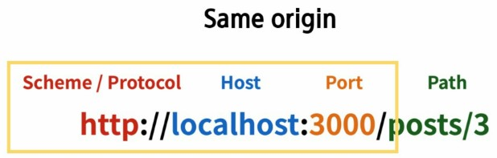

# Django REST Authentication

## Index

- [1. CORS](#1-cors)
  - [1.1. Same Origin Policy](#11-same-origin-policy)
  - [1.2. Definition of Origin](#12-definition-of-origin)
  - [1.3. CORS](#13-cors)
    - [1.3.1. django-cors-headers](#131-django-cors-headers)
- [2. Authentication](#2-authentication)
  - [2.1. Authentication Class](#21-authentication-class)
  - [2.2. Permission Class](#22-permission-class)
- [3. dj-rest-auth](#3-dj-rest-auth)
  - [3.1. Installation](#31-installation)
  - [3.2. Registration](#32-registration)

---

# 1. CORS

## 1.1. Same Origin Policy

The same-origin policy is a critical security mechanism **by browsers** that restricts how a document or script loaded by one origin can interact with a resource from another origin.

## 1.2. Definition of Origin



## 1.3. CORS

Cross-Origin Resource Sharing (CORS) is **an HTTP-header based mechanism that** allows a server to indicate any origins (domain, scheme, or port) other than its own from which a browser should permit loading resources.

**The server determines which origins are accessible to its resources.**

### 1.3.1. django-cors-headers

**Library to add CORS header to response**

- **Procedure**

  1. `pip install django-cors-headers`
  2. Add to `INSTALLED_APPS` and `MIDDLEWARE`

     ```python
     INSTALLED_APPS = [
         ...,
         "corsheaders",
         ...,
     ]

     MIDDLEWARE = [
         ...,
         "corsheaders.middleware.CorsMiddleware",
         "django.middleware.common.CommonMiddleware",
         ...,
     ]
     ```

  3. Register the accessible domains

     ```python
     CORS_ALLOWED_ORIGINS = [
         "https://example.com",
          ...
     ]

     # CORS_ALLOW_ALL_ORIGINS = True
     ```

---

# 2. Authentication

[django REST framework Authentication](https://www.django-rest-framework.org/api-guide/authentication/)

## 2.1. Authentication Class

REST framework will attempt to authenticate with each class in the list.

```python
REST_FRAMEWORK = {
    # Authentication
    'DEFAULT_AUTHENTICATION_CLASSES': [
        # ID and Password
        'rest_framework.authentication.BasicAuthentication',
        # Session
        'rest_framework.authentication.SessionAuthentication',
        # Token
        'rest_framework.authentication.TokenAuthentication',
    ],
}
```

## 2.2. Permission Class

[Permission Classes](https://www.django-rest-framework.org/api-guide/permissions/#api-reference)

Permissions determine whether a request should be granted or denied access. Permissions in REST framework are always defined as a list of permission classes.

```python
REST_FRAMEWORK = {
    # Permission
    'DEFAULT_PERMISSION_CLASSES': [
        # 'rest_framework.permissions.IsAuthenticated',
        'rest_framework.permissions.AllowAny',  # 모든 요청에 대해 허용 후, url 개별적으로 제한
    ],
}
```

```python
@permission_classes([IsAuthenticated])
def example_view(request, format=None):
    content = {
        'user': str(request.user),  # `django.contrib.auth.User` instance.
        'auth': str(request.auth),  # None
    }
    return Response(content)
```

---

# 3. dj-rest-auth

[dj-rest-auth doc](https://dj-rest-auth.readthedocs.io/en/latest/index.html)
The library that provides REST API end points related to authentication

## 3.1. Installation

1.  User should be customized before start.
    ```python
    AUTH_USER_MODEL = 'accounts.User'
    ```
2.  `pip install dj-rest-auth`
3.  Add dj_rest_auth app to INSTALLED_APPS in your django settings
    ```python
        INSTALLED_APPS = (
        ...,
        'rest_framework',
        'rest_framework.authtoken',
        ...,
        'dj_rest_auth'
    )
    ```
4.  Add dj_rest_auth urls
    ```python
    urlpatterns = [
    ...,
    path('dj-rest-auth/', include('dj_rest_auth.urls'))
    ]
    ```
5.  `python manage.py migrate`

## 3.2. Registration

Additional packages must be installed to add a membership registration function.

1. `pip install 'dj-rest-auth[with_social]'`

2. Add apps to INSTALLED_APPS in your django settings
   ```python
   INSTALLED_APPS = [
   ...,
   'django.contrib.sites',
   'allauth',
   'allauth.account',
   'allauth.socialaccount',
   'dj_rest_auth.registration',
   ]
   ```
3. Add SITE_ID = 1 to your django settings
   ```python
   SITE_ID = 1
   ```
4. Add dj_rest_auth.registration urls
   ```python
   urlpatterns = [
   ...,
   path('dj-rest-auth/', include('dj_rest_auth.urls')),
   path('dj-rest-auth/registration/', include('dj_rest_auth.registration.urls'))
   ]
   ```
5. `python manage.py migrate`
