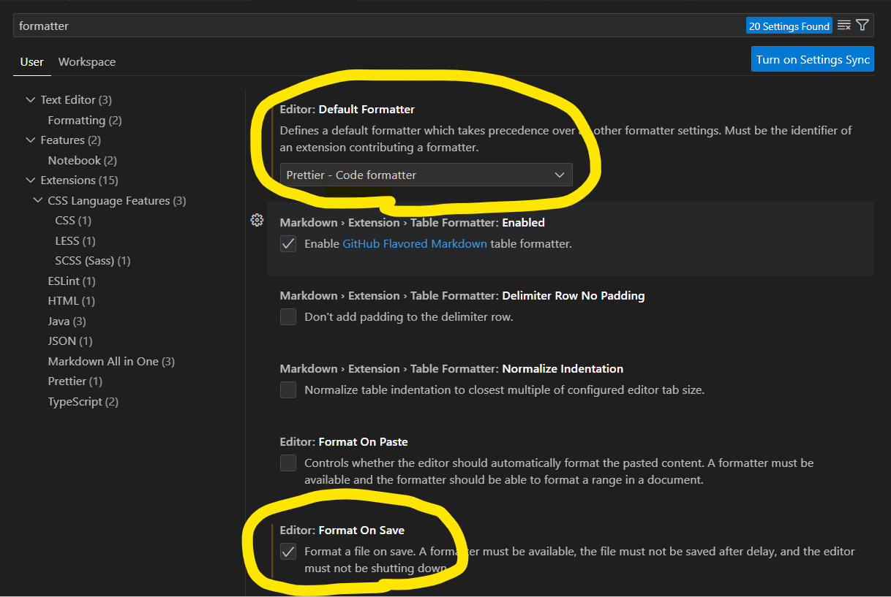

# 1. 개요

## 1.1. Prettier & ESLint란?

Prettier와 ESLint는 각각 코드 포맷팅(Code Formatting)과 린팅(Linting)을 지원하는 도구이다. **코드 포맷팅은 코드 전체에서 일관된 스타일링을 적용해 가독성을 높이는 작업**을 말하며, **린팅은 소스 코드를 분석하여 잠재적인 오류, 버그, 스타일 규칙 위반 등을 찾아내는 과정**을 말햔다. 따라서 린팅이 코드 포맷팅의 기능도 일부 포함한다.

보통 팀 단위 작업을 할 때, 여러 개발자들 간의 원활한 협업과 일관된 코드 품질을 위해 위 2가지 도구는 기본적으로 사용한다. 나는 이번에 혼자 작업하는 거라서 Prettier와 ESLint설정을 건너 뛰었는데, 참 바보같은 결정이었다.

특히, ESLint는 말한 것처럼 소스 코드에 대한 잠재적인 오류를 찾아내기 때문에, **혼자 작업하더라도 코드의 품질을 높이는데 중요한 역할을 한다.** 예를 들어, TypeScript의 관련된 강화된 규칙을 강제하거나, 안 쓰는 모듈의 import를 제거할 수 있다. 따라서 프로젝트를 본격적으로 시작하기 전에 Prettier와 ESLint를 설정해줄 것을 강력하게 추천한다.

## 1.2. Husky란?

**Husky는 Git 훅 관리 도구이다.** Git 이벤트(commit, push, ...) 발생 시, 이벤트 전/후에 특정 스크립트를 실행시킬 수 있다.

<mark>생각해보면 앞서 설정한 Prettier와 ESLint는 모두 자동으로 실행되지 않는다. CLI 명령어를 돌리거나 vsCode와 같은 코드 편집기에 관련 설정을 해줘야 한다.</mark> 만약 팀의 누군가가 관련 설정을 하지 않고, git에 커밋하면 그냥 올라가는 것이다. 이를 방지하기 위해서, Husky와 같은 도구를 사용해 Prettier와 ESLint를 커밋 시마다 강제할 수 있다.

# 2. Prettier

아래 내용은 [prettier 공식문서](https://prettier.io/docs/en/install.html)를 따라 작성했다.

1. **prettier 설치**

   ```bash
   npm install --save-dev --save-exact prettier
   ```

2. **prettier 설정파일 생성**

   프로젝트 루트 경로에 .prettierrc.json 파일을 생성하고, [prettierrc 설정 옵션 문서](https://prettier.io/docs/en/options.html)을 참고해서 원하는대로 파일을 작성하면 된다. 내가 작성한 설정 파일은 다음과 같다.

   ```json
   {
     "trailingComma": "es5", // 객체, 배열의 마지막 요소 뒤에 쉼표(,) 추가
     "tabWidth": 2,
     "semi": false,
     "singleQuote": true
   }
   ```

3. **.prettierignore 생성**  
    .prettierignore을 통해 **prettier CLI 명령어**를 적용시키지 않을 문서를 설정한다.

   ```text
   # Gatsby의 경우 빌드 결과물이 public 폴더에 저장된다
   public
   coverage

   # 다음 요소들은 기본 설정되므로 따로 추가할 필요 없다.
   **/.git
   **/.svn
   **/.hg
   **/node_modules
   ```

4. **prettier cli 실행 방법**

   `--write` 옵션를 통해 prettier 코드 포맷팅을 적용할 수 있다.

   ```bash
   # 모든 파일
   npx prettier --write .

   # 특정 파일 지정
   npx prettier --write src/components/Button.js
   ```

   `--check` 옵션을 통해 prettier 포맷팅을 검사만 하고, 실제 수정하지는 않을 수 있다.

   ```bash
   npx prettier --check .
   ```

5. **prettier vsCode 연동**  
   헷갈리지 말아야할 것이 prettier은 설치만 한다고 해서, **파일 저장 시** prettier 코드 포맷팅이 적용되는 것이 아니다.
   <mark>**파일 저장 시 prettier 적용을 위해서는 코드 편집기의 도움이 필요하다.**</mark> vsCode의 경우 **Prettier - Code formatter** 플러그인을 설치하고 아래 설정을 체크해준다.

   

# 3. ESLint

아래 내용은 [eslint 공식문서](https://eslint.org/docs/latest/use/getting-started)에 따라 작성했다.

1. **ESLint 설치**

   ```bash
   npm install --save-dev eslint
   ```

2. **ESLint 설정 파일 생성**

   프로젝트 루트 경로에 ESLint 설정파일(touch .eslintrc.js)를 생성한다.

   ```bash
   touch .eslintrc.js
   ```

3. **ESLint 설정 파일 작성**

   [Gatsby 공식문서](https://www.gatsbyjs.com/docs/how-to/custom-configuration/eslint/)와 [eslint 공식문서](https://eslint.org/docs/latest/use/getting-started)를 참고하여 다음과 같은 기본 .eslintrc.js파일을 작성했다.

   ```bash
   # Gatsby 공식문서에 따라 다음 eslint config를 설치한다.

   npm install eslint-config-react-app
   ```

   ```js
   // .eslintrc.js example
   module.exports = {
     globals: {
       __PATH_PREFIX__: true,
     },
     env: {
       browser: true,
       es2021: true,
     },
     extends: ['eslint:recommended', 'react-app']
     parserOptions: {
       ecmaVersion: 'latest',
       sourceType: 'module',
     },
   }
   ```

   - **global**  
     ESLint를 수행하는 데 있어서 필요한 전역변수를 설정한다.
     - **PATH_PREFIX**
       gatsby-config.js파일에 `pathPrefix`옵션이 설정되어 있음을 알려준다.
   - **env**
     - **browser**
       이 옵션은 코드가 브라우저 환경에서 실행될 것임을 나타냄으로써, 브라우저에서 제공하는 전역 객체와 API를 사용하는 코드에 대해 적절한 규칙을 적용할 수 있다.
     - **es2021**  
       ECMAScript 2021(ES2021)의 기능을 사용할 것임을 나타냄으로써, ES2021에서 추가된 문법을 사용하는 코드에 대해 적절한 규칙을 적용할 수 있다.
   - **parserOptions**  
     parser에 대한 옵션을 지정한다. paser는 ESLint가 코드의 문맥을 해석하기 위해서 사용하는 도구라고 생각하면 된다.
     - **ecmaVersion**  
       "latest"로 설정하면 ESLint는 현재 사용 가능한 최신 ECMAScript 버전에 대한 기능을 인식할 수 있다.
     - **sourceType**  
       "module"로 설정하면 코드가 ES 모듈 형식인 것을 나타낸다.

4. **ESLint cli 실행 방법**

   다음 cli 명령어를 통해 ESLint를 실행하고 수정할 수 있다.

   ```bash
   # 특정 파일에 대한 ESLint 실행
   npx eslint --fix file1.js file2.js

   # 특정 디렉토리에 대한 ESLint 실행
   npx eslint --fix lib/**
   ```

5. **ESLint vsCode 연동**  
    역시나 헷갈리지 말아야할 것이 ESLint를 설치만 한다고 해서, **파일 저장 시** ESLint가 적용되지는 않는다. <mark>**파일 저장 시 ESLint 적용을 위해서는 코드 편집기의 도움이 필요하다.**</mark>

   vsCode의 경우 **ESLint** 플러그인을 설치하고 아래 설정을 체크해준다.

   ```json
   // ctrl+shif+P > 'settings' 검색 > User Settings (JSON)
   {
      "editor.formatOnSave": true,
      "editor.codeActionsOnSave": {
         "source.fixAll.eslint": true // ES Lint 저장 시 자동 fix 설정
      },
      ...
   }
   ```

## 3.1. ESLint & Prettier

앞 서 설명한 것처럼 **린팅은 코드 포맷팅 기능을 포함한다.** 따라서 코드 포맷팅(스타일링)에서 ESLint와 prettier의 규칙이 충돌할 수 있기 때문에 이를 중재할 필요가 있다. <mark>보통 충돌이 일어날 때, prettier의 규칙을 따르도록 설정한다.</mark>

1. **config 설치**

   'eslint-confing-prettier'는 prettier에 대한 규칙 패키지이다.

   ```bash
   npm install --save-dev eslint-config-prettier
   ```

2. **.eslintrc.js 수정**

   ```json
   {
     "extends": [ ... , "prettier"]   // prettier을 가장 마지막에 둬야 한다.
   }
   ```

## 3.2. ESLint & Typescirpt

여러분의 프로젝트가 TypeScript라면, ESLint에 TypeScript에 대한 설정을 추가해줘야 한다. ESLint는 기본 설정이 JavaScript에 맞춰져 있기 때문이다.

1.  **parser와 plugin 설치**

    '@typescript-eslint/parser'는 TypeScript 코드를 분석하고 이해하기 위한 ESLint 파서이다. ESLint의 기본 파서가 JavaScript 파서이기 때문에, ESLint가 TypeScript 코드를 해석하기 위해서 설치해줘야 한다.

    '@typescript-eslint/eslint-plugin'는 TypeScript 프로젝트에서 사용되는 ESLint 규칙을 제공하는 플러그인이다.

    ```bash
    npm install --save-dev @typescript-eslint/parser @typescript-eslint/eslint-plugin
    ```

2.  **.eslintrc.js 수정**

    ```js
    module.exports = {
      extends: ['plugin:@typescript-eslint/recommended'], // 규칙 확장
      parser: '@typescript-eslint/parser',
      plugins: ['@typescript-eslint'], // 플러그인 적용
      root: true, // 현재 디렉토리가 루트 디렉토리임을 표시
    }
    ```

## 3.3. ESLint & Import 순서

ESliint를 이용해서 모듈 import 순서를 관리할 수 있다. 아래 내용은 [eslint-plugin-import의 README](https://www.npmjs.com/package/eslint-plugin-import#resolvers)를 참고해서 작성했다.

1. **plugin 설치**

   ```bash
   npm install --save-dev eslint-plugin-import
   ```

2. **.eslintrc.js 수정**

   ```js
   module.exports = {
     extends: ['eslint:recommended', 'plugin:import/recommended'], // 규칙 확장
     plugins: ['import'], // 플러그인 적용
     rules: {
       'import/no-unresolved': [2, { commonjs: true, amd: true }], //CommonJS, AMD 형식의 import 허용
     },
   }
   ```

3. **TypeScript 추가 설정**

   프로젝트가 TypeScript라면 다음을 추가 설정해줘야 한다.

   ```bash
   npm install --save-dev eslint-import-resolver-typescript
   ```

   ```js
   module.exports = {
     extends: ['eslint:recommended', 'plugin:import/recommended', 'plugin:import/typescript'], // 규칙 확장
     settings: {
       'import/resolver': {
         typescript: true // tsconfig.json 파일에 설정된 경로 매핑(alias)
         node: true // Node.js의 내장 모듈 및 node_modules 모듈 해석
       }
     },
   }
   ```

4. **import 순서 설정**

   [import/order 공식문서](https://github.com/import-js/eslint-plugin-import/blob/main/docs/rules/order.md)를 참고하여 자신만의 규칙을 커스텀한다. 나는 다음과 같이 작성했다.

   ```js
   module.exports = {
     rules: {
       'import/order': [
         2,
         {
           groups: ['builtin', 'external', 'internal'],
           pathGroups: [
             {
               pattern: 'react*', // react 관련 모듈 가장 앞으로
               group: 'builtin',
               position: 'before',
             },
             {
               pattern: '{./*scss, @styles/**}', // style 관련 모듈 앞으로
               group: 'builtin',
               position: 'before',
             },
           ],
           pathGroupsExcludedImportTypes: [], // pathGroups에 정의한 패턴 중 제외하고 싶은 것
           alphabetize: {
             order: 'asc', // 알파벳 내림차순 정렬
             caseInsensitive: true, // 대소문작 구분 안함
           },
           'newlines-between': 'never', // import문은 모두 붙이기
         },
       ],
     },
   }
   ```

## 3.4. ESLint & Unused Import

개발을 하다보면 import한 모듈이 필요없어지기도 한다. 더 이상 사용하지 않는 모듈을 'eslint-plugin-unused-imports'로 자동 삭제할 수 있다. 아래 내용은 [eslint-plugin-unused-import의 README](https://www.npmjs.com/package/eslint-plugin-unused-imports)를 참고해서 작성했다.

1. **plugin 설치**

   ```bash
   npm install eslint-plugin-unused-imports --save-dev
   ```

2. **.eslintrc.js 수정**

   ```js
   module.exports = {
     plugins: ['unused-imports'], // 플러그인 추가
     rules: {
       // 충돌 방지를 위해 기존의 관련된 규칙을 off 한다.
       'no-unused-vars': 'off', // or "@typescript-eslint/no-unused-vars": "off",
       'unused-imports/no-unused-imports': 'error',
       'unused-imports/no-unused-vars': [
         'warn',
         {
           vars: 'all',
           varsIgnorePattern: '^_',
           args: 'after-used',
           argsIgnorePattern: '^_',
         },
       ],
     },
   }
   ```

# 4. Husky

<mark>lint-staged</mark>를 Husky와 함께 설치해서 사용할 것이다. 왜냐하면 Husky를 이용해 commit 전에 코드 검사를 실행할텐데, 그냥 `npx eslint --fix` 구문을 사용하면, 작업영역(working directory)에서 린팅이 일어난다. commit 시에 검사를 하겠다는 말은 `git add` 명령어로 올라간 staging area의 파일들을 수정하겠다는 의미이다.

**이렇게 staged된 파일에 대해서 코드 검사를 지원하는 라이브러리가 'lint-staged'이다.** 의미를 알고나니, 라이브러리의 이름이 참 직관적이다.

아래 내용은 [Husky 공식문서](https://typicode.github.io/husky/getting-started.html#install)를 따라 작성했다.

1. **husky와 lint-staged 설치**

   ```bash
   npm install --save-dev husky lint-staged
   ```

2. **git 훅 활성화**

   `husky install`은 git 훅을 활성화하는 명령어로 프로젝트에서 적어도 한 번 실행시켜줘야 한다.

   ```bash
   npx husky install
   ```

3. **npm scripts.prepare 추가**

   [npm script 공식문서](https://docs.npmjs.com/cli/v7/using-npm/scripts)를 보면, npm 명령어들 간에도 lifecylce이 존재하다. 그 중 `prepare`는 `install`이후에 실행되는 명령어이다. 따라서 아래와 같이 설정하면, 다른 개발자들이 레포지토리를 다운받아 `npm install`를 실행시켰을 때, `husky install`도 자동으로 실행된다.

   ```json
   // pacakge.json
   {
     "scripts": {
       "prepare": "husky install"
     }
   }
   ```

4. **lint-staged 코드 작성**

   [lint-staged의 README](https://www.npmjs.com/package/lint-staged)를 참고해서 package.json에 관련 코드를 작성한다. 나는 아래와 같이 작성했다.

   ```json
   // pacakge.json
   {
     "lint-staged": {
       "*.{ts,tsx}": ["eslint --fix", "prettier --write"] // *.tx, *.tsx 파일에 대해 eslint와 prettier을 적용한다.
     }
   }
   ```

5. **husky pre-commit등록**

   [Git 공식문서](https://git-scm.com/book/en/v2/Customizing-Git-Git-Hooks)를 보면 어떤 git hook들이 있는지 확인할 수 있다. 아래 사용하는 'pre-commit'훅은 commit 이벤트를 감지하여, 커밋 전에 실행된다.

   husky의 훅들은 '.husky'디렉토리에서 git 훅과 동일한 이름의 파일에서 관리된다. 아래와 같은 명령어로 pre-commit 이벤트에 대해서 `` 명령어를 등록한다.

   ```bash
   npx husky add .husky/pre-commit "npx lint-staged"
   ```

# 5. 참조

- [Prettier](https://prettier.io/docs/en/install.html)
- [ESLint](https://eslint.org/docs/latest/use/getting-started)
- [TypeScript-ESLint](https://typescript-eslint.io/getting-started)
- [eslint-plugin-import](https://www.npmjs.com/package/eslint-plugin-import#resolvers)
- [eslint-plugin-import/order](https://github.com/import-js/eslint-plugin-import/blob/main/docs/rules/order.md)
- [eslint-plugin-unused-imports](https://www.npmjs.com/package/eslint-plugin-unused-imports)
- [Husky Getting Started](https://typicode.github.io/husky/getting-started.html#install)
- [npm scripts](https://docs.npmjs.com/cli/v7/using-npm/scripts)
- [lint-staged](https://www.npmjs.com/package/lint-staged)
- [Git Hooks](https://git-scm.com/book/en/v2/Customizing-Git-Git-Hooks)
