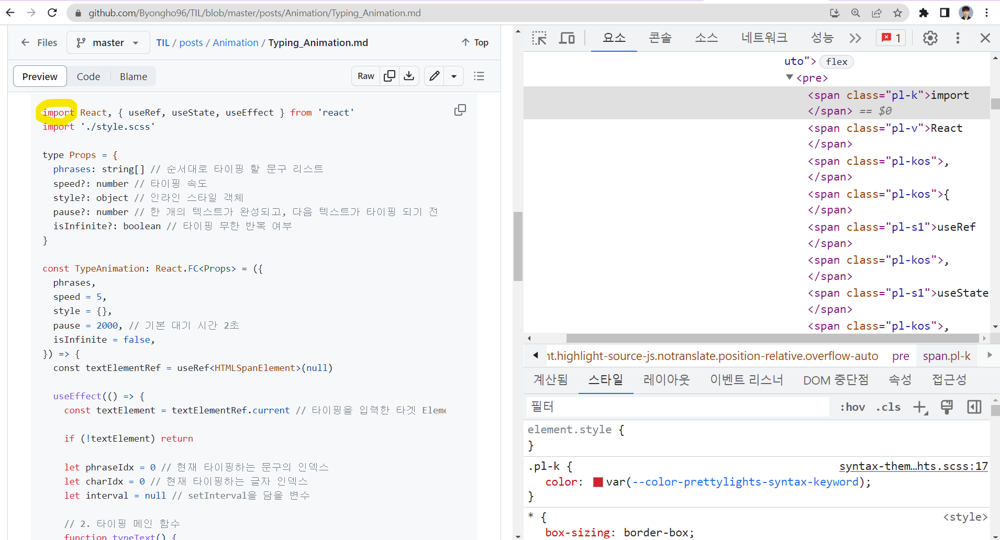

> `gatsby-transformer-remark`플러그인을 통한 `markdownRemark`노드를 사용을 전제합니다.

# 1. 마크다운 스타일링

나는 분명 [Gatsby 공식문서](https://www.gatsbyjs.com/docs/how-to/routing/adding-markdown-pages/)를 따라 `gatsby-transformer-remark`플러그인을 이용해서 마크다운 페이지를 만들고 있었다.

그러던 중 [Remark에서 MDX로 이전하는 방법](https://www.gatsbyjs.com/docs/how-to/routing/migrate-remark-to-mdx/)이라는 기가 차는 또 하나의 공식문서를 발견하게 되었다. 아마 Gatsby는 `remark`노드보다 `MDX`노드를 주력으로 밀려고 하나보다.

저 문서를 따라 몇 번 이전을 시도했지만, 번번히 실패하여 정신건강을 위해 그냥 `remark`노드를 이용하기로 했다. 어차피 내 웹사이트에는 MDX의 기능을 쓰지도 않는다.

## 1.1. GraphQL 불러오기

일단 grqphQL로 내가 원하는 `markdownRemark`노드의 `html`필드를 불러와야 한다. **이 html에는 마크다운 문서가 html형식을 변환된 값이 <mark>문자열 형식</mark>으로 담겨있다.**

```js
export const query = graphql`
  query ($id: String!) {
    markdownRemark(id: { eq: $id }) {
      html
      ...
    }
  }
`
```

## 1.2. dangerouslySetInnerHTML

그럼 이제 불러온 html 문자열을 리액트 tsx(jsx)문법에 맞춰 렌더링해야 한다.

리액트는 어떻게 알고, 이런 경우를 위한 <mark>특별한 prop을</mark> 준비해놨다. 바로 `dangerouslySetInnerHTML`이다.  
**`dangerouslySetInnerHTML`은 문자열 형식의 HTML을, 리액트 컴포넌트로 전환해서 렌더링할 수 있게 도와준다.** 사용방법은 간단하다. `dangerouslySetInnerHTML`의 `__html` 속성 값으로 문자열 형식의 HTML을 전달하기만 하면 된다.

근데 <mark>"dangerously"</mark>라는게 뭔가 좀 불안하다. 다른게 아니라 문자열이 그대로 html로 전환되는 만큼 조심히 사용하라는 것이다. 만약 전달하는 문자열이 악의적인 `<script/>`태그라도 가지고 있다면, XSS 공격이 발생할 수 있다.

나는 다행히도 지금 정적 웹사이트 생성기로, 내가 작성한 마크다운 파일을 렌더링하려는 것이기 때문에 보안의 위험은 걱정할 필요 없다.

```js
import React from 'react'
import type { PageProps } from 'gatsby'

const PostPage: React.FC<PageProps> = ({ data }) => {
  return <div dangerouslySetInnerHTML={{ __html: data.markdownRemark.html }} />
}
```

## 1.3. 마크다운 CSS

이제 그럼 렌더링 된 마크다운을 이쁘게 CSS 스타일링 해야한다. 근데 밑바닥부터 만드려니까 눈 앞이 깜깜해져, 좋은 레퍼런스를 하나 참조하기로 했다. 바로바로~ **github**이다!

솔직히 과연 github CSS가 있을까 했는데, [너무 대놓고 있었다](https://github.com/sindresorhus/github-markdown-css/blob/main/github-markdown.css). 심지어 [npm 패키지](https://www.npmjs.com/package/github-markdown-css)로도 제공한다. 나는 CSS를 커스텀할 것이기 때문에 복사해서 `src/styles/_markdown.scss`로 가져왔다.

### 1.3.1. 마크다운에만 한정 적용

복붙해 온 css 코드를 슬쩍 보면, 너무 감사하게도 한 가지 공통된 특징을 발견할 수 있다.

<mark>바로 모든 선택자에 `.markdown-body`가 붙는다는 것이다.</mark> 다시 말해서 github의 모든 CSS는 `markdown-body`라는 클래스를 가진 요소 안에서만 적용된다.

```css
.markdown-body mark {
  background-color: var(--color-attention-subtle);
  color: var(--color-fg-default);
}

.markdown-body small {
  font-size: 90%;
}

.markdown-body sub,
.markdown-body sup {
  font-size: 75%;
  line-height: 0;
  position: relative;
  vertical-align: baseline;
}

...
```

그럼 아주 간단하게 아까 tsx(jsx)로 가서

1. github CSS 파일을 import 하고
2. `dangerouslySetInnerHTML`으로 html을 내려준 요소에다 `markdown-body`라는 클래스를 추가해주면

해당 요소에만 github CSS 한정 적용된다.

```js
import React from 'react'
import from '@styles/_markdown.scss'
import type { PageProps } from 'gatsby'

const PostPage: React.FC<PageProps> = ({ data }) => {
  return (
    <div
      className="markdown-body" // 추가
      dangerouslySetInnerHTML={{ __html: data.markdownRemark.html }}
    />
  )
}
```

### 1.3.2. 다크모드

가져온 github CSS 파일을 보면, 다음과 같이 다크모드 관련 CSS 변수가 문서 앞쪽에서 모두 구분되어 있다.

따라서 이 CSS 변수할당 부분만, 자신의 웹사이트 다크모드 기능에 맞게 수정하면 된다.

```css
@media (prefers-color-scheme: dark) {
  .markdown-body {
    color-scheme: dark;
    --color-fg-default: #c9d1d9;
    --color-fg-muted: #8b949e;
    --color-fg-subtle: #6e7681;
    ...;
  }
}

@media (prefers-color-scheme: light) {
  .markdown-body {
    color-scheme: light;
    --color-fg-default: #24292f;
    --color-fg-muted: #57606a;
    --color-fg-subtle: #6e7781;
    ...;
  }
}
```

나는 context API를 이용하여 `theme`을 `'dark' | 'light'`로 받는다. 따라서 이 `theme`변수를 아까 `markdown-body`클래스를 달은 요소에 추가해주었고

```js
import React, { useContext } from 'react'
import from '@styles/_markdown.scss'
import type { PageProps } from 'gatsby'
import { ThemeContext } from '@contexts/theme-context'

const PostPage: React.FC<PageProps> = ({ data }) => {
  const { theme } = useContext(ThemeContext) // dark | light

  return (
    <div
      className={`markdown-body ${theme}`}
      dangerouslySetInnerHTML={{ __html: data.markdownRemark.html }}
    />
  )
}
```

이어서 깃헙 CSS의 변수할당 부분을 다음과 같이 커스텀했다.

```css
.markdown-body.dark {
  color-scheme: dark;
  --color-fg-default: #c9d1d9;
  --color-fg-muted: #8b949e;
  --color-fg-subtle: #6e7681;
  ...;
}

.markdown-body.light {
  color-scheme: light;
  --color-fg-default: #24292f;
  --color-fg-muted: #57606a;
  --color-fg-subtle: #6e7781;
  ...;
}
```

# 2. 코드 하이라이팅

## 2.1. 토큰화란? (Tokenization)

코드 하이라이팅에 대해 조금만 구글링해보면 <mark>토큰화(tokenization)</mark>라는 말이 나온다. 토큰이라고 하니까 JWT토큰 같은 것 밖에 생각 안나서 좀 이상했는데, 좀 더 알아보니 별거 아니었다.

**코드 하이라이팅에서 토큰화란 소스 코드를 어휘 단위로 나누는 과정을 의미한다.** 예를 들어, 키워드, 식별자, 연산자 등으로 해당 언어의 문법 구조에 맞춰 구분하는 것이다.

예시를 보면 훨씬 더 직관적으로 이해할 수 있다. 아래는 Github에서 내 레포지토리의 아무 md파일을 열어 확인한 것이다. Github 사이트도 자체적으로 코드하이라이팅 기능을 지원하는데, 개발자도구를 열어서 요소를 확인해보면, **작성된 코드 어휘 단위로 구분되어 클래스가 먹혀있는 걸 확인할 수 있다.** 그리고 오른쪽 아래를 보면 CSS는 클래스에 맞춰 색깔을 입혀줬을 뿐이다.



이러한 토큰화 과정은 코드 하이라이팅 말고도, TypeScript언어로 JavaScript로 컴파일 할 때, 혹은 JavaScript를 추상구문트리(AST, Abstract Syntax Tree)로 변환할 때도 거치는 과정이다.

## 2.2. Prism.js를 사용한 방법

결과적으로 채택하지 않은 방법이기 때문에 원리만 간단히 설명하려고 한다.

가장 쉽게 사용할 수 있는 Prism.js이다. [Gatsby와 연동되는 플러그인](https://www.gatsbyjs.com/plugins/gatsby-remark-prismjs/)이 있어 문서에 따라 `gatsby-config.js`파일만 작성해주면, `markdownRemark`노드를 만드는 과정에서 토큰화 과정도 함께 일어난다.

한마디로 `markdownRemark.html`안에 `pre > code`내부 값이 모두 토큰화 된 채로, `dangerouslySetInnerHTML`에 전달되었다. 이제 할 일은 <mark>클래스 네임에 따라 color를 입히는 css파일</mark>만 적용하면 된다. 이는 [prismjs npm 패키지](https://www.npmjs.com/package/prismjs)를 설치하면 받을 수 있다.

그런데 왜 Prism.js를 적용하지 않았냐? 하면 **너어어어무 못생겼기 때문이다.** [Prsim.js 공식 홈페이지](https://prismjs.com/)에 가면 스타일링을 미리 확인해볼 수도 있는데, 8가지 옵션이 있는데 하나같이 구리다. 그래서 갈아탔다.

## 2.3. Highlight.js를 사용한 방법

그러던 중 [Highlight.js](https://highlightjs.org/)를 찾았다.  
무려 스타일이 248개이다. 그리고 이따 보면 알겠지만, 생각보다 클래스가 많이 구분되지 않아 커스텀할 만하다.

HighlightJS도 [Gatsby 플러그인](https://www.gatsbyjs.com/plugins/gatsby-remark-highlight.js/)이 있기는 한데, 어째 내용도 부실하고 v1.0도 출시가 안된 것이 조금 꺼림직하다. 그래서 [HighlightJS 공식문서]를 참고해서 토큰화 함수를 돌릴 것이다.

1. **highlight.js 설치**
   ```bash
   npm install highlight.js
   ```
2. **highligt.css 작성**  
   원래는 아까 highlight.js npm 패키지 설치 시, `node_modules/styles`경로에 CSS 파일이 스타일 옵션 별로 설치되었기 때문에 그냥 `import`헤서 쓰기만 하면 된다.

   그런데 문제는 다크모드를 지원하기 위해서는 CSS 파일을 조건에 따라 동적으로 `import`해야 한다는 것이다. 어떻게 이걸 해야할지 모르겠어서 그냥 2개의 CSS 파일을 복붙해다가 아래처럼 `highlight.css`파일을 만들었다.

   보면 `github-light`와 `github-dark`스타일을 가져왔는데, 하나는 스타일 전체를 각각 `.light` 선택자와 `.dark`선택자 안에 둬서 동적으로 적용되게 했다. 이게 가능한 이유는, 앞 서 [1.3.2. 다크모드](#132-다크모드) 항목에서 마크다운 최상단 태그에 `${theme}` 클래스를 넣어주었기 때문이다.

   ```css
   pre code.hljs {
     display: block;
     overflow-x: auto;
     padding: 1em;
   }
   code.hljs {
     padding: 3px 5px;
   }

   .light {
     /*
    Theme: GitHub
    Description: Light theme as seen on github.com
    Author: github.com
    Maintainer: @Hirse
    Updated: 2021-05-15
    */
     .hljs {
       color: #24292e;
     }
     .hljs-doctag,
     .hljs-keyword,
     .hljs-meta .hljs-keyword,
     .hljs-template-tag,
     .hljs-template-variable,
     .hljs-type,
     .hljs-variable.language_ {
       color: #d73a49;
     }
     .hljs-title,
     .hljs-title.class_,
     .hljs-title.class_.inherited__,
     .hljs-title.function_ {
       color: #6f42c1;
     }
     ...;
   }

   .dark {
     /*
    Theme: GitHub Dark
    Description: Dark theme as seen on github.com
    Author: github.com
    Maintainer: @Hirse
    Updated: 2021-05-15
    */
     .hljs {
       color: #c9d1d9;
     }
     .hljs-doctag,
     .hljs-keyword,
     .hljs-meta .hljs-keyword,
     .hljs-template-tag,
     .hljs-template-variable,
     .hljs-type,
     .hljs-variable.language_ {
       color: #ff7b72;
     }
     .hljs-title,
     .hljs-title.class_,
     .hljs-title.class_.inherited__,
     .hljs-title.function_ {
       color: #d2a8ff;
     }
     ...;
   }
   ```

3. **highlightCode.js 파일 작성**  
   higlightCode.js의 역할은 두 가지이다.

   - 코드를 토큰화한다.
   - CSS 파일을 import 한다.

   [highligt.js 공식문서](https://highlightjs.readthedocs.io/en/latest/api.html#highlightelement)를 보면 `highlightElement`로 특정 엘리먼틀를 잡아 토큰화할 수 있다고 한다. 나는 `pre > code`요소 만을 선택했는데, 그냥 `code`로 하면 in-line 코드 블록까지 선택된다.  
    또 `configure`에다가 `ignoreUnescapedHTML: true`를 설정해줬는데, JSX 구분을 토큰화할 때 `<`와 `>`요소 등에 대해 콘솔 창에 경고 문구를 띄우길래, 그냥 무시하겠다는 설정이다.

   ```js
   import hljs from 'highlight.js'
   import '@styles/_highlight.scss' // CSS 파일

   hljs.configure({
     ignoreUnescapedHTML: true,
   })

   export default function highlightCode() {
     const codeBlocks = document.querySelectorAll('pre > code') // 인라인 코드 블록은 제외
     codeBlocks.forEach((codeBlock) => {
       if (typeof codeBlock === 'object') {
         hljs.highlightElement(codeBlock)
       }
     })
   }
   ```

4. **마운트 시 highlightCode.js 실행**  
   이제 작성한 highlightCode.js를 mount 되었을 떼 실행하면 된다. 지금은 Gatsby니가 Hydration 되었을 때 실행시킨다고 생각하면 더 적합할 것 같다.

   ```js
   import React, { useEffect, useContext } from 'react'
   import from '@styles/_markdown.scss'
   import type { PageProps } from 'gatsby'
   import { ThemeContext } from '@contexts/theme-context'
   import highlightCode from '@utils/highlightCode.ts'

   const PostPage: React.FC<PageProps> = ({ data }) => {
     const { theme } = useContext(ThemeContext)

     useEffect(() => {  // 마운트 되었을 때, highlightCode() 동작
       highlightCode()
     }, [])

     return (
       <div
         className={`markdown-body ${theme}`}
         dangerouslySetInnerHTML={{ __html: data.markdownRemark.html }}
       />
     )
   }
   ```

# 3. 참조

- [Gatsby: Adding Markdown Pages](https://www.gatsbyjs.com/docs/how-to/routing/adding-markdown-pages/)
- [Gatsby: Migrating Remark to MDX](https://www.gatsbyjs.com/docs/how-to/routing/migrate-remark-to-mdx/)
- [Github Markdown CSS](https://github.com/sindresorhus/github-markdown-css)
- [Gatsby Remark Prismjs](https://www.gatsbyjs.com/plugins/gatsby-remark-prismjs/)
- [HighligtJS](https://highlightjs.org/)
- [HighlightJS Documentation](https://highlightjs.readthedocs.io/en/latest/api.html#highlightelement)
