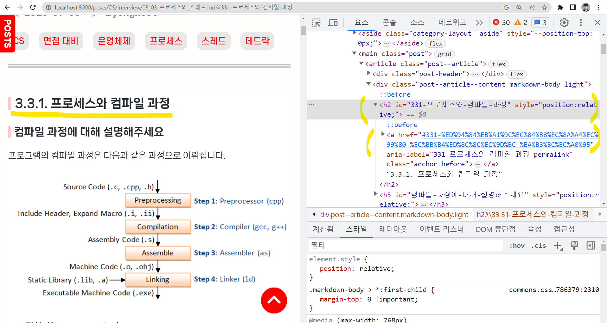
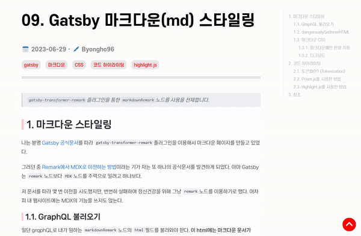
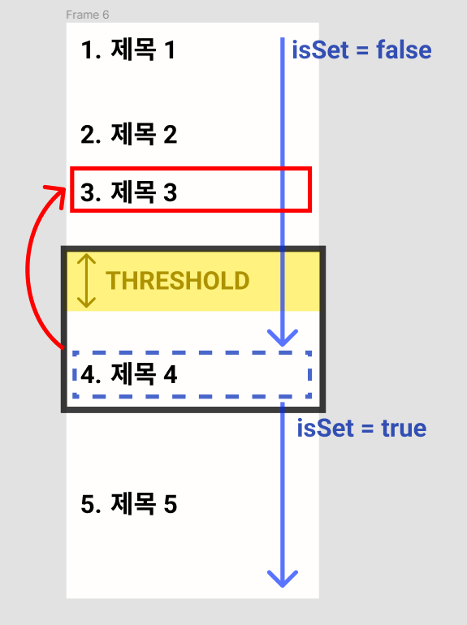

# 1. URL 프래그먼트 식별자(#)

일단 프래그먼트 식별자(a.k.a. #)이 어떻게 동작하는 알 필요가 있다.  
나는 평소 너무 당연하게 써왔지만, 어떻게 동작하는지는 한 번도 생각해보지 않았다.

1. 사용자가 URL을 입력하거나 링크를 클릭합니다.
2. 브라우저는 URL을 파싱하여 호스트, 포트 번호, 경로, 쿼리, 프래그먼트로 구분한다.
3. 페이지 렌더링이 완료되면, 브라우저가 프래그먼트 식별자를 처리한다.
4. 페이지에서 프래그먼트 식별자와 동일한 ID를 가진요소를 검색한다.
5. 요소가 발견되면, 브라우저는 해당 요소로 스크롤하여 사용자를 이동시킨다.
6. 만약 프래그먼트 식별자에 해당하는 요소가 없는 경을 경우, 별도로 추가 동작하지 않는다.

이런 사전 지식을 알고 있을 때, `gatsby-remark-autolink-headers`플러그인의 역할을 이해할 수 있다.

## 1.1. gatsby-remark-autolink-headers

gatsby-remark-autolink-headers의 역할은 대표적으로 두 가지이다.



- **헤더에 id 추가**  
  헤더 요소에 프래그먼트 식별자에 대응하는 id가 추가되어야, 브라우저가 스크롤을 이동시킬 수 있다.
- **헤더에 \<a/> 태그 추가**  
  헤더 요소에 추가되는 \<a/> 태그는, 눌렀을 때 자기 자신의 위치로 이동하는 프래그먼트 url값을 가진다.

적용 방법은 그냥 [공식문서](https://www.gatsbyjs.com/plugins/gatsby-remark-autolink-headers/)를 따라하면 된다.

# 2. TOC 생성

`markdownRemark`노드를 사용하느냐, `MDX`노드를 사용하느냐에 따라서 `tableOfContents`필드 값의 형태가 다른 것으로 알고 있다. <mark>하지만 형태는 중요하지 않다.</mark> 어차피 \<a/>태그가 적용되어 프래그먼트 식별자로 이동하는 동작 자체는 동일하기 때문이다.

`markdownRemark`노드를 사용할 경우, `<ul>`구조의 문자열 html이 검색되기 때문에, 아래와 같이 그대로 `dangerouslySetInnerHTML`에 내려주면 된다.

```js
import React from 'react'

// toc는 페이지 쿼리로부터 상속 받은 markdownRemark.tableOfContents 값이다.
const TableOfContent: React.FC = ({ toc }) => {
  return <div className="toc" dangerouslySetInnerHTML={{ __html: toc }} />
}

export default TableOfContent
```

# 3. 스크롤 이벤트

이제 스크롤 이벤트를 걸어 아래와 같이 상호작용하는 toc를 만들 것이다.



나는 내가 생각해낸 방법이 꽤나 마음에 드는데, 그림과 함께 설명하면 다음과 같다.



1. 위에서 부터 순서대로 탐색하며 `.active`클래스를 없애준다.
2. 헤더의 `top(상단 위치)`이 설정한 THRESHOLD보다 커지는 **첫번째 헤더**를 찾는다.
3. 그럼 <mark>해당 헤더가 아닌, 그 윗 헤더에 `.active`클래스를 달아주고</mark>
4. `isSet`이라는 변수의 값을 `false`라면 설정한다.
5. `isSet`라면 `top`이 `THRESHOLD`보다 크더라도, 무시하고 `.active`클래스를 없애준다.
6. 만약 마지막 요소를 순회할 때 까지 `isSet`이 `false`라면, 마지막 헤더에 `.active`클래스를 달아준다.

여기서 생각보다 중요한 점은 `.active`를 **추가**해야하는 요소 말고도, 다른 요소들에 대해서 `.active`를 **제거**해줘야 한다. 안 그러면 스크롤을 아주 빠르게 반복적으로 이동시켰을 때, 생각처럼 동작하지 않았다.

위 기능을 하나의 `useEffect`안에 구현하면 다음과 같다.

```js
useEffect(() => {
  const handleScroll = function () {
    const TOP_THRESHOLD = 50
    const headerElements = document.querySelectorAll(
      '.markdown-body h1, .markdown-body h2, .markdown-body h3'
    ) // toc 스크롤 기능을 적용하고자하는 헤더를 선택한다.

    let isSet = false
    for (let idx = 0; idx < headerElements.length; idx++) {
      const headerElement = headerElements[idx]
      const { top } = headerElement.getBoundingClientRect() // 현재 뷰포인트 기준, 요소의 상단 상대적 위치

      // toc에서 헤더 id에 대응하는 요소를 탐색
      const id = encodeURI(headerElement.id) // 한글을 url 형식으로 인코딩
      const tocElement = document.querySelector(`.toc a[href="#${id}"]`)

      if (!(tocElement instanceof HTMLAnchorElement)) return // 대응하는 toc 요소가 없으면 종료(비정상)

      // 조건에 만족하는 첫번째 헤더를 찾았을 때
      if (top > TOP_THRESHOLD && !isSet) {
        isSet = true
        tocElement.classList.remove('active') // 현제 헤더는 active 클래스 제거
        // 이전 헤더를 찾아 active 클래스 추가
        if (idx < 1) continue
        const previousHeaderElement = headerElements[idx - 1]
        const previousId = encodeURI(previousHeaderElement.id)
        const previousTocElement = document.querySelector(
          `.toc a[href="#${previousId}"]`
        )
        previousTocElement.classList.add('active')
        continue
      }

      // 그 외의 헤더들은 모두 active 클래스 제거
      tocElement.classList.remove('active')
    }

    // 모든 헤더를 탐색 완료했을 때까지 isSet이 false이면, 마지막 헤더에 active 클래스 추가
    if (!isSet) {
      const headerElement = headerElements[headerElements.length - 1]
      const id = encodeURI(headerElement.id)
      const tocElement = document.querySelector(`.toc a[href="#${id}"]`)
      tocElement.classList.add('active')
    }
  }

  const throttledHandleScroll = throttle(handleScroll, 100) // 연속해서 이벤트 발생 시, 최소 0.1초 간격으로 실행. lodash.throttle

  window.addEventListener('scroll', throttledHandleScroll)

  return () => {
    // clean-up
    window.removeEventListener('scroll', throttledHandleScroll)
  }
}, [])
```

# 4. 참조

- [gatsby-remark-autolink-headers](https://www.gatsbyjs.com/plugins/gatsby-remark-autolink-headers/)
