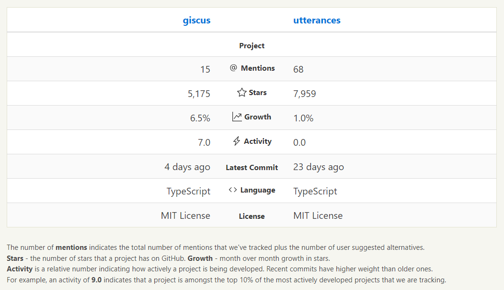
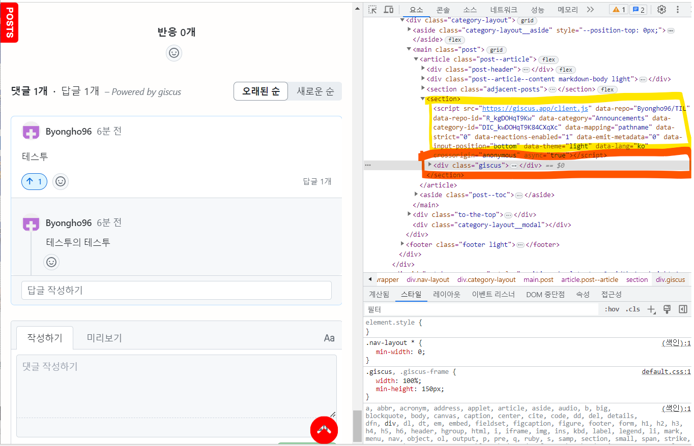

# 1. Utterances와 Giscus

따로 서버를 돌리지 않고서는 댓글/좋아요 기능을 구현할 수 없을 줄 알았다.

그런데 항상 개발자들은 신박한 방법을 찾아낸다.  
**GitHub API**를 이용해서 구현된 서비스가 있었다. 그것도 두 개나 말이다!

- **Utterances**  
  [Utterances](https://utteranc.es/)는 GitHub의 이슈(Issue)를 활용해서 댓글 서비스를 제공한다. 원래 깃헙 이슈란, 코드 및 프로젝트에 대한 문제점이나 개선사항을 제안하고, 이에 대해 논의하고 위한 기능이다. 따라서 이슈는 레이블, 마일스톤, 이슈 상태, 담당자 등의 다양한 작업추적 기능을 제공한다.

- **Giscus**  
  [Giscus](https://giscus.app/)는 GitHub의 토론(Discussion)을 이용해서 구현된 서비스이다. 원래 깃헙 토론도, 프로젝트와 관련된 주제에 대해서 의견을 교환하기 위한 기능이다. 깃헙 이슈처럼 작업추적 기능은 제공되지 않지만, 더 자유롭게 의견을 교환할 수 있다.

직관적인 사용 기능을 비교하면 다음과 같다.

|             | Utterances         | Giscus             |
| ----------- | ------------------ | ------------------ |
| 댓글        | :heavy_check_mark: | :heavy_check_mark: |
| 댓글 좋아요 | :heavy_check_mark: | :heavy_check_mark: |
| 마크다운    | :heavy_check_mark: | :heavy_check_mark: |
| 테마        | :heavy_check_mark: | :heavy_check_mark: |
| 대댓글      | :x:                | :heavy_check_mark: |
| 좋아요      | :x:                | :heavy_check_mark: |
| 다국어      | :x:                | :heavy_check_mark: |

보면 Utterances를 사용할 이유가 없어보인다. 그런데 **현재 서비스의 안정성이나 유지 보수 측면에서는 Utterances가 더 낫다.** 일단, [공식문서](https://giscus.app/)만 들어가봐도 Gsiscus는 다음과 같이 시인하고 있다.

> giscus is still under active development. GitHub is also still actively developing Discussions and its API. Thus, some features of giscus may break or change over time.

아래 [지표](https://www.libhunt.com/compare-giscus-vs-utterances)가 현재 Utterances와 Giscus의 현황을 잘 표현해주는 것 같다. Utterances 이미 멘션횟수가 많고 Stars도 많이 받았지만, 성장세는 비교적 완만하다. 반대로 Giscus는 상대적으로 아직 덜 주목받지만, 성장세는 가파르다.



나는 원래 Utterances를 적요했다가, 좋아요 기능이 너무 탐나서 Giscus로 이전했다.

## 1.1. 동작 원리

Utterances와 Giscus 모두 **npm 라이브러가 아니다.** 그냥 하나의 `<script>`태그만 주어진다.

이 `<script>`태그를 html에서 원하는 곳에 삽입하면 마법처럼 댓글 UI가 나타난다. 처음에는 이런 동작과정이 익숙하지 않아 어떻게 리액트 컴포넌트를 만들어야 할지 감이 오지 않았다. 그런데 좀만 시간을 갖고 알아보니, 색다르면서도 재밌게 동작하는 서비스였다.

<mark>Utterances와 Giscus는 서로 매우 유샤하게 동작하기 때문에, Utterances를 예시로 동작과정을 설명해보겠다.</mark>

다음은 utterances의 예시 스크립트이다. `src`를 제외한 값은 모두 사용자 옵션 값이다.

```js
<script
  src="https://utteranc.es/client.js"
  repo="[ENTER REPO HERE]"
  issue-term="[ONE OF OPTIONS]"
  theme="[ONE OF THEMES]"
  crossorigin="anonymous"
  async
></script>
```

위의 src의 값 "https://utteranc.es/client.js"을 url에 입력해보면, 생각보다 짧은 js문서를 받을 수 있다.  
거기서 핵심만 추려보면 다음과 같이 동작하는 것을 확인할 수 있다.

1. 현재 스크립트 요소를 기억해둔다.
2. 사용자 옵션에 따라 `<div class="utterances" />`를 생성한다.
3. 생성한 `<div />`를 현재 스크립트 뒤에 추가한다.
4. 스크립트는 삭제한다. (giscus는 이 과정이 없다)

```js
https: (() => {
  ...
  let r = document.currentScript    // r은 현재 스크립트 요소
  ...
  r.insertAdjacentHTML(
    'afterend',
    `<div class="utterances">\n    <iframe class="utterances-frame" title="Comments" scrolling="no" src="${h}?${new URLSearchParams(
      i
    )}" loading="lazy"></iframe>\n  </div>`
  )                                 // 현재 스크립트 요소 뒤에, 실제 컨텐츠 <div class="utterances"> 추가
  const m = r.nextElementSibling
  r.parentElement.removeChild(r)    // 현재 스크립트 삭제 (utterances 한정)
  ...
})()
```

한마디로 `<script/>`태그를 기준으로 바로 뒤에(`afterend`)에 요소를 추가하기 때문에, `<script/>`를 곧 댓글 UI라고 보아도 무방한 것이다.



# 1. Utterances

## 1.1. 앱 등록 및 script 생성

걍 [공식문서](https://utteranc.es/)를 따라하면 된다.

## 1.2. 리액트 컴포넌트

단순히 script태그를 원하는 곳에 정적으로 추가해도 되지만, **다크모드 등의 옵션을 사용하려면 prop을 받아 동적으로 렌더링하는 리액트 컴포넌트를 만들어야 한다.** 아래는 내가 만든 Utterances 리액트 컴포넌트이다.

```js
import React, { createRef, useEffect } from 'react'

export interface UtterancesProps {
  theme?:
    | 'github-light'
    | 'github-dark'
    | 'preferred-color-scheme'
    | 'github-dark-orange'
    | 'icy-dark'
    | 'dark-blue'
    | 'photon-dark'
    | 'boxy-light'
    | 'gruvbox-dark'; // utterances 지원 가능 테마 목록
}

// 쓸데없는 재렌더링이 일어나지 않돌고 React.memo
const Utterances: React.FC<UtterancesProps> = React.memo(
  ({ theme = 'github-light' }) => {
    const utterRef = createRef < HTMLElement > null

    useEffect(() => {
      const utterance = utterRef.current
      const utterScript = document.createElement('script') // script 태그 생성

      // prop에 따라서 script 속성 추가
      const attributes = {
        src: 'https://utteranc.es/client.js',
        repo: 'byongho96/TIL',
        'issue-term': 'pathname',
        theme: theme,
        label: '🔮comments🔮',
        crossOrigin: 'anonymous',
        async: true,
      }
      Object.entries(attributes).forEach(([key, value]) => {
        utterScript.setAttribute(key, value)
      })

      // script 태그 DOM에 추가
      utterance.appendChild(utterScript)

      return () => {
        // utternance 내부 요소 삭제 후, 재렌더링 작업
        utterance.childNodes.forEach((utterance) => {
          utterance.remove()
        })
      }
    }, [theme])

    return <section ref={utterRef} />
  }
)

export default Utterances
```

## 1.3. 사용 예시

나는 Context API를 활용하여 `theme`을 관리하기 때문에 아래와 같이 사용했다.

```js
import React, { useContext } from 'react'
import { ThemeContext } from '@contexts/theme-context'
import Utterances from '@components/utterances'

const PostPage: React.FC<PageProps> = ({ pageContext, data }) => {
  const { theme } = useContext(ThemeContext)

  return (
    <Utterances theme={theme === 'dark' ? 'github-dark' : 'github-light'} />
  )
}
```

# 2. Giscus

## 2.1. 앱 등록 및 script 생성

역시 걍 [공식문서](https://giscus.app/)를 따라하면 된다. Utterances와 다르게 discussion 기능을 열어주는 단계가 추가된다.

## 2.2. 리액트 컴포넌트

역시 prop에 따라 동적으로 재렌더링 시키기 위해 아래와 같은 리액트 컴포넌트를 만들었다.

```js
import React, { createRef, useEffect } from 'react'

export interface GiscusProps {
  theme?:
    | 'light'
    | 'light_high_contrast'
    | 'light_protanopia'
    | 'light_tritanopia'
    | 'dark'
    | 'dark_high_contrast'
    | 'dark_protanopia'
    | 'dark_tritanopia'
    | 'dark_dimmed'
    | 'preferred_color_scheme'
    | 'transparent_dark'
    | 'noborder_light'
    | 'noborder_dark'
    | 'cobalt'  // giscus 지원 가능 테마 목록
  lang?: 'en' | 'ko'
}

// 쓸데없는 재렌더링이 일어나지 않돌고 React.memo
const Giscus: React.FC<GiscusProps> = React.memo(
  ({ theme = 'light', lang = 'ko' }) => {
    const giscusRef = createRef<HTMLElement>(null)

    // utternace를 적용하기 위한 script를 html에 성생
    useEffect(() => {
      const giscusContainer = giscusRef.current
      const giscusScript = document.createElement('script') // script 태그 생성

      // prop에 따라서 script 속성 추가
      const attributes = {
        src: 'https://giscus.app/client.js',
        'data-repo': 'Byongho96/TIL',
        'data-repo-id': 'R_kgDOHqT9Kw',
        'data-category': 'Announcements',
        'data-category-id': 'DIC_kwDOHqT9K84CXqXc',
        'data-mapping': 'pathname',
        'data-strict': '0',
        'data-reactions-enabled': '1',
        'data-emit-metadata': '0',
        'data-input-position': 'bottom',
        'data-theme': theme,
        'data-lang': lang,
        crossorigin: 'anonymous',
        async: true,
      }
      Object.entries(attributes).forEach(([key, value]) => {
        giscusScript.setAttribute(key, value)
      })

      // script 태그 DOM에 추가
      giscusContainer.appendChild(giscusScript)

      return () => {
        // giscuss 내부 요소 삭제 후, 제 랜더링
        giscusContainer.childNodes.forEach((giscusance) => {
          giscusance.remove()
        })
      }
    }, [theme, lang])

    return <section ref={giscusRef} />
  }
)

export default Giscus
```

## 2.3. 사용 예시

나는 Context API를 활용하여 `theme`을 관리하기 때문에 아래와 같이 사용했다.

```js
import React, { useContext } from 'react'
import { ThemeContext } from '@contexts/theme-context'
import Giscus from '@components/giscus'

const PostPage: React.FC<PageProps> = ({ pageContext, data }) => {
  const { theme } = useContext(ThemeContext)

  return <Giscus theme={theme === 'dark' ? 'dark' : 'light'} />
}
```

## 2.4. cross-origin

Giscus는 Cross Origin에 대응하기 위해 giscus.json 설정파일을 제공한다.

Utterances를 사용할 때는 한 번도 생각해보지 않았는데, 곰곰히 생각해보니 Script만 있으면 아무 웹사이트에서 내 레포지토리에 대한 댓글 UI를 생성할 수 있다는게 이상하기는 하다.

[공식문서](https://github.com/giscus/giscus/blob/main/ADVANCED-USAGE.md#giscusjson)의 설명에 따르면, giscus.json 파이을 레포지토리 루트 경로에 생성함으로써 추가 설정을 걸 수 있다고 한다. 그 중에서 `origin`설정은 내 `<script/>`를 로드할 수 있는 도메인을 제한하는 설정이다.

```json
// giscus.json
{
  "origins": ["https://byongho96.github.io/TIL"]
}
```

# 3. 참조

- [Utterances](https://utteranc.es/)
- [Giscus](https://giscus.app/)
- [Ricale.kr: Gatsby 블로그 만들기 8 - 댓글](https://ricale.kr/blog/posts/230211-gatsby-8-comments/)
