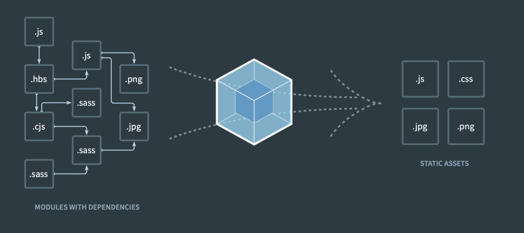

> "CRA 없는 React 초기 셋팅"은 총 4개의 글로 구성되어 있습니다.

# 0. 시작하며

지금까지 항상 **Create React App**로 리액트 프로젝트를 생성했다. 너무 익숙해져서 이제는 이 둘을 구분 짓기 어려워졌다.

그러던 어느 날 문득, 라이브러리 따위가 프로젝트의 주도권을 가져가려는게 아니꼬웠다. 이 참에 직접 리액트를 세팅해보기로 했다. 그 힘겨운 싸움의 과정을 여기에 남긴다.


# 1. Node.js 프로젝트 생성

```bash
npm init -y
```

**`npm init` 명령어로 node.js 프로젝트를 시작**할 수 있다. 다르게 표현하면 **package.json**파일이 생성되어 node.js 패키지를 관리할 수 있다.

**`-y` 옵션으로 프롬프트 입력값을 자동 처리**할 수 있다. 궁금해서 떼고 돌려 봤는데 쓰잘데기 없는 걸 묻길래, 취소하고 다시 -y 옵션을 붙였다.

# 2. Webpack

## 2.1. Webpack 이란?



아주아주 간단하게 말하면 **웹팩은 모듈 번들러로, 여러 개의 모듈을 하나로 병합하는 도구**이다. 그런데 이 설명만으로는 충분하지 않다.

먼저 프론트엔드 프로젝트를 정확하게 이해할 필요가 있다. <mark>프론트엔드 프로젝트는 파일 그 자체로 사용자에게 제공된다.</mark> 예를 들어 'www.naver.com'이라고 주소창에 치면, 네이버 서버는 그냥 홈페이지에 해당하는 html, css, js, 이미지 파일 등을 우리에게 넘겨주는 것이다.

그런데 프론트 코드를 보면 알겠지만, 하나의 페이지를 만들기 위해서는 수많은 컴포넌트(js 파일)가 만들어진다. 당연히 그에 따라 CSS 파일도 늘어난다. CRA 프로젝트는 html파일이 기본적으로 한 개이지만 필요에 따라 여러 개 설정할 수도 있다.

만약 우리가 어떤 홈페이지를 방문했을 때 그 많은 js파일과 css를 그대로 건네 받는다고 가정하면, 큰 네트워크 비용과 느린 렌더링 속도는 불 보듯 뻔한 일이다. 이 문제를 해결할 수 있는 녀석이 바로 Webpack이다. **Webpack은 프론트엔드 코드 간의 복잡한 의존성을 분석하여, 한 세트의 최적화 된 js, css, html + 파일 컨텐츠(이미지, 오디오 ...)를 뱉어낸다.** 정말 마법같은 기능이다.

이렇게 웹팩과 같은 모듈 번들러를 구동해 프론트엔드 코드를 최적화된 결과물로 변환하는 것이 바로 빌드이다.

## 2.2. webpack.config.json

[Webpack 공식문서 Concept](https://webpack.js.org/concepts/) 항목에 발 맞춰 개념을 정리하고, 따라

## 2.3. package.json

# 3. 최종 파일 및 추가 내용

## 3.1. 최

몇가지 추가해야한다.

- Baabel
- Typescript

또한 지속적인 업데이트

# 4. 참고자료

- [Webpack 공식문서](https://webpack.js.org/concepts/#entry)
- [캡틴 판교: Webpack 핸드북](https://joshua1988.github.io/webpack-guide/)
- [E.UID: Webpack 러닝 가이드](https://yamoo9.gitbook.io/webpack/)
- [Stackbucks: create-react-app 없이 리액트 프로젝트 생성하기(webpack)](https://velog.io/@stakbucks/create-react-app-%EC%97%86%EC%9D%B4-%EB%A6%AC%EC%95%A1%ED%8A%B8-%ED%94%84%EB%A1%9C%EC%A0%9D%ED%8A%B8-%EC%83%9D%EC%84%B1%ED%95%98%EA%B8%B0webpack)
- [Kang: webpack-merge](https://kagrin97-blog.vercel.app/other/webpack-merge)
