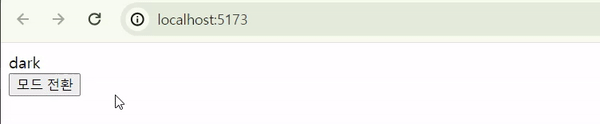
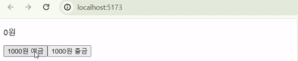
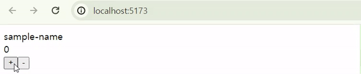
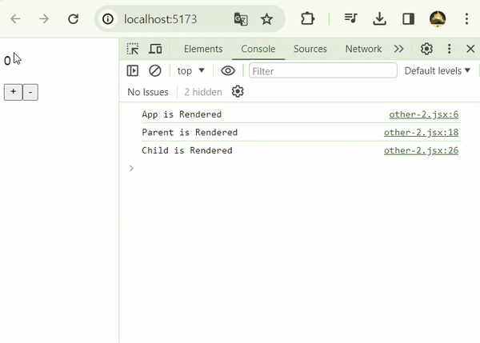
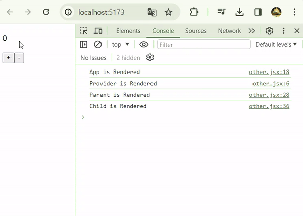
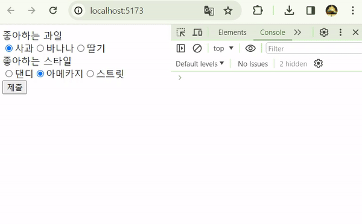

# 1. Context 란?

나는 <mark>React 자체 전역 데이터 저장소</mark>라고 생각한다. 일반적으로 React에서 데이터를 하위 컴포넌트로 전달하기 위해서는 props로 일일히 내려줘야 한다. 따라서 데이터를 손자, 증손자, 고조손자까지 넘겨주려고 하면 코드가 지저분해질 뿐 아니라 불필요한 리렌더링이 발생한다. 이를 **Props-Drilling**이라고 한다.

`Context`를 이용하면 `Provider`로 감싼 모든 하위 컴포넌트에서 자유롭게 데이터에 접근 할 수 있다. 여기에 `reducer`를 이용해서 상태 업데이트를 규격화하면 일종의 Flux Pattern을 가진 미니 전역 저장소를 만들 수 있다. 중간 컴포넌트에서의 **불필요한 리렌더링 또한 `children` prop으로 극복 가능**하다. 이에 대해서는 아래에서 한 번 더 다룰 예정이다.

## 1.1. 간단한 예시 (ThemeProvider)

`useContext`를 사용하는 가장 대표적인 경우는 **다크모드 관리**이다. 아마 Context의 기본 동작이 Provider 하위 컴포넌트의 리렌더링을 유발하기 때문에, 다크모드처럼 제한적으로 바뀌는 값을 관리하는 것 같다.

```js
import React, { useState, useContext, createContext } from 'react'
import { ThemeContext } from './context/ThemeContext'

export const ThemeContext = createContext()

function App() {
  const [isDark, setIsDark] = useState(false)

  return (
    <ThemeContext.Provider value={{ isDark, setIsDark }}>
      <Page />
    </ThemeContext.Provider>
  )
}

function Page() {
  return <div>Page</div>
}

function Component() {
  const { isDark, setIsDark } = useContext(ThemeContext)

  return (
    <div>
      <div>{isDark ? 'dark' : 'light'}</div>
      <button onClick={() => setIsDark((theme) => !theme)}>모드 전환</button>
    </div>
  )
}

export default App
```



## 1.2. useReducer 란?

`reducer`는 <mark>상태를 업데이트를 제한하는 함수로써, 전역 상태의 무분별한 접근과 수정을 방지</mark>한다.

`useReducer`를 사용하면 `reducer`로 관리되는 데이터를 쉽게 생성할 수 있다. `useState`와 아주 유사하여 [공식문서](https://react.dev/learn/extracting-state-logic-into-a-reducer#comparing-usestate-and-usereducer)에도 이 둘을 비교 정리했다. `useState`가 상태를 자유롭게 수정할 수 있는 `setState`를 반환하는 한편, `useReducer`는 미리 정의된 `reducer`에 맞춰 동작하는 `dispatcher`를 반환한다.

```js
import React, { useState, useReducer } from 'react'

/**
 *
 * @param state 기존 상태
 * @param action dispatch로 전달 받은 인자
 * @returns
 */
const reducer = (state, action) => {
  switch (action.type) {
    case 'deposit':
      return state + action.payload
    case 'withdraw':
      return state - action.payload
    default:
      return state
  }
}

function App() {
  const [balance, dispatch] = useReducer(reducer, 0) // reducer, 초깃값

  function deposit() {
    dispatch({ type: 'deposit', payload: number })
  }

  function withdraw() {
    dispatch({ type: 'withdraw', payload: number })
  }

  return (
    <div>
      <p>{balance}원</p>
      <button onClick={deposit}>예금</button>
      <button onClick={withdraw}>출금</button>
    </div>
  )
}
```



## 1.2. Context와 useReducer

`Context`에 `useReducer`을 결합하면, Flux Pattern의 전역 저장소를 구현할 수 있다. 아래 예시 코드는 어쩌다보니 TypeScript로 작성했다.

```ts
// types.ts
import React, { createContext, useReducer } from 'react'

type TState = {
  name: string
  count: number
}

type TAction = {
  type: 'UP' | 'DOWN'
  pyload?: any
}

type TContext = {
  state: TState
  dispatch: React.Dispatch<TAction>
}
```

```ts
// Context.ts
import { createContext } from 'react'
import { TContext } from './types'

export const Context = createContext<TContext | null>(null)
```

```tsx
// ContextProvider.tsx
import React, { useReducer } from 'react'
import { TAction, TState } from './types'
import { Context } from './Context'

const initState: TState = {
  name: 'sample-name',
  count: 0,
}

const reducer = (state: TState, action: TAction) => {
  switch (action.type) {
    case 'UP':
      return {
        ...state,
        count: state.count + 1,
      }
    case 'DOWN':
      return {
        ...state,
        count: state.count - 1,
      }
  }
}

const ContextProvider = ({ children }: React.PropsWithChildren) => {
  const [state, dispatch] = useReducer(reducer, initState)

  return (
    <Context.Provider value={{ state, dispatch }}>{children}</Context.Provider>
  )
}

export default ContextProvider
```

```tsx
// App.tsx
import { useContext } from 'react'
import ContextProvider from './ContextProvider'
import { Context } from './Context'

const App = () => {
  return (
    <ContextProvider>
      <Parent />
    </ContextProvider>
  )
}

const Parent = () => {
  return <Child />
}

const Child = () => {
  const context = useContext(Context)

  if (!context) return

  return (
    <div>
      <div>{context.state.count}</div>
      <button onClick={() => context.dispatch({ type: 'UP' })}>+</button>
      <button onClick={() => context.dispatch({ type: 'DOWN' })}>-</button>
    </div>
  )
}

export default App
```



# 2. Context의 한계

흔히 Context의 한계로 **중간 컴포넌트의 불필요한 리렌더링을 꼽는다.** 맞으면서도 틀린 말이다.

아래 두 개의 코드는 `children` Prop 사용유무를 제외하면 완벽하게 동일하다. 하지만 콘솔을 찍어보면, `children`을 사용한 경우에 중간 컴포넌트의 불필요한 리렌더링을 발생하지 않는다.

```jsx
// children 사용 안함
import { useState, createContext, useContext } from 'react'

const MyContext = createContext(null)

const App = () => {
  console.log('App is Rendered')

  const [number, setNumber] = useState(0)

  return (
    <MyContext.Provider value={{ number, setNumber }}>
      <Parent />
    </MyContext.Provider>
  )
}

const Parent = () => {
  console.log('Parent is Rendered')

  return <Child />
}

const Child = () => {
  const { number, setNumber } = useContext(MyContext)

  console.log('Child is Rendered')

  return (
    <div>
      <p>{number}</p>
      <button onClick={() => setNumber((prev) => prev + 1)}>+</button>
      <button onClick={() => setNumber((prev) => prev - 1)}>-</button>
    </div>
  )
}

export default App
```



```jsx
// children 사용함
import { useState, createContext, useContext } from 'react'

const MyContext = createContext(null)

const MyProvider = ({ children }) => {
  console.log('Provider is Rendered')

  const [number, setNumber] = useState(0)

  return (
    <MyContext.Provider value={{ number, setNumber }}>
      {children}
    </MyContext.Provider>
  )
}

const App = () => {
  console.log('App is Rendered')

  return (
    <MyProvider>
      <Parent />
    </MyProvider>
  )
}

const Parent = () => {
  console.log('Parent is Rendered')

  return <Child />
}

const Child = () => {
  const { number, setNumber } = useContext(MyContext)

  console.log('Child is Rendered')

  return (
    <div>
      <p>{number}</p>
      <button onClick={() => setNumber((prev) => prev + 1)}>+</button>
      <button onClick={() => setNumber((prev) => prev - 1)}>-</button>
    </div>
  )
}

export default App
```



## 2.1. children 에 대한 고찰

간단하게 말하면 `children`으로 `ReactNode`를 넘겨주는 행위는, **완성된 컴포넌트를 전달**해주는 것과 같다.</mark> 하위 컴포넌트가 별개로 완성되어 상위 컴포넌트에 prop으로 넘겨졌기 때문에, 하위 컴포넌트의 렌더링이 더이상 상위 컴포넌트에 종속되지 않는다. (더 정확한 원인을 알기 위해서는 React 가상 DOM을 학습해야 할 것 같다.)

기존

```jsx
const Parent = ({ children }) => {
  return <div>{children}</div>
}

// 아래 두 형식이 동일하다.
const Container = () => {
  return (
    <Parent>
      <Child />
    </Parent>
  )
}

const Container = () => {
  return <Parent children={<Child />} />
}
```

# 3. Radio에 Context 적용

드디어 오늘의 주제에 도착했다. `Context`는 분명 편리한 기능이지만, 다른 전역 상태 라이브러리에 가려져 잘 사용하지 않는다. 그나마 앞서 말한 `ThemeProvider` 정도랄까. 그러던 중 최근에 아주 좋은 사용처를 발견했다. 바로 **Radio 인풋 버튼**이다.

동일한 `name`의 Radio 버튼들은 서로 배타적이어야 하기 때문에 강한 연관성을 가진다. 하지만 이를 전역 상태로 관리하기에는 너무 지엽적이다. 이때 >Radio 버튼 그룹을 `Context`로 관리하면, 여러 개의 Radio 버튼 컴포넌트를 **UI나 depth에 상관없이 자유롭게 배치**할 수 있다. 구체적인 동작은 아래 코드에서 확인할 수 있다.

```ts
import { ChangeEventHandler, createContext } from 'react'

type TRadioContext = {
  name: string
  value: string
  onChange: ChangeEventHandler
}

export const RadioContext = createContext<TRadioContext | null>(null)
```

```tsx
import { ChangeEventHandler, PropsWithChildren, useState } from 'react'
import { RadioContext } from './RadioContext'

type RadioGroupProps = {
  name: string
  defaultValue: string
  onChange?: ChangeEventHandler
}

const RadioGroup = ({
  children,
  name,
  defaultValue,
  onChange,
}: PropsWithChildren<RadioGroupProps>) => {
  const [value, setValue] = useState<string>(defaultValue)

  /**
   * 하위 Radio 버튼 change 이벤트 처리
   * 1. 데이터(vlaue) 업데이트
   * 2. 지정된 함수(onChange) 동작
   */
  const handleChange: ChangeEventHandler<HTMLInputElement> = (e) => {
    setValue(e.currentTarget.value)
    onChange && onChange(e)
  }

  return (
    <RadioContext.Provider value={{ name, value, onChange: handleChange }}>
      <div>{name}</div>
      <div>{children}</div>
    </RadioContext.Provider>
  )
}

export default RadioGroup
```

```tsx
import { ChangeEventHandler, useContext } from 'react'
import { RadioContext } from './RadioContext'

type RadioProps = {
  value: string
  label?: string
}

const Radio = ({ value, label }: RadioProps) => {
  const radioContext = useContext(RadioContext)

  if (!radioContext) return

  return (
    <label>
      <input
        type="radio"
        name={radioContext.name} // context의 name으로 통일
        value={value}
        checked={!!radioContext && radioContext.value === value}
        onChange={radioContext.onChange}
      />
      {label ? label : value}
    </label>
  )
}

export default Radio
```

## 3.1. 사용 방법

위 코드는 아래와 같이 사용할 수 있다. <mark>`RadioGroup` 안에 있는 `Radio` 버튼들은 depth에 관계없이 결합된다.</mark> 정말로 데이터가 잘 선택되었는지 확인하기 위해 `submit`이벤트 발생 시 `form`안의 데이터를 수집해서 콘솔로 출력했다.

```tsx
import React from 'react'
import RadioGroup from './RadioGroup'
import Radio from './Radio'

const App = () => {
  const handleSubmit: React.FormEventHandler<HTMLFormElement> = (e) => {
    e.preventDefault()

    // formData 콘솔 출력
    const form = e.currentTarget
    const formData = new FormData(form)
    for (let key of formData.keys()) {
      console.log(key, ':', formData.get(key))
    }
  }

  return (
    <div>
      <form onSubmit={handleSubmit}>
        <RadioGroup
          name="좋아하는 과일"
          defaultValue="사과"
          onChange={() => {
            console.log('좋아하는 과일 change')
          }}
        >
          <Radio value="사과" />
          <Radio value="바나나" />
          <Radio value="딸기" />
        </RadioGroup>
        <RadioGroup
          name="좋아하는 스타일"
          defaultValue="아메카지"
          onChange={() => {
            console.log('좋아하는 스타일 change')
          }}
        >
          <StyleList />
        </RadioGroup>
        <button type="submit">제출</button>
      </form>
    </div>
  )
}

const StyleList = () => {
  return (
    <div>
      <Radio value="댄디" />
      <Radio value="아메카지" />
      <Radio value="스트릿" />
    </div>
  )
}

export default App
```



# 4. 참조

- [React : "Passing Data Deeply with Context"](https://react.dev/learn/passing-data-deeply-with-context)
- [React : "Extracting State Logic into a Reducer"](https://react.dev/learn/extracting-state-logic-into-a-reducer)
- [2ast : "React) children prop에 대한 고찰(feat. 렌더링 최적화)"](https://velog.io/@2ast/React-children-prop%EC%97%90-%EB%8C%80%ED%95%9C-%EA%B3%A0%EC%B0%B0feat.-%EB%A0%8C%EB%8D%94%EB%A7%81-%EC%B5%9C%EC%A0%81%ED%99%94)
