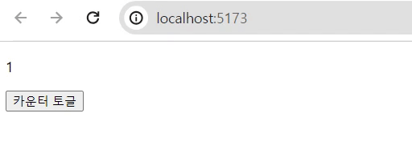
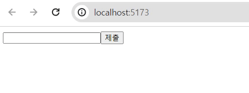

# 1. useState란 무엇인가

리액트의 useState는 대표적으로 2가지 기능을 제공한다. <mark>1. 컴포넌트가 리렌더링 되더라도 값을 유지하고</mark>, <mark>2. 값이 업데이트 되면 컴포넌트를 리렌더링한다</mark>. 프론트의 데이터 변화는 대부분 화면 업데이트를 요구하기 때문에, useState는 가장 유용한 리액트 훅이 되었다. 하지만 같은 이유로 가장 **남용되는 훅**이기도 하다.

useState 두번째 기능, 컴포넌트를 리렌더링하는 것은 결국 자원 소모를 말한다. 따라서 useState 불필요하게 사용하지 않도록 주의할 필요가 있다. useRef는 useState의 가장 대표적인 대체재이다. <mark>useRef로 생성된 객체의 current 속성은 컴포넌트가 리렌더링 되어도 값을 유지하고, 값이 업데이트 되어도 컴포넌트를 리렌더링 하지 않는다.</mark> 즉 useState의 첫번째 기능만을 가지는 셈이다.

아래 예시코드를 통해 useState와 useRef의 쓰임새를 더 명확히 구분할 수 있다. `count`는 현재 카운트를 화면에 보여준다. 따라서 화면 렌더링과 관련된 변수이기 때문에 useState로 선언해야 한다. 반면 `isStop`은 화면과 관계없이 내부 로직에서 쓰이는 변수이면서, 컴포넌트가 리렌더링되더라도 값이 초기화되서는 안된다. 따라서 useRef로 선언해야한다.

```javascript
import { useState, useRef, useEffect, useCallback } from 'react'

export default function Component() {
  const [count, setCount] = useState(1) // 화면에 보여지는 값
  const isStop = useRef(false) // 컴포넌트 내부 로직에서 쓰이는 값

  // 1초마다 count의 값을 1씩 증가하는 interval 실행
  useEffect(() => {
    setInterval(() => {
      if (isStop.current) return // 단, isStop이 가리키는 변수가 true이면 증가시키지 않음
      setCounter((cnt) => cnt + 1)
    }, 1000)
  }, [])

  // 클릭할 때마다 isStop이 가리키는 변수를 토글
  const handleClick = useCallback(() => {
    isStop.current = !isStop.current
  }, [])

  return (
    <div>
      <p>{count}</p>
      <button onClick={handleClick}>카운터 토글</button>
    </div>
  )
}
```



# 2. useState 양방향 바인딩

useState가 자주 쓰이지만 useRef로 대체하기 어려운 상황도 있다. 바로 `<input>`의 값을 양방향 바인딩할 때이다. 리액트로 처음 배우면, 보통 아래와 같이 `<input`>의 값을 useState로 선언하고 onChange로 바인딩한다. 이 방법이 잘못되었다는 말은 아니다. 실제 [리액트 공식문서](https://react.dev/learn/reacting-to-input-with-state#step-5-connect-the-event-handlers-to-set-state)에서도 이러한 방법을 예시 코드로 보여주고 있다.

공식문서에서는 이를 선언적(declarative) 방식이라 표현하며, 명령적(imperative) 방식보다 편의성과 직관성이 뛰어나고 소개한다. 그리고 좀 더 찾아보니 useState를 사용하면, 단일 진실 공급원(Single Source of Truth)을 확보할 수 있다고 한다. 한 마디로 표현하면 **변수의 origin을 보장**한다는 말인데, 겨우 하나의 컴포넌트 내에서 데이터의 공급원을 보장하는게 정말 중요할지는 의문이다.

```javascript
import { useState } from 'react'

export default function Component() {
  const [answer, setAnswer] = useState('') // input의 값

  // input 변화를 감지해서 answer 업데이트 (양방향 바인딩)
  const handleChange = (event) => {
    setAnswer(event.target.value)
  }

  // form 제출
  const handleSubmit = (event) => {
    e.preventDefault()
    submit(answer) // answer 값을 제출
  }

  return (
    <form onSubmit={handleSubmit}>
      <input type="text" value={answer} onChange={handleChange} />
      <button type="submit">제출</button>
    </form>
  )
}
```

## 2.1. form 항목 증가에 따른 문제

아무튼 편리한 useState의 사용이, form에서 관리해야할 데이터가 많아지만 단점이 되어버린다. form에서 관리해야하는 데이터가 한 50개 정도라고 가정해보자. 아래 코드처럼 단순히 **데이터를 선언하고, 바인딩하는 코드만 200줄**이다. 무슨 하나의 form에서 50개의 값을 제출하냐 싶겠지만, 목록형 데이터를 다루면 가뿐하게 뛰어넘을 수 있다. 실제 가장 최근에 진행한 프로젝트에서 5개의 값을 가진 10개의 목록 데이터를 제출해야했다.

이로 인한 문제를 다시 정리하자면, <mark>1. 코드의 복잡도가 증가한다</mark>. 일단 코드가 길어지니까 당연히 코드가 복잡해질 수 밖에 없다. <mark>2. 불필요한 리렌더링이 빈번하게 발생한다</mark>. 50개의 변수 중 하나라도 값이 바뀌면, 해당 컴포넌트가 리렌더링된다. 더군다나 50개의 데이터를 다루는 컴포넌트는 간단하지도 않을 것이다.

```javascript
import { useState } from 'react'

export default function Component() {
  // 50줄
  const [answer1, setAnswer1] = useState('')
  ...
  const [answer50, setAnswer50] = useState('')

  // 150줄
  const handleChange1 = (event) => {
    setAnswer1(event.target.value)
  }
  ...
  const handleChange50 = (event) => {
    setAnswer50(event.target.value)
  }

  ...

  return (
    <form onSubmit={handleSubmit}>
      <input type="text" value={answer1} onChange={handleChange1} />
      ...
      <input type="text" value={answer50} onChange={handleChange50} />
      <button type="submit">제출</button>
    </form>
  )
}
```

# 3. formData로의 전환

웹페이지의 3요소는 html, css, javaScript이고, 이 중에서 html은 가장 유구한 전통을 자랑한다. <del>반면 javaScript은 요즘 어떻게든 줄이려고들 난리이다.</del> 때문에 html은 그 자체만으로도 웹페이지를 운영할 수 있도록 기본적인 기능을 가지고 있다. 그 중에 하나가 `<input>`과 `<form>`의 조합을 이용한 데이터 제출이다.

## 2.1. input 태그 활용

`<input>`는 사용자의 입력값을 받을 수 있는 태그이다. 브라우저가 자체적으로 input의 변화를 감지해서 화면에 반영하기 때문에, 컴포넌트 리렌더링을 따로 고려하지 않아도 된다.

<input/>

위에 있는 텍스트 필드가 그냥 `<input>`을 선언한 것이다. 별도의 javaScript 코드가 없지만, 자유롭게 텍스트를 입력할 수 있고, 그 값이 화면에 반영된다.

## 2.2. formData 활용

`<input>`의 값들은 `<form>`으로 모을 수 있다. JavaScript의 `FormData` 생성자에 `<form>` 요소에 넣어 객체를 생성하면, <mark>해당 form 내부에 있는 입력값들을 모은 FormData 객체가 생성된다</mark>. 참고로 formData 객체는 콘솔에 찍어도 내부 값을 확인할 수 없다. 번거롭지만 for문을 돌려서 안에 있는 요소를 확인해야 한다.

```javascript
export default function Component() {
  const handleSubmit = async (e: React.FormEvent<HTMLFormElement>) => {
    e.preventDefault()
    e.stopPropagation()

    const form = e.currentTarget // HTML form 요소
    const formData = new FormData(form) // FormData 객체 생성

    // 내부 값 출력
    for (let key of formData.keys()) {
      console.log(key, ':', formData.get(key))
    }

    // 콘솔 예시
    // name : 홍길동
    // age : 25
    // phone : 01012345678
  }

  return (
    <form onSubmit={handleSubmit}>
      <input type="text" name="name" />
      <input type="number" name="age" />
      <input type="text" name="phone" />
      <button type="submit">제출</button>
    </form>
  )
}
```

## 2.3. 유효성 검사

formData에 대한 유효성 검사는 정해진 방법이 없다. 아래는 내가 사용한 유효성 검사 방식 중 하나이다.

```javaScript
export function validate(formData: FormData) {
  // 이름 유효성 검사
  const name = formData.get('name') as string
  if (!/^[A-Za-z\dㄱ-ㅎㅏ-ㅣ가-힣]{2,10}$/.test(name)) {
    return false
  }

  // 나이 유효성 검사
  const age = formData.get('age') as string
  if (!/^[0-9]{1,3}$/.test(age)) {
    return false
  }

  // 휴대폰 유효성 검사
  const phone = formData.get('phone') as string
  if (/^(010)-?[0-9]{3,4}-?[0-9]{4}$/.test(phone)) {
    return false
  }

  return formData
}
```

## 2.4. 서버 전송

formData 형식 그대로 서버에 전송할 때는 Content-Type을 `'multipart/form-data'`으로 설정해야한다. 그래야지만 백서버에서 데이터를 추출할 수 있다.

```javaScript
import axios from 'axios'

export async function submit(formData: FormData) {
  return axios.post('/api', formData, {
        headers: {
          'Content-Type': 'multipart/form-data',
        },
      })
}
```

# 3. 추가 고려사항

## 3.1. checkbox

보통 체크박스를 사용해서 불리언 값을 다룬다. 체크박스가 체크되었을 때의 값은 value 속성을 이용해서 `true` 외에도 마음대로 지정해줄 수 있다. 그런데 문제는 체크박스가 체크되지 않았을 때이다. 보통 체크가 되지 않으면 `false`나 `null`등의 값으로 formData에 수집되길 기대할텐데, 실제로는 아예 formData에서 제외된다. 이에 대해 [MDN 공식문서](https://developer.mozilla.org/en-US/docs/Web/HTML/Element/input/checkbox#value)는 javaScript를 이용해서 <mark>unchecked 상태일 때의 값을 `<input type="hidden">`로 동적으로 추가</mark>하라고 한다. 그래서 체크박스에 한해 useState를 사용할 수 밖에 없었다.

```javaSCript
import { useState } from 'react'

export default function Component() {
  const [isAdult, setIsAdult] = useState(false)

  const handleChange = (e) => {
    setIsAdult(e.target.checked)
  }

  return (
    <form onSubmit={handleSubmit}>
      <input type="checkbox" name="isAdult" value={isAdult} onChange={handleChange}/>
      {!isActive && <input type="hidden" name="isAdult" value={isAdult} />}
      <button type="submit">제출</button>
    </form>
  )
}
```

## 3.2. 목록 데이터

목록 데이터를 수집하기 위해서는 아래 코드와 같이 인덱싱 `[]` 을 사용하면 된다.

```javaScript
<form>
  <input type="text" name="names[0]"/>
  <input type="text" name="names[1]"/>
  <input type="text" name="names[2]"/>
</form>

// javaScript 객체로 표현하면 다음과 같다.
data : {
  names: ["name0", "name1", "name2"]
}
```

아래와 같은 방식으로 **객체 목록 데이터**를 수집할 수도 있다.

```javaScript
<form>
  <input type="text" name="people[0].name"/>
  <input type="number" name="people[0].age"/>
  <input type="phone" name="people[0].phone"/>
  <input type="text" name="people[1].name"/>
  <input type="number" name="people[1].age"/>
  <input type="phone" name="people[1].phone"/>
</form>

// javaScript 객체로 표현하면 다음과 같다.
data : {
  people: [
    {
      name: "홍길동",
      number: 25,
      phone: "01012345678"
    },
    {
      name: "고길동",
      number: 45,
      phone: "01087654321"
    },
  ]
}
```

# 4. 한계점

입력값이 `<input>`이외에서도 사용된다면 useState를 사용해야 한다.

```javaScript
import { useState } from 'react'

export default function Component() {
  const [color, setColor] = useState('')

  const handleChange = (e) => {
    setColor(e.target.value)
  }

  return (
    <div>
      <form>
        <input type="text" name="color" onChange={handleChange} />
        <button type="submit">제출</button>
      </form>
      <p style={{ color: color, fontSize: '2rem', fontWeight: 800 }}>{color}</p>
    </div>
  )
}
```



# 5. 참고자료

- [React 공식문서 "State: A Component's Memory" ](https://react.dev/learn/state-a-components-memory)
- [React 공식문서 "Reacting to Input with State"](https://react.dev/learn/reacting-to-input-with-state)
- [MDN "FormData() constructor"](https://developer.mozilla.org/en-US/docs/Web/API/FormData/FormData)
- [MDN "<input type="checkbox"\>"](https://developer.mozilla.org/en-US/docs/Web/HTML/Element/input/checkbox#value)
