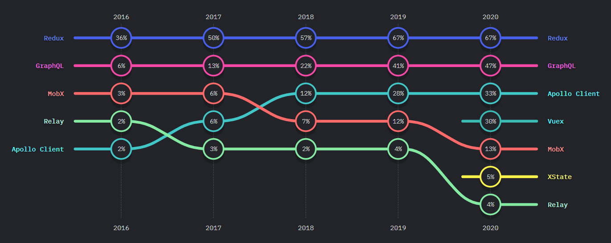

# 1. MobX 란?

MobX <mark>**옵저버 패턴**으로 동작하는 데이터 상태관리 라이브러리</mark>이다. 여느 상태 관리 라이브러리와 마찬가지로 Flux 패턴으로 동작한다. 다만 상태 변화로 꼭 View(컴포넌트)를 렌더링할 필요는 없다. 아래 그림을 보면 `Reaction`이 상태 변화에 의존하여 실행되는 함수인데, 여기에 컴포넌트를 렌더링하는 함수를 포함하여 자유롭게 JavaScript 함수를 등록할 수 있다.

<figure>
    
    <figcaption>MobX의 데이터 흐름.</figcaption>
</figure>

MobX를 실제 사용할 때 체감되는 가장 큰 특징은 아무래도 **아래 두 가지**이다.

- 클래스 문법으로 store을 구축한다. ~~정확히는 observable 객체~~
- 데이터를 mutable하게 관리한다.

Redux를 포함한 여러 상태관리 라이브러이기 immutability(불변성)을 강조하길래 꼭 그래야하는 줄로만 알았다. 데이터 불변성이 더 안전하다고 하지만 이는 다소 주관성이 있는 것 같고, 더 중요한 이유는 <mark><얕은 비교로 데이터 수정여부를 더 빠르게 판단</mark>할 수 있기 때문이다.

> In particular, immutability in the context of a Web app enables sophisticated change detection techniques to be implemented simply and cheaply, ensuring the computationally expensive process of updating the DOM occurs only when it absolutely has to. [[Redux 공식문서]](https://redux.js.org/faq/immutable-data#what-are-the-benefits-of-immutability)

회사 프로젝트에서 MobX로 데이터 상태를 관리하고 있다. 때문에 처음 접하고 알게 되었는데 아주 사용하기 편리한 상태 관리 툴이라고 생각한다. 클래스로 짠 store 구조는 아주 직관적이고, mutable 한 객체 사용은 편리하다. 하지만 어째서인지 [state-of-js의 설문조사](https://2020.stateofjs.com/en-US/technologies/datalayer/)에서는 꾸준히 인기가 감소하고 있다.🥲

<figure>
    
    <figcaption>state-of-js 데이터 관리 툴 선호도</figcaption>
</figure>

# 2. MobX core

MobX는 기타 전역 상태 라이브러리와 같이 Flux 패턴으로 동작한다. 따라서 이름만 봐도 대충 어떤 역할인지 짐작할 수 있다.

- **Actions** : 상태를 업데이트하는 하수
- **Observable** : 데이터 상태
- **Derived** : 상태로부터 도출되는 값 (computed)
- **Reaction** : 상태가 변할 때마다 실행되는 함수

<figure>
    
    <figcaption>MobX의 데이터 흐름.</figcaption>
</figure>

## 2.1. Observable

MobX는 옵저버 패턴을 이용해서 데이터 상태를 관리한다. 그리고 그 옵저버 패턴은 Proxy 객체로 구현되었다. 실제 `observable`함수로 생성한 객체를 콘솔로 찍어보면 `Proxy`객체 출력된다.

즉 MobX에서 스토어를 만든다는 것은 이러한 `observable`한 Proxy 객체를 만드는 것이다. 그리고 아래 소개할 `makeObservable` 함수가 정해진 규칙대로 손쉽게 Proxy 객체를 만들어준다.

- **makeObservable**

- **makeAutoObservable**

### 2.1.1. **autoBind**

## 2.2. Actions

### 2.2.1. action()

### 2.2.2. runInAction

### 2.2.3. 비동기 action

### 2.2.4. flow

## 2.3. Computed

## 2.4. Reactions

리액트 렌더링 함수

### 2.4.1. reaction

### 2.4.2. 가비지 컬렉트

# 3. MobX 리액트

autoroun을 사용했을 뿐 observer로

## 3.1. 기본 사용

todo

## 3.2. MobX 리액트 최적화 팁

### 3.2.1. Use many small components

### 3.2.2. Render lists in dedicated components

### 3.2.3. Dereference values late

### 3.2.4. Function props (비추)

## 3.3. 주의 사항

객체 생성 클래스
[plain object](https://mobx.js.org/observable-state.html#available-annotations)

# 4. Tips and Tricks

## 4.1. 스토어 정의

- 도메인
- UI
- 스토어 결합

## 4.2. Reactivity

결국 객체의 속성에 접근하는 것

## 4.3. computed with Aruguemnts

그냥 함수로 쓰셈

isSelected를 다른 state로 분리하셈

# 참고자료

- [MobX 공식문서](https://mobx.js.org/README.html)
- [MobX : "10 minute interactive introduction to MobX and React"](https://mobx.js.org/getting-started)
- [Redux : "Why Redux Toolkit is How To Use Redux Today"](https://redux.js.org/introduction/why-rtk-is-redux-today)
- [Poiemaweb : "객체와 변경불가성(Immutability)"](https://poiemaweb.com/js-immutability)
- [나무소리 : "리액트 몹엑스 기초 강의"](https://www.youtube.com/watch?v=NwbZmhE2Blc&t=319s)
- [개발자 황준일 : "Vanilla Javascript로 상태관리 시스템 만들기"](https://junilhwang.github.io/TIL/Javascript/Design/Vanilla-JS-Store/#_1-%E1%84%8E%E1%85%AC%E1%84%8C%E1%85%A5%E1%86%A8%E1%84%92%E1%85%AA)
