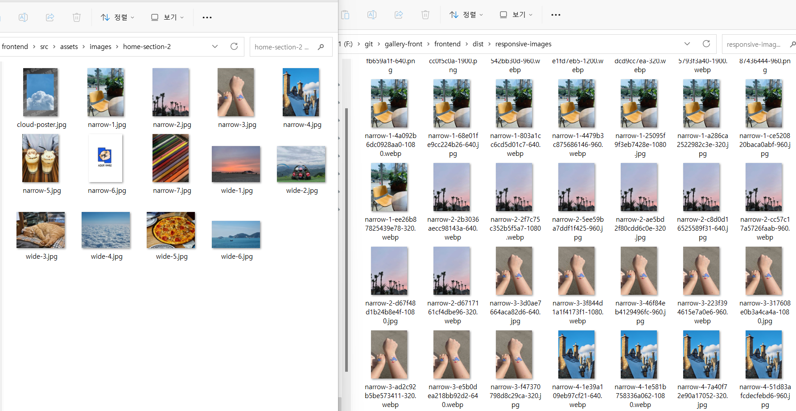
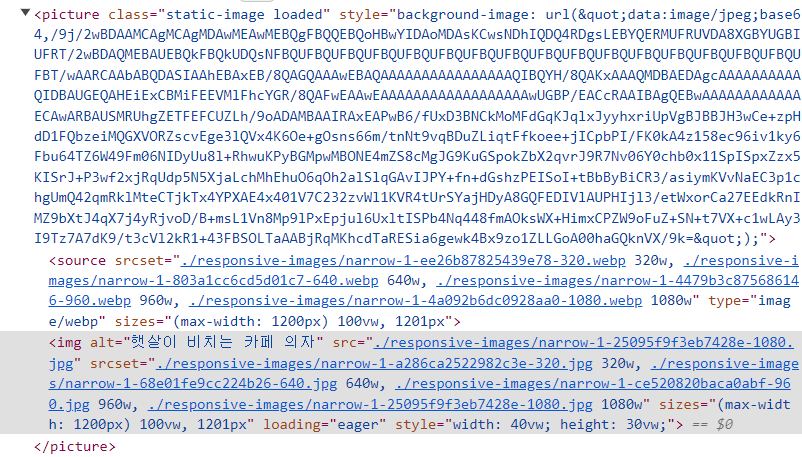

> 이 글에서는 responsive-loader를 적용하는 법을 중심적으로 다룬다. 원리에 대해서 알고 싶다면 ['정적 이미지를 로딩하는 가장 완벽한 방법'](https://byongho96.github.io/TIL/posts/Knowledge/Web/image_lazy_loading/) 포스팅에 정리했다.

# 1. responsive-laoder

자바스크립트로 만들어진 웹팩 플러그인이다. [npm 패키지](https://www.npmjs.com/package/responsive-loader)로 배포되어 바로 설치해 사용할 수 있다.

```bash
npm i responsive-loader
```

# 2. 사용법

## 2.1. 웹팩 적용

아래와 같이 설정하면 프로젝트 코드 내에서 `import`하는 **모든 png, jpg 파일에 대해서 로더가 동작한다.** 로더에 따라 `import`하는 데이터의 형식이 달라지는 것을 유의하자.

```js
module.exports = {
  // ...
  module: {
    rules: [
      {
        test: /\.(png|jpe?g)$/,
        use: [
          {
            loader: 'responsive-loader',
            options: {
              sizes: [320, 640, 960, 1200, 1800, 2400], // 열거한 사이즈들에 대한 이미지들을 만든다.
            },
          },
        ],
        type: 'javascript/auto',
      },
    ],
  },
}
```

## 2.2. 타입 선언

```js
import imgSrc from './images/example.png'
```

가장 기본적인 file-loader 등을 사용하면, `imgSrc`변수에 바로 `string`타입의 url 주소가 할당된다. 하지만 responsive-loader는 다양한 기능을 제공하므로 더 복잡한 타입을 반환한다. 따라서 타입스크립트를 사용할 경우, 별도의 타입선언이 필요하다

```ts
interface ResponsiveImageOutput {
  src: string
  srcSet: string
  placeholder: string | undefined // data URL
  images: { path: string; width: number; height: number }[]
  width: number
  height: number
  toString: () => string
}

declare module '*.jpg' {
  const src: ResponsiveImageOutput
  export default src
}

declare module '*.png' {
  const src: ResponsiveImageOutput
  export default src
}
```

## 2.3. 기본 사용

그러면 아래와 같이 사용할 수 있다.

```js
import responsiveImage from 'img/myImage.png?format=jpg';
import responsiveImageWebp from 'img/myImage.jpg?format=webp';

...
  <picture>
    <source srcSet={responsiveImageWebp.srcSet} type='image/webp' sizes='(min-width: 1024px) 1024px, 100vw'/>
    
  </picture>
```

실제로 빌드를 해보면 아래 그림처럼 하나의 이미지에 대해서

1. webpack에 설정한 너비 폭에 대응하는 파일을 만들고
2. 사용한 포맷(jpg, webp) 각각에 대한 이미즐 생성했다.



# 3. 커스텀 컴포넌트

정적 이미지는 프로젝트 전체에서 자주 사용될 것이므로, 하나의 독립적인 컴포넌트로 만들자.

## 4.1. 소스 코드

```js
import React, { useRef } from 'react'
import './StaticImage.scss'

interface Props {
  webpSrc: ResponsiveImageOutput
  imgSrc: ResponsiveImageOutput
  alt: string
  width?: string
  height?: string
  sizes?: string
  loading?: 'eager' | 'lazy'
  onLoad?: () => void
}

const StaticImage: React.FC<Props> = ({
  webpSrc,
  imgSrc,
  alt,
  width = '100%',
  height = '100%',
  sizes = '(max-width: 1200px) 100vw, 1201px',
  loading = 'eager',
  onLoad,
}) => {
  const picRef = useRef<HTMLPictureElement>(null)

  // 이미지가 로드되면 클래스를 추가해서 CSS 변경시켰다.
  const handleLoad = function staticImageLoaded() {
    const picture = picRef.current!
    picture.classList.add('loaded')
    onLoad && onLoad()
  }
  return (
    <picture
      ref={picRef}
      className="static-image"
      style={{
        backgroundImage:
          'url("' +
          (imgSrc.placeholder ? imgSrc.placeholder : DEV_BLUR_DATA) +
          '")',
      }}
    >
      <source srcSet={webpSrc.srcSet} type="image/webp" sizes={sizes} />
      
    </picture>
  )
}

export default StaticImage
```

```scss
.static-image {
  background-repeat: no-repeat;
  background-size: cover;

  img {
    display: block;
    object-fit: cover;
    opacity: 0;
    transition: opacity 250ms ease-in-out;
  }

  &::before {
    content: '';
    position: absolute;
    width: 100%;
    height: 100%;
    opacity: 0;
    background-color: white;
    animation: static-image-pulse 1500ms infinite;
  }
}

@keyframes static-image-pulse {
  0% {
    opacity: 0;
  }
  50% {
    opacity: 0.5;
  }
  100% {
    opacity: 0;
  }
}

.static-image.loaded {
  img {
    opacity: 1;
  }

  &::before {
    animation: none;
    content: none;
  }
}
```

## 4.2. 사용 예시

아래처럼 손쉽게 사용할 수 있다.

```js
import React from 'react'
import StaticImage from '@/atoms/ui/StaticImage'

import responsiveImage from '@/assets/images/home-section-2/narrow-1.jpg?format=jpg'
import responsiveImageWebp from '@/assets/images/home-section-2/narrow-1.jpg?format=webp'

function Guide() {
  return (
    <div>
      <StaticImage
        webpSrc={responsiveImageWebp}
        imgSrc={responsiveImage}
        alt="햇살이 드는 카페 의자"
        width="40vw"
        height="30vw"
      />
    </div>
  )
}
```




# 5. 참고 자료

- [Web Dev Simplified: Make Your Site Lightning Fast With Responsive Images](https://www.youtube.com/watch?v=fp9eVtkQ4EA&t=394s)
- [Web Dev Simplified: How To Load Images Like A Pro](https://www.youtube.com/watch?v=hJ7Rg1821Q0)
- [10분 테코톡: 록바의 웹 성능 개선하기 - 이미지](https://www.youtube.com/watch?v=INPldifIEXE)
- [npm: responsive-loader](https://www.npmjs.com/package/responsive-loader)
