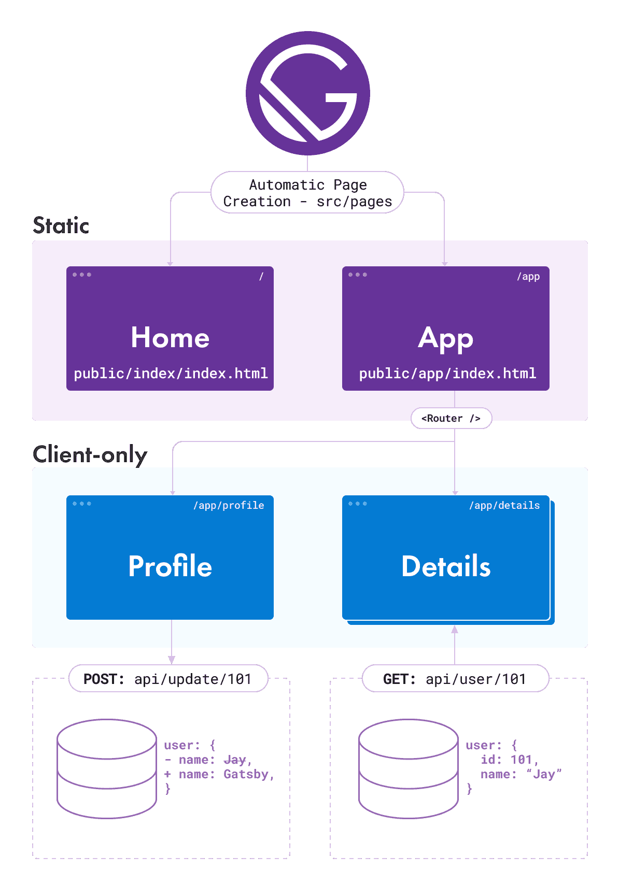
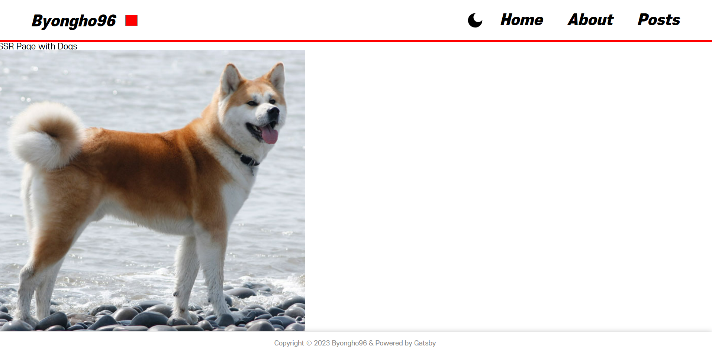

# 시작하기 앞서...

Gatsby로 Markdown기반의 블로그를 만들려고 한다면, [Gatsby 공식문서](https://www.gatsbyjs.com/docs/tutorial/getting-started/)를 보는 것을 추천한다. 맞춤형 강의라고 해도 믿을 만큼 잘 정리되어 있기 때문이다.

때문에 나는 앞으로 Gatsby 튜토리얼에 없는 내용을 포스팅할 예정이다. 예를 들자면 다음과 같다.

- **기존 git 레포지토리에 gatsby 블로그 생성하기**
- **폴더 구조를 바탕으로 사이드 네비게이션 바 자동 생성하기**
- **특정 md 파일들만 필터링해서 페이지 생성하기**
- **다크모드 구현하기**

그리고 첫번째 글은 바로 [Gatsby의 렌더링 옵션](https://www.gatsbyjs.com/docs/conceptual/rendering-options/)과 [Gatsby의 폴더구조](https://www.gatsbyjs.com/docs/reference/gatsby-project-structure/)에 대한 내용이다. 기본적이지만 어째서인지 가장 어려운 부분이라고 할 수 있다.

# 1. CSR vs SSG vs SSR

**Gatsby는 <mark style='background-color: #fff5b1'>SSG, CSR, SSR</mark> 3가지 렌더링 옵션을 모두 지원한다.** 따라서 Gatsby를 이해하기 위해서는 이 3가지 렌더링의 차이점을 이해할 필요가 있다.

## 1.1. CSR 이란?

CSR(Client-side Rendering)은 React, Vue와 같은 프론트 프레임워크의 대표적인 렌더링 방식이다.

CSR 프로젝트를 빌드하면 한 세트의 정적파일(html, js, css)이 생성되는데, 이 중 html파일이 다음과 같이 텅 비어있다.

```html
<!DOCTYPE html>
<html lang="en">
  <head>
    <meta charset="utf-8" />
    ... 메타 태그
    <script defer="defer" src="/static/js/main.ca30c0de.js"></script>
    <link href="/static/css/main.d6754f87.css" rel="stylesheet" />
  </head>
  <body>
    <noscript>You need to enable JavaScript to run this app.</noscript>
    <div id="root"></div>
  </body>
</html>
```

브라우저가 이렇게 텅 빈 html 파일을 처음에 받은 이후에, JavaScirpt가 동작하여 작성된 코드에 따라 html을 렌더링한다. **이처럼 브라우저(클라이언트) 측에서 html파일을 채워넣는 것을 Client-side Rendering이라고 한다.**

## 1.2. SSR 이란?

SSR(Server-side Rendering)은 CSR 방식의 SEO(검색 엔진 최적화)문제를 해결하기 위해 최근에 다시 주목 받고 있는 렌더링 방식이다. Next.js가 SSR방식으로 동작하는 대표적인 프레임워크다.

**SSR에서는 클라이언트가 페이지를 요청하면, 서버는 먼저 필요한 데이터를 모으고, <mark style='background-color: #fff5b1'>모은 데이터와 함께 html파일을 렌더링 한 뒤,</mark> 클라이언트에게 전송한다.**

SSR은 CSR에 비해서 다음과 같은 장단점이 있다.

- **장점**

  - JavaScript가 동작하기 전이라도 사용자는 페이지의 콘텐츠를 볼 수 있다.
  - 페이지 별로 비교적 작은 크기의 정적파일(html, js, css)를 제공받기 때문에 로딩속도가 빠르다.
  - SEO(검색 엔진 최적화)에 더 유리하다.

- **단점**

  - 렌더링 엔진을 구동할 서버가 필요하다
  - 다수의 요청이 들어올 경우, 서버 렌더링 과정에서 과부하가 발생할 수 있다.
  - Next.js와 같은 프레임워크의 경우, CSR과 SSR을 분리해야하기 때문에 설계과정에서 비용이 발생한다.

## 1.3. SSG 란?

SSG 빌드 시점에 모든 페이지에 대해 pre-rendered된 html파일을 생성한다.

혼동하지 말아야할 점은 **SSG(Static Site Generator)가 <mark style='background-color: #fff5b1'>CSR, SSR 모두와 다른 별개의 렌더링 옵션</mark>이라는 것이다.**

SSG만의 차이점은 다음과 같다.

1. **빌드 시에 모든 페이지에 대한 html을 렌더링한다.**  
   따라서 CSR과 다르게 모든 페이지마다 완성된 html을 반환한다.  
   하지만 그렇다고 SSR도 아니다. 사용자 요청에 따라 서버가 동적으로 렌더링하는 것이 아니라, 모든 사용자 요청에 대해 렌더링 해 둔 동일한 html을 반환한다. 따라서 렌더링 엔진을 탑재한 서버도 필요없다.
2. **페이지 데이터가 정적이다.**  
   첫 번째 특징과 연관되어 있다. SSG는 빌드 시점에 모든 페이지에 대한 html을 생성해야 하기 때문애, 페이지에 대한 데이터는 빌드 시점의 데이터로 고정되어 있다.  
   예를 들어 `/profile/:id` 라는 경로로 사용자 정보를 보여준다고 할 때, CSR과 SSR은 실시간으로 id에 대응되는 데이터를 DB에서 확인하여 결과를 반환할 수 있지만, SSG는 빌드 시점에 없는 `id`가 url에 입력되면, 해당 url에 대한 html 파일이 없기 때문에 404페이지를 표시한다.

## 1.3. CSR vs SSR vs SSG

|               | CSR                           | SSR                | SSG                           |
| ------------- | ----------------------------- | ------------------ | ----------------------------- |
| 렌더링 속도   | :thumbsdown:                  | :thumbsup:         | :thumbsup:                    |
| SEO           | :thumbsdown:                  | :thumbsup:         | :thumbsup:                    |
| 실시간 데이터 | :white_check_mark:            | :white_check_mark: | :negative_squared_cross_mark: |
| 서버 여부     | :negative_squared_cross_mark: | :white_check_mark: | :negative_squared_cross_mark: |

# 2. Gatsby 렌더링

Gatsby는 SSG와 CSR을 기본적으로 지원하며, 5버전 이후로는 SSG도 공식적으로 지원한다. <mark style='background-color: #fff5b1'>**한 마디로 그냥 다 할 수 있다.**<mark>

> As already mentioned, Gatsby always supported SSG and client-side rendering. Now, two other rendering options are available: Deferred Static Generation (DSG) and Server-Side rendering (SSR).
> [Gatsby: Rendering Options]

## 2.1. Gatsby SSG

Gatsby는 기본적으로 정적 사이트 생성기이다.

`gatsby build` 명령어를 실행할 때, 모든 url 페이지에 대한 index.html을 생성한다.

## 2.2. Gatsby CSR

만약 Gatsby가 단순히 SSG로써 정적인 html파일을 제공하는데 그친다면, 사용자와 상호작용하지 못하는 아주 재미없는 사이트가 될 것이다. **그래서 Gatsby는 <mark style='background-color: #fff5b1'>Hydration</mark>을 통해 CSR을 제공한다.**

**Hydration이란 정적인 <mark style='background-color: #fff5b1'>HTML을 React Application으로</mark> 변환하는 과정이다.** 브라우저 측에서 전달받은 JavaScript를 로드하여 HTML파일이 사용자와 상호 작용 가능하도록 만든다.

이 Hydration을 통해 Gatsby는 <mark style='background-color: #fff5b1'>React의 기능을 완전히 포함</mark>할 수 있다. [Gatsby의 Client Only Routing 항목](https://www.gatsbyjs.com/docs/how-to/routing/client-only-routes-and-user-authentication/)을 보면 클라이언트 측에서만 존재하는 url를 만들 수 있다고 하는데, 이게 곧 기존의 CSR 방식을 말한다. 다음과 같이 `pages/app.js`에 React의 최상단 컴포넌트에 라우팅 기능을 추가함으로써, `/app/` 이후의 url 주소는 SPA(Single Page Application) 방식의 React와 동일하게 동작한다.

```js
// pages/app.js
import React from 'react'
import { Router } from '@reach/router'
import Layout from '../components/Layout'
import Profile from '../components/Profile'
import Details from '../components/Details'
import Login from '../components/Login'
import Default from '../components/Default'

const App = () => {
  return (
    <Layout>
      <Router basepath="/app">
        <Profile path="/profile" />
        <Details path="/details" />
        <Login path="/login" />
        <Default path="/" />
      </Router>
    </Layout>
  )
}

export default App
```



## 2.3. Gatsby SSR

Gatsby SSR 렌더링은 5버전 부터 공식적으로 제공된다.

**[Gatsby 공식문서](https://www.gatsbyjs.com/docs/how-to/rendering-options/using-server-side-rendering/)에서는 랜덤으로 강아지 이미지를 SSR 렌더링하는 예시**를 보여준다. 아주 간단하게 설명하자면, 서버가 사용자 요청을 받으면 먼저 `getServerData()`로 데이터를 모으고, 컴포넌트에서는 모은 데이터를 `serverdata`라는 변수로 받아 렌더링한다.



하지만 SSR를 동작시키기 위해서는 렌더링 엔전이 돌아가는 서버가 필요하다. 다음 테스트를 통해 직접 확인해볼 수 있다. `npm rum serve` or `gatsby serve` 명령어로 동작시킨 개발 서버에서는 해당 코드가 정상 동작하지만, `npm rum build` or `gatsby build`로 빌드된 정적파일에서는 동작하지 않는다.

나는 이번 Gatsby 블로그를 만드는데 SSR 옵션을 사용하지 않았다. 여러분도 만약 gh-pages나 netflify와 같은 정적파일 제공 서버를 사용할 예정이라면, SSR 옵션을 고려할 필요가 없을 것이다.

# 3. Gatsby 구조

```text
/
|-- /.cache
|-- /plugins
|-- /public
|-- /src
    |-- /api
    |-- /pages
    |-- /templates
    |-- html.js
|-- /static
|-- gatsby-config.js
|-- gatsby-node.js
|-- gatsby-ssr.js
|-- gatsby-browser.js
```

## 3.1. Gatsby 디렉토리

- **/.cache**  
  Gatsby 개발 서버나 빌드 프로세스 중에 사용되는 중간 캐시 데이터를 저장하는 디렉토리이다. 자동으로 생성되며 개발자에 수정을 필요로 하지 않는다. `.gitignore`파일에 추가되어야 한다.

* **/plugins**  
  npm 패키지로 출시되지 안은 local 플러그인을 저장하는 디렉토리이다.

* **/public**  
  빌드 프로세스의 결과물이 저장되는 디렉토리이다. `.gitignore`파일에 추가되어야 한다.

* **/src**

  - **/api**  
    Gatsby는 api를 내장해 express-like 기능을 갖춘 서버리스 프로젝트를 만들 수 있다. 자세한 내용을 다음 [Gatsby 공식문서](https://www.gatsbyjs.com/docs/reference/functions/getting-started/)에서 확인할 수 있다.
  - **/pages**  
    해당 디렉토리 아래에 있는 컴포넌트는 **자동적으로 자신의 상대경로를 url로 가지는 페이지 컴포넌트**로 인식된다.
  - **/templates**  
    프로그래밍적으로 페이지를 생성하기 위한 템플릿을 저장하는 디렉토리이다.
  - **/static**  
    static 폴더 안에 든 파일은 webpack에 의해 처리되지 않고, 그대로 public 폴더 내부로 복사된다.

## 3.2. Gatsby 파일

- **gatsby-config.js**  
  **<mark style='background-color: #fff5b1'>Gatsby 주요 설정 파일</mark>로 Webpack 설정을 포함한다.** 플러그인, 메타데이터, 데이터 소스, 웹팩 등 사이트의 전반적인 동작을 커스터마이징할 수 있다.

- **gatsby-node.js**  
  **Gatsby 노드 API에 대한 설정 파일이다.** Gatsby 노드 API는 빌드 단계에서 페이지 생성, 데이터 가져오기, 동적 라우팅 설정 등의 작업을 수행할 수 있다. 구체적인 노드 API는 [Gatsby 공식문서](https://www.gatsbyjs.com/docs/reference/config-files/gatsby-node/)에서 확인할 수 있다.

- **gatsby-browser.js**  
  **Gatsby 브라우저 API에 대한 설정 파일이다.** Gatsby 브라우저 API는 페이지 전환 시 애니메이션 효과를 추가하거나, 외부 라이브러리를 초기화하거나, 글로벌 CSS 스타일을 적용하는 등의 작업을 수행할 수 있다. 구체적인 브라우저 API는 [Gatsby 공식문서](https://www.gatsbyjs.com/docs/reference/config-files/gatsby-browser/)에서 확인할 수 있다.

- **gatsby-ssr.js**  
  **Gatsby 서버 사이드 렌더링 API에 대한 설정 파일이다.** Gatsby 서버 사이드 렌더링 API는 주로 HTML 마크업과 관련된 작업을 수행하고, 서버 사이드에서 데이터를 가져오거나 렌더링 전에 전처리하는 등의 작업을 할 수 있다. 구체적인 서버 사이드 렌더링 API는 [Gatsby 공식문서](https://www.gatsbyjs.com/docs/reference/config-files/gatsby-ssr/)에서 확인할 수 있다.

# 5. 참고자료

- [Gatsby Rendering Optons](https://www.gatsbyjs.com/docs/conceptual/rendering-options/)
- [Gatsby React Hydration](https://www.gatsbyjs.com/docs/conceptual/react-hydration/)
- [Gatsby Client Only Routing](https://www.gatsbyjs.com/docs/how-to/routing/client-only-routes-and-user-authentication/)
- [Gatsby using SSR](https://www.gatsbyjs.com/docs/how-to/rendering-options/using-server-side-rendering/)
- [Gatsby Project Structure](https://www.gatsbyjs.com/docs/reference/gatsby-project-structure/)
