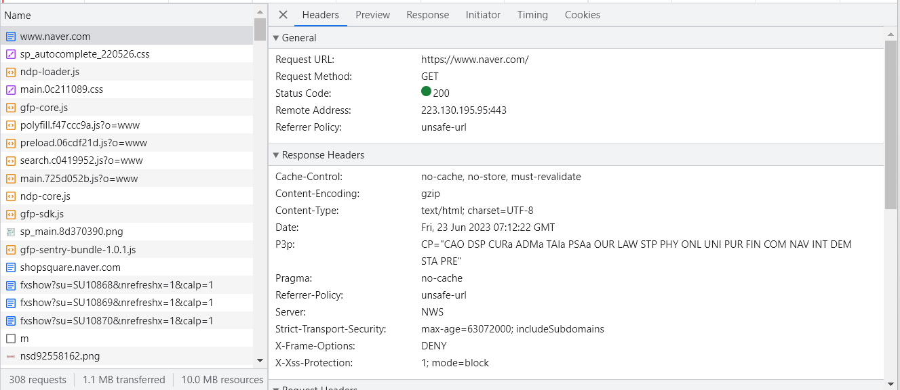
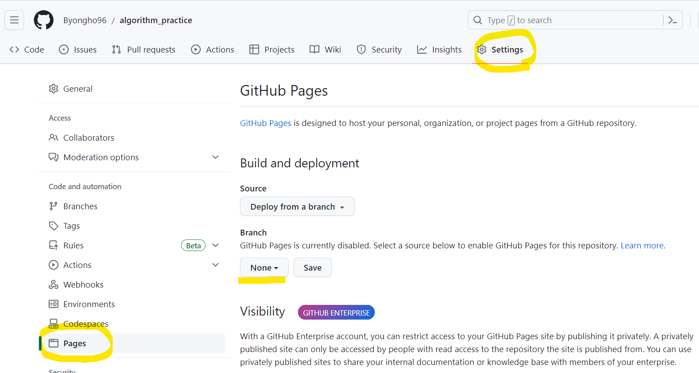
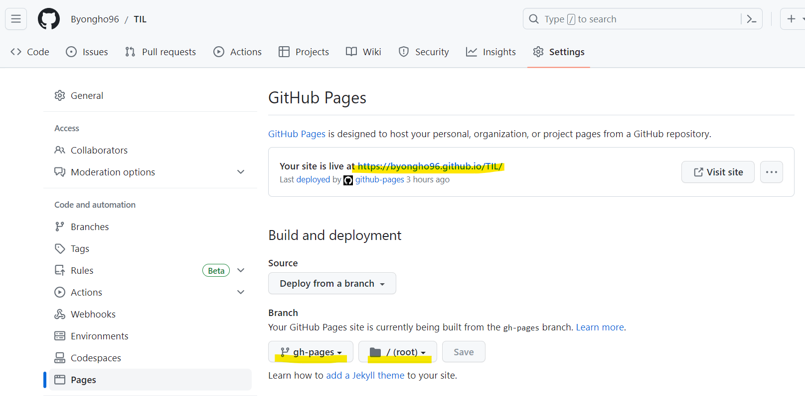

# 1. 프론트엔드 배포란?

프론트엔드 배포를 한 마디로 정리하면, **특정 url을 통한 GET요청에 대해 index.html을 반환하도록 설정**하는 것을 말한다.

처음 배포를 공부할 때, 나는 백엔드보다 오히려 프론트엔드의 배포를 이해하기 더 어려웠다. 백엔드를 배포한다는 것은, 클라이언트의 요청을 WAS(Web Application Server)가 동적으로 처리해 결과를 반환할 수 있도록, 서버에 백엔드 프로젝트(어플리케이션)를 구동하는 것을 말한다. 그런데 도대체 프론트엔드를 배포한다는게 무슨 말일까?

다음 예시를 통해 프론트엔드 배포의 한 번 설명해보겠다.



1. 브라우저에 'http://www.naver.com/'을 입력했다고 가정해보자
2. 이는 곧 해당 URL(IP 주소)로 GET 요청을 보내는 것이다
3. URL(IP 주소)에 대응하는 서버는 네이버 홈페이지 HTML파일을 반환한다.
4. 이 때 HTTP/2의 특징으로 HTML파일이 참조하는 JS, CSS, img, ... 등도 서버에서 한꺼번에 보내준다.
5. 브라우저는 받은 HTML을 나머지 정적 파일들과 함께 렌더링하여 화면에 보여준다.

즉, 백엔드와 프론트엔드 배포는 큰 틀에서 동일하게 동작한다. 다만 프론트엔드는 GET만을 받아 JSON이 아닌 정적파일(html, js, css, ...)을 반환하는 차이점이 있을 뿐이다. 이렇게 url에 대해서 정적인 콘텐츠를 반환할 뿐이기에, 프론트엔드만을 배포하기 위해서 24시간 돌아가는 컴퓨팅 자원을 관리하는 것을 배보다 배꼽이 큰 격이다. 이런 경우 Netflify나 Gihub Pages와 같은 정적 콘텐츠 제공 서비스를 사용할 수 있다.

|         |           백엔드           |         프론트엔드          |
| ------- | :------------------------: | :-------------------------: |
| Method  | GET, POST, PUT, DELETE ... |             GET             |
| Process |      요청에 따라 동적      | 모든 요청에 정적 (SSR 제외) |
| Return  |            JSON            |   html (js, css, static)    |

# 2. GitHub Pages

[GitHub Pages](https://docs.github.com/ko/pages/getting-started-with-github-pages/creating-a-github-pages-site)는 GitHub에서 제공하는 정적 웹사이트 호스팅 서비스이다. GitHub 리포지토리에 저장된 정적 파일(HTML, CSS, JavaScript)을 url 요청이 들어오면 제공하는 것이다.

어떠한 github 레포지토리든지 Settings > Pages 에 들어가면, 아래 사진에서 볼 수 있는 것처럼 특정 Branch를 바라보도록 설정할 수 있다. 그러면 GitHub Pages는 해당 브랜치의 최상단 디렉토리에서 <mark style='background-color: #fff5b1'>**index.html, index.md, README.md**</mark> 3가지 파일을 호스팅할 사이트의 **시작 파일**로 관찰하고 있다.



내 TIL 레포지토리에 대한 Gihub Pages 설정을 보며 더 자세하게 설명해보도록 하겠다.

- Default url은 `{Github ID}.github.io/{레포지토리 이름}/`이다.
  - 아래 예시의 경우, `byongho96/github.io/TIL/`
- 지켜 볼 Branch와 Directory를 설정할 수 있다.
  - 아래 예시의 경우, `gh-pages` 브랜치의 최상단 디렉토리(`/root`)를 바라보고 있다.
  - 해당 위치에 index.html, index.md, README.md 가 들어올 경우, 이를 제공한다.



## 2.1. gh-pages

그럼 우리는 index.html을 포함한 정적 파일을 특정 브랜치에 업로드하기만 하면 된다. 이를 도와주는 라이브러리가 [gh-pages](https://www.npmjs.com/package/gh-pages-cli)이다. gh-pages의 역할을 간단하다. 그냥 레포지토리에 브랜치를 생성하고, 해당 브랜치에 정적파일을 업로드 하는 것이다.

사용법은 다음과 같다.

1. **gh-pages 설치**

   npm 패키지 설치 시, cli 명령도 사용할 수 있다.

   ```cli
   npm install gh-pages --save-dev
   ```

2. **gh-pages CLI 구동**

   ```cli
   gh-pages

   옵션
   -d {타겟 디렉토리}: 올리고자 하는 타겟 디렉토리이다. 기본값은 현재 위치이다.
   -b {타겟 브랜치}: 올리려는 타겟 브랜치이다. 기본값은 gh-pages이다.
   ```

## 2.2. Gatsby and gh-pages

[Gatsby 공식문서](https://www.gatsbyjs.com/docs/how-to/previews-deploys-hosting/how-gatsby-works-with-github-pages/)에서는 Gatsby 프로젝트를 gh-pages를 어떻게 배포할지 설명해주고 있다. 그런데 살펴보면 별거 없다. **그냥 Gatsby를 먼저 빌드하고, 이걸 `gh-pages`명령어로 GitHub에 푸시하라는 말이다.**

1.  **gh-pages 설치**

    ```cli
    npm install gh-pages --save-dev
    ```

2.  **pathPrefix 설정**

    Github Pages로 웹사이트를 호스팅하면 따로 커스텀 도메인을 설정해주지 않는 이상, 레포지토리 명을 url 주소의 prefix로 가져간다. 이를 반영해서 Gatsby 프로젝트를 반영하기 위해 `gatsby-config.js`파일에 다음 설정을 해줘야 한다.

    ```js
    // gatsby-config.js

    module.exports = {
      pathPrefix: '/{레포지토리 이름}',
    }
    ```

3.  **커스텀 script 설정**

    다음과 같이 pacakge.json에서 커스텀 script를 설정한다. `npm run deploy`를 입력하면, `gatsby build --prefix-paths && gh-pages -d public`명령어를 실행시키도록 하겠다는 것이다.

    - `gatsby build --prefix-paths`

      - 설정해 둔 `pathPrefix`를 반영해서 Gatsby 프로젝트를 빌드한다.
      - 빌드 결과물은 자동으로 `/public`폴더에 저장된다.

    - `gh-pages -d public`
      - `public`폴더의 내용물을 `gh-pages`브랜치에 push한다.

    ```js
    // package.json

     {
        "scripts": {
            "deploy": "gatsby build --prefix-paths && gh-pages -d public"
        }
     }
    ```

# 3. Github Actions

Github Actions는 GitHub에서 제공하는 CI/CD 서비스이다.

더 직관적으로 설명하면 이렇다. YAML형식의 워크플로우 파일을 등록하여, **특정 이벤트(push, merge, pull ...)가 일어났을 때, 내가 설정해둔 작업을 자동 실행시킬 수 있다.**

그러면 내가 master 브랜치에 머지했을 때 `npm run deploy`명령어가 돌아가도록, 형식에 맞춰 워크플로우를 작성해서 등록하면 자동배포 끝이다!

근데 항상 생각대로 되지 않기 마련이다... 아래는 내가 처음에 작성했던 간단한 워크플로이다. 마지막 `npm run deploy`부분에서 인증에러가 발생했다. 아무리 내 레포지토리로 push를 하는 것이라고 해도, 실제 워크플로 작업이 일어나는 공간은 Github Cloud이기 때문에 인증에러가 발생하는 것이라고 추측한다.

```yml
name: Deploy GitHub Pages

# master 브랜치에 push 작업이 발생했을 때,
on:
  push:
    branches:
      - master

# 아래 작업을 실행시킨다.
jobs:
  deploy:
    runs-on: ubuntu-latest # 작업 실행 OS 설정
    permissions: # 저장소에 대해 쓰기 권한을 부여한다.
      contents: write
    steps:
      - uses: actions/checkout@v3 # 현재 저장소를 checkout해서 코드를 가져온다.

      - name: Setup Node # Node 환경을 셋팅한다.
        uses: actions/setup-node@v3
        with:
          node-version: '18' # 내가 사용한 Node 버전

      - run: npm ci # npm 패키지를 설치
      - run: npm run deploy # gatsby build --prefix-paths && gh-pages -d public
```

## 3.1. peaceiris/actions-gh-pages

그래서 인증과 gh-pages를 함께 처리할 수 있는 action을 찾기 시작했다. **actions 이란, 워크플로우에서 재사용할 수 있는 기능 단위의 모듈이라고 생각할 수 있다.** `actions/checkout` Github에서 공식적으로 제공하는 액션도 있고, 다른 개발자들이 만든 action도 있다.

그런데 구글링해서 찾아본 대부분의 글에서는 Personal Access Token을 발급받아 배포를 진행했다. 나는 다음과 같은 이유로 이 부분이 조금 꺼림직했다.

- 내 레포지토리로 push를 하는 것인데, Personal Access Token이 정말 필요할지 의문이었다.
- Github 공식 Action도 아닌데 Personal Access Token을 사용하기가 꺼려졌다.
- **무엇보다 Persnal Access Token은 만료기간이 있어서 주기적으로 갱신해줘야 한다.**

그러던 중 구세주를 만났다. 바로 이 [peaceiris/actions-gh-pages](https://github.com/peaceiris/actions-gh-pages)이다. 링크를 타고 들어가면 다음과 같은 사용예시와 설명을 볼 수 있다. 한 마디로 `GIHUB_TOKEN`이라는 값을 사용하기는 하는데, 이건 Personal Access Token이 아니라 Github Actions Runner가 인증을 위해 자동생성하는 값이다. 때문에 우리는 어떠한 추가 설정없이 바로 해당 action을 사용할 수 있다!

```yml
- name: Deploy
  uses: peaceiris/actions-gh-pages@v3
  with:
    github_token: ${{ secrets.GITHUB_TOKEN }}
    publish_dir: ./public
```

> For newbies of GitHub Actions: Note that the GITHUB_TOKEN is NOT a personal access token. A GitHub Actions runner automatically creates a GITHUB_TOKEN secret to authenticate in your workflow. So, you can start to deploy immediately without any configuration.

여기서 끝이 아니다! 프레임워크 별로 구체적인 예시 코드까지 정리해 놓으셨다. 이렇게 똑똑하고 친절한 개발자는 복 받을 거다. 아래는 내가 아주 살짝 커스텀한 코드이다.

```yml
name: GitHub Pages

# master 브랜치에 push 작업이 발생했을 때,
on:
  push:
    branches:
      - main

jobs:
  deploy:
    runs-on: ubuntu-latest # 작업 실행 OS 설정
    permissions: # 저장소에 대해 쓰기 권한을 부여한다.
      contents: write
    concurrency: # 작업 동시성을 제어한다 (하단 설명 참조)
      group: ${{ github.workflow }}-${{ github.ref }}
    steps:
      - uses: actions/checkout@v3 # 현재 저장소를 checkout해서 코드를 가져온다.

      # Node 환경을 셋팅한다.
      - name: Setup Node
        uses: actions/setup-node@v3
        with:
          node-version: '18' # 내가 사용한 노드 버전

      # 캐시 관리
      # 다운로드한 패키지를 캐시하여 다음 실행 시에 다시 다운로드하지 않는다. (하단 설명 참조)
      - name: Cache dependencies
        uses: actions/cache@v3
        with:
          path: ~/.npm
          key: ${{ runner.os }}-node-${{ hashFiles('**/package-lock.json') }}
          restore-keys: |
            ${{ runner.os }}-node-

      - run: npm ci
      #   - run: npm run format
      #   - run: npm run test
      - run: npm run build

      - name: Deploy
        uses: peaceiris/actions-gh-pages@v3
        if: github.ref == 'refs/heads/main'
        with:
          github_token: ${{ secrets.GITHUB_TOKEN }}
          publish_dir: ./public
```

- **concurrency**  
  concurrency는 동시성을 제어하는 옵션으로, 그룹 내에서 여러 작업이 동시 실행되는 것을 제한할 수 있다.

  위 코드에서는 group 속성에 `${{ github.workflow }}-${{ github.ref }}` 값을 사용하고 있다. `${{ github.workflow }}`는 현재 워크플로우 이름을, `${{ github.ref }}`는 현재 브랜치를 의미한다. 이렇게 설정된 그룹 내에서는 한 번에 하나의 작업만 실행된다. 이를 통해 작업 간의 충돌을 방지하고 자원을 효율적으로 활용할 수 있다고 한다.

- **actions/cache@v3**  
   해당 코드는 Github의 캐시 서비스를 이용해서 종속성을 캐시한다. 캐시 서비스에 저장된 값은 동일 레포지토리 내에서 다른 워크플로우와 공유되기 때문에, 다음 번 워크프롤우에서 사용할 수 있다.

  - **path**  
    캐시를 저장할 디렉토리 경로를 지정한다.

  - **key**  
    캐시를 식별하는 고유한 키를 생성한다. 위 코드에서는 두가지 변수를 사용한다. `${{ runner.os }}`는 실행 환경의 운영체제를, `-node-`는 단순 문자열, 그리고 `${{ hashFiles('**/package-lock.json') }}`은 package-lock.json 파일의 해시값을 의미한다. 이를 통해 package-lock.json 파일이 수정되었을 경우에만 새로운 캐시를 생성한다.

  - **restore-keys**  
    캐시된 값을 복원할 때 사용할 키들의 목록을 지정한다. 위의 코드에서는 `${{ runner.os }}-node-`를 사용하여 앞선 `key`항목에서 생성되었던 모듴 키들을 순서대로 검사하도록 했다. 그 중 가장 최근에 생성된 캐시의 값으로 복원한다.

# 참조

- [Getting Started with Github Pages](https://docs.github.com/ko/pages/getting-started-with-github-pages/creating-a-github-pages-site)
- [Github Pages](https://pages.github.com/)
- [How Gatsby workswith Gitub Pages](https://www.gatsbyjs.com/docs/how-to/previews-deploys-hosting/how-gatsby-works-with-github-pages/)
- [peaceiris/actions-gh-pages](https://github.com/peaceiris/actions-gh-pages)
