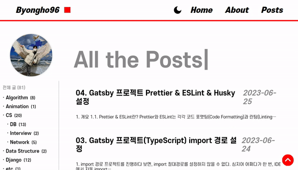
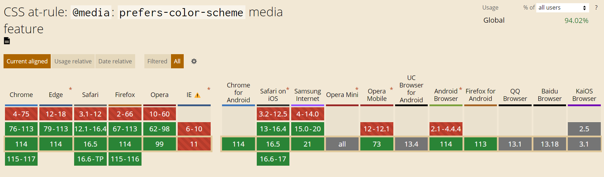
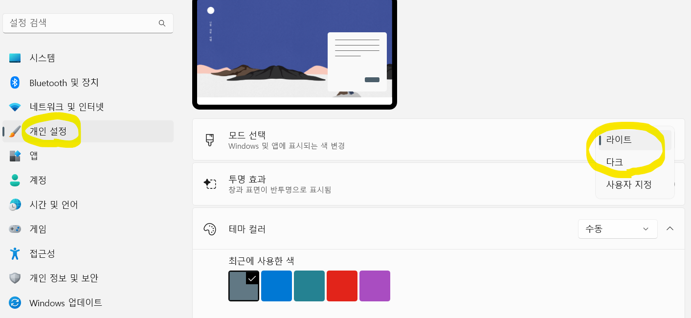

> 아래 내용은 주관적인 의견이고, [카카오 FE 기술 블로그](https://fe-developers.kakaoent.com/2021/211118-dark-mode/)의 내용을 참조했습니다.

# 1. Sass 다크모드

한동안 다크모드를 공부한 적이 있다. Styled Component와 같은 CSS-in-JS를 사용할 때는 나름 다크모드를 구현할 줄 알았는데, Sass와 같은 정적 CSS로 넘어오자 도저히 갈피를 못잡았기 때문이다.

리액트 기반 프로젝트에서 Sass로 다크모드를 구현하기 위해서는 두가지 기능을 사용할 것이다. CSS variables와 Context API이다. **CSS variables는 정적인 다크모드 UI를 구현하는데 사용할 것이다.** 예를 들어, 다크모드일 때 배경색이 검은색으로 변하는 게 정적인 다크모드에 해당할 것이다.



**반대로 Context API는 동적인 UI를 구현하는데 사용할 것이다.** 단순히 css의 특정 속성값을 바꾸는게 아니라, 모드에 따라 컴포넌트의 클래스명('light', 'dark')을 변경하여 자유롭게 CSS 기능을 추가할 수 있다.


## 1.1. CSS variables

<mark>**CSS도 전역적으로 사용할 수 있는 변수**가 있다.</mark> 더 정확히 말하면 [CSS custom properties](https://developer.mozilla.org/en-US/docs/Web/CSS/Using_CSS_custom_properties)라고 한다. 진짜 알면 별거 없는데 모르면 큰일이다. 처음 프로젝트에서 Sass를 사용했을 때는, 이 개념을 몰라 다크모드를 위한 코드가 많이 더러웠다. 

이미 Sass 시스템 자체에서 변수를 지원하는데 무슨 소리냐고 할 수 있는데, 아래 예시를 보면 단번에 이해할 수 있을 것이다. `:root` 태그에 'light'클래스 유무에 따라서 프로젝트 전체에서 사용되는 CSS variable에 할당된 값이 바뀐다.

참고로 `:root`는 다른게 아니라 가상선택자로 `html`태그와 동일한 위치에 있다고 생각하면 된다. [MDN 공식문서](https://developer.mozilla.org/en-US/docs/Web/CSS/Using_CSS_custom_properties#basic_usage)에서 CSS variables를 **전역적으로 사용**하려면 `:root`요소에 정의하는 것을 권장하고 있다. 또한 이러한 <mark>전역 스타일링 코드는 최종적으로 [gatsby-browser](https://www.gatsbyjs.com/docs/how-to/styling/global-css/#adding-global-styles-without-a-layout-component)에 포함되어야 한다.</mark>

```scss
// Sass 변수
$font-white: #ffffff;
$font-black: #000000;
$bg-white: #dddddd;
$bg-black: #292929;

// 다크 모드(default)
:root {
  --bg-color: #{$bg-black}; // sass 변수를 css 변수로 사용하기 위해 interpolation
  --font-color: #{$font-white};
}
// 라이트 모드
:root.light {
  --bg-color: #{$bg-white};
  --font-color: #{$font-black};
}
```

그러면 실제 컴포넌트의 css에서는 다음처럼 사용하면 된다. css 변수를 사용하기 위해서는 `var()`를 써줘야한다.

```scss
.component {
    background-color: var(--bg-color);
    color: var(--font-color);
}
```

## 1.2. Theme Context

**Theme Context는 <mark>사용자와 상호작용하며 Theme 정보를 다른 컴포넌트</mark>와 공유하기 위한 Context API이다.** 따라서 반드시 Context API가 아니어도 된다. 다른 Recoil이나 Redux같은 전역저장소를 사용해도 된다. 다만 어차피 대부분의 컴포넌트를 재렌더링해야하기 때문에 Context API를 사용하기 적합하다고 생각한다.

Theme Context는 별거 없다. React의 context API를 그대로 활용하면 된다. `createContext`를 이용해 context를 만들고, `theme`변수와 `toggleTheme`함수를 정의해서 Provider로 하위 컴포넌트들에게 제공하면 된다. 

```js
// src/contexts/theme-context.tsx
import React, { createContext ,useState, useCallback } from 'react'

interface Props {
  children: React.ReactNode
}

// Context 생성
export const ThemeContext = createContext({
  theme: 'dark',
  toggleTheme: null,
})

export const ThemeProvider = ({ children }: Props) => {
  const [theme, setTheme] = useState('dark')    // theme 정의
  const toggleTheme = useCallback(() => {       // toggleTheme 정의
    setTheme((theme) => {
      return theme === 'light' ? 'dark' : 'light'
    })
  }, [])

  return (
    <ThemeContext.Provider value={{ theme, toggleTheme }}>
      {children}
    </ThemeContext.Provider>
  )
}

export default ThemeProvider
```

컴포넌트에서는 다음과 같이 읽어와서 쓰면 된다.

```js
import React, { useContext } from 'react'
import { ThemeContext } from '@contexts/theme-context'

const Component: React.FC = () => {
  const { theme, toggleTheme } = useContext(ThemeContext)

  return (
    <div className={`${theme}`}>
        ...
    </div>
  )
}
```

## 1.3. 코드 합치기

이제 위의 두가지 기능을 연동할 것이다. 별거 아니라 Theme Context에서 `theme`이 토글됨에 따라서 `:root`요소의 클래스를 변경하겠다는 말이다. 다음과 같이 `useEffect`를 하나 추가함으로써 구현할 수 있다.

```js
// src/contexts/theme-context.tsx
import React, { createContext ,useState, useEffect, useCallback } from 'react'

interface Props {
  children: React.ReactNode
}

export const ThemeContext = createContext({
  theme: 'dark',
  toggleTheme: null,
})

export const ThemeProvider = ({ children }: Props) => {
  const [theme, setTheme] = useState('dark')    
  const toggleTheme = useCallback(() => {      
    setTheme((theme) => {
      return theme === 'light' ? 'dark' : 'light'
    })
  }, [])

  // theme에 따라 :root의 클래스를 토글한다.
  useEffect(() => {
    const root = document.querySelector(':root')
    if (theme === 'light') {
      root.classList.add('light')
    } else {
      root.classList.remove('light')
    }
  }, [theme])

  return (
    <ThemeContext.Provider value={{ theme, toggleTheme }}>
      {children}
    </ThemeContext.Provider>
  )
}

export default ThemeProvider
```

# 2. 다크모드 UX

다크모드는 눈에 띄는 사용자 경험(User Exprience)이다. 사이트의 사용자 경험을 높이기 위해 다크모드라는 클라이언트 데이터를 어떻게 관리할지 고민해볼만하다.

결론적으로 말하면 나는 **세션 스토리지**에 다크모드 값을 저장해서 우선적으로 읽고, 해당 값이 없을 경우 **prefers-color-scheme**의 다크모드 설정 여부를 판단해 렌더링하기로 했다.

## 2.1. prefers-color-scheme

먼저 **prefers-color-scheme**는 CSS 미디어 특성으로, <mark>사용자 웹의 다크모드 설정여부를 확인</mark>한다. 최신 브라우저에서는 모두 지원하기는 하는데, 정확히 어떻게 결정되는지는 모르겠다.



심지어 운영체제의 설정과도 연관되어 있는 것 같다. 직접 테스트해본 결과, Windows 설정에서 바꾼 선호 모드가 prefers-color-scheme에 영향을 끼쳤다.



CSS와 JS에서는 각각 다음과 같이 사용할 수 있다.

```scss
@media (prefers-color-scheme: dark){
	body {
		background: black;
		color: white;
	}
}
```
```js
if (window.matchMedia('(prefers-color-scheme: dark)').matches) {
    console.log('I prefer dark mode.')
}
```

하지만 이 설정에만 의존해서는 안된다. 분명 사용자의 선호 테마를 참조할 수 있다는 것은 좋은 사용자 경험을 제공하지만, 사이트 자체에서 다크모드를 토글하기 위해서는 추가적인 작업이 필요하다.

## 2.2. 세션 스토리지

그래서 나는 세션 스토리지를 사용하기로 했다. 상상해보니까 로컬 스토리지보다 세션 스토리지가 더 나은 사용자 경험을 제공할 것 같았기 때문이다.

만약 어떤 다크모드 사용자가 내 웹사이트에 놀러왔다고 가정해보자. 그 날 따라 눈이 침침해서, 아니면 그냥 심심해서, 테마를 라이트모드로 전환하고 떠났다. 그리고 며칠이 지난 후, 내 웹사이트에서 본 깔쌈하고 멋진 글이 문득 생각 나서 다시 놀러왔다. 바로 이 때, 해당 사용자는 마지막에 자신이 설정한 테마를 기억이나 하고 있을까? 난 아니라고 생각한다. 밤 늦게 개발을 하면서 들어간 웹사이트가, 예상치 못하게 제공된 라이트모드 때문에 눈뽕을 당했다고 생각할 확률이 더 높을 것이다.

위와 같이 나름의 사고를 걸쳐 다크모드를 세션 스토리지에 저장하기로 했다.

## 2.3. 코드 작성

위의 내용을 바탕으로 앞 서 작성한 `Theme Context`파일에 코드를 추가했다. `useEffect`페이지 첫 로딩 시, 세션 스토리지와 사용자 선호테마에 따라서 테마를 결정하고, 테마가 변경될 때마다 세션 스토리지에 데이터를 추가하는 코드를 작성한다. 또한 useEffect가 하나 더 추가 됨에 따라 기존 useEffect와 순서가 보장되지 않으므로, `isSetted`라는 변수를 생성해서 처음 작성한 useEffect문이 첫 마운트 시에는 동작하지 않도록 한다.

```js
// src/contexts/theme-context.tsx
import React, { createContext ,useState, useEffect, useRef, useCallback } from 'react'

interface Props {
  children: React.ReactNode
}

export const ThemeContext = createContext({
  theme: 'dark',
  toggleTheme: null,
})

export const ThemeProvider = ({ children }: Props) => {
  const [theme, setTheme] = useState('dark')    
  const toggleTheme = useCallback(() => {      
    setTheme((theme) => {
      return theme === 'light' ? 'dark' : 'light'
    })
  }, [])

  const isSetted = useRef(false)
  useEffect(() => {
    // 페이지 첫 mount시에는 제외하고 동작
    if (!isSetted.current) {
      isSetted.current = true
      return
    }

    sessionStorage.setItem('theme', theme)  // theme 변경 시마다 세션스토리지에 저장
    const root = document.querySelector(':root')
    if (theme === 'light') {
      root.classList.add('light')
    } else {
      root.classList.remove('light')
    }
  }, [theme])

  // 페이지 첫 로딩시 테마 결정
  // 세션 스토리지 확인 > prefers-color-scheme 확인
  useEffect(() => {
    const sessionTheme = sessionStorage.getItem('theme')
    if (sessionTheme) {
      setTheme(sessionTheme)
    } else if (window.matchMedia('(prefers-color-scheme: dark)').matches) {
      setTheme('dark')
    } else {
      setTheme('light')
    }
  }, [])

  return (
    <ThemeContext.Provider value={{ theme, toggleTheme }}>
      {children}
    </ThemeContext.Provider>
  )
}

export default ThemeProvider
```

# 3. wrapRootElement

Gatsby는 SSG기반의 프레임워크이어서 모든 url에 대응되는 index.html이 있다. **즉 리액트와 같은 Single Page Application이 아니기 때문에, url를 이동할 때마다 새로운 index.html을 받는다.** 한 마디로 말해서 <mark>url을 이동할 때마다 새로고침</mark>이 일어난다고 생각하면 된다.

앞에서 설명은 안했지만, Gatsby는 정적인 index.html을 받아 이를 hydration하고 안에 있는 리액트코드를 돌리기까지 시간이 걸린다. 그래서 내가 설정한 다크모드와 웹사이트의 기본 다크모드가 다를 경우, 화면이 반짝거리는 flicker 현상이 일어나는데, 이게 매 url 이동마다 일어난다고 생각하면 끔찍한다.

따라서 Gatsby는 모든 페이지에서 대해, 어떤 요소를 전역적으로 유지하기 위해 [wrapPageElement](https://www.gatsbyjs.com/docs/reference/config-files/gatsby-browser/#wrapRootElement)라는 browser API를 제공한다. 공식문서에 따르면 `wrapRootElement`는 context API와 같은 것에 적합하고, 네비게이션바와 같이 UI 관련 요소의 경우 `wrapPageElement`를 사용하라고 한다.

> This is useful to set up any context providers that will wrap your application. For setting persistent UI elements around pages use wrapPageElement. [Gatsby Doc]

또한 ssr API에도 동일한 API들이 있어 이 둘을 같이 사용할 것을 권장하고 있다. 하지만 나는 SSR 방식을 아예 사용하지 않기 때문에 제외했다.

> There is an equivalent hook in Gatsby’s SSR API. It is recommended to use both APIs together. [Gatsby Doc]

## 3.1. gatsby-browser

적용 방법은 아주 쉽다. gatsby-browser 파일에 다음처럼 코드를 작성하기만 하면 된다. 좀 특이했던 것은 jsx 문법을 사용하기 때문에

- `import React from 'react` 구문을 넣고
- 파일 이름을 `gatsby-browser.ts`에서 `gatsby-browser.tsx`로 바꿔야 했다. 

```js
import React from 'react'
import ThemeProvider from '@contexts/theme-context'

export const wrapRootElement = ({ element }) => {
  return <ThemeProvider>{element}</ThemeProvider>
}
```

# 4. 참조
- [카카오 FE 기술블로그: 웹에서 다크모드 지원하기](https://fe-developers.kakaoent.com/2021/211118-dark-mode/)
- [CSS custom properties](https://developer.mozilla.org/en-US/docs/Web/CSS/Using_CSS_custom_properties)
- [prefers-color-scheme](https://developer.mozilla.org/en-US/docs/Web/CSS/@media/prefers-color-scheme)
- [Gatsby Browser APIs](https://www.gatsbyjs.com/docs/reference/config-files/gatsby-browser/)