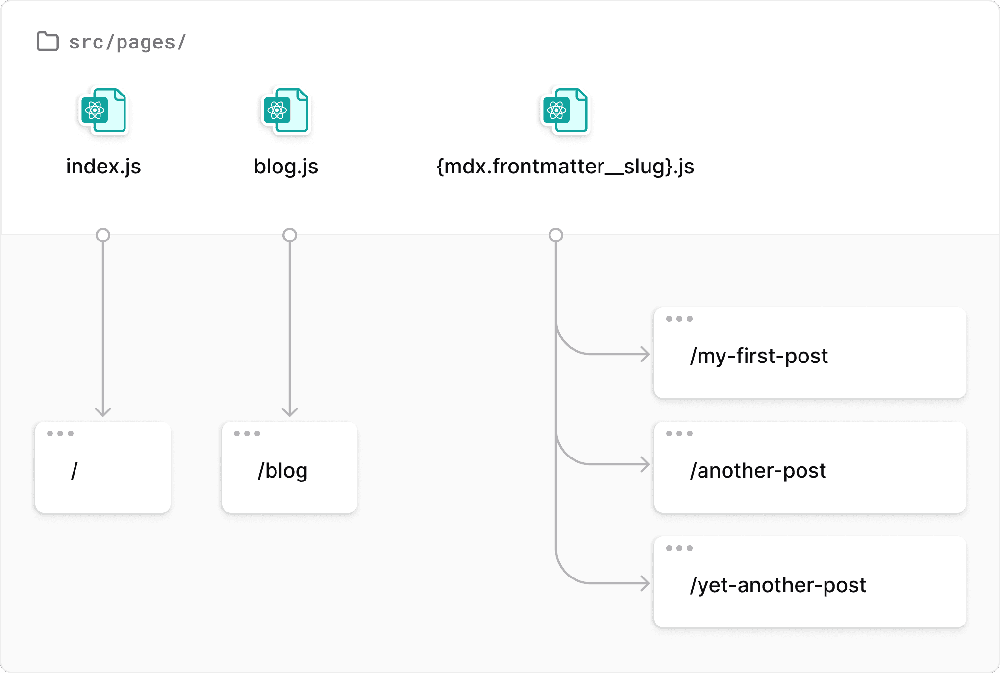

# 1. 튜토리얼 방식의 한계

[Gatsby 튜토리얼 Part6](https://www.gatsbyjs.com/docs/tutorial/getting-started/part-6/) 를 보면 **file system routes**라고 해서 파일시스템에 있는 파일들에 대해서 동적으로 페이지를 생성하는 방법을 소개한다.

예를 들어 아래 그림처럼 `src/pages/`아래에 `{mdx.frontmatter_slug}`라는 파일을 만들면, 파일 시스템이 관측하는 모든 mdx의 문서에 대해서 `{mdx.frontmatter_slug}`라는 url로 페이지를 만들어 준다. 더 자세하게 말하면, `gatsby-config`파일에서 `gatsby-source-filesystem`가 관측하는 경로의 모든 mdx파일에 대해서 페이지를 만들어준다



위 방법으로 간단하게 모든 파일에 대응되는 페이지를 만들 수 있었지만, 나한테는 적합하지 않았다. 왜냐하면 나는 <mark>모든 파일이 아닌 **필터링된 일부 파일**</mark>에 대해서만 페이지를 만들고 싶었기 때문이다. 개인적인 상황을 좀 더 구체적으로 말하자면, 내 \*.md 파일들의 frontmatter는 다음처럼 구성되어 있다. 나는 이 중 `isCompleted: true`인 파일들에 대해서만 페이지를 만들고 싶었다. ~~내가 의욕이 많은 편이라 isCompleted가 false 문서가 많다~~

```text
---
title: ''
updatedAt: 'YYYY-MM-DD'
createdAt: 'YYYY-MM-DD'
isCompleted: boolean
description: ''
tags: ['']
reference: ''
---
```

# 2. CreatePage

Gatsby는 나 같은 사람들을 위해서 또 node API를 만들었다. node API 중 `createPages`를 이용하면, 프로그래밍적으로 내가 원하는 커스텀 페이지를 만들 수 있다.

# 2.1. gatsby-node

페이지를 만드는 작업은 빌드 시에 일어나기 때문에, 당연히 `createPages`는 Node API 이다. 그리고 Node API이기 때문에 `gatsby-node`파일에 작성한다.

사용 예시가 [공식문서](https://www.gatsbyjs.com/docs/programmatically-create-pages-from-data/)에 잘 정리되어 있어, 나는 그냥 따라서 코드를 작성했다.

한 가지 특별히 설명하고 싶은 거는 **pageContext**이다. 마지막 `createPage`함수에 보면 `path`, `component`, `context`가 인자로 들어간다. 각각의 인자의 특징은 다음과 같다.

- **path**
  - 페이지의 url 경로.
- **component**
  - 렌더링할 페이지 컴포넌트.
- **context**
  - 페이지에 `pageContext`라는 이름으로 prop된다.
  - 페이지 query에서 인자로 바로 참조할 수 있다.

```js
// createPages API로 커스텀 페이지 생성
exports.createPages = async ({ graphql, actions, reporter }) => {
  const { createPage } = actions

  // 페이지를 만들 md 데이터 수집
  // 조건 1. frontmatter.isCompleted == true
  // 조건 2. posts 디렉토리 내부 && README 파일 제외
  const posts = await graphql(
    `
      query AllPost {
        allMarkdownRemark(
          filter: {
            frontmatter: { isCompleted: { eq: true } }
            fileAbsolutePath: { regex: "/^(?!.*README).*posts.*$/" }
          }
        ) {
          nodes {
            id
            parent {
              ... on File {
                id
                name
                relativeDirectory
                relativePath
              }
            }
          }
        }
      }
    `
  )

  // 에러 처리
  if (posts.errors) {
    reporter.panicOnBuild(`Error while running GraphQL query.`)
    return
  }

  // 사용할 템플릿(페이지) 컴포넌트
  const postTemplate = path.resolve(`src/templates/post/index.tsx`)

  // graphQL로 불러온 데이터를 순회하며 페이지 생성
  posts.data.allMarkdownRemark.nodes.forEach((node) => {
    const path = 'posts/' + node.parent.relativePath // url 경로 커스텀
    const relativeDirectory = node.parent.relativePath // 추가로 내려주고 싶은 pageContext
      .split('/')
      .slice(0, -1)
      .join('/')
    const regex = new RegExp(
      `^(?!.*README).*${relativeDirectory}.*$`
    ).toString()

    // 페이지 생성
    createPage({
      path: path, // url 경로
      component: postTemplate, // 페이지 템플릿
      context: {
        // pageContext
        siblingPostsPathRegex: regex,
        ...node,
      },
    })
  })
}
```

# 2.2. template 컴포넌트

그러면 템플릿 컴포넌트에서는 다음과 같이 코드를 작성할 수 있다.

앞서 말한 것처럼 `gatsby-node`파일에서 작성한 코드에서, **`createPage`함수에 `context`에 내려준 값은 페이지에 `pateContext`라는 prop으로 내려간다.** 그 뿐 아니라, <mark>pageContext의 내부 값은 페이지 query에서 바로 참조할 수 있다.</mark>

그래서 나는 `pageContext`로 prop받은 markdownRemark의 `id`와 형제 포스트를 검색하기 위해 커스텀해서 내려준 정규식 `siblingPostsPathRegex`을 사용해서, 세부 정보를 위한 query를 만들었다.

```js
import * as React from 'react'
import type { PageProps } from 'gatsby'
import { graphql } from 'gatsby'

const PostPage: React.FC<PageProps> = ({ pageContext, data }) => {
  console.log(pageContext) // createPage 함수에서 내려준 context

  return <div dangerouslySetInnerHTML={{ __html: data.markdownRemark.html }} />
}

// pageContext의 내부 값은 페이지 query에서 바로 참조 가능
export const query = graphql`
  query PostDetail ($id: String!, $siblingPostsPathRegex: String!) {
    markdownRemark(id: { eq: $id }) {
      id
      html
      tableOfContents
      frontmatter {
        ...
      }
    }
    allMarkdownRemark(
      filter: {
        frontmatter: { isCompleted: { eq: true } }
        fileAbsolutePath: { regex: $siblingPostsPathRegex }
      }
    ) {
      nodes {
        ...
      }
    }
  }
`

export default PostPage
```

# 3. 참조

-[Gatsby Getting Started Part6](https://www.gatsbyjs.com/docs/tutorial/getting-started/part-6/) -[Gatsby Programatically Create Pages from Data](https://www.gatsbyjs.com/docs/programmatically-create-pages-from-data/)
