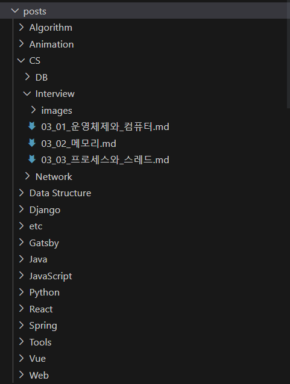
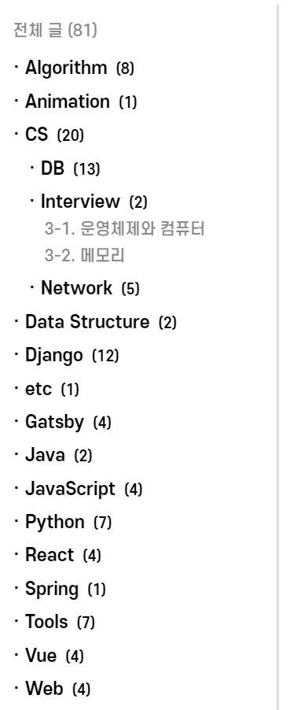

> 틀린 내용이 있거나, 제가 모르는 방법이 있다면 제발 알려주세요

# 1. GraphQL

아직 GraphQL을 파일시스템에 대해서 밖에 사용하지 않아, 정확히 GraphQL이 뭔지는 감이 안잡힌다. 하지만 그 제한된 경험으로도 GrqphQL이 기존 API방식과 많이 다르다는 것을 체감하기는 충분했다.

- **장점**  
  <mark>작성되지 않은 API에 대해서도 데이터를 받을 수 있다.</mark> 벌써 파일시스템도 설계된 API 없이 모든 정보를 받아올 수 있다. 반면 백엔드를 통해 데이터베이스와 연결된 요청에 대해서는 어떻게 동작하는지 미지수이다.

- **단점**  
   <mark>원하는 형식으로 데이터를 받을 수 없다.</mark> GraphQL의 장점으로 프론트엔드가 원하는대로 데이터를 골라받을 수 있다고 하는데, 이건 정말 **원하는 데이터만을 골라 받는거지, 원하는 형식으로 주는 것은 아니다.** 때문에 프론트엔드가 데이터를 받아 직접 가공해야 한다.

# 2. 폴더구조 기반 카테고리

블로그를 생성하기 전, 나는 TIL 레포지토리의 마크다운 파일들을 다음과 같이 중첩된 디렉토리 구조로 관리하고 있었다(아마 대부분 그렇겠지만...). 그래서 아래 그림과 같이, 나는 이 폴더구조가 곧 카테고리 바가 되길 바랬다.아마 누구나 처음 그렇게 생각하지 않을까?

|  |  |
| --------------------------------------------------------------------------------------- | ------------------------------------------------------------------------- |

결론만 말하면 **그냥 코딩테스트마냥 구현 알고리즘을 만들었다.** GraphQL에 대해서 설명한 이유가 이것이다. 데이터가 원하는 대로 오지 않으면, 가공하면 그만이다. 그나마 다행인 점은, 렌더링 속도 측면에서 시간복잡도를 고려할 필요는 없다는 것이다. SSG 방식이기 때문에 어차피 빌드 시에 렌더링이 완성되기 때문이다.

## 2.1. fragments & useStaticQuery

Gatsby는 기본적으로 페이지 단위의 Query로 동작한다. 빌드 시에 모든 페이지에 대한 index.html을 렌더링하는 SSG 특징 때문인 것 같다. 하지만 프로젝트의 크기가 커지고, 컴포넌트가 분리되면 페이지 쿼리에서 모든 데이터를 불러오는게 말처럼 쉽지가 않다. 일단 query문 자체가 무지막지하게 길어질 것이다.

**Gatsby는 페이지 쿼리를 분리해서 개별 컴포넌트에서 관리하기 위해 두 가지 기능을 제공한다.** 바로 [fragments](https://www.gatsbyjs.com/docs/conceptual/graphql-concepts/#fragments)와 [useStaticQuery](https://www.gatsbyjs.com/docs/how-to/querying-data/use-static-query/)이다. 이 둘의 목적만 간략하게 정리하면 다음과 같다. 구체적인 예시는 위 링크를 통해 공식문서에서 확인할 수 있다.

- **fragments**

  - **페이지에 종속적인 쿼리 데이터를 컴포넌트에서 관리할 수 있다.**
  - 컴포넌트에 선언된 fragment는 최종적으로 페이지 쿼리문에 삽입되어야 한다.

- **useStaticQuery**
  - **페이지에 독립적인 정적 쿼리문을 컴포너트에서 관리할 수 있다.**
  - 정적인 쿼리문이기 때문에 외부로부터 인자를 받지 못한다.

## 2.1. useStaticQuery Hook

카테고리 바를 구현하기 위해, 나는 `useStaticQuery`를 사용했다. **디렉토리 구조라고 하는 것은, 페이지 url과는 상관없는 독립적이고 정적인 데이터이기 때문이다.**

그리고 [공식문서](https://www.gatsbyjs.com/docs/how-to/querying-data/use-static-query/#composing-custom-usestaticquery-hooks)를 보면, <mark>`useStaticQuery`를 하나의 hook으로 관리하여 여러 컴포넌트에서 재사용하기를 권장한다.</mark> 여기서 말하는 hook이란, 정적인 데이터를 불러와 원하는 형태로 가공하여 제공하는 역할을 한다.

그렇게 내가 만든 `useCategorizedPosts`는 다음과 같다.

```js
import { graphql, useStaticQuery } from 'gatsby'

// 마크다운 파일 정보
interface Post {
  id: string
  title: string
  relativePath: string
}

// 카테고리(디렉토리) 정보
interface Directory {
  name: string
  posts: Post[]
  nums: number
  folders: Directory[]
}

interface Returns {
  totalPosts: number // 전체 포스트 수
  categories: Directory[] // 카테고리(디렉토리) 정보 배열
}

export const useCategorizedPosts = (): Returns => {
  // 마크다운 파일 수집
  // 조건 1. isCompleted: true
  // 조건 2. README.md 제외
  // 조건 3. posts 디렉토리 하위
  const data = useStaticQuery(graphql`
    query {
      allMarkdownRemark(
        filter: {
          frontmatter: { isCompleted: { eq: true } }
          fileAbsolutePath: { regex: "/^(?!.*README).*posts.*$/" }
        }
        sort: { frontmatter: { title: ASC } }
      ) {
        nodes {
          id
          parent {
            ... on File {
              id
              name
              relativePath
            }
          }
          frontmatter {
            title
          }
        }
      }
    }
  `)

  const totalPosts = data.allMarkdownRemark.nodes.length // 전체 포스트 수

  // 마크다운 파일 순회하며 카테고리 분류
  const categories = []
  data.allMarkdownRemark.nodes.forEach((post) => {
    // 데이터 분해
    const { id, parent, frontmatter } = post
    const { name, relativePath } = parent
    const { title } = frontmatter

    // 카테고리 분류를 위해 상대 경로를 배열로 변환
    const pathArray = relativePath.split('/')

    // 루트 카테고리 분류
    const rootCategoryName = pathArray[0]
    let rootCategory = categories.find(
      (category) => category.name === rootCategoryName
    )
    if (!rootCategory) {
      // 루트 카테고리가 없을 경우, 새로 생성
      const newCategory = {
        name: rootCategoryName,
        num: 1,
        posts: [],
        subCategories: [],
      }
      categories.push(newCategory)
      rootCategory = newCategory
    } else {
      // 루트 카테고리가 있을 경우, 갯수만 업데이트
      rootCategory.num += 1
    }

    // 서브 카테고리 분류
    let parentCategory = rootCategory // 상대 경로 배열을 순회하며, 부모 디렉토리 재할당
    pathArray.slice(1, -1).forEach((subCategoryName) => {
      let subCategory = parentCategory.subCategories.find(
        (category) => category.name === subCategoryName
      )
      if (!subCategory) {
        // 서브 카테고리가 없을 경우, 새로 생성
        const newCategory = {
          name: subCategoryName,
          num: 1,
          posts: [],
          subCategories: [],
        }
        parentCategory.subCategories.push(newCategory)
        subCategory = newCategory
      } else {
        // 서브 카테고리가 있을 경우, 새로 생성
        subCategory.num += 1
      }
      parentCategory = subCategory
    })

    // 포스트 삽입
    parentCategory.posts.push({ id, title, name, relativePath })
  })

  return { totalPosts, categories }
}
```

## 2.3. 카테고리 컴포넌트

카테고리 컴포넌트는, 위에서 만든 `useCategorizedPosts`훅에서 데이터를 받아 렌더링된다.

```js
import React, { useState, useRef, useEffect } from 'react'
import './style.scss'
import { Link } from 'gatsby'
import { useCategorizedPosts } from '@hooks/use-categorized-posts'

interface Props {
  openedCategory?: string; // 처음 렌더링 시 선택값
}

// 최대 3단계 카테고리까지만(루트 카테고리 포함) 지원
const Category: React.FC<Props> = ({ openedCategory = '' }) => {
  const { totalPosts, categories } = useCategorizedPosts()
  const [selectedCategory, setSelectedCategory] = useState(openedCategory)

  const handleClickCategory = (event, name) => {
    if (event.detail > 1) return
    event.preventDefault() // 한번 클릭이면 Link 이동 막고, selecedCategory 토글
    setSelectedCategory(selectedCategory === name ? '' : name)
  }

  return (
    <nav className="sidebar">
      <div className="sidebar__total">{`전체 글 (${totalPosts})`}</div>
      <ul className="sidebar__menu">
        {/* 루트 카테고리 */}
        {categories.map((category) => (
          <li key={category.name}>
            <CategoryName
              name={category.name}
              num={category.num}
              handleClickCategory={handleClickCategory}
            />
            <ul>
              {/* 서브 카테고리 1 */}
              {category.subCategories.map((subCategory) => (
                <li key={subCategory.name}>
                  <CategoryName
                    name={subCategory.name}
                    num={subCategory.num}
                    handleClickCategory={handleClickCategory}
                  />
                  <ul>
                    {/* 서브 카테고리 2 */}
                    {subCategory.subCategories.map((subCategory) => (
                      <li key={subCategory.name}>
                        <CategoryName
                          name={subCategory.name}
                          num={subCategory.num}
                          handleClickCategory={handleClickCategory}
                        />
                        {/* 서브 카테고리 2 포스트 */}
                        <Posts
                          posts={subCategory.posts}
                          isSelected={selectedCategory === subCategory.name}
                        />
                      </li>
                    ))}
                  </ul>
                  {/* 서브 카테고리 1 포스트 */}
                  <Posts
                    posts={subCategory.posts}
                    isSelected={selectedCategory === subCategory.name}
                  />
                </li>
              ))}
            </ul>
            {/* 루트 카테고리 포스트 */}
            <Posts
              posts={category.posts}
              isSelected={selectedCategory === category.name}
            />
          </li>
        ))}
      </ul>
    </nav>
  )
}

const CategoryName: React.FC = React.memo(
  ({ name, num, handleClickCategory }) => {
    return (
      <Link
        to={`/posts/${name}`}
        className="sidebar__category"
        onClick={(event) => {
          handleClickCategory(event, name)
        }}
      >
        {`${name}\u00a0\u00a0(${num})`}
      </Link>
    )
  }
)

const Posts: React.FC = React.memo(({ posts, isSelected }) => {
  const postsRef = useRef < HTMLUListElement > null

  // css를 위한 변수 전달
  useEffect(() => {
    const postsEle = postsRef.current
    postsEle &&
      postsEle.style.setProperty('--posts-length', posts.length.toString())
  }, [])

  const selected = isSelected ? 'open' : null // 선택 여부

  return (
    <ul ref={postsRef} className={`sidebar__posts ${selected}`}>
      {posts.map((post) => (
        <li key={post.id}>
          <Link to={`/posts/${post.relativePath}`} activeClassName="active">
            {post.title || post.name}
          </Link>
        </li>
      ))}
    </ul>
  )
})
export default Category
```

# 참고

- [Gatsby useStaticQuery](https://www.gatsbyjs.com/docs/how-to/querying-data/use-static-query/)
