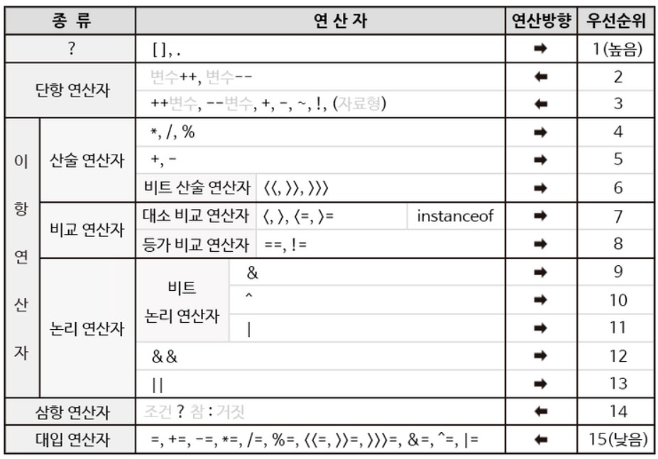
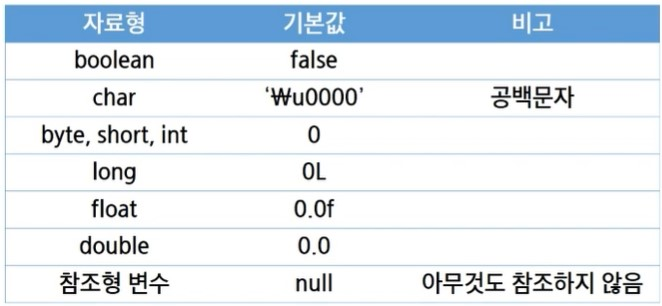

- [1. Program and OS](#1-program-and-os)
  - [1.1. Program](#11-program)
  - [1.2. Operating System](#12-operating-system)
- [2. Data representation](#2-data-representation)
- [3. JVM(Java Virual Machine)](#3-jvmjava-virual-machine)
- [4. Hello SSAFY](#4-hello-ssafy)
- [5. Java IDE Intro](#5-java-ide-intro)
  - [5-1. main method](#5-1-main-method)
  - [5-2. comment](#5-2-comment)
  - [5-3. Print](#5-3-print)
- [6. Variable and Data type](#6-variable-and-data-type)
  - [6.1. Variable](#61-variable)
  - [6.2. Data Type (Primitive) \<-\> (Reference)](#62-data-type-primitive---reference)
  - [6.3. Type Casting](#63-type-casting)
- [7. Operator](#7-operator)
- [8. Control flow - condition](#8-control-flow---condition)
  - [8.1. if](#81-if)
  - [8.2. switch](#82-switch)
- [9. Control flow - loop](#9-control-flow---loop)
  - [9.1. if](#91-if)
  - [9.2. while](#92-while)
  - [9.3. continue and break](#93-continue-and-break)
- [10. Array](#10-array)
  - [10.1. Declaration](#101-declaration)
  - [10.2. Usage](#102-usage)
- [11. Multidimensional Array](#11-multidimensional-array)
  - [11.1. Declaration](#111-declaration)
  - [11.2. Search](#112-search)

---

# 1. Program and OS

## 1.1. Program

- **the collection of commands to perfrom sepcific task**

## 1.2. Operating System

- **Software that manage computer hardware and provide service and platform for application SW**

# 2. Data representation

- **Binary data**
- 1Byte as numerical value(==the first one is sign bit==)
  - -128 ~ 127

# 3. JVM(Java Virual Machine)

- **Subjects executing Java Byte code**
- **Java Byte Code**
  - the middle file(.class) between source code and binary code
- Makes Java Byte code be able to excuted on every OS

# 4. Hello SSAFY

```java
public class Hello {
    public static void main(String[] args){
        System.out.println("Hello SSAFY")
    }
}
```

- javac Hello.java
  - Hello.java -> Hello.class
- java Hello
  - excuting Hello.class
- **eclipse**
  - IDE(Integrated Developmend Environment)
  - Support programming including upper procedures

# 5. Java IDE Intro

```java
<package> // folder
    <library>
    <src> // source code folder
        <.java> //make class in the package.src
    <bin> // java byte code folder
        <.clss>
```

## 5-1. main method

- where the code starts!!
- fixed form
  `public static void main(String[] args){}`

## 5-2. comment

- line comment: `//`
- range comment: `/* */`
- documentation comment: `/** */`
  - explanation for the function

## 5-3. Print

**System.out.**

- `print`: print
- `println`: print and change the line
- `printf`

  -

  ```java
  public static void main(String[] args) {
      System.out.printf("%d \n", 10);     // 10
      System.out.printf("%o \n", 10);     // 12
      System.out.printf("%x \n", 10);     // a
      System.out.printf("%X \n", 10);     // A

      System.out.printf("%4d \n", 10);    //  10
      System.out.printf("%-4d \n", 10);   //10
      System.out.printf("%04d \n", 10);   //0010

      System.out.printf("%f \n", 10.1);   //10.100000
      System.out.printf("%.2f \n", 10.1); //10.10

      System.out.printf("%s \n", "Kim");  //Kim
      System.out.printf("%c \n", "O");    //O
  }
  ```

# 6. Variable and Data type

## 6.1. Variable

- **name of the memory that contains the data**
- Rules
  - Letters and numbers '$' and '\_'
  - can't start with numbers
  - camelCase
    - for variable and functions
    - PascalCase: for class

## 6.2. Data Type (Primitive) <-> (Reference)

- Primitive Type

  - pre-fixed memory size
  - variable itself has the data
  - types
    - Bool
    - char(2B)
    - byte(1B), short(2B), ==int(4B)==, long(8B)
    - float(4B), ==double(8B)==
  - declaration -> assgining

    ```java
    int age;
    age = 30;

    int age = 30; // initilazation = declaration + assigning
    ```

## 6.3. Type Casting

- byte < short < int < long < float < double
  - ==float is bigger than long==
- Implicit Casting
  - put smaller data type into bigger data type
- Explicit Casting
  - put bigger data type into smaller data type
  - ```java
    int i = 100;
    byte b = (byte)i;
    ```

# 7. Operator



- Equality comparison operator
  - ==: compare the value **in the variable**
    - ==not suitable for reference data type==
  - equals(): compare the value **in the object**
    - ==suitable for reference data type==

# 8. Control flow - condition

## 8.1. if

```java
public class example {
    public static void main(String[] args) {
        if(conditional statement) {
            statement to run;
        }else if(conditional statement2) {
            statement to run;
        }else {
            statement to run;
        }

        if(conditional statement)
            statement to run; // when there's only one statement {}can be skipped
            statement to run2; // it isn't included regardless of the index. Not Python!!!
    }
}
```

## 8.2. switch

```java
public class example {
    public static void main(String[] args) {
        switch(variable) {
            case value1:
                statement;
                break   // break is not mandotry
                        // but from here all the statements under will be excuted until meet another break
            case value2:
                statement;
                break
            default:
                statement;
        }
    }
}
```

Example.

```java
public class example {
    public static void main(String[] args) {

        int month = 12

        switch(month) {
            case 1:
            case 3:
            case 5:
            case 7:
            case 8:
            case 10:
            case 12:
                System.Out.println("31");
                break
            case 4:
            case 6:
            case 9:
            case 11:
                System.Out.println("30");
            case 2:
                System.Out.println("28");
                break
            default:
                System.Out.println("Wrong input");
        }
    }
}
```

# 9. Control flow - loop

## 9.1. if

```java
public class example {
    public static void main(String[] args) {
        for (intialization; condition; Incre/Dcre){
            statement
        }
        // intialization, Incre/Decre can be expressed with more than 2 vairables!!

        for(int i = 0; i < 10; i++){
            System.outl.println(i); // 0 ~ 9
        }

        for(int i = 0, j = 10; i < 10; i += 2, j--){
            System.outl.println(i); // 0, 2, 4, 6, 8
            System.outl.println(j); // 10, 9, 8, 7, 6

        // multiplication table
        for (int i = 2; i <= 9; i++){
            for (int j = 2; j <= 9; j++)
                System.outl.printf("%d * %d = %d\n", i, j, i * j);
        }
    }
}
```

## 9.2. while

```java
public class example {
    public static void main(String[] args) {
        while(conditional statement) {
            statement;
        } // while conditional statement is true

        do {
            statement;
        } while (conditional statement);
        // the statement is excuted at least once
    }
}
```

## 9.3. continue and break

- can be used with ==label=

```java
public class example {
    public static void main(String[] args) {
        label:
        for (int i = 2; i <= 9; i++){
            for (int j = 2; j <= 9; j++)
                System.outl.printf("%d * %d = %d\n", i, j, i * j);
                if (j==3){
                    continue label;
                }
        }
}
```

# 10. Array

- Data structure for saving the same type of data
- ==The size is **fixed**==
- It's an **object** == **reference data**

  - The data is saved **in heap**
  - The variable **in stack** has the address pointing the data
  - ```java
    String c = "Hi";
    String d = "Hi";
    String e = new String("Hi");

    System.out.println(c == d); //true. There's string pool in heap
    System.out.println(c == e); //false
    System.out.println(c.equals(d)); //true
    ```

- can be referenced with index(int)

## 10.1. Declaration

- **Delacration**
  - **type[] variable**
  - type variable[]
    ```java
    int[] iArr;
    char[] cArr;
    boolean[] bArr;
    String[] strArr;
    Date[] dateArr;
    ```
- **Creation**

  - type[] variable = {v1, v2, v3, }
  - variable = new type[] {v1, v2, v3, }
  - variable = new type[len]

    - default value
      

    ```java
    public class array {
        public static void main(String[] args) {
            //1-dimensional array
            int[] score1;
            int score2[];

            score1 = {1, 2, 3, 4, 5}; // Impossible
            score1 = new int[] {1, 2, 3, 4, 5};

            int[] score2 = {1, 2, 3, 4, 5}

            int[] score3 = new int[5];
            score3[0] = 1;
            score3[1] = 2;
            score3[2] = 3;
            score3[3] = 4;
            score3[4] = 5;
         }
    }
    ```

## 10.2. Usage

- `Arr[index]`
- `Arr.length`
- for-each

  - access to the elements in the array
  - take the elements ==**by copying** it==

    ```java
    public class foreach{
        public static void main(String[] args) {
            int[] arr = {77, 50, 10, 12, 64, 15}

            for(int x : arr) {
                System.out.println(X); // 77, 50, 10, 12, 64, 15
            }
        }
    }
    ```

- `Arrays.toString(arr)`
  - change the arr into '[v1, v2, v3, ...]'
- `System.arraycopy(Object src, int srcPos, Object dest, int destPos, int length)`

  ````java
     public class copy{
         public static void main(String[] args) {
             int[] arr = {77, 50, 10, 12, 64, 15}

             int[] tmp = new int[arr.length*2];

             System.arraycopy(arr, 0, tmp, 0, arr.length);
             //[77, 50, 10, 12, 64, 15, 0, 0, 0, 0, 0, 0]
         }
     }
     ```
  ````

# 11. Multidimensional Array

- **elements of the array have the address of another array**

## 11.1. Declaration

- **Declaration**

  - **int[][] iArr**
  - int iArr[][]
  - int[] iARr[]

- **Creation**

  - variable = new type[num_of_1st_array][size_of_1st_array]
  - variable = new type[num_of_1st_array][]

  ```java
  int a = 10;

  int[] arr = new int[4]; //[0, 0, 0, 0]

  int[][] arr2 = new int[2][];
  arr2[0] = new int[3];
  arr2[1] = new int[3];
  arr2[1][1] = 100; // [[0, 0, 0], [0, 100, 0]]
  ```

## 11.2. Search

- **arr[i][j]**
  - x-search
    - arr[i][j+1]: right
    - arr[i][j-1]: left
  - y-search
    - arr[i+1][j]: bottom
    - arr[i-1][j]: top
