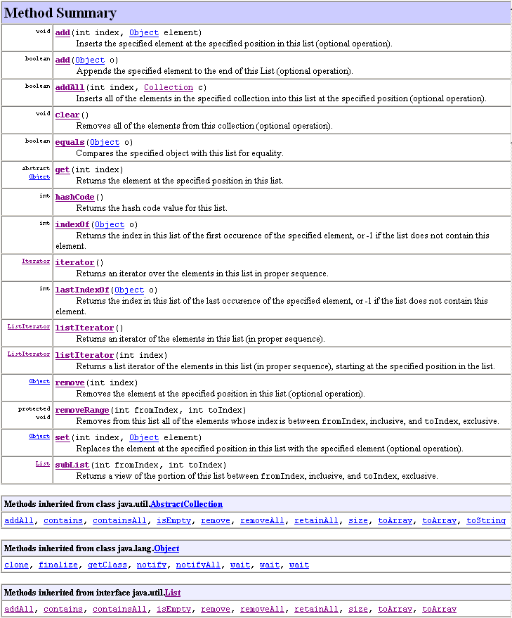
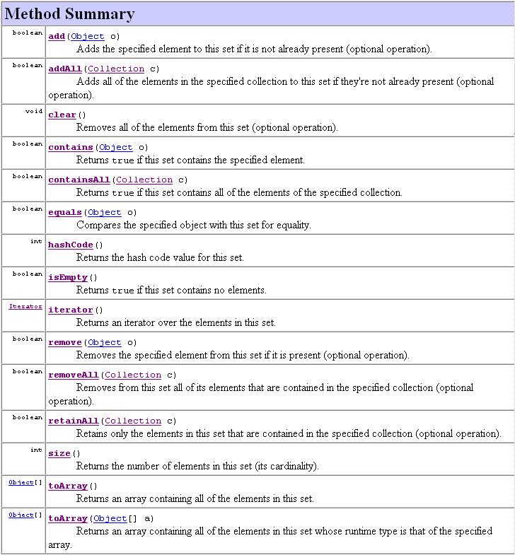
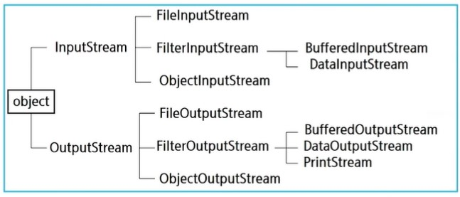
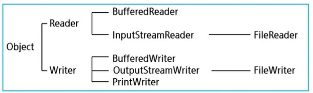
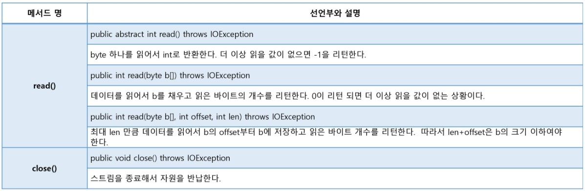
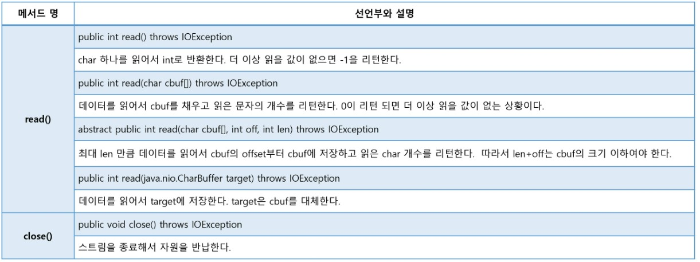
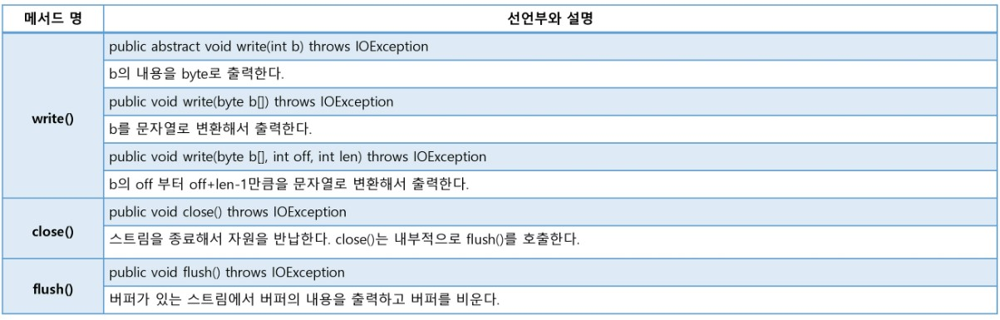
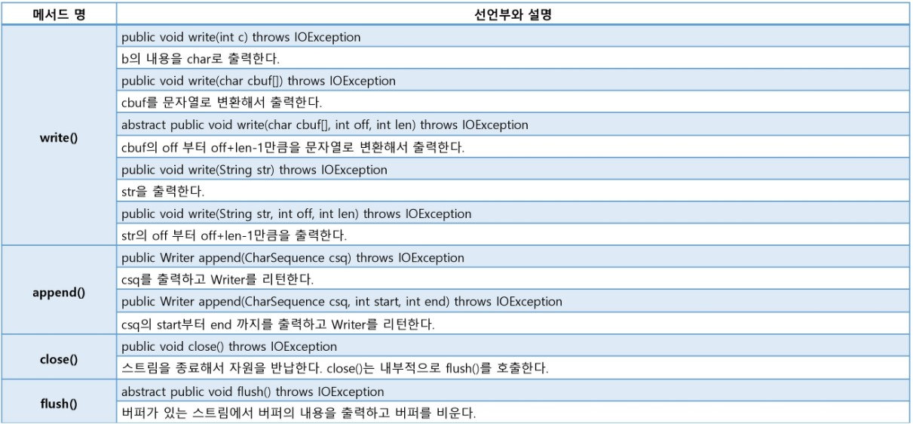
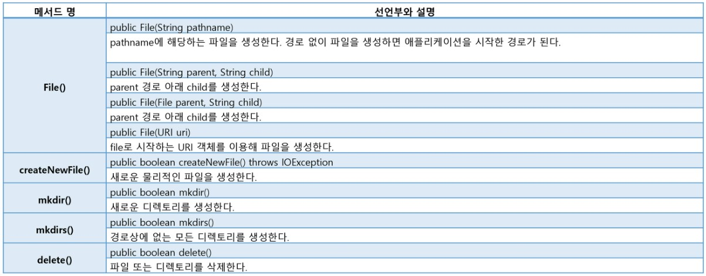
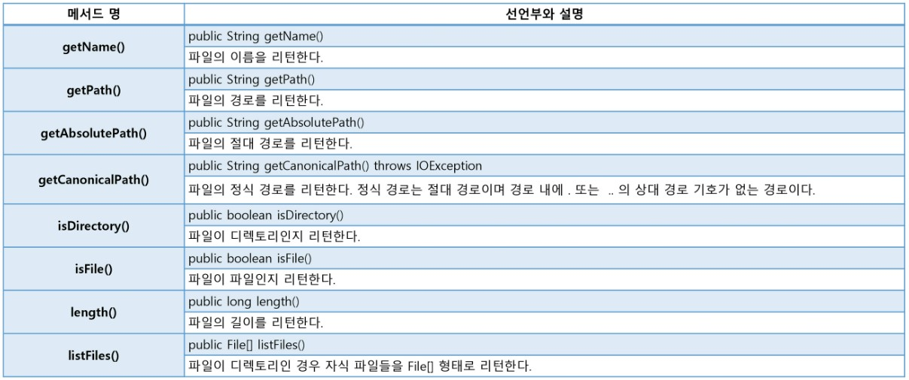

- [1. OOP](#1-oop)
- [2. Class](#2-class)
  - [2.1. composition](#21-composition)
  - [2.2. Basic figure](#22-basic-figure)
- [3. Field (variables)](#3-field-variables)
  - [3.1. Types](#31-types)
- [4. Method(functions)](#4-methodfunctions)
  - [4.1. Basic figure](#41-basic-figure)
  - [4.2. Overloading](#42-overloading)
- [5. JVM Memory structure](#5-jvm-memory-structure)
- [6. Constructor](#6-constructor)
  - [6.1. Default Constructor](#61-default-constructor)
  - [6.2. Constructor with parameters](#62-constructor-with-parameters)
  - [6.3. this](#63-this)
- [7. Package](#7-package)
  - [7.1. import](#71-import)
- [8. Encapsulation (Access Modifier)](#8-encapsulation-access-modifier)
  - [8.1. Types](#81-types)
  - [8.2. Getter/Setter](#82-gettersetter)
  - [8.3. Singleton Pattern](#83-singleton-pattern)
- [9. Inheritance](#9-inheritance)
  - [9.1. super()](#91-super)
  - [9.2. super](#92-super)
  - [9.3. Overriding](#93-overriding)
  - [9.4. final](#94-final)
- [10. Polymorphism](#10-polymorphism)
- [10.1. Usage](#101-usage)
  - [10.2. Type Casting](#102-type-casting)
  - [10.3. \[objectName\] instanceof \[ClassName\]](#103-objectname-instanceof-classname)
- [11. Abstract class](#11-abstract-class)
- [12. Interface](#12-interface)
- [13. Generic](#13-generic)
  - [13.1. Expression](#131-expression)
  - [13.2. Announcement](#132-announcement)
  - [13.3. Constraint of Type parameter](#133-constraint-of-type-parameter)
- [14. Collection Framework](#14-collection-framework)
  - [14.1. List](#141-list)
  - [14.2. Set](#142-set)
  - [14.3. Map](#143-map)
  - [14.4. Sorting](#144-sorting)
- [15. Exception Handling](#15-exception-handling)
  - [15.1. multiple exception handling](#151-multiple-exception-handling)
  - [15.2. try ~ catch ~ finally](#152-try--catch--finally)
  - [15.3. throws](#153-throws)
  - [15.4. throw](#154-throw)
- [16. Input/Output API](#16-inputoutput-api)
  - [16.1. I/O Stream](#161-io-stream)
  - [16.2. Methods](#162-methods)
  - [16.3. BufferedStream(보조스트림)](#163-bufferedstream보조스트림)
- [17. JSON](#17-json)
  - [17.1. JAVA and JSON](#171-java-and-json)
- [18. GSON Library](#18-gson-library)
  - [18.1. Download](#181-download)

---

# 1. OOP

- **Object Oriented Programming**
- **Characteristics**
  - Abstraction
  - Polymorphism
  - Inheritance
  - Encapsulation

# 2. Class

**The blueprint of a collection of variables and functions which are relevant**

- **being assigned in **heap** memory**

  ```java
  // make 'variable random' in the 'stack' which is pointing Random datatype
  // assign 'object Random' in the 'heap' to the random
  Random random = new Random();
  randBool = random.nextBoolean();

  // make object Random for one-time usage
  // nothing points Random
  randBool = new Random().nextBoolean();
  ```

## 2.1. composition

- Attribute: variables
- Behavior: methods
- Constructor

## 2.2. Basic figure

```java
//접근제한자: public / default
//활용제한자: final / abstact
[접근제한자][활용제한자] class 클래스명 {
    필드
    메소드
    생성자
}
```

# 3. Field (variables)

## 3.1. Types

- **Class variable**
  - ==**static** keyword==
    - being saved on the class memory
    - with methods
  - shared by all the instances
  - on the memory ~ program end
- **Instance variable**
  - without the keyword
    - being saved on the heap
  - belongs to one instance
  - the instance is created ~ the instance isn't referenced
- **Local variable**

  - declared in the methods(functions)
  - should be **initialized**

  ```java
  public class Person {
      // class memory
      static int personCount;
      // Instance variables
      String name;
      int age;
      String hobby;
  }
  public class Person {
      public static void main(String[] args) {
          //local varibale
          Person p1 = new Person();
          //instance variable should be called with an instacne
          p1.name = "Yang";
          p1.age = 45;
          p1.hobby = "Golf";
          // class variable can be called with the class
          System.out.println(Person.personCount);
      }

      void test() {
          //Error: p1 was an local variable in the different method
          println(p1.name);
      }
  }

  ```

# 4. Method(functions)

## 4.1. Basic figure

```java
//접근제한자: default / public / protected / private
//활용제한자: static / final / abstract / synchronized
// If there's static, it can be called by the class
[접근제한자] (static) [활용제한자] [반환값] 메소드이름(매개변수) {
    명령어
}
```

- **static**-> className.method()
  - Otherwise, objectName.method()
- **Parameter**
  - the passage to hand over data
  - implicit type casting
    - small -> bigger
- **retrun type**
  - only one data is possible

## 4.2. Overloading

**Re-define different type of parameters in the same name of method**

```java
println(): void
println(boolean x):void
println(char x): void
println(char[] x):void
println(double x): void
println(float x):void
print(int x): void
...
```

# 5. JVM Memory structure


- static area **can't** access non-static area

  ```java
  public class Main {
      String str = "문장";

      public static void main(String[] args) {
          System.out.println(Str);
      }
  }
  ```

- non- static area **can** access static area

  ```java
  public class Main {
      static String str = "문장";

      public static void main(String[] args) {
          System.out.println(Str);
      }
  }
  ```

# 6. Constructor

**being excuted only once when an object is constructed**

- called with **new** keyword
  - return the address of the object
- named as the same with the class
  - therefore, following PascalCase

## 6.1. Default Constructor

- when there's no constructor in the class, it's the one the JVM automatically protvide

````java
public class Dog {
        // no return type
        /*
        public Dog() {
            //I'm a default constructor.
        }
        */
    }
    ```
````

## 6.2. Constructor with parameters

- initialize the instance variables
- the defualt constructor is not defined

  - overloading

  ```java
  class Dog {
      String name;
      int age;

      Dog(String n, int a) {
          name = n;
          age = a;
      }
  }

  class Main {
      public static void main(String[] a) {
          //Error
          Dog d1 = new Dog();

          Dog de = new Dog("Bob", 3);
      }
  }
  ```

- making more than one constructor is possible
  ```java
  class Dog {
      Dog() {}
      Dog(String name) {}
      Dog(int age) {}
      Dog(String name, int age) {}
  }
  ```

## 6.3. this

- indicating the object itself
  - this.instanceArea
  ```java
  class Dog {
      String name;
      int age;
      Dog(String name, int age){
          this.name = name;
          this.age = age;
      }
  }
  ```
- can call another instuructor
  - this(parameter)
  - should be placed at the first line of an instructor
  ```java
  class Dog {
      String name;
      int age;
      // If the name is not handed over, the default name is "Bob"
      Dog() {
          // call Dog(String name)
          this("Bob");
      }
      Dog(String name){
          this.name = name
      }
  }
  ```

# 7. Package

**Folder for managing classes**

```html
<src>
  <package>
    <.java>
    <class>
      <class>
        <.java>
        <class>
          <pacakge2>
            <.java>
            <class>
              <.java>
              <class>
                //public class should be on in the .java // but class can be
                more than one // eclipse makes multiple class file after
                compiling
              </class>
            </class>
          </pacakge2>
        </class>
      </class>
    </class>
  </package>
</src>
```

## 7.1. import

**process for using a class in another package**

```html
<src>
  <com.A.project1>
    <Person.java>
      <com.A.projcet2>
        <PersonService.java></PersonService.java></com.A.projcet2></Person.java></com.A.project1
></src>
```

```java
package com.A.procjet2;

//import [packageName].[className];
//import [packageName].*;
import com.A.projcet1.Person;

public class PersonService {
    Person p;
}
```

```java
package com.projcet1;

import java.util.*
//import java.util.Arrays;
//import java.util.Scanner;
//import java.util.function.Function;

public class Package {
    public static void main(String[] args) {
        Scanner sc // O
        Arrays arr; // O
        Function f; // X
    }
}
```

- **ctrl + shift + O**: automatically import packages that I need
  - PascalCase: only for the classes
- **java.lang.\***
  - initially imported
  - Ex. **System**.stdin.println()

# 8. Encapsulation (Access Modifier)

**For protecting data(field, method) in the class**

## 8.1. Types

- **public**
  - can be accessed **from everywhere**
- **protected**
  - can be accessed **from the same package**
  - or **from the inherited class**
- **(default)**
  - can be accessed **from the same package**
  - when an access modifier is not defined
- **private**
  - only can be accessed **in the same class**

## 8.2. Getter/Setter

**==public methods== that allows accessing the data from out of the class**

```java
package package01;

public class Car {
    String color;
    private int speed;

    // Setter
    public void setSpeed(int, speed) {
        if(0 <= speed && speed < = 250)
            this.speed = speed;
        else
            System.out.println("speed out of range");
    }
    // Getter
    public int getSpeed() {
        return this.speed;
    }
}
```

```java
package package01;

public class CarTest {
    public static void main(String[] args) {
        Car c = new Car();

        c.color = "Red";

        //c.speed = 100; Error
        c.setSpeed(100);
        //System.out.println(c.speed); Error
        System.out.println(c.getSpeed());
    }
}
```

- Mouse right click > source > generating getter and setter
- Boolean

  - getter name is a little bit different

    ```java
    package package01;

    public class GetSet {
        private boolean hungry;

        //setter
        public void setHungry(boolean hungry) {
            this.hungry = hungry;
        }
        //getter
        public boolean isHungry() {
            return this.hungry;
        }
    }
    ```

## 8.3. Singleton Pattern

**Even if the class is called several times, there's ==only one object==, and return this**

```java
public class Manager {
    private Student[] students = new Student[100];
    private int size = 0;

    // 2. make a private instance in the class by itself
    private static StudentManager manager = new StudentManager();

    // 1. private constructor
    private StudentManager() {
    }

    // 3. Getter
    public static StudentManager getManger() {
        return manager;
    }
}
```

# 9. Inheritance

**Making a new class which contains all the attributes of another class**

- Java doesn't support multiple inheritance
  - but by using 'interface' and 'abstract class', it can be supported
- Child class can use the Parent class's fields and mehtods except private
- Object class is the parent class of all the class

  - java.lang.Object

  ```java
  public class Person {
      String name;
      int age;

      public void eat() {
          System.out.println("Eating food");
      }
  }

  public class Student extends Person {
      String major;

      public void study() {
          System.out.println("Studying");
      }
  }
  ```

## 9.1. super()

**call the parent class's constructor**

- it's automatically excuted in the constructor
  - object -> parent1 object -> parent2 object -> child object

```java
public class Person {
        String name;
        int age;

        public Person() {
            //super()
            System.out.println("Person.constructor is excuted")
        }
    }

public class Student extends Person {
        String major;

        public Student() {
            //super()
            System.out.println("Student.constructor is excuted")
        }
    }
```

```java
public class MainTest {
    public static void main(String[] args) {
        student st = new Student();
        // Person.constructor is excuted
        // Student.constructor is excuted
    }
}
```

## 9.2. super

**Indicating parent class**

```java
public class Person {
        String name;
        int age;

        public void eat() {
            System.out.println("Eating food");
        }
    }

public class Student extends Person {
        String major;

        public void study() {
            super.eat() //Person.eat()
            System.out.println("Studying");
        }
    }
```

```java
public class MainTest {
    public static void main(String[] args) {
        student st = new Student();

        st.study();
        // Eating food
        // Studying
    }
}
```

## 9.3. Overriding

**Re-define parent class's method**

- name of the method, data type, and parameters all should be the same
- `@Override`: comments for compiler
- the range of child's access modifier should bigger than parents'
  - vice versa is possible

```java
public class Person {
        String name;
        int age;

        public void eat() {
            System.out.println("Eating food");
        }
    }

public class Student extends Person {
        String major;

        @Override // highly recommended
        public void eat() {
            System.out.println("Eating knowledge");
        }
    }
```

```java
public class MainTest {
    public static void main(String[] args) {
        student st = new Student();

        st.eat();
        // Eating knowledge
    }
}
```

## 9.4. final

- **final class**: can't be inherited
- **final method**: can't be overrided
- **final variable**: can't be changed
  - UPPER_AND_UNDRBAR

# 10. Polymorphism

**can refer to child class' object with parent class**

- becuase every child object is constructed on the parent classes' objects

  ```java
  // Object -> Person -> Student
  Student st = new Student("kim", 25);
  Person p = new Student("kim", 25);
  Object ob = new Student("kim", 25);

  //Error: PErson() object doesn't generate Student object
  Student st = new Person("kim", 25);
  ```

# 10.1. Usage

- **Array containing different data types**

  ```java
  Person[] persons = new Person[3];

  persons[0] = new Person();
  persons[1] = new Student();
  persons[2] = new Student();
  // [Person(), Student(), Student()]
  ```

- **Arguments can be any data type**
- If the paramter is declared as Object, it can get any kind of data types

  ```java
  public void println(Object x) {
      String s = String.valueOf(X);
      synchronized (this) {
          print(S);
          newLine();
      }
  }

  public void main(String[] args) {
      public void println(Person p);
      public void println(Student st);
  }
  ```

## 10.2. Type Casting

- **smaller -> bigger**
  - implicit type casting
  - but some data cannot'be referenced even if it's on the memory
  ```java
  // Object -> Person -> Student
  public void main(String[] args) {
      Person person = new Person();
      Object obj = person;
  }
  ```
- **bigger -> smaller**

  - explicit type casting
  - data which is not on the memory can't be used

  ```java
  // Object -> Person -> Student
  public void main(String[] args) {
      Person p = new Student();
      Student st = (Student)p;

      Person p2 = new Person();
      Student st2 = (Student)p;
  }
  ```

- **Dynamic Binding**

  - Overrided method is excuted, even if the method is referenced by the bigger class

    ```java
    class SuperClass {
        String x = "super";

        public void method() {
            System.out.println("super class method")
        }
    }

    class SubClass extends SuperClass {
        String x = "sub";

        @Override
        public void method() {
            System.out.println("sub class method")
        }
    }

    public class PrintObject {
        public static void main(String[] args) {
            SubClass subClass = new SubClass();

            SuperClass superClass = subClass;
            System.out.println(superClass.x);
            superClass.method();
            //super
            //sub class method
        }
    }
    ```

    ```java
    class UserInfo {
        String name = "Kim";

        @Override
        public String toString() {
            return "Name: " + this.name;
        }
    }

    class MemeberInfo extends UserInfo {
        String grade = "A";

        @Override
        public String toString() {
            return super.toString() + ", grade: " + grade;
        }
    }

    public class PrintObject {
        public static void main(String[] args) {
            Object member = new MemberInfo();
            System.out.print("Info: " + member);
            //Info: name: Kim, grade: A
        }
    }
    ```

## 10.3. [objectName] instanceof [ClassName]

**Check the object is the instance of the class**

```java
// Object -> Person -> Student
public void main(String[] args) {
    Person p = new Student();
    // True
    if (p instnace of Student) {
        Student st = (Student)p;
    }

    Person p2 = new Person();
    // False
    if (p2 instnace of Student) {
        Student st2 = (Student)p;
    }
}
```

# 11. Abstract class

**There is a method that should be always overrided**

- You can't just erase the method, because then you can't use dynamic biding at all
- Make a bluprint of an object which is partially made
  - specialized for inheritance
  - the child class has two options
    - override
    - be abstract class too

```java
// Can't generate object with abstract class without overriding
public abstract class Chef {
    String nae;
    int age;
    String speciality;

    public void eat() {
        System.out.println("Eating food");
    }
    // abstract method
    public abstract void cook();
}

public class KFoodChef extends Chef {
    @Override
    public void cook() {
        System.out.println("Cooking K-food");
    }
}

public class JFoodChef extends Chef {
    @Override
    public void cook() {
        System.out.println("Cooking J-food");
    }
}
```

```java
public class ChefTest {
    // Dynamic binding is available
    // Stabilize the class and objects by coercing
    public static void main(String[] args) {
        Chef c = new KFoodChef();
        c.cook();

        // Chef c2 = new Chef(); : Error
        // anonymous class
        Chef ce = new Chef() {
            @Override
            public void cook() {
                System.out.println("Cooking food");
            }
        }
    }
}
```

# 12. Interface

**All the methods are abstract**

- All the variables are **final and constant**
- All the methods are **abstract**
- declared with `interface`
- **interface -> class**: inherited with `implements`
- **interface -> interface**: Multiple-inheritance is possible
  - All the methods have to be overrided

```java
public interface MyInterface1 {
    public static final int MEMBER1 =10;
    //public static final: automatically
    //static cause it's constant -> be on the class area memory
    int MEMBER2 =10;

    public abstract void method1(int param);
    //public abstract: automatically
    void method2(int param);
}

public interface MyInterface2 {
}
```

```java
// Multiple Inhertiance: Interface -> Interface
interface MyInterface3 extends MyInterface1, MyInterface2 {

}
// Multiple Inhertiance: Interface -> class
// Override
class MyClass implements MyInterface1, MyInteface2, MyInterface3 {
    @Override
    public void method1(int para){}
    @Override
    public void method2(int para){}
}
```

```java
public class MainTest {
    public static void main(String[] args) {
        //Interface can't make objcets
        //MyInterface2 m = new MyInterface2(); Error
    }
}
```

# 13. Generic

- Checking type in methods or classes that use various types

## 13.1. Expression

- T: Reference Type
- E: Element
  - basically same to T, but more foucused on arrays
- K: Key
- V: Value

## 13.2. Announcement

- announcement of the class

```java
// 일반 class
class NormalBox{
    private Object some;

    public Object getSome() {
        return some;
    }
    public void setSome(Object some) {
        this.some = some;
    }
}
```

```java
// generic class
class GenericBox<T>{
    private T some;

    public T getSome() {
        return some;
    }
    public void setSome(T some) {
        this.some = some;
    }
}
```

- announcement of instances

```java
GenericBox<String> generic = new GenericBox<String>();
GenericBox<String> generic2 = new GenericBox<>();
GenericBox generic3 = new GenericBox(); //not recommended
```

- **Example of usage**

```java
public class NormalBoxTest{
    public static void main(String[] args) {
        NormalBox nbox = new NormalBox();
        nbox.setSome("Hello");

        Obect some = nbox.getSome();
        if(some instanceof String) {
            // Type Casting
            String someStr = (String) some;
            System.out.println(someStr);    // Hello
        }

        //However,below is also possible
        //Because of Dynamic Binding: toString() is overrided in String class
        System.out.println(some);   // Hello
    }
}
```

```java
public class GenericBoxTest{
    public static void main(String[] args) {
        GenericBox<String> gbox = new GenericBox<>();
        gbox.setsome("Hi");
        String some = gbox.getSome();

        System.out.println(some);
    }
}
```

## 13.3. Constraint of Type parameter

| Expression    | Meaning                     |
| ------------- | --------------------------- |
| <?>           | Any types                   |
| <? extends T> | T or types that inherited T |
| <? super T>   | T or ancestors of T         |

- Example

```java
public class Number<T extends Number> {
    //similar to (T ts[])
    //handed over the number of arguments as array
    public void addSome(T... ts) {
        double sum = 0;
        for(T t : ts) {
            sum += t.doubleValue();
        System.out.println(sum);
        }
    }
}
```

```java
public class Test{
    public static void main(String[] args) {
        NumberBox<Number> nbox = new NumberBox<>();
        nbox.addSome(1, 2, 3, 4, 5, 6); // 21.0
    }
}
```

- Example2

```java
class Person {

}

class Student extends Person {

}

class PersonBox<T> {

}

public class WildCardTest {
    public static void main(String[] args) {
        PersonBox<Object> pobj = new PersonBox<>();
        PersonBox<Person> pper = new PersonBox<>();
        PersonBox<Student> pstu = new PersonBox<>();

        PersonBox<?> pAll = pobj;
        pAll = pper;
        pAll = pstu;

        PersonBox<? extends Person> pexPer = pper;
        pexPer = pstu;
        pexPer = pobj; // Error

        PersonBox<? super Person> psuPer = pper;
        psuPer = pstu; // Error
        psuPer = pobj;
    }
}
```

# 14. Collection Framework


- support dynamic structure
  - the size of the data structure can be modified autmatically according to the number of elements.
  - List, Stack, Queue
  - <-> Static structure: array

## 14.1. List

- characteristics
  - managing the data using array
  - Ordered
  - Allow duplication
  - dynamic data structrue
    - the size of the list: depends on the actual number of the elemetns
- Pros and cons
  - pros
    - Basic and simple
    - fast for accessing
  - cons
    - slow for inserting and deleting front data
- methods
  
- example

```java
public class ListTest {
    public static void main(String[] args) {
        // Typecasting: smaller -> bigger
        // Can use methods in list
        // and overrided methods in ArrayList
        List<String> names = new ArrayList<>();

        names.add("Kim");
        names.add("Lee");
        names.add("Park");
        names.add("Kim");
        names.add(0, "Hong"); // not good in terms of time complexity

        System.out.println(names); // [Hong, Kim, Lee, Park, Kim]

        System.out.println(names.isEmpty()); // False
        System.out.println(names.size()); // 5

        for(int i = 0 ; i < names.size(); i++) {
            System.out.println(names.get(i));
        }
        for(String name : names) {
            System.out.println(name);
        }

        names.set(4, "Choi"); // [Hong, Kim, Lee, Park, Choi]

        names.remove(0); // [Kim, Lee, Park, Choi]
        names.add("Lee") // [Kim, Lee, Park, Choi, Lee]
        names.remove("Lee"); // [Kim, Park, Choi, Lee]
}
```

## 14.2. Set

- characteristics
  - Unordered
  - Not allowing duplication
- Pros and cons
  - pros
    - good for eliminating duplcated data
  - cons
    - not suitable for ordering
- methods
  
- example

```java
import java.util.HashSet;
import java.util.Set;

public class Person {
    String name;
    String pNum;

    public Person(String name, String pNum) {
        this.name = name;
        this.pNum = pNum;
    }

    @OVerride
    public String toString() {
        return "name=" + name + "/ pNum=" + pNum;
    }

    // Wow...
    @OVerride
    public boolean equals(Object obj) {
        // if(this == obj) return true;
        // if(obj == null) return false;
        Person other = (Person) obj;
        return pNum.equals(other.pNum);
    }
    // Not wow...
    // HashSet also compares hashCode().
    @OVerride
    public int hashCode() {
        return Objects.hash(pNum);
    }
}

public class SetTest {
    public static void main(String[] args) {
        // Typecasting: smaller -> bigger
        // Can use methods in Set
        // and overrided methods in HashSet;
        Set<String> set = new HashSet<>();

        set.add("Kim");
        set.add("Hong");
        set.add("Lim");
        set.add("Kim"); // ignored
        System.out.println(set); // [Lim, Hong, Kim]

        Person p1 = new Person("Kim", "123");
        Person p1 = new Person("Lee", "456");
        System.out.println(p1 == p2); // false, 주소 비교
        System.out.println(p1.equals(p2)); // true

        Set<Person> pSet = new HashSet<>();
        pSet.add(new Person("Kim", "123"));
        pSet.add(new Person("Lee", "123"));
        System.out.println(pSet);
        // [name=Kim / pNum=123]
        // equals() + hashCode()
    }
}
```

## 14.3. Map

- characteristics
  - pair up key and value {key=value}
  - Unordered
  - Not allowing duplication
- Pros and cons
  - pros
    - fast
  - cons
    - not suitable for ordering
- methods
  
- example

```java
import java.util.HashMap;
import java.util.Map;

public class MapTest {
    public static void main(String[] args) {
        // Typecasting: smaller -> bigger
        // Can use methods in Map
        // and overrided methods in HashMap;
        Map<String, String> map = new HashMap<>();

        map.put("123", "Kim");
        map.put("456", "Lee");
        map.put("789", "Park");

        System.out.println(map); // {123=Kim, 456=Lee, 789=Park}

        System.out.println(map.get("456")) // Lee
        System.out.println(map.get("555")) // null
        System.out.println(map.containsKey("555")) // false

        map.put("456", "Hong");// {123=Kim, 456=Hong, 789=Park}
    }
}
```

## 14.4. Sorting

- Only availabe in ordered collections
  - List
  - SortedSet
  - SortedMap
- Examples

```java
import java.util.ArrayList;
import java.util.Collections;
import java.util.List;

public class SortTest1 {
    public static void main(String[] args) {
        List<String> list = new ArrayList<>();

        list.add("C");
        list.add("B");
        list.add("A");
        list.add("b");
        list.add("가");
        list.add("나");

        Collections.sort(list);
        System.out.println(list); // [A, B, C, b, 가, 나]: ASCII
    }
}
```

- Comparable Interface
  ```java
  public interface Comparable<T> {
      public int compareTo(T o);
  }
  ```
- Problem

```java
import java.util.ArrayList;
import java.util.Collections;
import java.util.List;

public class Person {
    String name;
    String pNum;

    public Person(String name, String pNum) {
        this.name = name;
        this.pNum = pNum;
    }
}

public class SortTest2 {
    public static void main(String[] args) {
        List<Person> list = new ArrayList<>();

        list.add(new Person("Mike1", "123"));
        list.add(new Person("Mike2", "321"));
        list.add(new Person("Mike3", "111"));
        list.add(new Person("Mike4", "456"));
        list.add(new Person("Mike5", "787"));

        Collections.sort(list);
        System.out.println(list); // Error
    }
}
```

- Solution

```java
import java.util.ArrayList;
import java.util.Collections;
import java.util.List;

public class Person implements Comparable<Person> {
    String name;
    String pNum;

    public Person(String name, String pNum) {
        this.name = name;
        this.pNum = pNum;
    }

    @Override
    public int compareTo(Person o) {
        return this.pNum.compareTo(o.pNum); // String에 구현된 compareTo사용
    }
}

public class SortTest2 {
    public static void main(String[] args) {
        List<Person> list = new ArrayList<>();

        list.add(new Person("Mike1", "123"));
        list.add(new Person("Mike2", "321"));
        list.add(new Person("Mike3", "111"));
        list.add(new Person("Mike4", "456"));
        list.add(new Person("Mike5", "787"));

        //using Comparable class
        Collections.sort(list);
        System.out.println(list); // Mike3, Mike1, Mike2, Mike4, Mike5

        //using Comparator as an anonymous inner class
        Collections.sort(list, new Comparator<Person>() {
            @Override
            public int compare(Person o1, Person o2) {
                return o1.name.compareTo(o2.name);
            }
        })
        // Mike1, Mike2, Mike3, Mike4, Mike5
    }
}
```

# 15. Exception Handling

- Error & Exception
  - Error
    - severe situation: can't be fixed once occur
  - Exception
    - mild situation: can be fixed with programming code
  ```java
  public class ExceptionTest1 {
      public static void main(String[] args) {
          int[] nums = { 10 };
          System.out.println(nums[2]); // Exception
      }
  }
  ```


- Types of Exception

  - Checked exception
    - can't be compiled
  - Unchecked exception
    - can be compiled

- **keywords**

  - try
  - catch
  - finally
  - throws
  - throw

- Example

```java
 public class ExceptionTest1 {
        public static void main(String[] args) {
            int[] nums = { 10 };
            try {
                System.out.println(nums[2]);
            } catch(ArrayIndexOutOfBoundsException e) {
                System.out.println("Program ended");
            }
        }
    }
```

- Exception methods

  - `public String getMessage()`
    - return the detail message
  - `public Throwable getCause()`
    - return the Throwable object which causes the exception
    - or return null
  - `public void printStackTrace()`
    - return the stack of called methods until the exception occured
    - 예외종류: 예외원인
      at 호출경로

- Example

```java
 public class ExceptionTest2 {
        public static void main(String[] args) {
            int[] nums = { 10 };
            try {
                System.out.println(nums[2]);
            } catch(ArrayIndexOutOfBoundsException e) {
                System.out.println("Program ended");
                System.out.println(e.getMessage()); // 2
                e.printStackTrace(); // java.lang.ArrayIndexOutOfBoundsException: 4 at .../main(Exceptiontest1.java:{line})
            }
        }
    }
```

## 15.1. multiple exception handling

```java
 public class ExceptionTest3 {
        public static void main(String[] args) {
            int[] nums = { 10 };
            try {
                System.out.println(nums[2]);
            } catch (ArrayIndexOutOfBoundsException e) {
                e.printStackTrace();
            } catch (ArithmeticException e) {
                e.printStackTrace();
            } catch (Exception e) {
                // handling all kinds of exception
                // It have to be placed at the last catch
                e.printStackTrace();
            }
        }
    }
```

## 15.2. try ~ catch ~ finally

    * finally is always excuted, even before return the result in another catch
    * frequently used for returning the resource

```java
 public class ExceptionTest4 {
        public static void main(String[] args) {
            int num = 1; // num = 0 -> 1, 3, 4, 5
            try {
                System.out.println("1");
                int i  = 1 / num;
                System.out.println("2");
                return;
            } catch (ArithmeticException e) {
                System.out.println("3");
            } finally {
                System.out.println("4");
            }
            System.out.println("5");
            // 1, 2, 4
        }
    }
```

## 15.3. throws

- throw the error to the ancestor function

```java
public class CheckedExceptionTest {
    public static void main(String[] args) {
        // below methods are not static; instance methods
        // therefore to use them, instance should be made first
        CheckedExcetionTest c  = new CheckedExceptionTest();

        try {
            c.method1();
        } catch (ClassNotFoundException e) {
            e.printStackTrace();
        }
    }

    public void method1() throws ClassNotFoundException {
        method2();
    }

    public void mehtod2() throws ClassNotFoundException {
        Class.forName("SSAFY"); // Checked Exception: ClassNotFound
    }
}
```

```java
// unchecked exception throws the exception automaticallyw
public class UncheckedExceptionTest {
    public static void main(String[] args) {
        // below methods are not static; instance methods
        // therefore to use them, instance should be made first
        UncheckedExcetionTest c  = new UncheckedExceptionTest();

        try {
            c.method1();
        } catch (ArithmeticException e) {
            e.printStackTrace();
        }
    }

    public void method1() {
        method2();
    }

    public void mehtod2() {
        int i = 1 / 0; // Checked Exception: ClassNotFound
    }
}
```

## 15.4. throw

- user defined exception

```java
public class FruitNotFoundException extends Exception {
    public FruitNotFoundException(String name) {
        // super(): call the constructor of the parent class
        super("There's no" + name)
        // Exception(String message) {super(message)}
        // Excpetion -> Throwable
    }
}
```

```java
public class UserExceptionTest {

    private static String[] fruits = {"berry", "grape", "melon", "apple", "orange"}

    public static void main(String[] args) {
        //getFruit1
        boolean result = getFruit1("berry");
        if(!result) {
            System.out.println("No berry");
        }
        result = getFruit1("berry");
        if(!result) {
            System.out.println("No berry");
        }

        //getFruit2
        try {
            getFruit2("grape");
            getFruit2("grape");
        } catch (FruitNotFoundException e) {
            e.printStackTrace(); // There's no grape
            // and print message of the printStackTrace()
        }


    }

    public static boolean getFruit1(String name) {
        for(int i = 0; i < fruits.length; i++) {
            if(fruits[i] != null && fruits[i].equals(name)) {
                fruits[i] = null;
                return true;
            }
        }
    }

    public static boolean getFruit2(String name) {
        for(int i = 0; i < fruits.length; i++) {
            if(fruits[i] != null && fruits[i].equals(name)) {
                fruits[i] = null;
                return;
            }
        }
        throw new FruitNotFoundException(name);
    }

    public static boolean getFruit3(String name) {

    }
}
```

# 16. Input/Output API

## 16.1. I/O Stream

- I/O
  - Input and Output
- Node
  - the ends of Input/Ouput
- Stream
  - the concept which link the nodes and deliver data
  - one-way communication path
- Processing unit
  | |byte|Char|
  |---|---|---|
  |Input|InputStream|Reader|
  |Output|OutputStream|Writer|
  
  

## 16.2. Methods

- InputStream
  
- Reader
  
- Example

  ```java
  import java.io.ByteArrayInputStream;
  import java.io.CharArrayReader;
  import java.io.IOException;
  import java.io.InputStream;
  import java.io.Reader;

  public class SimpleInputTest {
      public static void main(String[] args) {
          SimpleInputTest si  = new SimpleInputTest();
          si.read1();
          si.read2();
          si.read3()l
      }

      String data = "hi java world";

      void read1() {
          // try with resources
          // if the stream is announced in 'try'
          // the stream is automatically closed after the try context
          try (InputStream input = new ByteArrayInputStream(data.getBytes())) {
              int read = -1;
              while((read = input.read()) != -1) {
                  System.out.printf("decimal: %d, character: %c \n", read, read);
                  // decimal: 104, character:h
                  // decimal: 105, character:i
                  // decimal: 32, character:
                  // ...
              }
          } catch (IOException e) {
              e.printStackTrace();
          }
      }

      String data2 = "java is OOP";

      void read2() {
          // try with resources
          byte[] buffer = new byte[10];
          try (InputStream input = new ByteArrayInputStream(data2.getBytes())) {
              int read = -1;
              while((read = input.read(buffer)) > 0) {
                  System.out.printf("length: %d, string: %s \n", read, new String(buffer, 0, read));
                  // length: 10, string:java is OO
                  // length: 1, string:P
              }
          } catch (IOException e) {
              e.printStackTrace();
          }
      }

      String data3 = "자바는 객체지향 언어입니다.";

      void read3() {
          char[] buffer = new char[10];
          try(Reader input = new CharArrayReader(data3.toCharArray())) {
              int read = -1;
              while((read = input.read(buffer)) > 0) {
                  System.out.printf("length: %d, string: %s \n", read, new String(buffer, 0, read));
                  // length: 10, string:자바는 객체지향 언
                  // length: 5, string:어입니다.
              }
          } catch (IOException e) {
              e.printStackTrace();
          }
      }
  }
  ```

- OutputStream
  
- Writer
  
- File
  
  
  

```java
// Copy original.txt -> copy.txt
import java.io.FileInputStream;
import java.io.FileNotFoundException;
import java.io.FileOutputStream;
import java.io.IOException;

public class FileCopyTest {
    public static void main(String[] args) {
        // java should work on different types of OS
        String path = "C:" + File.seperator + "Temp" + File.seperator;
        // String path = "C:\\Temp\\";

        String originFile = path + "original.txt";
        String destFile = path + "copy.txt";

        try(FileOutputStrea fo = new FileOutputStream(destFile);FileInputStream fi = new FileInputStream(originFile)) {
            byte[] buf = new byte[1024];
            int size = 0;
            while((size = fi.read(buf)) > 0) {
                fo.write(buf, 0, size)
            }
        } catch (FileNotFoundException e) {
            e.printStackTrace();
        } catch (IOExceptio e) {
            e.printStackTrace();
        }
    }
}
```

## 16.3. BufferedStream(보조스트림)

BlahBlahBlah

# 17. JSON

## 17.1. JAVA and JSON

- class : {}
- array, list: []

```java
class Member {
    String name;
    int age;
}
// JSON
// {"name": "...", "age":int}
```

```java
List<String> list = new ArayList<>();
// JSON
// ["...", "...", "...", ]
```

```java
class Member {
    private String name;
    private List<String> hobbys;
}
// JSON
// {
//     "name": "...",
//     "hobbys": ["...", "...", "...", ]
// }
```

```java
class Address {
    private String basic;
    private String detail;
}
class Member {
    private String name;
    private Address addr;
    private List<String> hobbys;
}
// JSON
// {
//     "name": "...",
//     "addr" : {
//          "basic": "...",
//          "detail": "...",
//      }
//     "hobbys": ["...", "...", "...", ]
// }
```

# 18. GSON Library

- the Libaray for converting JAVA object to JSON string or vice versa
- made by Google

## 18.1. Download

- https://mvnrepository.com/
- download .jar
- referencing library
  1. move to JRE System Library
  2. import jar out of the project
  3. copy to the project
     - build path > libraries > Add (External) JARs > click
  4. use Maven
- Example

```java
// class <-> json
import .Gson;

class Message {
    private String sendId;
    private String recvId;

    public Message(String sendId, String recvId) {
        this.sendId = sendId;
        this.recvId = recvId;
    }
}

public class Test {
    public static void main(String[] args) {
        Message msg = new Message("Kim", "Lee");

        Gson gson = new Gson();

        //class -> json
        String jsonMsg = gson.toJson(msg);
        System.out.println(jsonMsg) // {"sendId": "Kim", "recvId": "Lee"}

        //json -> class
        Message msg2 = gson.fromJson(jsonMsg, Message.class);
        System.out.println(msg2); // Message [sendId=Ki, recvId=Lee]

        Map<String, Object> map = new HashMap<>();
        map.put("id", "heng2926");
        map.put("age", 65);
        // map -> json
        String jsonMap = gson.toJson(map);
        System.out.println(jsonMap); // {"id": "heng2926", "age":65}

        // map -> json
        Map<String, Object> map2 = gson.fromJson(jsonMap, Map.class);
        System.out.println(map2) // {id= heng2926, age=65.0}
    }
}
```
