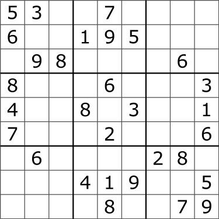

# 1. 핵심 요약

P-NP 개념에 대해 구글링하면 온갖 수학적 개념이 튀어나와 사람을 기죽이고 그런다. 명제만으로 개념을 설명하기 위한 수학자들의 변태적 성향 때문인 것 같다.

따라서 나처럼 평범한 사람도 알아들을 법한 언어로 정리하면 다음과 같다.

- **P 문제**: 다항 시간 이내의 시간 복잡도로 풀이 가능한 문제
- **NP 문제**: 다항 시간 이내의 시간 복잡도로 검증 가능한 문제
- **NP 난해**: 다항 시간 이내의 시간 복잡도로 풀이 불가능한 문제
- **NP 완전**: 다항 시간 이내의 시간 복잡도로 풀이 불가능하지만, 다항 시간의 시간복잡도로 검증 가능한 문제

**다항시간의 시간복잡도**란, <mark>주어진 데이터의 크기가 N이라고 할 때 `O(N**n)`(n은 0 이상의 정수)</mark>으로 나타낼 수 있는 시간복잡도를 의미한다.

# 2. P 문제

<mark>**다항 시간 이내의 시간 복잡도로 풀이 가능한 문제**</mark>.

`O(logN)`의 시간복잡도가 `O(N)`보다 낮기 때문에, 다항식에 `logN` 등이 곱해져도 여전히 다항식의 시간복잡도 이내에 속한다.

# 3. NP 문제

<mark>**다항 시간 이내의 시간 복잡도로 검증 가능한 문제**</mark>.

1.  **모든 P문제는 NP문제에 포함된다.**  
     다항 시간 이내에 문제를 해결할 수 있다면, 최악의 경우라도 같은 시간 내에 검증 가능하기 때문이다.  
    예를 들어 누군가 제출한 답안의 정답 여부를 확인해야한다고 가정해보자. 가장 무식한 방법은, 직접 문제를 풀어서 정답을 구한 다음, 제출된 답과 비교하는 것이다. 같은 논리로 P문제는 항상 NP문제에 포함된다.

2.  **어떤 문제들은 P문제가 아님에도 NP문제에 포함된다.**  
    <mark>[스도쿠 문제](https://www.acmicpc.net/problem/2580)가 대표적이다.</mark>  
    스도쿠는 각 칸에 1 ~ 9의 숫자가 들어갈 수 있기 때문에 N개의 빈칸이 있을 때, `O(9**N)`의 시간복잡도가 소요된다. (완전 탐색 가정)  
    하지만 누군가가 제출한 답안을 검증하는 것은 훨씬 간단하다. 9개의 열, 행, 사각형을 순차탐색하면 되기 때문이다. N과 관계 없이 `O(3*9*9)`이라는 상수 시간복잡도를 가진다.  
    

# 4. NP 난해

<mark>**다항 시간 이내의 시간 복잡도로 풀이 불가능한 문제**</mark>

위의 문장이 완벽한 정의는 아니지만, **`P == NP`가 증명되지 않은 현재 상황에선 큰 문제 없을 것** 같다. 참고로 Wikipedia에서는 아래와 같이 정의한다.

> NP-난해, NP-hard는 NP에 속하는 모든 판정 문제를 다항 시간에 다대일 환산할 수 있는 문제들의 집합이다. 다시 말하면, NP-난해는 적어도 모든 NP 문제만큼은 어려운 문제들의 집합이다. [Wikipida]

1. **NP문제 중 다항시간 내에 풀이 불가능한 문제가 포함된다.**  
   앞서 설명했던 스도쿠 문제는 NP문제이면서 `O(9**N)`의 시간복잡도를 가지기 때문에 NP난해에 속한다.

2. **NP문제가 아니면서 다항시간 내에 풀이 불가능한 문제가 포함된다.**  
   <mark>[외판원 문제](https://www.acmicpc.net/problem/2098)가 대표적이다.</mark>
   외판원 문제는 순열(permutation) 문제의 일종으로 `O(N!)`의 시간복잡도를 가진다. 검증을 위한 방법이 따로 존재하지도 않아서, 검증에도 역시 `O(N!)`의 시간이 소요된다.

## 4.1. P와 NP난해

NP-난해의 정의 자체가 NP에 종속되어 있으므로, P와 NP 관계에 따라서 P와 NP-난해의 관계도 달라진다.

> NP-난해 집합에 속하는 문제가 NP에도 속하면 NP-완전에 속한다. 즉, NP-완전은 NP와 NP-난해의 교집합이다. 만약 P-NP 문제가 P=NP로 풀린다면 P=NP=NP-완전이므로 P와 NP는 NP-난해의 부분집합이 되고, P≠NP인 경우는 P와 NP-난해는 서로소가 된다.

# 5. NP 완전

<mark>**다항 시간 이상의 시간 복잡도로 풀이 불가능하지만, 다항 시간의 시간복잡도로 검증 가능한 문제**</mark>.

간단히 말해서 NP와 NP난해의 교집합이다. 따라서 앞서 계속 예시로 나왔던 [스도쿠 문제](https://www.acmicpc.net/problem/2580)가 또 다시 여기에 포함된다.

# 6. P-NP 문제

<mark>**P-NP문제란, P문제와 NP문제가 같은지 다른지를 증명하는 것이다.**</mark>

다들 백준에서 시간초과가 났을 때, 다른 알고리즘을 써서 시간복잡도를 줄인 후에야 통과한 경험이 있을 것이다. 예를 들어, 백준의 [세 용액](https://www.acmicpc.net/problem/2473)문제는 완전탐색으로 풀면 `O(N**3)`의 시간 복잡도가 소요되는데, 투포인터를 이용하면 `O(N**2)`으로 시간 복잡도를 줄일 수 있다.

같은 맥락에서 **다항시간 내에 검증이 가능한 문제(NP 문제)라면, 더 대단한 알고리즘을 개발해서 결국 다항시간 내에 풀이(P문제)할 수 있지 않을까?** 하는 기대감이라고 할 수 있겠다.

하지만 ChatGPT피셜, **현재까지 다항 시간 이상이 소요되는 문제가 더 나은 알고리즘으로 다항 시간 이내에 풀이된 사례는 없다고 한다.** 따라서 P와 NP가 다름을 증명하는게, 그 역보다 더 가능성 있다고 생각하는데, 내가 뭘 알겠어

# 7. 참고자료

- [위키피디아: P-NP 문제](https://ko.wikipedia.org/wiki/P-NP_%EB%AC%B8%EC%A0%9C)
- [위키피디아: NP 난해](https://ko.wikipedia.org/wiki/NP-%EB%82%9C%ED%95%B4#:~:text=NP%2D%EB%82%9C%ED%95%B4%2C%20NP%2Dhard,%ED%95%98%EB%A9%B4%20NP%2D%EC%99%84%EC%A0%84%EC%97%90%20%EC%86%8D%ED%95%9C%EB%8B%A4.)
