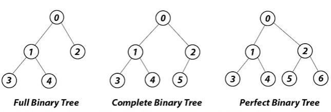
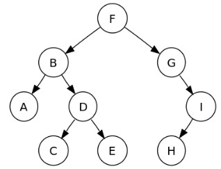

# 1. 개요

**순환 루프를 가지지 않는 연결된 유향(방향이 있는) 그래프**이다.
연결된 두 개의 노드는 부모-자식 관계로 정의되고, 부모에서 자식으로 간선의 방향성을 가진다.

이처럼 트리는 부모-자식이라는 선후관계에 따라 **계층적 자료구조(Hierarchical Data Structure)** 정의된다.

## 1.1. 특징

- 하나의 노드에 대해 여러개의 노드가 이어지는 **비선형 자료구조**이다.
- 트리구조 내에 또 다른 트리구조를 가지는 있는 **재귀적 자료구조**이다.
- 노드가 n개인 트리는 node-1개의 간선을 가진다.
- 임의의 어떤 어떤 두 정점을 잡아도 단순 경로가 단 하나 존재한다.
- 어떤 간선을 제거해도 연결 그래프가 아니게 된다.

## 1.2. 용어

- **노드 (node)**  
  트리를 구성하는 기본 원소

  - **루트 노드 (root node)**  
    부모가 없는 최상위 노드
  - **부모 노드 (parent node)**  
    루트 노드 방향으로 직접 연결된 노드
  - **자식 노드 (child node)**  
    루트 노드 반대방향으로 직접 연결된 노드
  - **형제 노드 (siblings node)**  
    같은 부모 노드를 가지는 다른 노드
  - **내부 노드 (leaf node)**  
    자식 노드가 있는 노드
  - **리프 노드 (leaf node)**  
    자식 노드가 없는 노드

- **간선(edge)**
  노드와 노드 간의 연결선
- **경로(path)**  
  두 노드 사이 노드들의 순서
- **크기(size)**  
  노드의 갯수
- **레벨, 깊이(level, depth)**  
  특정 노드와 루트 노드 사이의 간선 갯수
- **높이(height)**  
  트리의 최대 깊이
- **너비(width)**  
  특정 레벨에 있는 노드의 갯수
- **차수(degree)**  
  특정 노드의 자식 노드 갯수

# 2. Binary Tree

## 2.1 개요

자식 노드 개수(차수)를 최대 2개로 제한하는 트리



- **정 이진 트리(Full Binary Tree)**  
  모든 노드의 차수가 0 혹은 2인 이진트리. 즉, 리프 노드를 제외한 모든 노드들이 2개의 자식을 가진다.
- **완전 이진 트리(Complete Binary Tree)**  
  리프 노드의 높이 차가 최대 1이고, 오른쪽 자식 노드가 있으면 반드시 왼쪽 자식이 있는 이진트리이다. 즉, 노드를 트리의 상단 왼쪽부터 채워나간 이진트리
- **포화 이진 트리(Perfect Binary Tree)**  
  리프 노드들이 모두 같은 레벨이 있는 이진트리.

## 2.2. 순회



- 전위 순회: F, B, A, D, C, E, G, I, H
- 중위 순회: A, B, C, D, E, F, G, H, I
- 후위 순회: A, C, E, D, B, H, I, G, F
- 레벨 순회: F, B, G, A, D, I, C, E, H

### 2.2.1. 전위 순회 (preorder)

깊이 우선 탐색(depth-first-traversal)이라고도 한다.

1. 노드를 방문한다.
2. 왼쪽 서브 트리를 전위 순회한다.
3. 오른쪽 서브 트리를 전위 순회한다.

### 2.2.2. 중위 순회 (inorder)

1. 왼쪽 서브 트리를 중위 순회한다.
2. 노드를 방문한다.
3. 오른쪽 서브 트리를 중위 순회한다.

### 2.2.3. 후위 순회 (postorder)

1. 왼쪽 서브 트리를 후위 순회한다.
2. 오른쪽 서브 트리를 후위 순회한다.
3. 노드를 방문한다.

### 2.2.4. 레벨 순서 순회 (level-order)

너비 우선 탐색(breadth-first-traversal)이라고도 한다.

1. 낮은 레벨의 왼쪽부터 순회한다.

## 2.3. 구현

- **Python**

  ```python
  # 노드
  class Node:
      def __init__(self, item):
          self.item = item  # 노드의 값
          self.left = None  # 왼쪽 자식 노드
          self.right = None # 오른쪽 자식 노드

  # 이진 트리
  class BinaryTree():
      # 생성자
      def __init__(self, root = None):
          self.root = root  # 루트 노드

      # 전위 순회
      def preorder(self, node):
          if node != None:
              print(node.item, end=' ') # 노드 방문
              if node.left:
                  self.preorder(node.left) # 왼쪽 서브트리 전위 순회
              if node.right:
                  self.preorder(node.right) # 오른쪽 서브트리 전위 순회

      # 후위 순회
      def postorder(self, node):
          if node != None:
              if node.left:
                  self.postorder(node.left) # 왼쪽 서브트리 후위 순회
              if node.right:
                  self.postorder(node.right) # 오른쪽 서브트리 후위 순회
              print(node.item, end=' ') # 노드 방문

      # 중위 순회
      def inorder(self, node):
          if node != None:
              if node.left:
                  self.inorder(node.left) # 왼쪽 서브트리 중위 순회
              print(node.item, '', end='') # 노드 방문
              if node.right:
                  self.inorder(node.right) # 오른쪽 서브트리 중위 순회

      # 레벨 순회 (BFS)
      def levelorder(self, node):
          q = []
          q.append(node)
          while q:
              node = q.pop(0)
              print(node.item, '', end='')
              if node.left != None:
                  q.append(node.left)
              if node.right != None:
                  q.append(node.right)
  ```

## 2.5. 활용

- Binary Search Tree (Data Structure)

- [Heap (Data Structure)](./Heap.md)

- Huffan's Code (Greedy Algoritm)
- [백준 2263번 트리의 순회](https://www.acmicpc.net/problem/2263)  
   중위 순회 + 후위 순회 -> 전위 순회
- [백준 4256번 트리](https://www.acmicpc.net/problem/4256)  
   전위 순회 + 중위 순회 -> 후위 순회

# 3. 활용

- Tree (Greedy Algoritm)
