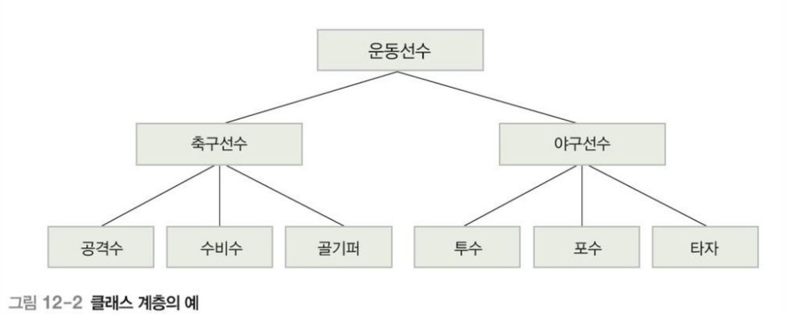
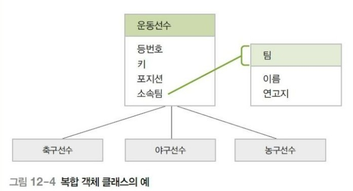
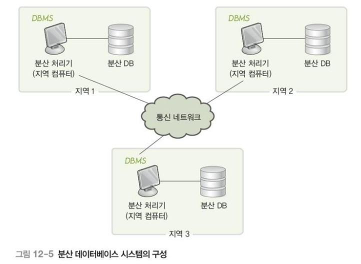
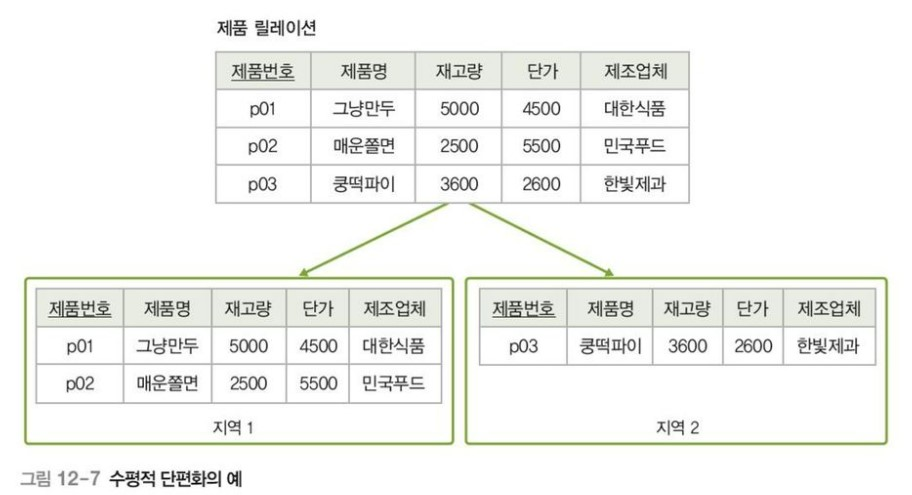
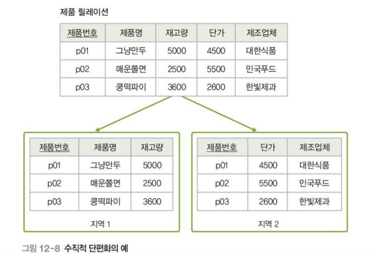
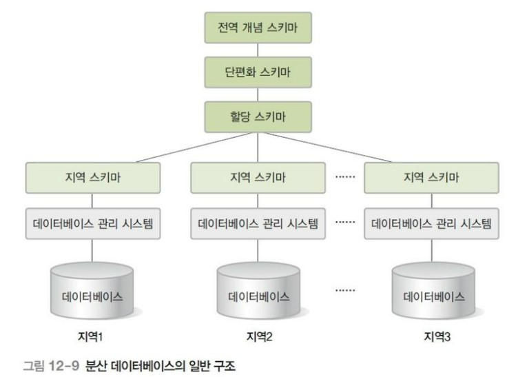

> 관계 데이터베이스 모델 이후 새로 제안된 데이터 모델들과 응용 기술들을 학습한다.

- [12.1. 객체지향 데이터베이스](#121-객체지향-데이터베이스)
  - [12.1.1. 객체지향 데이터 모델](#1211-객체지향-데이터-모델)
  - [12.1.2. 객체지향 질의 모델](#1212-객체지향-질의-모델)
- [12.2. 객체관계 데이터베이스](#122-객체관계-데이터베이스)
- [12.3. 분산 데이터베이스 시스템](#123-분산-데이터베이스-시스템)
  - [12.3.1. 분산 데이터베이스 시스템의 구성](#1231-분산-데이터베이스-시스템의-구성)
  - [12.3.2. 분산 데이터베이스 시스템의 주요 목표](#1232-분산-데이터베이스-시스템의-주요-목표)
  - [12.3.3. 분산 데이터베이스의 구조](#1233-분산-데이터베이스의-구조)
  - [12.3.4. 분산 데이터베이스의 질의 처리](#1234-분산-데이터베이스의-질의-처리)
  - [12.3.5. 분산 데이터베이스 시스템의 장단점](#1235-분산-데이터베이스-시스템의-장단점)
- [12.4. 멀티미디어 데이터베이스 시스템](#124-멀티미디어-데이터베이스-시스템)
  - [12.4.1. 멀티미디어 데이터의 특성](#1241-멀티미디어-데이터의-특성)
  - [12.4.2. 멀티미디어 데이터베이스의 발전 과정](#1242-멀티미디어-데이터베이스의-발전-과정)
  - [12.4.3. 멀티미디어 데이터베이스 관리 시스템의 구성](#1243-멀티미디어-데이터베이스-관리-시스템의-구성)
  - [12.4.4. 멀티미디어 데이터의 질의](#1244-멀티미디어-데이터의-질의)
- [12.5. 기타 데이터베이스 응용 기술](#125-기타-데이터베이스-응용-기술)
  - [12.5.1. 웹 데이터베이스](#1251-웹-데이터베이스)
  - [12.5.2. 데이터 위어하우스](#1252-데이터-위어하우스)

---

## 12.1. 객체지향 데이터베이스

일반적으로 많이 사용되는 관계 데이터베이스는 관계 데이터 모델의 구조적 특성을 만족하면서 정규화 규칙을 따르는 릴레이션으로 저장된다. 하지만 관계 데이터베이슨느 관계 데이터 모델의 기능적 제약조건과 SQL의 표현력 한계로 CAD(Computer Aided Design), CAM(Computer Aided Manufactruing), CAE(Computer Aided Engineering), CASE(Computure Aided Software Engineering) 등의 응용 분야에 부적합하다는 문제가 제기되었다.

### 12.1.1. 객체지향 데이터 모델

> 객체와 객체 식별자, 속성과 메서드, 클래스 등을 지원하는 객체지향 개념에 기반을 둔 모델이다.

- **객체와 객체 식별자**  
  객체는 현실 세계의 개체를 추상적으로 표현한 것이고, 각 객체는 시스템에서 유일하게 식별될 수 있는 객체 식별자(Object Identifier)를 가진다. 객체 간의 관계는 객체 식별자를 참조한다.
- **속성과 메서드**  
  객체의 상태를 나타내는 하나 이상의 속성과 객체의 상태를 조작할 수 있는 하나 이상의 메서드로 구성된다.  
  **객체지향 데이터 모델의 속성**은 관계 데이터 모델과 다르게 속성 값을 여러 객 가질 수 있고, 해당 클래스의 하위 클래스도 도메인으로 정의할 수 있다.  
  **객체지향 데이터 모델의 메서드**는 객체의 속성 값을 검색하거나 추가, 삭제, 수정하는 데 주로 사용된다.
- **클래스**  
  클래스는 속성과 메서드를 공유하는 유사한 성질의 객체들을 하나로 그룹화한 것이다.
- **클래스 계층과 상속**  
  클래스를 단계적으로 세분화하면 클래스 간의 계층 관계가 바랫ㅇ하여 결과적으로 클래스 계층이 하나 형성된다. 클래스 계층에서 상위에 있는 클래스를 **상위클래스**라 하고, 하위에 있는 클래스를 **하위클래스**라고 한다.  
    
  클래스 계층 개념은 상위클래스의 자신의 모든 속성과 메서드를 하위클래스에 물려주는 **상속**개념을 지원한다. 하위 클래스가 단 하나의 상위 클래스를 상속 받는 것을 **단일 상속**이라 하고, 여러 개의 상위클래스로부터 속성과 메서드를 상속받는 것을 **다중 상속**이라 한다.
- **복합 객체**  
  시스템에서 기본으로 제공하지 않는 사용자 정의 클래스를 도메인으로 하는 속성을 가진 객체를 복합 객체라고 하고, 도메인의 실제 값은 해당 클래스의 속하는 객체의 식별자를 가진다.  
  

### 12.1.2. 객체지향 질의 모델

> 객체지향 데이터베이스에서는 질의 대상이 클래스이고, 질의결과는 클래스에 속하는 개체 집합이다. 객체지향 개념을 기반으로 클래스, 속성, 메서드, 객체 등을 이용해 질의를 표현하지만, 아직까지 표준화된 질의어가 개발되지 않은 상태이다.

클래스 하나와 해당 클래스의 하위 클래스 전체를 대상으로 하는 질의를 단일 오퍼랜드 질의라 하고, 여러 클래스를 대상으로 한느 질의를 다중 오퍼랜드 질의라고 한다.

## 12.2. 객체관계 데이터베이스

> 객체지향 개념과 관계 데이터 모델의 개념을 통합한 것으로, 관계 데이터 베이스의 표준 질의어인 SQL을 이용할 수 있으며 객체, 메서드, 클래스 등의 객체 지향 특성도 함께 가지고 있다.

기존의 RDBMS에 외부 소프트웨어 도구를 추가하여 ORDBMS와 비슷한 기능을 제공하게 할 수도 있는데, 이러한 외부 소프트웨어 도구를 객체 관계 매핑 시스템이라고 부른다.

## 12.3. 분산 데이터베이스 시스템

> 물리적으로 분산된 데이터베이스 시스템을 네트워크로 연결해, 사용자가 하나의 중앙 집중식 데이터베이스 시스템처럼 사용할 수 있도록 한 것

### 12.3.1. 분산 데이터베이스 시스템의 구성

- **분산 처리기**  
  지역별로 필요한 데이터를 처리할 수 있는 데이터베이스 관리 시스템을 가진 지역 컴퓨터.
- **분산 데이터베이스**  
  물리적으로 분사된 지역 데이터베이스. 보통 해당 지역에서 가장 많이 사용하는 데이터를 저장한다.
- **통신 네트워크**  
  네트워크를 통해 분산 처리기는 데이터를 전송하고 수신하며, 결과적으로 논리적으로 하나의 시스템과 같이 동작한다.

### 12.3.2. 분산 데이터베이스 시스템의 주요 목표

분산된 데이터가 논리적으로 하나의 데이터베이스 처럼 동작(분산 데이터 독립성)하기 위해서는 분산 투명성을 보장해야한다. 분산 투명성에는 다음을 포함한다.

- **위치 투명성**  
  사용자는 접근하려는 데이터의 실제 저장위치를 알 필요 없이 데이터베이스의 논리적인 이름만으로 데이터에 접근할 수 있다. 이를 위해 데이터베이스 관리 시스템은 시스템 카탈로그에 데이터의 모든 위치 정보를 가지고 있다가 사용자의 요청을 다음 두가지 방식으로 처리한다.
  - 다른 지역에 있는 데이터를 가져와 처리한다.
  - 사용자 요청을 해당 데이터의 지역으로 보낸 후, 결과값만 받는다.
- **중복 투명성**
  데이터가 여러 지역에 중복 저장되더라도 사용자가 중복을 인식하지 못한다.

  | 구분             | 내용                                                                                                      |
  | ---------------- | --------------------------------------------------------------------------------------------------------- |
  | 데이터 중복 장점 | - 한 지역에서 문제가 발생하더라도 데이터가 유지된다. - 요청에 대해 여러 지역에서 병럴 처리할 수 있다. |
  | 데이터 중복 단점 | - 저장 공간을 많이 사용한다. - 데이터를 변경하는 과정에서 데이터 불일치가 발새할 수 있다.             |

- **위치 투명성**  
  데이터가 단편화되더라도 사용자가 단편화를 인식하지 못한다.  
  단편화란 하나의 릴레이션을 더 작은 릴레이션으로 나누어 처리하는 것을 말한다.

  - **단편화 수행 조건**  
    | 조건 | 설명 |
    | ------ | ------------------------------------------------------------------- |
    | 완전성 | 전체 릴레이션의 모든 데이터는 어느 한 조각에는 꼭 속해야 한다. |
    | 회복성 | 단편화된 조각들로부터 원래의 전체 릴레이션을 회복할 수 있어야 한다. |
    | 분리성 | 전체 릴레이션의 모든 조각을 서로 중복되지 않게 분리해야 한다. |
  - **단편화 방법**
    - 수평적 단편화  
      
    - 수직적 단편화  
      
    - 혼합 단편화  
      수평적 단편화와 수직전 단편화를 모두 사용한다.

- **병행 투명성**  
  데이터베이스와 관련된 트랜잭션들이 동시에 수행되더라도 결과는 항상 일관성을 유지한다.
- **장애 투명성**  
  지역 시스템에 문제가 발생하더라도 전체 시스템이 작업을 수행할 수 있다.

### 12.3.3. 분산 데이터베이스의 구조

- **전역 개념 스키마**  
  분산 데이터베이스에 저장할 모든 데이터 구조와 제약조건을 정의한다.
- **단편화 스키마**  
  전역 개념 스키마를 분할하는 방법을 정의하고, 전역 개념 스키마와 각 조각 스키마의 대응 관계도 정의한다.
- **할당 스키마**  
  각 조각 스키마의 인스턴스를 물리적으로 저장해야 되는 지역을 정의한다.
- **지역 스키마**  
  지역별로 저장하고 있는 데이터 구조와 제약조건을 정의한다.

### 12.3.4. 분산 데이터베이스의 질의 처리

중앙 집중식 데이터 시스템에서 최선의 질의 처리 전략은 데이터베이스가 위치한 디스크에 접근하는 횟수를 기준으로 선택된다. 반면, 분산 데이터베이스 시스템에서는 **디스크 접근 횟수** 뿐 아니라, 네트워크에서 **데이터 전송 비용**과 하나의 질의문을 여러 지역에서 **병렬 처리함으로써 얻는 성능상의 이점**도 고려한다.

### 12.3.5. 분산 데이터베이스 시스템의 장단점

- **장점**

  - **신뢰성과 가용성 증대**  
    분산 데이터베이스 시스템에서는 특정 지역에서 장애가 발생하더라도 다른 지역의 데이터베이스를 이용해 작업을 계속 수행할 수 있다.
  - **지역 자치성과 효율성 증대**  
    지역별로 데이터를 독립적으로 관리함으로써, 요청이 해당 지역의 데이터베이스에서 처리가 가능할 경우, 응답시간과 통신 비용이 절약된다.
  - **신뢰성과 가용성 증대**  
    처리할 데이터의 양이 증가할 경우, 분산 데이터베이스 시스템에서는 새로운 지역에 데이터베이스를 추가 설치하고 운영하면 된다.

- **단점**
  - **설계 및 구축 비용**  
    데이터의 분산, 단편화, 중복 등의 고려할 사항이 더 많아 설계와 구출 비용이 더 많이 든다.
  - **관리의 복잡성과 비용**  
    분산된 여러 지역을 모두 관리해야 하기 때문에 관리가 복잡하고 비용이 많이 든다. 특히 데이터 처리 과정에서 추가 통신 비용이나 처리 비용이 발생한다.

## 12.4. 멀티미디어 데이터베이스 시스템

멀티미디어 데이터베이스 시스템은 수사자나 문자 데이터와 가튼 일반 데이터를 처리하는 기능 뿐 아니라 영상, 음향 및 애니메이션과 같은 멀티미디어 데이터도 효과적으로 저장하고 처리하는 기능을 함께 제공해야 한다.

### 12.4.1. 멀티미디어 데이터의 특성

- **대용량 데이터**  
  멀티미디어 데이터는 숫자나 문자 데이터와 달리, 크기가 수 킬로바이트에서 수십 메가바이트 이상이기 때문에 압축해서 저장하고, 일반 데이터와 다른 구조로 별도의 저장 공간으르 구성하여 관리해야 한다.

- **검색 방법이 복잡한 데이터**  
  멀티미디어 데이이터는 일반 데이터와 달리 검색 방법이 복잡하다.

  - **설명 기반 검색**  
    초기에 많이 사용한 방법으로, 멀티미디어에 대한 키워드나 설명으로 데이터와 함께 저장해두었다가 이를 검색에 사용한다. 많은 양의 데이터를 처리하는데 적합하지 않고, 키워드 작성 시 사람의 주관이 반영된다.
  - **내용 기반 검색**  
    멀티 미디어 데이터의 실제 내용을 이용하여 검색한다. 멀티미디어의 내용을 추출하여 데이터베이스에 저장하고, 이 정보를 이용해 질의를 처리하는 기법이 별도로 필요하다.

- **구조가 복잡한 데이터**
  멀티 미디어 데이터는 원시 데이터(raw data), 등록 데이터(registration data), 서술 데이터(descritpion data)등으로 구성된다.  
  **원시데이터**는 텍스트, 그래픽, 이미지, 비디오, 오디오 등 기본 타입의 데이터다.  
  **등록데이터**는 멀티미디어 데이터의 특성과 필요한 정보를 별도로 추출한 데이터다. 예를 들어 해상도, 픽셀 수, 색상, 크기, 포맷 등의 정보가 있다.  
  **서술데이터**는 멀티미디어 데이터를 검색할 때 사용되는 키워드나 자세한 설명 등이 해당된다.

### 12.4.2. 멀티미디어 데이터베이스의 발전 과정

멀티미디어 데이터베이스는 크게 두 가지로 발전하였다.

- **관계 데이터베이스에서의 멀티미디어 데이터 처리**  
  관계 데이터베이스에 멀티미디어 데이터를 위한 새로운 데이터 타입(이진 대형 객체: Binary Large OBject)을 추가하여 데이터를 저장하고 처리한다.
  관계 데이터베이스의 안정적인 이론과 기법을 이용할 수 있지만, 멀티미디어 데이터를 단순히 저장하고 검색하는 기능만 제공한다.

- **객체지향 데이터베이스에서의 멀티미디어 데이터 처리**  
  객체지향 데이터베이스는 다양한 관계의 표현, 데이터 추상화와 캡슐화, 상속 등 멀티미디어 데이터를 처리하는 데 잎ㄹ요한 다양한 기능을 제공한다.  
  하지만 객체지향 데이터베이스를 통한 멀티미디어 처리도, 사용자의 복잡하고 다양한 모델링 요구사항을 완벽히 만족시키지 못한다는 한계가 있다.

### 12.4.3. 멀티미디어 데이터베이스 관리 시스템의 구성

멀티미디어 데이터베이스 시스템은 데이터베이스 시스템의 기본 기능을 제공할 뿐 아니라, 멀티미디어 데이터 특성에 따른 새로운 사항도 고려해야한다. 예를 들어, 동영상 데이터의 경우 시공간적 연속성과 같은 특성을 지원해야한다.

- **파일 시스템을 이용하는 방식**  
  초기에 많이 사용된 방식으로, 응용 프로그램에 필요현 멀티미디어 데이터를 파일로 저장하고, 프로그래밍 언어로 데이터를 처리하는 코드를 응용프로그램에 포함시킨다.  
  데이터를 응용 프로그램에서 직접 관리해야 하기 때문에 응용프로그램 개발이 어렵고, 파일의 단순한 저장 구조에 복잡한 멀티미디어 데이터를 저장하기 쉽지않다. 무엇보다 데이터 동시 공유, 회복, 보안 등의 데이터베이스 관리 시스템의 고급 기능을 제공하기 어렵다.

- **관계 데이터베이스 관리 시스템을 이용하는 방식**  
  일반 데이터는 관계 데이터베이스에 저장하고, 이미지나 비디오 같은 데이터는 파일에 저장한다. 파일에 저장된 데이터에 대한 처리 요청을 프로그래밍 언어로 작성하고, 관계 데이터베이스에 저장된 데이터에 대한 처리 요청을 SQL로 작성한다.

- **확장된 관계 데이터베이스 관리 시스템을 이용하는 방식**  
  대용량 멀티미디어 데이터를 위한 이진 대형 객체(BLOB) 데이터 타입을 추가한다. 멀티미디어 데이터에 데이터베이스 관리 시스템의 고급 기능을 제공할 수 있지만, 멀티미디어 데이터 특성을 반영한 처리 요청을 SQL로 표현하기도 쉽지 않다.

- **객체지향 관계 데이터베이스 관리 시스템을 이용하는 방식**  
  데이터 추상화와 캡슐화, 상속 등의 객체 지향 개념을 지원하므로 멀티미디어 데이터를 처리하는데 필요한 여러 가지 기능을 제공한다. 하지만 기존 데이터베이스 관리 시스템의 동시성 제어, 질의 최적화, 회복 기능 등의 고급 기능을 제공하지 못하는 경우가 많다.

### 12.4.4. 멀티미디어 데이터의 질의

멀티미디어 데이터베이스에서는 데이터 자체에 대한 질의보다는 데이터에 포함된 특정 객체, 데이터에 대한 설명이나 키워드를 이용한 질의를 주로 사용한다.

- **멀티미디어 데이터의 질의 유형**

  - **텍스트 질의**  
    사용자가 제시한 키워드를 포함하는 문서를 검색한다.
  - **이미지 질의**  
    사용자가 제시한 키워드와 관련 있는 이미지를 검색하는 내용 검색이나, 사용자가 제시한 이미지와 유사한 이미지를 검색하는 유사도 검색질의.
  - **비디오 질의**  
    특정 장면을 대상으로 하는 검색 질의
  - **공간 질의**  
    주어진 버위 조건에 맞는 특정 위치를 검색하는 질의

- **멀티미디어 데이터의 질의 처리**
  - **매칭 기법**  
    수학 함수로 저장된 데이터와 질의 조건으로 주어진 데이터 간의 유사도를 수학 함수로 계산하여, 유사도가 높은 데이터를 검색한다.
  - **랭킹 기법**  
    검색 결과를 질의 조건과의 관련 정도에 따라 정렬하여, 관련성이 높은 결과부터 제공한다.
  - **필터링 기법**  
    질의 조건과 관련성이 적은 데이터를 단계적으로 제거하여 검색 범위를 줄여가며 검색한다.
  - **틴덱스 기법**  
    인덱스 구조를 이용하 질의 조건에 적합한 데이터를 검색한다.

## 12.5. 기타 데이터베이스 응용 기술

### 12.5.1. 웹 데이터베이스

> 웹 서비스와 데이터베이스 시스템을 통합한 것.

웹 서비스와 데이터베이스 시스템을 연결해주는 미들웨어가 필요하며, 이 미들 웨어를 통해 웹 서비스는 데이터베이스 시스템의 기능을 제공받는다. 미들웨어를 통해 데이터베이스에 접근하는 프로그램을 웹 서버 쪽에 둘 수도 있고, 클라이언트 쪽에 둘 수도 있느느데, 주로 서버 확장 방법을 이용한다.

### 12.5.2. 데이터 위어하우스

> 데이터베이스 시스템에서 의사 결정에 필요한 데이터를 미리 추출하여, 원하는 형태로 변환하고 통합한 **읽기 전용**의 데이터 저장소이다. 이를 통해 의사 결정에 도움이 되는 데이터를 빠르고 정확하게 추출할 수 있다.

데이터 웨어하우스가 일반 데이터베이스와 다른 주요 특징 몇 가지는 다음과 같다.

- **주제 지향적 내용**  
  일반 데이터베이스가 업무 처리 중심의 데이터로 구성된 반면, 데이터 웨어하우스는 의사결정이 필요한 주제를 중심으로 데이터를 구성한다. 즉, 데이터 웨어하우스는 의사 결정에 필요한 주제와 관련된 데이터만 유지한다.
- **통합된 내용**  
  여러 데이터베이스에 필요한 데이터를 추출하여 의사 결정에 필요한 분석 및 비교 작업을 지원한다.
- **시간에 따라 변하는 내용**  
  일반 데이터베이스는 현재의 데이터만 유지하는 반면, 데이터 웨어하우스는 올바른 의사결정을 위해 현재와 관거 데이터를 함께 유지한다. 데이터 웨어하우스가 저장하고 있는 각 시점의 데이터를 스냅샷이라고 한다.
- **비소멸적인 내용**  
  일반 데이터베이스는 데이터의 삽입, 삭제, 수정 작업이 자주 발생하는 반면, 데이터 웨어하우스는 검색작업만 수행되는 읽기 전용의 데이터를 유지한다. 따라서 데이터 웨어하우스는 검색의 효율성을 고려하여 설계하는 경우가 많다.
