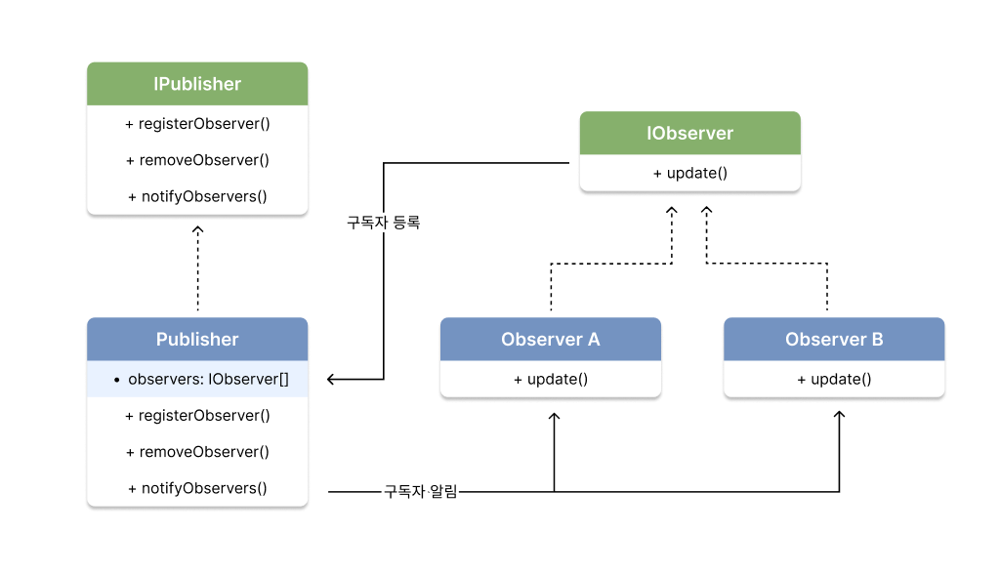
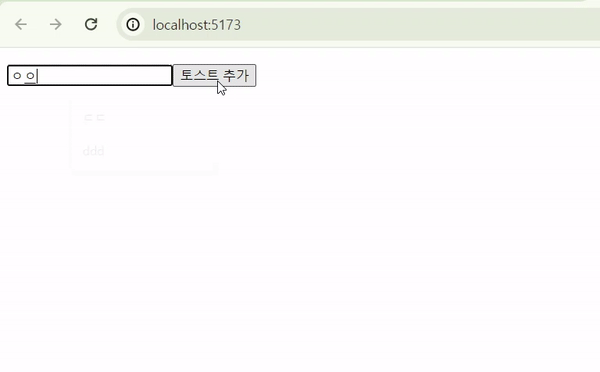
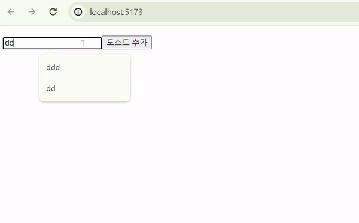

# 1. 옵저버 패턴



옵저버 패턴은 구조는 위와 같다. 아주 직관적이다. 발행자가 Observer(관측자)를 모아 관리하고, 이벤트가 발생할 때마다 Observer에게 알려준다.

알려주는 방법도 간단하다. 미리 약속된 함수 이름(`update`)를 정의하고, 실제 로직은 Observer측에서 구현한다. 발행자를 이를 단순히 실행시킨다.

# 2. 옵저버 패턴 구현 with TypeScript

## 2.1. 구독자 (Subscriber)

```js
// 인터페이스
export interface IObserver {
  update: () => void;
}

// 구현체 1
export class ObserverA implements IObserver {
  update() {
    console.log('Observer A 한테 이벤트 알림이 왔습니다.')
  }

  toString() {
    return 'Observer A'
  }
}

// 구현체 2
export class ObserverB implements IObserver {
  update() {
    console.log('ObserverB 한테 이벤트 알림이 왔습니다.')
  }

  toString() {
    return 'Observer B'
  }
}
```

## 2.2. 발행자 (Publisher)

```js
import { IObserver } from './observer'

// 인터페이스
interface IPublisher {
  registerObserver: (o: IObserver) => void
  removeObserver: (o: IObserver) => void
  notifyObservers: () => void
}

// 구현체
export class Publisher implements IPublisher {
  observers: IObserver[] = []  // 관찰자 리스트

  // 관찰자 등록
  registerObserver(o: IObserver) {
    this.observers.push(o)
    console.log(o + ' 구독 완료')
  }

  // 관찰자 제거
  removeObserver(o: IObserver) {
    for (let i = 0; i < this.observers.length; i++) {
      if (this.observers[i] === o) {
        this.observers.splice(i, 1)
        i--
      }
    }
    console.log(o + ' 구독 취소')
  }

  // 관찰자 알림
  notifyObservers() {
    this.observers.forEach((o) => {
      o.update()
    })
  }
}

```

## 2.1. 사용 예시

`PublisherManager`는 반드시 필요하지는 않다. 나는 앞서 구현한 `Publisher`에 대해 **하나의 객체를 생성 및 관리**하고 싶어 `Manager`를 생성했다.

```ts
import { IObserver } from './observer.ts'
import { Publisher } from './subject.ts'

export class PublisherManager {
  static publisher = new Publisher() // 하나의 Publisher 객체 관리

  // 새 이벤트 발생
  static addEvent(e: string) {
    console.log(`${e} 발생`)
    PublisherManager.publisher.notifyObservers()
  }

  // 구독
  static subscribe(o: IObserver) {
    PublisherManager.publisher.registerObserver(o)
  }

  // 구독 취소
  static unsubscribe(o: IObserver) {
    PublisherManager.publisher.removeObserver(o)
  }
}
```

아래와 같은 코드를 실행시키면, 예상하는 콘솔 결과를 확인할 수 있다.

```ts
import { PublisherManager } from './manager.ts'
import { ObserverA, ObserverB } from './observer.ts'

const observerA = new ObserverA()
const observerB = new ObserverB()

PublisherManager.subscribe(observerA)
PublisherManager.subscribe(observerB)
PublisherManager.addEvent('이벤트 1')

PublisherManager.unsubscribe(observerA)
PublisherManager.addEvent('이벤트 2')

PublisherManager.unsubscribe(observerB)
PublisherManager.addEvent('이벤트 3')
```

```bash
# typscript 파일을 바로 실행시키려면, ts-node를 사용해야 한다.
npx ts-node { ts 파일 }
```

```bash
Observer A 구독 완료
Observer B 구독 완료
이벤트 1 발생
Observer A 한테 이벤트 알림이 왔습니다.
ObserverB 한테 이벤트 알림이 왔습니다.
Observer A 구독 취소
이벤트 2 발생
ObserverB 한테 이벤트 알림이 왔습니다.
Observer B 구독 취소
이벤트 3 발생
```

# 3. 옵저버 패턴 활용 (React)

팀원 중 한 분이 토스트 메시지를 옵저버 패턴을 구현했다. 내가 구현하는 방식과는 전혀 달라서 처음 이해하는데 애를 먹었다. 옵저버 패턴을 적용하니까, 토스트 메시지의 비즈니스 로직이 UI와 완전히 구분할 수 있었다.

## 3.1. 함수형 React

먼저 익숙한 함수형 React 구현 방식부터 살펴보려고 한다. 함수형 React인 만큼 커스텀 훅으로 구현되었다.

### 3.1.1. Array 프로토타입 메소드 추가

시작하기 앞서 `Array.__proto__`에 메소드 하나만 추가하려고 한다. 그냥 array에서 특정 요소를 제거하는 로직인데, 이후 작성할 코드들의 간결성을 위해 **간이적으로 추가**했다.

```ts
// Array에서 element 요소를 찾아 제거하는 메소드
Array.prototype.removeElement = function <T>(this: T[], element: T): void {
  for (let i = 0; i < this.length; i++) {
    if (this[i] === element) {
      this.splice(i, 1)
      i--
    }
  }
}
```

### 3.1.2. useToast 구현

커스텀 훅은 컴포넌트(관찰자) 측에서 쓰이기 때문에, `useToast`를 Observer측의 구현체로 생각할 수 있다.

```ts
// 타입 정의
type TToast = {
  id: string
  message: string
}

const observers: (() => void)[] = [] // 관찰자 알림 함수 리스트
const toasts: TToast[] = [] // 토스트 메시지 리스트

// 토스트 메시지 추가
function addToast(message: string) {
  const newToast = {
    id: new Date().toDateString(),
    message,
  }
  toasts.push(newToast)
  notifyObservers()

  // 3초 후 자동 삭제
  setTimeout(() => {
    deleteToast(newToast)
  }, 3000)
}

// 토스트 메시지 삭제
function deleteToast(toast: TToast) {
  toasts.removeElement(toast)
  notifyObservers()
}

// 관찰자들에게 알림
function notifyObservers() {
  observers.forEach((update) => update())
}

// 커스텀 훅
export default function useToast() {
  const [_, forceUpdate] = useState({})

  useEffect(() => {
    const curUpdate = () => forceUpdate({}) // 현재 컴포넌트 강제 업데이트 함수 생성
    observers.push(curUpdate) // 구독

    return () => {
      observers.removeElement(curUpdate) // 구독 취소
    }
  }, [])

  return { toasts, addToast }
}
```

### 3.1.3. 실제 사용

아래와 같이 `useToast` 커스텀 훅을 가져와 사용할 수 있다.

```tsx
import { FormEventHandler } from 'react'
import useToast from './useToast'

function ToastContainer() {
  // 커스텀 훅
  const { toasts, addToast } = useToast()

  const handleSubmit: FormEventHandler<HTMLFormElement> = (e) => {
    e.preventDefault()
    e.stopPropagation()

    // form 태그 내에서 메시지 정보 추출
    const form = e.currentTarget
    const formData = new FormData(form)
    const message = formData.get('message') as string

    // 이벤트 발생
    addToast(message)
  }

  return (
    <div>
      <ul>
        {toasts.map((toast) => (
          <li key={toast.id}>{toast.message}</li>
        ))}
      </ul>
      <form onSubmit={handleSubmit}>
        <input name="message" />
        <button type="submit">토스트 추가</button>
      </form>
    </div>
  )
}

export default ToastContainer
```



## 3.2. 클래스형 React

클래스형 React로 구현할 경우, 옵저버 패턴이 더 명확하게 보인다.

### 3.2.1. Array 프로토타입 메소드 추가

마찬가지로 이후 작성할 코드들의 간결성을 위해 `Array.__proto__`에 메소드 하나만 추가 **간이적으로 추가**했다.

```ts
// Array에서 element 요소를 찾아 제거하는 메소드
Array.prototype.removeElement = function <T>(this: T[], element: T): void {
  for (let i = 0; i < this.length; i++) {
    if (this[i] === element) {
      this.splice(i, 1)
      i--
    }
  }
}
```

### 3.2.1. 발행자 (Publisher) 구현

이번에는 마지막에 단일 객체를 생성해서 export 하였기 때문에, [3-2절](##21-사용-예시)처럼 `Manager`클래스를 구현하지 않았다.

또한 리액트 컴포넌트 자체를 관찰자 리스트(`observers`)로 수집했다. 토스트 메시지 리스트(`toasts`)에 변화가 생기면 컴포넌트 프로토타입의 `forceUpdate` 메소드를 호출하여 강제 업데이트 했다.

```ts
import { Component } from 'react'

// 타입 정의
export type TToast = {
  id: string
  message: string
}

// 발행자 인터페이스
interface IPublisher<T> {
  registerObserver: (o: T) => void
  removeObserver: (o: T) => void
  notifyObservers: () => void
}

// 발행자 구현체
class ToastPublihser implements IPublisher<Component> {
  observers: Component[] = [] // 관찰하는 React 컴포넌트 리스트
  toasts: TToast[] = []

  // 토스트 메시지 추가
  addToast(message: string) {
    const newToast = {
      id: new Date().toDateString(),
      message,
    }
    this.toasts.push(newToast)
    this.notifyObservers()

    // 3초 후 삭제
    setTimeout(() => {
      this.deleteToast(newToast)
    }, 3000)
  }

  // 토스트 메시지 삭제
  deleteToast(toast: TToast) {
    this.toasts.removeElement(toast)
    this.notifyObservers()
  }

  // 구독자 등록
  registerObserver(component: Component) {
    this.observers.push(component)
  }

  // 구독자 제거
  removeObserver(component: Component) {
    this.observers.removeElement(component)
  }

  // 구독자들에게 알림
  notifyObservers() {
    this.observers.forEach((component) => component.forceUpdate())
  }
}

export default new ToastPublihser() // 단일 객체 export
```

### 3.2.2. 실제 사용

컴포넌트 측에서 아래와 같이 사용할 수 있다.

```tsx
import { Component, FormEvent } from 'react'
import ToastPublisher, { TToast } from './ToastPublisher'

class ToastContainer extends Component {
  state: {
    toasts: TToast[]
  }

  constructor(props: {} | Readonly<{}>) {
    super(props)
    this.state = {
      toasts: ToastPublisher.toasts,
    }
  }

  componentDidMount(): void {
    ToastPublisher.registerObserver(this) // 토스트 메시지 구독
  }

  componentWillUnmount(): void {
    ToastPublisher.removeObserver(this) // 토스트 메시지 구독 취소
  }

  handleSubmit(e: FormEvent<HTMLFormElement>) {
    e.preventDefault()
    e.stopPropagation()

    // form 태그 내에서 메시지 데이터 추출
    const form = e.currentTarget
    const formData = new FormData(form)
    const message = formData.get('message') as string

    // 토스트 메시지 추가
    ToastPublisher.addToast(message)
  }

  render() {
    return (
      <div>
        <ul>
          {this.state.toasts.map((toast) => (
            <li key={toast.id}>{toast.message}</li>
          ))}
        </ul>
        <form onSubmit={this.handleSubmit}>
          <input name="message" />
          <button type="submit">토스트 추가</button>
        </form>
      </div>
    )
  }
}

export default ToastContainer
```



# 4. 다른 토스트 메시지 구현 방식

아래는 평소 내가 사용하는 토스트 메시지 구현 방식이다. 더 직관적이지만 로직과 UI가 강하게 결합된다는 한계점이 존재한다. 그러나 토스트 메시지의 로직과 UI가 분리되는 경우는 보지 못했기 때문에, 나는 괜찮은 방식이라고 생각한다.

## 4.1. Toast 컴포넌트

먼저 Toast 메시지 컴포넌트를 생성한다. 이후 설계할 `ToastManger`에서 이 컴포넌트를 직접 `import`하여 사용할 것이다.

```tsx
import { useRef, useEffect, useMemo } from 'react'
import InfoIcon from '@/assets/svgs/lighthouse.svg'
import SuccessIcon from '@/assets/svgs/sail.svg'
import ErrorIcon from '@/assets/svgs/wreck.svg'
import './Toast.scss'

export type ToastProps = {
  type: 'success' | 'error' | 'info'
  message: string
  destroy: () => void
  duration?: number
}

const Toast = ({ type, message, destroy, duration = 3000 }: ToastProps) => {
  // type에 대응하는 아이콘 선택
  const icon = useMemo(() => {
    return {
      success: <SuccessIcon />,
      error: <ErrorIcon />,
      info: <InfoIcon />,
    }[type]
  }, [type])

  // duration 이후 자동 삭제
  useEffect(() => {
    const timer = setTimeout(() => {
      destroy()
    }, duration)

    return () => {
      clearTimeout(timer)
    }
  }, [])

  return (
    <div className={`toast ${type}`} onClick={destroy}>
      <div className="toast__message">
        {icon}
        <p aria-live="assertive">{message}</p>
      </div>
      <div className="toast__progress" ref={progressRef} />
    </div>
  )
}

export default Toast
```

## 4.2. ToastManager 클래스

```tsx
import React from 'react'
import { Root, createRoot } from 'react-dom/client'
import Toast from '@/atoms/ui/Toast'
import { ToastProps } from '@/atoms/ui/Toast/Toast'
import './toastManager.scss'

type ToastOption = ToastProps & {
  id?: number
}

class ToastManager {
  private container: Root
  private toasts: ToastOption[] = [] // 토스트 메시지 리스트

  /**
   * 토스트 메시지를 렌더링할 DOM을 지정한다.
   * 프로젝트의 다른 컴포넌트와 다른 위치에서 렌더링하기 위함이다.
   * 미리 html에 id="toast"인 요소가 존재해야 한다.
   */
  constructor() {
    this.container = createRoot(document.getElementById('toast')!)
  }

  // 토스트 메시지 추가
  addToast(
    type: 'error' | 'success' | 'info',
    message: string,
    duration: number = 3000
  ) {
    const id = Date.now()
    this.toasts.push({
      id,
      type,
      message,
      duration,
      destroy: () => this.deleteToast(id),
    })
    this.render()
  }

  // 토스트 메시지 삭제
  deleteToast(id: number) {
    this.toasts = this.toasts.filter((toast) => toast.id !== id)
    this.render()
  }

  // 토스트 메시지 렌더링
  private render(): void {
    const toastsList = this.toasts.map((toast) => (
      <Toast key={toast.id} {...toast} />
    ))
    this.container.render(toastsList)
  }
}

export default new ToastManager()
```

## 4.2. 실제 사용

컴포넌트에서는 아래와 같은 방식으로 사용할 수 있다.

```tsx
import toastManager from '@/utils/toastManager'

type GalleryFormProps = {
  onSuccess?: () => void
  onError?: () => void
}

const GalleryCreateForm = ({ onSuccess, onError }: GalleryFormProps) => {
  ...

  const handleSubmit = (e: React.FormEvent<HTMLFormElement>) => {
    e.preventDefault()
    e.stopPropagation()

    const form = e.currentTarget
    const formData = new FormData(form)

    // 유효성 검사
    const result = validateGalleryForm(formData)
    if (!result.result) {
      // 유효성 검사 통과 못할 경우, 에러 토스트 메시지 추가
      toastManager.addToast('error', result.reason)
      return
    }

    ...
  }

  return (
    <Form className="gallery-create-form" onSubmit={handleSubmit}>
      <Text label="전시회 이름" name="name" initialValue="" />
      <Textarea label="소개글" name="content" initialValue="" maxLen={150} />
      <PlacesRadio placeList={placeList} showSelected={false} />
      <Button type="submit" direction="left" ariaLabel="전시회 생성" text="전시회 개관" />
    </Form>
  )
}

export default GalleryCreateForm

```


# 참조

- [Inpa Dev : "옵저버(Observer) 패턴 - 완벽 마스터하기"](<https://inpa.tistory.com/entry/GOF-%F0%9F%92%A0-%EC%98%B5%EC%A0%80%EB%B2%84Observer-%ED%8C%A8%ED%84%B4-%EC%A0%9C%EB%8C%80%EB%A1%9C-%EB%B0%B0%EC%9B%8C%EB%B3%B4%EC%9E%90#:~:text=%EC%98%B5%EC%A0%80%EB%B2%84%20%ED%8C%A8%ED%84%B4(Observer%20Pattern)%EC%9D%80,%EB%A5%BC%20%EC%B7%A8%ED%95%98%EB%8A%94%20%ED%96%89%EB%8F%99%20%ED%8C%A8%ED%84%B4%EC%9D%B4%EB%8B%A4.>)
- [React : "createRoot"](https://react.dev/reference/react-dom/client/createRoot)
