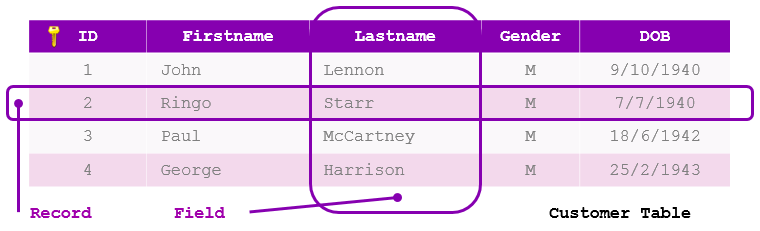
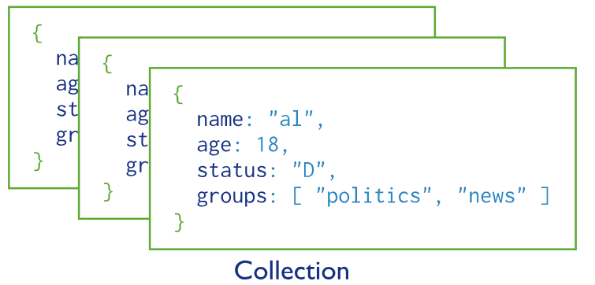
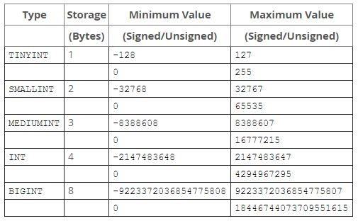
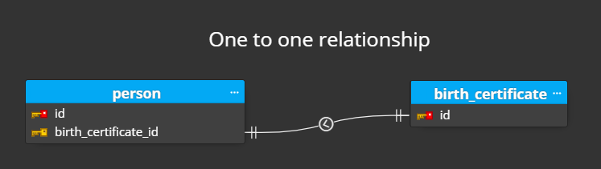
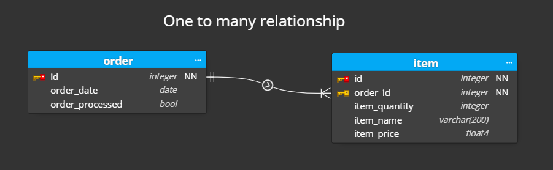

### 데이터베이스와 DBMS가 무엇인지 각각 구분해서 설명해주세요

**데이터베이스**는 일정한 규칙을 통해 체계화 된 데이터의 집합니다.

**DBMS**를 관리하는 소프트웨어 시스템입니다. DBMS마다 정의된 쿼리 언어를 통해 데이터베이스의 구조와 관계를 정의하고, 데이터를 삽입, 삭제, 수정, 조회할 수 있습니다. 그리고 그 과정에서 데이터의 무결성이 보장되도록 합니다.

## 4.1.1. 엔터티

### 엔터티란 무엇인가요?

**엔터티(Entity)는 데이터베이스에서 <mark>현실 세계의 개체나 개념을 나타내는 것</mark>을 말합니다. 또한 <mark>엔터티가 가진 특징이나 성질은 속성(Attribute)</mark>으로 정의됩니다.**

예를 들어 "헬스장 회원"이라는 엔터티가 있다고 가정하면, 회원은 이름, 주소, 전화번호, 인바디 정보 등의 속성을 가집니다.

### 약한 엔터티와 강한 엔터티에 대해 설명해주세요

약한 엔터티(Weak Entity)와 강한 엔터티(Strong Entity)는 엔터티 간의 종속성에 따라 구분되는 개념입니다. 데이터베이스에서는 필수 외래키의 존재 여부에 따라 구분할 수 있습니다.

- **강한 엔터티 (Strong Entity)**  
  강한 엔터티는 다른 엔터티와의 관계 없이 독립적으로 존재할 수 있습니다. 따라서 데이터베이스에서 개체를 고유하게 식별할 수 있도록, 자체적인 기본키(Primary Key)를 가집니다.

  예를 들어, "헬스장 회원"은 강한 엔터티입니다. 각 회원은 고유한 식별자(회원 ID)를 가지며, 다른 엔터티와의 관계 없이 독립적으로 존재할 수 있습니다.

- **약한 엔터티 (Weak Entity)**
  약한 엔터티는 다른 엔터티에 종속되며, 의존하는 엔터티와의 관계가 끊어지면 약한 엔터티는 삭제될 수 있습니다. 약한 엔터티도 보통 자체적인 기본키(Primary Key)를 가지지만, 그 보다는 다른 엔터티와의 관계를 나타내는 외래키(Foreign Key)로 식별되니다.

  예를 들어, "인바디 정보"라는 엔터티를 고려해보면, 인바디 정보는 "헬스장 회원"이라는 엔터티에 종속적입니다. 만일 헬스장 회원 정보가 사라질 경우, 종속된 인바디 정보도 삭제될 수 있습니다.

## 4.1.2. 릴레이션

### 릴레이션이란 무엇인가요?

릴레이션(Relation)은 현실세계의 엔터티(Entity)를 데이터베이스에서 표현하는 개념입니다. 릴레이션을 관계형 데이터베이스에서는 '테이블'이라고 하며, NoSQL 데이터베이스에서는 '컬렉션'이라고 합니다.

### 테이블과 컬렉션에 대해서 설명해주세요.

- **테이블**  
   테이블은 관계형 데이터베이스에서 사용되는 개념입니다. 고유한 이름을 가진 테이블은 행과 열의 구조로 데이터를 저장하고 표현합니다. 각 행은 레코드(Record) 또는 튜플(Tuple), 각 열은 속성(Attribute)이라고 부릅니다. <mark>테이블은 데이터의 구조화와 관계를 표현하기 위해 사용됩니다.</mark>

   

- **컬렉션**  
  컬렉션은 비관계형 데이터베이스(NoSQL)에서 사용되는 개념입니다. 컬렉션은 문서(Document)를 저장하는 데 사용되며, 문서는 "키-값"과 같은 데이터 구조로 구성됩니다. <mark>컬렉션은 비구조화된 데이터나 반정형 데이터를 처리하기 위해 유연한 데이터 모델을 제공합니다.</mark>

  

## 4.1.3. 속성

### 데이터베이스의 속성이란 무엇인가요?

**데이터베이스의 속성은 엔터티의 특징이나 성질에 대한 정보입니다.** 또한 속성은 데이터베이스 테이블에서 열(Column)에 해당합니다. 속성은 데이터베이스 테이블의 스키마(Schema)에 명시되어야 하며, 올바르게 정의된 속성은 데이터의 효율적인 관리에 기여합니다.

예를 들어 "헬스장 회원"이라는 엔터티가 있다고 가정하면, "헬스장 회원"의 속성은 이름, 나이, 전화번호, 인바디 정보 등이 될 수 있습니다.

## 4.1.4. 도메인

### 데이터베이스의 도메인이란 무엇인가요?

**데이터베이스의 도메인은 속성이 가질 수 있는 값의 집합을 말합니다.** 도메인은 속성의 데이터 유형, 크기, 형식, 제약 조건 등을 결정합니다. 도메인은 데이터베이스의 스키마(Schema)에서 각 속성마다 명시되어야 하며, 올바르게 정의된 도메인은 데이터의 유효성에 기여합니다.

예를 들어, "헬스장 회원" 릴레이션의 "나이" 속성을 고려해보면, 해당 속성의 도메인은 0 이상의 정수로 정의될 수 있습니다.

## 4.1.5. 필드와 레코드

### 데이터베이스의 필드와 레코드에 대해 설명해주세요

데이터베이스에서 필드(Field)와 레코드(Record)는 데이터를 구성하는 기본 단위입니다.

- **필드 (Field)**
  필드는 엔터티의 속성과 대응됩니다. 또한 테이블에서는 열(Column)로 해당합니다. 예를 들어 "헬스장 회원" 테이블의 "이름", "나이", "주소" 등의 필드를 가집니다.

- **레코드 (Record)**
  레코드는 특정 엔터티 객체에 대응됩니다. 또한 테이블에서는 행(Row)로 해당합니다. 예를 들어 "헬스장 회원" 테이블의 각 레코드는 개별 회원에 대한 정보를 담고 있습니다.

### MySQL 기준으로 필드 타입에 대해 설명해주세요

각 필드마다 특정한 타입을 가지고 있습니다. 필드 타입은 필드의 값을 제한하는 도메인의 역할을 합니다.

대표적인 DBMS인 MySQL에서는 다음과 같은 필드 타입을 제공합니다.

- **숫자 타입**

   

- **날짜 타입**

  - **DATE**

    - 용량: 3 bytes
    - 값의 범위: '1000-01-01' ~ '9999-12-31'
    - 저장되는 형식: 'YYYY-MM-DD'

  - **DATETIME**

    - 용량: 8 bytes
    - 값의 범위: '1000-01-01 00:00:00' ~ '9999-12-31 23:59:59'
    - 저장되는 형식: 'YYYY-MM-DD HH:MM:SS'

  - **TIMESTAMP**

    - 용량: 4 bytes
    - 값의 범위: '1970-01-01 00:00:01 UTC' ~ '2038-01-19 03:14:07 UTC'
    - 저장되는 형식: 'YYYY-MM-DD HH:MM:SS'

<!-- 네, 정확하게 말씀드리자면, TIMESTAMP는 내부적으로 초 단위로 저장되며, 일반적으로 1970년 1월 1일 00:00:00부터 경과한 초를 나타내는 정수 값으로 저장됩니다. 이를 Epoch time 또는 Unix timestamp라고도 합니다.

그러나 MySQL 5.6.4 버전부터 TIMESTAMP 필드의 정밀도가 개선되어 밀리초(millisecond)까지 저장할 수 있게 되었습니다. 이전에는 초 단위로 저장되었지만, 현재는 5.6.4 이상의 버전에서는 TIMESTAMP 필드가 1970년 1월 1일 00:00:00부터 경과한 밀리초를 나타내는 정수 값으로 저장될 수 있습니다.

MySQL 5.6.4 이전 버전에서는 TIMESTAMP 필드의 정밀도가 초 단위로 제한되었으므로, 밀리초 값을 직접 저장할 수 없었습니다. 그러나 이후 버전에서는 TIMESTAMP 필드를 사용하여 밀리초까지의 정밀한 시간 정보를 저장할 수 있게 되었습니다.

따라서, TIMESTAMP 필드가 정밀도를 가지고 있어 밀리초까지 저장되는 경우가 있을 수 있습니다. 하지만 MySQL의 이전 버전이나 설정에 따라 정밀도가 다를 수 있으므로, 사용하는 MySQL 버전과 설정을 고려하여 TIMESTAMP 필드의 정밀도를 확인해야 합니다. -->

- **문자 타입**

  - **CHAR**

    - CHAR는 고정 길이 문자열을 저장하는 데 사용됩니다.
    - 예를 들어 CHAR(10)필드에 입력된 [문자열이 10자](https://dev.mysql.com/doc/refman/8.0/en/char.html)보다 짧을 경우, 나머지는공백 문자로 채워져 저장됩니다.
    - 공간의 낭비가 발생할 수 있지만, 검색이 좀 더 빠릅니다.

  - **VARCHAR**

    - VARCHAR은 가변 길이 문자열을 저장하는 데 사용됩니다.
    - 예를 들어 VARCHAR(10)필드에 입력된 문자열이 5자일 경우, 5글자에 해당하는 바이트 + 길이 기록용 1바이트가 저장됩니다.
    - 공간을 효율적으로 사용할 수 있지만, CHAR보다 약간의 오버헤드가 발생합니다.

  - **TEXT**

    - TEXT는 가변 길이의 대량 텍스트 데이터를 저장하는 데 사용됩니다.
    - CHAR나 VARCHAR와 달리 길이 제한이 없습니다.

- **BLOB**

  - BLOB은 이미지나 동영상과 같은 대용량 이진 데이터 타입입니다.
  - 그러나 보통 아마존의 호스팅 서비스인 S3에 실제 데이터를 올리고, 파일 경로에 대한 정보를 VARCHAR로 저장합니다.

- **ENUM**

  - ENUM은 열(Column)에 가능한 값 목록을 정의하는 데 사용되는 데이터 타입입니다.
  - 미리 선언된 목록 중에서 하나만 선택할 수 있습니다.
  - 각 데이터가 인덱스에 따라 매핑되기 때문에 메모리를 효율적으로 사용할 수 있습니다.
  - `ENUM('Active', 'Inactive', 'Pending')`

- **SET**

  - SET은 역시 값들의 컬렉션을 나타내는 데이터 타입입니다.
  - 미리 선언된 목록 중에서 여러개를 선택할 수 있습니다.
  - SET은 비트값으로 저장되어 메모리를 효율적으로 사용할 수 있습니다. 비트가 1이면 해당 요소가 선택된 상태입니다.
  - `SET('Sports', 'Music', 'Art', 'Travel')`

## 4.1.6. 관계

### 데이터베이스의 관계에 대해 설명해주세요

데이터베이스의 관계는 데이터베이스 시스템에서 테이블 간의 관계를 나타내는 개념입니다.

데이터베이스 관계는 크게 3 가지로 구분할 수 있습니다.

- **일대일 관계 (One-to-One Relationship)**  
  일대일 관계는 한 테이블의 레코드가 다른 테이블의 레코드와 하나씩 매칭되는 관계를 나타냅니다.  
  예를 들어 한 사람은 단 하나의 출생증명서를 가질 수 있기 때문에, 사람과 출생증명서가 일대일 관계에 해당합니다.

  

- **일대다 관계 (One-to-Many Relationship)**  
  일대다 관계는 한 테이블의 레코드가 다른 테이블의 레코드 여러 개와 연결되는 관계를 나타냅니다.  
  예를 들어 하나의 상품 주문에는 여러 개의 상품주문이 들어 있을 수 있기 때문에, 상품 주문과 상품의 관계가 일대다 관계에 해당합니다.

  

- **다대다 관계 (Many-to-Many Relationship)**  
  다대다 관계는 한 테이블의 레코드가 다른 테이블의 레코드 여러 개와 서로 연결되는 관계를 나타냅니다.  
  예를 들어 하나의 학생은 여러 개의 강의를 수강할 수 있고, 하나의 강의는 여러 개의 학생을 가질 수 있기 때문에, 학생과 강의의 관계가 다대다 관계에 해당합니다.  
  <mark>보통 다대다 관계를 표현하기 위해서 중개 테이블(intermediate table)을 추가합니다.</mark>

  

## 4.1.7. 키

### 데이터베이스의 키란 무엇인가요?

**데이터베이스에서 키(Key)는 특정 테이블에서 각 레코드를 고유하게 식별하거나 정렬하기 위해 사용되는 필드(또는 필드의 집합)입니다.** 또한 키를 통해, 데이터베이스 내에서 레코드 간의 관계를 설정할 수 있습니다.

### 데이터베이스의 키를 종류 별로 설명해주세요

- **기본 키 (Primary Key)**
  **기본 키는 테이블에서 각 레코드를 고유하게 식별하며, <mark>유일성과 최소성</mark>을 만족합니다.** 따라서 기본 키는 NULL 값을 가질 수 없으며, 자연 키와 인조 키 중 선택해야합니다.

  - **자연 키 (Natural Key)**  
    자연 키는 테이블의 실제 데이터에서 파생된 키로, 자연스러운 식별자입니다. 예를 들어, 사람의 주민등록번호가 자연 키에 해당합니다.

  - **인조 키 (Surrogate Key)**  
    인조 키는 데이터베이스에서 목적에 따라 인위적으로 생성되는 키입니다. 예를 들어, MYSQL의 `auto increment`나 UUID가 해당합니다.

- **외래 키 (Foreign Key)**  
  외래 키는 한 테이블의 기본 키를 다른 테이블에서 참조하는 키입니다. 외래 키를 통해 테이블 레코드 간의 관계를 정의할 수 있습니다. 외래 키는 값이 중복되어도 상관없습니다.

- **후보 키 (Candidate Key)**  
  후보 키는 테이블에서 기본 키가 될 수 있는 잠재적인 키입니다. 기본 키와 마찬가지로 유일성과 최소성을 동시에 만족해야 하며, NULL값을 가질 수 없습니다.

- **대체 키 (Alternate Key)**
  대체 키는 후보 키 중에서 선택되지 않은 나머지 후보 키들입니다. 즉 테이블에서 하나의 후보 키가 기본 키로 선택되면, 나머지 후보 키는 대체 키가 됩니다.

- **슈퍼 키 (Super Key)**
  슈퍼 키는 테이블에서 유일한 값을 식별할 수 있는 <mark>키의 집합</mark>입니다. 즉, 하나 이상의 속성으로 구성된 키 집합을 의미합니다. 슈퍼 키 또한 테이블의 레코드를 고유하게 식별하는 데 사용될 수 있습니다. 하지만 최소성을 만족시키지 못하기 때문에 후보 키가 아닙니다.

<!-- ### 테이블의 pk를 자연 키, UUID, auto increment 중 무엇으로 설정할 지 근거와 함께 이유를 말해주세요 -->
