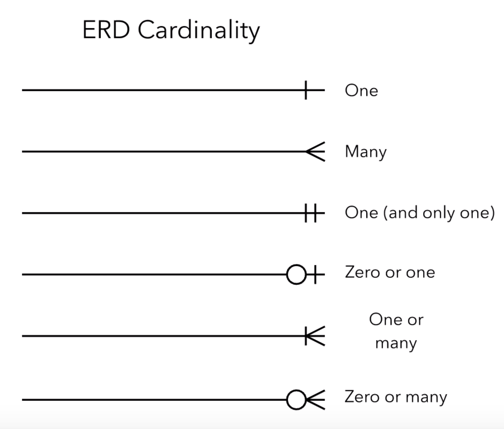
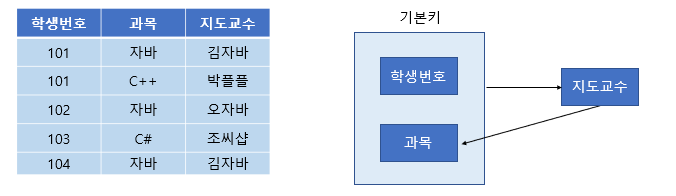

## 4.2.1. ERD의 중요성

### ERD란 무엇인가요?

ERD는 Entity-Relationship Diagram의 약자입니다. 즉 이름처럼 **ERD는 다양한 속성을 가진 엔터티를 생성하고, 이들 간의 관계를 시각적으로 나타내는 다이어그램입니다.**

ERD는 관계형 데이터베이스의 구조를 이해하고 표현하는데 유용하게 쓰입니다. 하지만 비정형 데이터를 표현하기에는 적합하지 않다는 한계가 있습니다.

## 4.2.2. 예제로 배우는 ERD

### ERD 기호의 의미를 그림과 함께 설명해주세요

ERD 엔티티에 대한 기호별 의미는 다음과 같습니다.

ERD 관계에 대한 기호별 의미는 다음과 같습니다.

## 4.2.3. 정규화 과정

### 정규화란 무엇인가요?

**정규화(Normalization)은 데이터의 중복성을 최소화하고 데이터의 일관성과 무결성을 유지하기 위해 데이터베이스를 구조화하는 작업입니다.** 정규화는 관계형 데이터베이스에서 주로 적용되며, 데이터를 여러 개의 독립된 테이블로 분할하고, 테이블 간의 관계를 설정함으로써 데이터 중복과 이상 현상을 줄이는 것을 목표로 합니다.

### 1 ~ 3 정규형에 대해 설명해주세요

- **제 1 정규형**
  **테이블의 각 속성이 원자값(Atomic Value)으로 구성되어야 합니다.**

  예를 들어, '학생' 테이블에서 '전공' 필드에 여러 전공이 들어있을 경우, 이는 제 1정규형을 만족하지 않습니다. 레코드를 분리하여 속성에는 단일값이 들어가도록 합니다.

  | 학번  | 이름  | 전공                          |
  | ----- | ----- | ----------------------------- |
  | 10001 | John  | Computer Science, Mathematics |
  | 10002 | Sarah | English Literature            |
  | 10003 | Alex  | Biology, Chemistry            |

  | 학번  | 이름  | 전공               |
  | ----- | ----- | ------------------ |
  | 10001 | John  | Computer Science   |
  | 10001 | John  | Mathematics        |
  | 10002 | Sarah | English Literature |
  | 10003 | Alex  | Biology            |
  | 10003 | Alex  | Chemistry          |

- **제 2 정규형**  
   **제 1 정규형을 만족하면서, 테이블의 기본키가 아닌 속성이 기본 키에 완전히 종속되어야 합니다.** 다시 말해, 기본키만을 가지고 다른 모든 속성의 값을 결정할 수 있어야 합니다.

  예를 들어, 아래 '주문'테이블에서 '상품 번호','상품 이름'과 '상품 가격'은 주문번호로 유일하게 결정되지 않습니다.

  | 주문 번호 | 상품 번호 | 상품 이름 | 상품 가격 |
  | --------- | --------- | --------- | --------- |
  | 1001      | 1         | Laptop    | 1500      |
  | 1001      | 2         | Printer   | 200       |
  | 1002      | 1         | Laptop    | 1500      |
  | 1002      | 3         | Mouse     | 20        |

  다음과 같이 테이블을 분리함으로써, 각 속성이 기본키에 완전 종속하도록 만들 수 있습니다.

  | 주문 번호 |
  | --------- |
  | 1001      |
  | 1002      |

  | 상품 번호 | 상품 이름 | 상품 가격 |
  | --------- | --------- | --------- |
  | 1         | Laptop    | 1500      |
  | 2         | Printer   | 200       |
  | 3         | Mouse     | 20        |

  | 주문 번호 | 상품 번호 |
  | --------- | --------- |
  | 1001      | 1         |
  | 1001      | 2         |
  | 1002      | 1         |
  | 1002      | 3         |

- **제 3 정규형**  
   **제 2 정규형을 만족하면서, 테이블 내의 모든 이행적 함수 종속성을 제거해야 합니다.** A → B, B → C인 경우, A → C가 성립하여 A가 C에 이행적으로 함수 종속 되어 있다고 말합니다.

  아래 태이블에서 '관리자 이름 -> 관리자 번호', '관리자 번호 -> 부서 번호', '관리자 이름 -> 부서 번호'라는 이행적 종속 관계를 확인할 수 있습니다.

  | 부서 번호 | 부서 이름 | 관리자 번호 | 관리자 이름 |
  | --------- | --------- | ----------- | ----------- |
  | 1         | Sales     | 10001       | John        |
  | 2         | Marketing | 10002       | Sarah       |
  | 3         | IT        | 10003       | Alex        |

  따라서 다음과 같이 테이블을 분리해 이행적 종속관계를 없앨 수 있습니다.

  | 부서 번호 | 부서 이름 | 관리자 번호 |
  | --------- | --------- | ----------- |
  | 1         | Sales     | 10001       |
  | 2         | Marketing | 10002       |
  | 3         | IT        | 10003       |

  | 직원 번호 | 직원 이름 |
  | --------- | --------- |
  | 10001     | John      |
  | 10002     | Sarah     |
  | 10003     | Alex      |

### 보이스/코드 정규형에 대해 설명해주세요

**보이스-코드 정규형(BCNF)은 제 3 정규형을 만족하면서, 모든 결정자가 테이블의 후보키여야 합니다.** 결정자란 다른 속성의 값을 결정할 수 있는 속성입니다.

아래 테이블에서 하나의 과목을 여러 교수가 맡을 수 있는 한편, 교수는 하나의 과목만을 담당한다고 가정해봅시다.

그러면 '지도교수' 속성은 '과목' 속성을 결정 짓는 결정자입니다. 하지만 '지도교수' 칼럼이 해당 테이블의 레코드를 유일하게 식별할 수 있는 후보키는 되지 못합니다.

따라서 아래와 같이 테이블을 분리하여 보이스/코드 정규형을 만족시킬 수 있습니다.

- **삽입 이상**  
  새로운 교수가 특정 과목을 담당한다는 새로운 정보를 추가하기 위해서는, 적어도 한 명 이상의 수강 학생이 필요하다.

- **삭제 이상**  
  학번 101이 C++ 과목을 취소하면, 박플플이 C++ 과목을 담당한다는 정보도 삭제된다.

- **갱신 이상**  
   박플플이 담당하는 과목이 변경되면, 박플플이 담당하는 모든 레코드를 바꿔줘야 한다.

### 반정규화가 무엇인지 설명해주세요

**반정규화란 정규화 원칙을 의도적으로 따르지 않는 것을 말합니다.**

정규화는 데이터를 효율적이고 일관된 상태로 유지하기 위해, 데이터의 중복성을 제거하고 테이블을 작은 단위로 분할하는 과정을 말합니다. 따라서 반정규화는 이와 반대로 데이터의 중복을 허락하거나, 테이블을 분할하지 않을 수 있습니다.

반정규화를 적용하면, <mark>데이터를 조회할 때 여러 테이블 간의 조인 연산 횟수를 줄여 조회 시간을 줄일 수 있습니다.</mark> 또한 <mark>테이블 간의 관계가 단순해져 데이터베이스를 더 이해하기 쉬워질 수 있습니다.</mark>

하지만 반정규화는 성능 향상을 위해 데이터베이스 설계를 트레이드오프하는 것이므로 주의가 필요합니다. 데이터의 중복성이 증가하고 데이터 불일치 문제가 발생할 수 있으며, 데이터 변경 시 일관성을 유지하기 위한 추가적인 관리 작업이 필요할 수 있습니다.
