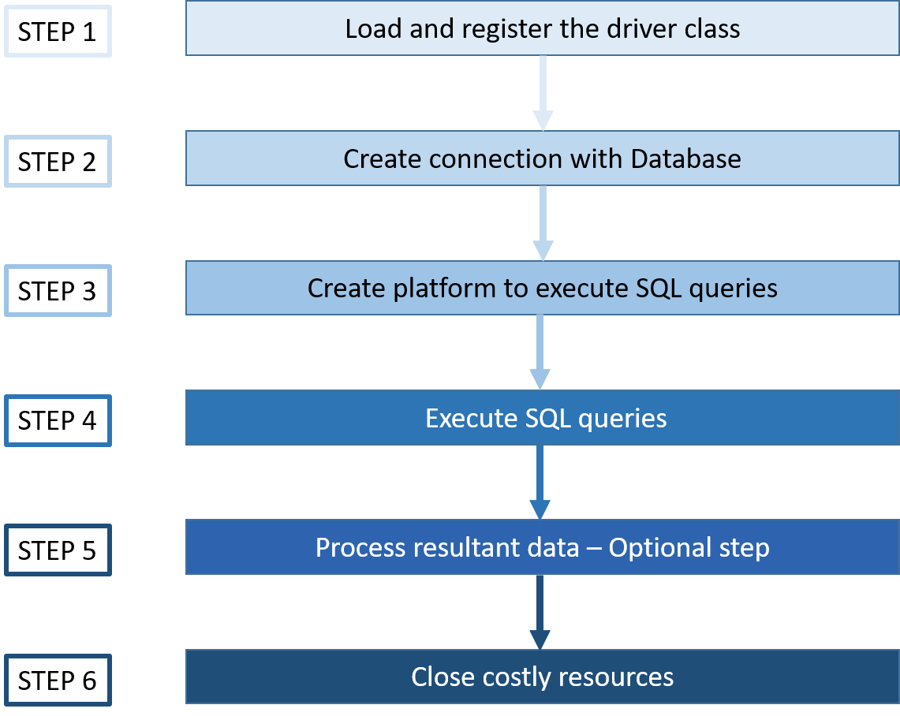

## 4.3.1. 트랜잭션

### 트랜잭션이란 무엇인가요?

**트랜잭션은 데이터베이스에서 수행되는 하나의 논리적인 작업 단위를 말합니다.** 데이터베이스에 접근하는 방법은 쿼리이므로, 여러 개의 쿼리들이 하나로 묶여 트랜잭션을 만듭니다. 트랜잭션은 원자성, 일관성, 격리성, 지속성을 만족시켜야 합니다.

이를 줄여서 'ACID'라고도 말합니다. Atomicity(원자성), Consistency(일관성), Isolation(격리성), Durability(지속성)

### 트랜잭션의 원자성이란 무엇인가요?

**트랜잭션 내의 모든 연산이 원자적 단위로 간주됨을 의미합니다.** 다시 말해, 하나의 트랜잭션 내 모든 작업이 전부 성공하거나 전혀 수행되지 않는다는 원칙을 말합니다.

이러한 원자성을 보장하기 위해 커밋과 롤백이라는 개념을 사용합니다.

### 커밋과 롤백이 무엇이지 설명해주세요

커밋과 롤백은 트랜잭션의 결과를 제어하여 트랜잭션의 원자성을 보장하는 개념입니다.

- **커밋 (Commit)**  
  **커밋은 트랜잭션의 작업을 <mark>영구적으로 반영</mark>하는 작업을 말합니다.**  
  트랜잭션의 모든 연산이 성공적으로 수행되었을 때 커밋이 일어나며, 변경사항에 대해서 다른 트랜잭션에서도 접근할 수 있습니다.
- **롤백 (Rollback)**  
  **롤백은 트랜잭션의 작업을 <mark>이전 상태로 복원</mark>하는 작업을 말합니다.**  
  트랜잭션 내에서 오류가 발생하거나, 명시적인 롤백 명령에 의해 롤백 작업이 수행됩니다.

### DB 커넥션과 DB 커넥션 풀에 대해 설명해주세요

DB 커넥션은 애플리케이션과 데이터베이스 간의 연결을 말합니다. 어플리케이션이 데이터베이스에 접근하기 위해서는 먼저 데이터베이스와의 연결을 설정하고, DB 커넥션 객체를 얻어야 합니다.

<mark>애플리케이션은 데이터베이스 서버의 주소(IP 주소 또는 호스트명)와 포트 번호를 사용하여 TCP 프로토콜 기반의 DB 커넥션을 생성합니다.</mark> 성공적으로 연결이 이뤄지면, 다양한 DB API를 가진 객체를 얻을 수 있고, 애플리케이션은 이 DB 커넥션을 통해 데이터베이스 서버와 통신합니다.

Java의 경우, Jvas 언어로 다양한 DBMS와 동일한 방식으로 소통하기 위해 JDBC라는 Java 표준 SQl 인터페이스 API를 제공하고 있습니다. 따라서 적절한 드라이버를 로드하기만 하면, DBMS 종류에 상관없이 동일한 방식으로 데이터베이스에 접근할 수 있습니다.



하나의 트랜잭션마다 하나의 DB 커넥션 객체를 사용합니다. 그런데 DB 커넥션을 생성하는 과정은 비용이 많이 드는 작업이기 때문에, 매 트랜잭션마다 DB 커넥션을 생성하면 오버헤드가 발생하기 쉽습니다.

따라서 DB 커넥션 풀(DBCP)라는 개념을 사용합니다. DB 커넥션 풀은 <mark>일정량의 DB 커넥션 객체를 미리 만들어 풀에 저장했다가, 실행되는 트랜잭션마다 커넥션 객체를 할당하고, 트랜잭션이 종료되면 다시 커넥션 객체를 풀에 반납</mark>하는 프로그래밍 기법입니다. 이미 모두 커넥션 객체가 사용 중일 경우, 트랜잭션은 큐에 대기합니다.

SpringBoot에서는 2.0 이전까지는 Tomcat JDBC를 사용하다, 현재 2.0 이후 부터는 [성능 상으로 더 뛰어난 HikariCP](https://velog.io/@miot2j/Spring-DB%EC%BB%A4%EB%84%A5%EC%85%98%ED%92%80%EA%B3%BC-Hikari-CP-%EC%95%8C%EC%95%84%EB%B3%B4%EA%B8%B0)를 기본옵션으로 사용하고 있습니다. 관련된 설정은 applcation.yml에서 설정할 수 있습니다.

```yml
spring:
  datasource:
    url: jdbc:mysql://localhost:3306/world?serverTimeZone=UTC&CharacterEncoding=UTF-8
    username: root
    password: your_password
    hikari:
      maximum-pool-size: 10
      connection-timeout: 5000
      connection-init-sql: SELECT 1
      validation-timeout: 2000
      minimum-idle: 10
      idle-timeout: 600000
      max-lifetime: 1800000

server:
  port: 8000
```

[느리더라도 꾸준하게: [데이터베이스] Connection Pool이란?](https://steady-coding.tistory.com/564)
[hudi.blog: 데이터베이스 커넥션 풀 (Connection Pool)과 HikariCP](https://hudi.blog/dbcp-and-hikaricp/#:~:text=%EB%8D%B0%EC%9D%B4%ED%84%B0%EB%B2%A0%EC%9D%B4%EC%8A%A4%20%EC%BB%A4%EB%84%A5%EC%85%98%20%ED%92%80%EC%9D%84%20%EC%82%AC%EC%9A%A9,%EC%9D%98%20%EC%BB%A4%EB%84%A5%EC%85%98%EB%93%A4%EC%9D%B4%20%EC%A1%B4%EC%9E%AC%ED%95%9C%EB%8B%A4.)

### 트랜잭션 전파에 대해 설명해주세요

**트랜잭션 전파는, 진행중인 트랜잭션이 내부적으로 다른 트랜잭션(메소드)를 호출 할 때, 호출된 트랜잭션의 DB 커넥션 객체를 어떻게 관리할 지에 대한 메커니즘입니다.**

트랜잭션 전파는 다양한 옵션을 가지고 있으며, 옵션에 따라 새로운 트랜잭션에 대해 DB 커넥션을 추가 할당할지가 결정됩니다. 또한 옵션마다 트랜잭션 실패 시의 롤백이 다르게 동작합니다.

- **REQUIRED**  
  이미 실행 중인 트랜잭션이 있으면 해당 트랜잭션에 참여하고, 그렇지 않으면 새로운 트랜잭션을 시작합니다. REQUIRED 전파는 가장 일반적으로 사용되는 옵션입니다.  
  중간에 롤백이 발생한다면, 하나의 트랜잭션이기 때문에 모두 롤백됩니다.

- **REQUIRES_NEW**  
  항상 새로운 트랜잭션을 시작합니다. 이미 실행 중인 트랜잭션이 있으면 일시 중지하고, 호출하는 메서드의 트랜잭션을 완료한 뒤에, 이전 트랜잭션을 계속 진행합니다.  
  각각의 트랜잭션이 서로 영향 없이 롤백됩니다.

- **SUPPORTS**  
  호출하는 메서드가 이미 실행 중인 트랜잭션이 있으면 해당 트랜잭션에 참여하고, 그렇지 않으면 트랜잭션 없이 실행됩니다.  
  SUPPORTS 전파는 트랜잭션이 필수는 아니지만, 존재할 경우에는 참여하고 그렇지 않으면 비트랜잭션으로 실행됩니다.

- **MANDATORY**  
  호출하는 메서드가 이미 실행 중인 트랜잭션이 있으면 해당 트랜잭션에 참여하고, 그렇지 않으면 예외를 발생시킵니다.  
  MANDATORY 전파는 반드시 실행 중인 트랜잭션이 존재해야만 메서드를 실행할 수 있도록 강제합니다.

- **NOT_SUPPORTED**  
  호출하는 메서드는 트랜잭션 없이 실행됩니다. 이미 실행 중인 트랜잭션이 있으면 일시 중지하고, 호출하는 메서드가 트랜잭션 없이 실행됩니다.

- **NEVER**  
  호출하는 메서드는 트랜잭션 없이 실행되어야 하며, 이미 실행 중인 트랜잭션이 있을 경우에는 예외를 발생시킵니다.

### 트랜잭션의 일관성이란 무엇인가요?

**트랜잭션의 일관성(Consistency)란, 트랜잭션이 실행되는 동안 데이터베이스가 항상 유효한 상태를 유지해야 함을 말합니다.**

각 필드의 도메인, 케이스케이드 조건, 개체 무결성 등. 데이터베이스의 모든 유효성을 만족하는 방식으로만 데이터베이스가 수정되어야 합니다.

### 트랜잭션의 격리성이란 무엇인가요?

**트랜잭션의 격리성(Isolation)은 동시에 실행 중인 여러 개의 트랜잭션이 서로에게 영향을 미치지 않고 독립적으로 실행되어야 함을 말합니다.**

격리성은 동시성 제어의 한 측면으로, 복숫의 병렬 트랜잭션이 마치 순차적으로 시랭되는 것처럼 작동해야 하지만, 실제로 순차처리할 시 트랜잭션 성능이 떨어지기 때문에, 여러 개의 격리 수준 중 적절한 수준을 선택해야 합니다.

### 트랜잭션의 격리수준의 종류와 그에 따라 발생하는 현상을 설명해주세요

먼저 트랜잭션 격리 수준에 따라 발생할 수 있는 이상현상을 설명하면 다음과 같습니다.

- **더티 리드(Dirty Read)**  
  하나의 트랜잭션이 아직 커밋되지 않은 다른 트랜잭션의 변경 사항을 읽는 현상을 말합니다.

- **반복 가능하지 않은 조회(Non-Repeatable Read)**  
  하나의 트랜잭션이 데이터베이스의 특정 레코드를 반복 조회할 때, 다른 결과를 얻는 현상을 말합니다.

- **팬텀 리드(Phantom Read)**  
  하나의 트랜잭션이 데이터베이스의 특정 테이블을 반복 조회할 때, 다른 결과를 얻는 현상을 말합니다.

다음으로 트랜잭션의 격리수준의 종류와 그에 다라 발생할 수 있는 이상현상은 다음과 같습니다.

- **SERIALIZABLE**  
  가장 높은 격리 수준이며 트랜잭션들이 순차적으로 실행되는 것처럼 처리됩니다.  
  모든 이상현상이 방지되지만, 교착상태가 일어날 가능성이 높고, 성능이 떨어집니다.

- **REPEATABLE READ**  
  트랜잭션이 읽은 데이터를 스냅샷하여 언두 로그(Undo log)에 유지합니다. 자기보다 뒤늦게 시작된 트랜잭션은 무시하고 로그 값을 참조하기 때문에, 같은 레코드를 반복해서 읽더라도 같은 결과를 얻을 수 있습니다.

  이는 특정 레코드가 아닌 범위에 대해서도 마찬가지입니다.

  다만 범위 <mark>`SELECT … FOR UPDATE`와 같은 배타적 잠금과 함께 데이터를 읽는 경우,</mark> 스냅샷을 생성하는 대신 락 기능을 사용해 레코드를 배타 점유합니다. 그런데 이 때 <mark>DBMS가 갭락이나 넥스트키락과 같은 range lock을 제공하지 않는 경우, 팬텀리드가 발생할 수 있습니다.</mark>

  **MySQL의 InnoDB엔진은 기본적으로 REPEATABLE READ 수준을 사용하지만, range lock을 제공하기 때문에 팬텀리드가 발생할 경우는 적습니다.**

- **READ COMMITTED**  
  커밋된 데이터만 다른 트랜잭션이 읽을 수 있습니다.  
  반복 가능하지 않은 조회가 발생할 수 있습니다.

- **READ UNCOMMITTED**
  커밋되지 않은 데이터도 다른 트랜잭션이 읽을 수 있습니다.  
  더티 리드가 발생할 수 있으며, 가장 낮은 격리 수준입니다. 하지만 가장 빠른 성능을 가지고 있기 때문에 거대한 양의 어림잡아 집계할 때 사용됩니다.

[망나니 개발자: [MySQL] 트랜잭션의 격리 수준(Isolation Level)에 대해 쉽고 완벽하게 이해하기](<https://mangkyu.tistory.com/299#:~:text=%ED%8A%B8%EB%9E%9C%EC%9E%AD%EC%85%98%EC%9D%98%20%EA%B2%A9%EB%A6%AC%20%EC%88%98%EC%A4%80(Isolation%20Level)%EC%9D%B4%EB%9E%80%20%EC%97%AC%EB%9F%AC%20%ED%8A%B8%EB%9E%9C%EC%9E%AD%EC%85%98%EC%9D%B4,%EB%A5%BC%20%EA%B2%B0%EC%A0%95%ED%95%98%EB%8A%94%20%EA%B2%83%EC%9D%B4%EB%8B%A4.>)

[MySQL Transaction Isolation Levels](https://dev.mysql.com/doc/refman/8.0/en/innodb-transaction-isolation-levels.html)

### 트랜잭션의 지속성이란 무엇인가요?

**트랜잭션의 지속성(Durability)은 데이터베이스 시스템에서 트랜잭션의 성공적인 완료 후에 변경된 데이터가 영구적으로 보존되어야 함을 의미합니다.** 이는 시스템에 장애가 발생해도 원래 상태로 복구할 수 있는 기능을 포함합니다.

이를 위해 데이터베이스는 체크섬, 저널링, 롤백 등의 기능을 사용합니다.

### 체크섬과 저널링에 대해 설명해주세요

- **체크섬(Checksum)**  
  체크섬은 데이터의 무결성을 확인하기 위해 사용되는 기술입니다. 데이터의 일부 또는 전체를 해시 함수를 사용하여 특정 영역에 저장해둔 뒤. 데이터베이스에서 특정 작업을 할 때마다, 체크섬 값을 다시 계산하여 저장된 체크섬 값과 비교함으로써 데이터의 무결성을 확인할 수 있습니다.

- **저널링(Journaling)**  
  **저널링은 트랜잭션의 변경 작업을 로그로 기록하는 것입니다.**  
  이를 통해, 트랜잭션은 작업이 완료될 때까지 데이터베이스에 반영(커밋)하지 않으르 수 있으며, 시스템 장애가 발생하더라도 로그를 기반으로 데이터를 복구할 수 있습니다.

## 4.3.2. 무결성

### 데이터의 무결성이 무엇이고, 그 종류에 대해 설명해주세요

**데이터의 무결성(Integrity)은 데이터베이스에서 데이터의 정확성, 일관성, 유효성을 유지하는 것을 말합니다.**

데이터의 무결성은 다음과 같은 종류로 나눌 수 있습니다.

- **개체 무결성(Entity Integrity)**  
  기본 키는 각 행을 고유하게 식별하는 역할을 수행하며, 중복된 값이나 NULL 값은 허용되지 않습니다.

- **참조 무결성(Referential Integrity)**  
  외래 키는 참조하는 테이블의 기본 키와 일치하거나 NULL 값을 가져야 합니다.

- **도메인 무결성(Domain Integrity)**  
  각 속성(attribute)이 정의된 도메인에 속하는 값만 가질 수 있도록 하는 것을 의미합니다.

- **NULL 무결성(Key Integrity)**  
  NULL을 가질 수 없는 조건을 가진 속성값은 NULL이어서는 안됩니다.
