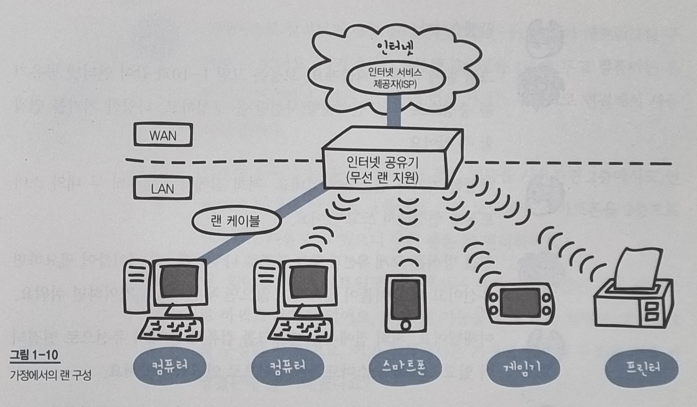
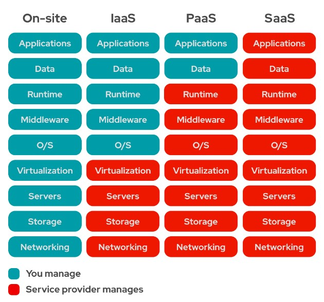
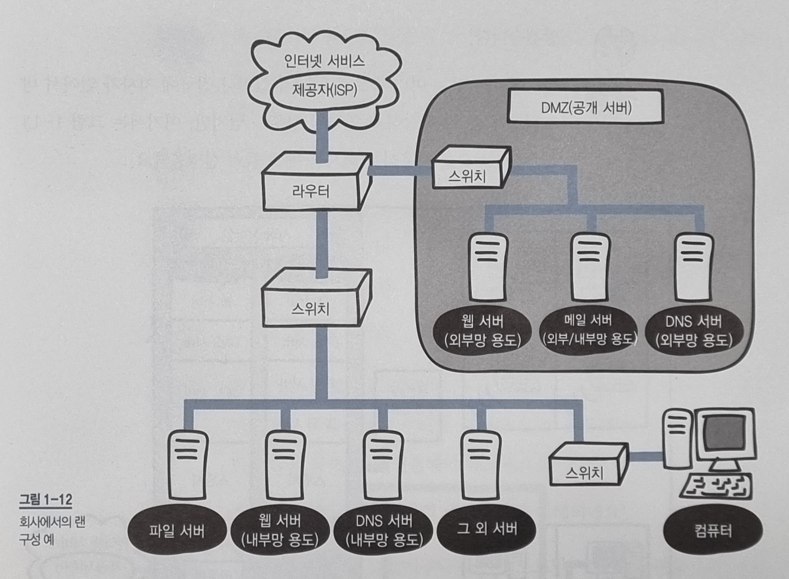
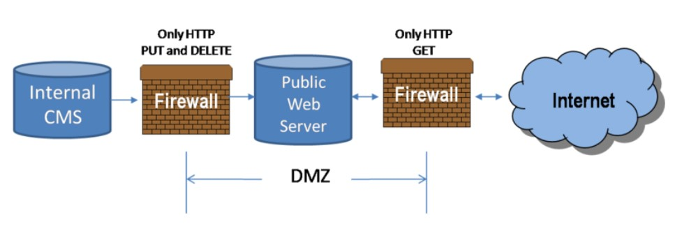

> 네트워크를 배우기 앞서 기초지식을 학습한다.

- [1.1. 네트워크의 구조](#11-네트워크의-구조)
  - [1.1.1. 컴퓨터 네트워크](#111-컴퓨터-네트워크)
  - [1.1.2. 패킷](#112-패킷)
- [1.2. 정보의 양을 나타내는 단위](#12-정보의-양을-나타내는-단위)
  - [1.2.1. 비트와 바이트](#121-비트와-바이트)
- [1.3. LAN과 WAN](#13-lan과-wan)
  - [1.3.1. LAN과 WAN의 차이](#131-lan과-wan의-차이)
- [1.4. 가정에서의 LAN 구성](#14-가정에서의-lan-구성)
  - [1.4.1. 가정에서의 네트워크 구성](#141-가정에서의-네트워크-구성)
- [1.5. 회사에서의 LAN 구성](#15-회사에서의-lan-구성)
  - [1.5.1. 소규모 회사에서의 네트워크 구성(온프레미스)](#151-소규모-회사에서의-네트워크-구성온프레미스)

---

## 1.1. 네트워크의 구조

### 1.1.1. 컴퓨터 네트워크

> 분산되어 있는 컴퓨터를 통신망으로 연결하여 자원을 공유할 수 있게한 것.  
> 컴퓨터 간 실제 연결은 광케이블과 같은 유선 혹은 와이파이와 같은 무선 매체를 통해 이뤄진다.

인터넷은 TCP/IP 프로토콜를 기반으로 전 세계적으로 연결되어있는 컴퓨터 네트워크 통신망을 말한다.

### 1.1.2. 패킷

> 네트워크를 통해 전송되는 형식화된 작은 데이터 조각

큰 데이터를 그대로 네트워크를 통해 송 수신 경우, 네트워크의 대역폭[^1]을 많이 점유해서 다른 데이터의 흐름을 막을 수 있다. 따라서 데이터를 작은 크기의 패킷으로 분할하여 전송한다.
데이터를 분할하여 보내는 만큼, 수신측 컴퓨터에서 패킷을 다시 정렬할 수 있도록 패킷에는 제어정보를 담긴다.
[^1]: 단위 시간당 전송할 수 있는 데이터 전송량. bps(bits per second) 단위를 사용한다.

## 1.2. 정보의 양을 나타내는 단위

정보의 양에 대한 수학적 정의는 다음과 같다.

- I = log2(1/P)

  - I: 정보량 (단위 bit)
  - P: 사건이 일어날 확률

수학적 정의에 따르면 사건이 일어날 확률이 낮을수록 이를 표현하기 위한 정보의 양은 많아진다. 동전 뒤집기를 예시로 들면 다음과 같다.
동전이 앞면인지 뒷면인지는 (P = 1/2)의 확률을 가진다. 따라서 I = log2(2) = 1 bit 의 정보량으로 동전 뒤집기의 결과를 표현할 수 있다.

### 1.2.1. 비트와 바이트

> **비트(bit).** 0과 1의 정보를 나타내는 최소단위

> **바이트(byte).** 1byte = 8bit

n비트(bit)로는 2^n개의 가짓 수를 표현할 수 있다.

## 1.3. LAN과 WAN

### 1.3.1. LAN과 WAN의 차이

> **LAN(Local Area Network)**  
> 근거리 통신망으로 집이나 빌딩과 같이 지리적으로 가까운 지역의 컴퓨터를 묶은 네트워크이다. 동일한 IP대역과 동일한 Subnet mask를 사용한다.

> **WAN(Wide Area Network)**  
> 광역 통신망으로 LAN과 LAN을 연결한 컴퓨터 네트워크티다. 거대한 통신 인프라를 필요로 하기 때문에, 인터넷 서비스 제공자(ISP)가 서비스를 지원한다.

|      | LAN                      | WAN                  |
| ---- | ------------------------ | -------------------- |
| 범위 | 좁다(건물이나 특정 지역) | 넓다(랜과 랜을 연결) |
| 속도 | 빠르다                   | 느리다               |
| 오류 | 적다                     | 많다                 |

## 1.4. 가정에서의 LAN 구성

### 1.4.1. 가정에서의 네트워크 구성

- **인터넷 서비스 제공자**  
  인터넷 서비스를 제공하는 주체를 의미하며, 인터넷 서비스에는 구체적으로 **인터넷 통신망**, **IP 할당** 그리고 **인터넷 접속 서비스**가 있다.
- **인터넷 공유기**  
  가정이나 소기업 등에서 사용하는 소용량의 라우터를 가리키는 말이다. 최근에는 라우터 기능 뿐 아니라 스위칭 허브, 방화벽과 같은 다양한 기능을 제공한다. 명시한 기능들은 추후 챕터에서 더 자세하게 다룬다.
- **유선 랜과 무선 랜**
  - **유선 랜**
    이더넷 케이블이라고도 불리며, 8가닥의 구리선 케이블을 이용해 데이터를 송수신한다. 자세한 내용은 3장에서 다룬다.
  - **무선 랜**  
    [IEEE 802.11 표준](https://ko.wikipedia.org/wiki/IEEE_802.11)에 기반한 무선 네트워크 통신 기술이다. 자세한 내용은 9장에서 다룬다.

## 1.5. 회사에서의 LAN 구성

서버 인프라를 관리하기 위해서는 전문적인 지식과 유지 보수를 위한 비용이 필요하다. 그에 따라 이러한 서버 인프라를 제공하는 클라우드 서비스가 나타났으며, 회사의 서버 운영 방식은 컴퓨팅 자원을 누가 관리하느냐에 따라 크게 두가지로 분류할 수 있다.

- **온프레미스(On-Premise)**  
  회사 자체적으로 서버를 운영하는 방식.
- **클라우드(Cloud)**  
  외부의 서버 인프라를 이용하는 방식. 제공되는 서비스 범위에 따라 다음과 같이 세분화할 수 있다.
  

  - **IaaS(Infrastructure as a Service)**  
    IaaS의 제공업체는 서버, 하드 드라이브, 네트워킹, 가상화 및 스토리지를 제공하며, 고객은 OS, 미들웨어, 애플리케이션 및 데이터와 같은 자원들을 관리할 수 있다.  
    Ex) AWS EC2
  - **PaaS(Platform as a Service)**
    IaaS의 제공업체는 OS, 미들웨어, 런타임환경까지 제공하며, 고객은 애플리케이션 개발에 집중할 수 있다.  
    Ex) Heroku
  - **SaaS(Software as a Service)**  
    SaaS의 완성된 어플리케이션 서비스를 인터넷을 통해 제공하며, 고객은 해당 애플리케이션을 통해 제한된 방식으로 컴퓨팅 자원을 이용할 수 있다.  
    Ex) Google Drive

### 1.5.1. 소규모 회사에서의 네트워크 구성(온프레미스)

- **방화벽**  
  **[방화벽](<https://ko.wikipedia.org/wiki/%EB%B0%A9%ED%99%94%EB%B2%BD_(%EB%84%A4%ED%8A%B8%EC%9B%8C%ED%82%B9)>)은 서로 다른 네트워크를 지나는 데이터를 허용하거나 거부하거나 검열, 수정하는 하드웨어나 소프트웨어 장치이다.** 패킷 자체만을 보고 특정 IP주소나 포트 경로를 차단하는 일반 수준의 정책부터 패킷의 내용을 분석함으로써 응용프로그램에서의 동작을 예측하여 차단하는 고급 수준의 정책까지 다양한 방식으로 동작한다.
- **DMZ(Demilitarized Zone)**  
    
  내부 네트워크와 외부 네트워크에서 모두 접근 가능하지만, DMZ 내의 컴퓨터는 오로지 외부 네트워크로만 접근 가능하다.  
  DMZ를 통해 외부 네트워크 서비스를 제공하면서도, 내부 네트워크를 보호할 수 있다.
