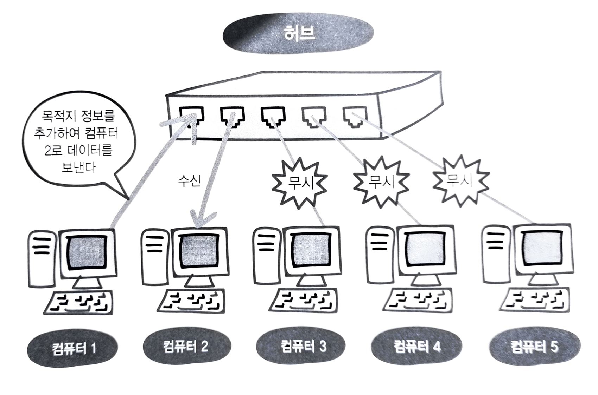

> OSI 2계층인 데이터링크 계층에 대해서 학습한다.

- [4.1. 데이터 링크 계층의 역할과 이더넷](#41-데이터-링크-계층의-역할과-이더넷)
  - [4.1.1. 이더넷](#411-이더넷)
- [4.2. MAC 주소](#42-mac-주소)
  - [4.2.1. MAC 주소](#421-mac-주소)
  - [4.2.2. 프레임](#422-프레임)
- [4.3. 스위치](#43-스위치)
  - [4.3.1. MAC 주소 테이블](#431-mac-주소-테이블)
  - [4.3.2. 전이중 통신과 반이중 통신](#432-전이중-통신과-반이중-통신)
  - [4.3.3. 충돌 도메인](#433-충돌-도메인)
- [4.4. ARP](#44-arp)
  - [4.4.1. ARP 프로토콜](#441-arp-프로토콜)
  - [4.4.2. ARP 테이블](#442-arp-테이블)

---

## 4.1. 데이터 링크 계층의 역할과 이더넷

### 4.1.1. 이더넷

> 데이터 링크 계층은 네트워크 장비 간에 신호를 주고받는 규칙을 정하는 계층으로, 그 규칙들 중 가장 일반적으로 사용되는 규칙이 이더넷이다. 이더넷은 [IEEE 802.3](https://www.ieee802.org/3/)으로 정의 되는 통신 규격이다.

이더넷 프로토콜은 다음과 같은 내용들을 포함한다. (이더넷은 랜 케이블을 통한 데이터 통신에 사용되는 프로토콜이다. 따라서 무선 통신 등에는 적용되지 않는다.)

- **목적지 정보(MAC)**

  

  이더넷 헤더에는 MAC 주소를 달아 목적지 정보를 표기하고, 이 외의 컴퓨터는 데이터를 받아도 무시한다. 해당 내용은 [아래 챕터](<(#42-mac-주소)>)에서 더 자세히 다룬다.

- **데이터 충돌 방지(CSMA/CD)**

  

  과거 **더미 허브를 사용했을 때**에는 여러 컴퓨터가 덩시에 데이터를 보낼 경우, 데이터가 서로 부딪혀 충돌이 일어날 수 있었다. 이를 방지하기 위한 것이 CSMA/CD 프로토콜이고 다음과 같은 순서로 동작한다.

  1. A, B 컴퓨터는 데이터를 정보를 전송할 회선이 사용 중인지 확인한다. (반송파 감지 - Carrier Sense)
  2. 회선이 사용 중이지 않은 것을 확인하면, 두 컴퓨터는 데이터를 송수신한다 (다중 접근 - Multi Access)
  3. 그 과정에서 두 컴퓨터의 통신이 충돌되면, 컴퓨터는 비정상적인 증폭으로 충돌을 확인한다. (충돌 감지 - Collision Detection)
  4. 충돌을 확인한 전송 장비가 충돌을 알린다. (충돌 신호 - Jam Signal)
  5. A, B 컴퓨터는 충돌을 확인 후 백오프(Backoff) 알고리즘을 수행하고, 임의의 시간동안 전송을 중단한다.
  6. 임의의 시간이 지난 후, 다시 청취모드로 돌아간다. 이 과정을 충돌이 일어나지 않을 때까지 반복한다.

## 4.2. MAC 주소

### 4.2.1. MAC 주소

> 인터넷을 할 수 있는 이더넷 기반 기기에 할당되어 있는 고유한 ID이다.


총 48비트로 이루어져 있기 때문에 이론상 281조 개의 서로 다른 ID를 만들 수 있다. **앞의 3자리(24비트)는 제조사 코드**, **뒤의 3자리(24비트)는 기기 고유코드**이다. 따라서 한 개의 제조사 코드로 약 1600만개(2\*\*24) 개의 MAC주소를 만들 수 있는데, 보통 하나의 제조사는 여러 개의 제조사 코드를 할당받는다.

### 4.2.2. 프레임

> OSI 모델의 데이터 링크 계층(TCP/IP 모델의 네트워크 접속 계층)에서는 상위 계층에서 전달받은 데이터에 **이더넷 헤더**와 **트레일러**가 붙어서 프레임을 만든다.


- **이더넷 헤더**

  - **Destination Address**  
    목적지의 MAC 주소
  - **Source Address**  
     출발지의 MAC 주소
  - **Type(Length)**  
    상위 계층의 프로토콜을 나타낸다. 대표적인 유형 번호는 아래와 같다.

    | 유형번호 | 프로토콜         |
    | -------- | ---------------- |
    | 0800     | IPv4             |
    | 0806     | ARP              |
    | 8035     | RARP             |
    | 814C     | SNMP or Ethernet |
    | 86DD     | IPv6             |

- **트레일러**
  - **Frmae Check Sequence**  
    이더넷 헤더와 데이터 영역에 대해서 [CRC에러](http://www.ktword.co.kr/test/view/view.php?m_temp1=603) 검사를 하는데 사용된다. 이를 통해 데이터 전송 도중, 오류가 발생했는지 확인할 수 있다.


이와 같이 데이터 링크 계층(네트워크 접속 계층)에서는 목적지의 MAC주소를 담은 이더넷 헤더가 추가되기 때문에, 수신 측에서는 데이터의 목적지 MAC주소가 자신의 MAC주소와 다를 경우 해당 데이터를 수신하지 않을 수 있다.

## 4.3. 스위치

스위치는 허브와 달리 데이터 충돌이 발생하지 않는다. 스위치가 어떠한 원리로 작동하는지 알아보자.

### 4.3.1. MAC 주소 테이블

> 스위치의 포트번호와 해당 포트에 연결되어 있는 컴퓨터의 MAC 주소가 등록되어 있는 데이터베이스

1~5까지의 포트번호를 가진 스위치를 생각할 때, 스위치의 **MAC 주소 필터링**은 다음과 같이 동작한다.

1. 처음 스위치의 전원을 켠 경우 MAC 주소 테이블에니느 아무 것도 등록되어 있지 않다.
2. 컴퓨터 1에서 컴퓨터 3으로 데이터를 전송한다.
3. 스위치는 MAC 주소 테이블을 확인하고, 프레임의 출발지 MAC 주소가 등록되어 있지 않으면 MAC 주소 테이블을 업데이트 한다.(컴퓨터 1의 MAC주소가 등록된다.)
4. 스위치는 컴퓨터 3의 MAC 주소에 해당하는 포트 번호를 모르므로, 송신 포트 이외의 모든 포트에 데이터를 전송한다. 이런 현상을 **플러딩**이라고 한다.
5. 만일 컴퓨터 3의 MAC 주소에 대응하는 포트 번호를 알 경우, 해당 포트로만 데이터를 전송한다.

### 4.3.2. 전이중 통신과 반이중 통신

> **전이중 통신**은 회선을 2개 이상 사용해 데이터 송수신이 동시에 일어나는 방식이고, **반이중 통신**은 회선 하나로 송신과 수신을 번갈아가면서 통신한느 방식이다.

- **랜 케이블**

    

  랜선의 경우, 총 8개의 구리선을 두개 선을 이용하기 때문에 전이중통신 방식을 지원한다.

- **허브**

  

  허브의 내부는 반이중 통신 방식이기 때문에 서로 다른 컴퓨터에서 동시에 데이터를 보낼 경우, 충돌이 발생한다.

- **스위치**

  

  스위치의 내부는 전이중 통신 방식이기 때문에 동시에 데이터를 송신해도 충돌이 발생하지 않는다.

### 4.3.3. 충돌 도메인

> 충돌이 발생할 때 그 영향이 미치는 범위

허브는 접속되어 있는 모든 컴퓨터가 하나의 충돌 도메인이 되는 반면, 스위치는 충돌이 일어나지 않고, 충돌이 발생한다 하더라도 그 도메인이 훨씬 작다.

## 4.4. ARP

### 4.4.1. ARP 프로토콜

> ARP는 목적지 컴퓨터의 IP 주소를 이용하여 MAC 주소를 찾기 위한 프로토콜이다. 이더넷 프레임을 전송하려면 목적지의 MAC 주소를 알아야 하는데, 출발지 컴퓨터가 목적지의 MAC 주소를 모를 경우 네트워크에 ARP 요청을 브로드 캐스트한다.

1. 컴퓨터 A가 컴퓨터 B에게 데이터를 전송하려고 할 때, 컴퓨터 B의 IP 주소는 알고 있지만, MAC 주소를 모른다.
2. 컴퓨터 A는 네트워크 상에서 ARP 요청 패킷을 **브로드캐스트**한다. (목적지의 MAC 주소를 FF:FF:FF:FF:FF:FF로 설정)
3. ARP 요청 패킷은 **로컬 네트워크** 상의 모든 호스트에게 전송됩니다.
4. 컴퓨터 B는 자신의 IP 주소와 일치하는 ARP 요청 패킷을 수신하고, 자신의 MAC 주소를 포함한 ARP 응답 패킷을 전송한다.
5. 컴퓨터 A는 ARP 응답 패킷을 통해 B의 MAC 주소를 알게 된다.

참고로 ARP 프로토콜은 로컬 네트워크 상에서만 작동하기 때문에, 만약 로컬 네트워크 바깥에 있는 컴퓨터에 데이터를 보내고 싶다면 라우터를 통해야 한다.

### 4.4.2. ARP 테이블

> 로컬 컴퓨터의 메모리에 보관된 MAC주소와 IP주소 매핑 정보

한 번 ARP 요청을 통해 MAC 주소를 얻으면, 이후에는 ARP 테이블을 참고하여 데이터가 전송된다. 하지만 IP주소는 고정되지 않기 때문에 ARP 테이블 정보는 영구적이지 않다. 그에 따라서 ARP 테이블을 보존기간을 ARP 캐시로 지정하고, 일정 시간이 지나면 삭제 후 다시 ARP 요청을 보낸다.

윈도우와 리눅스에서 ARP 캐시 내용을 확인하기 위한 명령어는 다음과 같다.

```bash
# ARP 캐시 확인
arp -a

# ARP 캐시 삭제
arp -d
```
