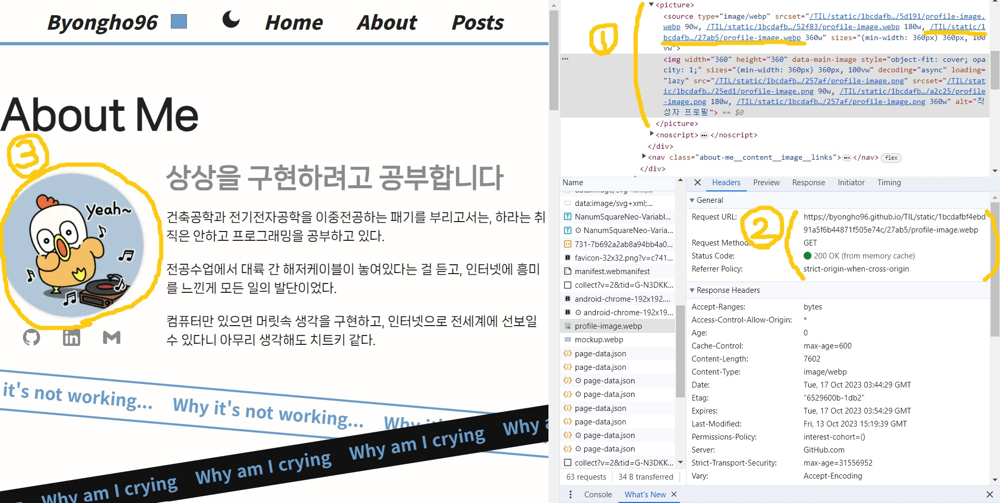
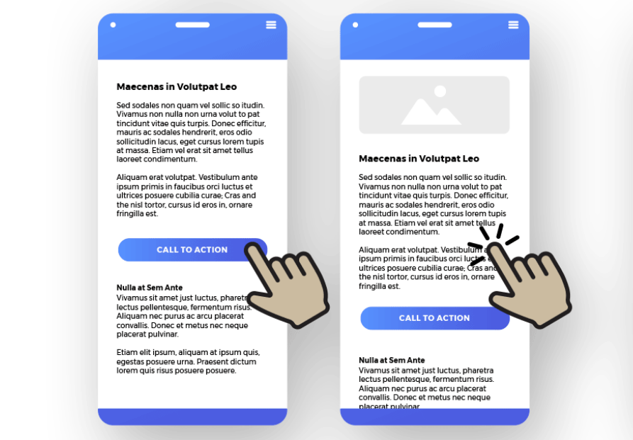
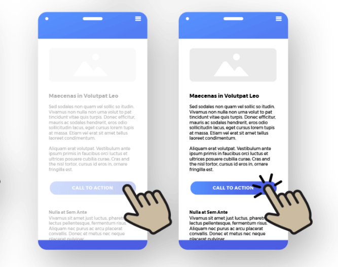
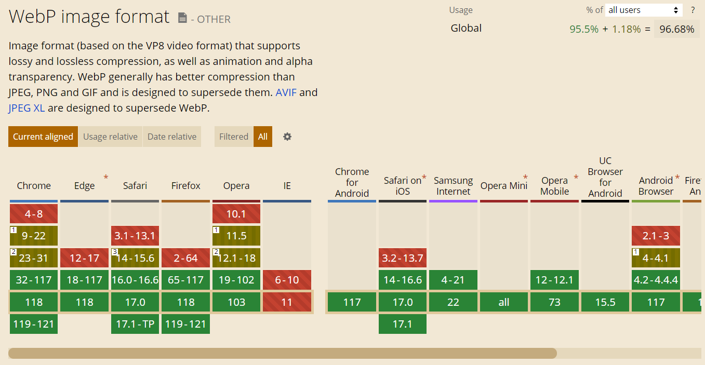

> 과장 좀 해봤습니다.

# 1. 정적 이미지란?

## 1.1. 정의

이름처럼 웹 페이지나 앱에서 사용 중에서 **변하지 않는 고정된 이미지**를 가리킨다. 반대로 백엔드 데이터로 관리되는 **동적 이미지는 사용자의 활동에 따라 변경**된다. 예를 들어 카카오톡 프로필 사진은 사용자에 의해 계속해서 수정되므로 동적 이미지다. 반대로 카카오톡 로고는 로고 자체가 수정되지 않는 한 고정되어있으므로 정적 이미지다.

때문에 "반드시"라고 할 수는 없지만, 대개 **정적 이미지 url은 프론트가 직접 가지고 있다.** 그리고 이미지 url 주소를 ``에 대입해서 html을 렌더링하면, 브라우저 자체 기능에 따라 이미지 정보를 요청한다. 코드와 함께 좀 더 자세하게 살펴보자.

```jsx
import imgSrc from './images/example.png'

export default App() {
    return 

}
```

```html
<head>
  ...
</head>
<body>
  <div id="app">
    
  </div>
</body>
```

위는 간단한 리액트 코드이다. 이미지 파일에 대해 번들러 설정이 잘 갖춰졌다면, 위처럼 이미지 파일을 마치 자바스크립트 코드처럼 `import`해서 사용할 것이다. 그리고 소스코드를 빌드하면 **번들러는 다음 작업을 수행한다.**

- 이미지를 빌드 타겟 폴더로 복사한다.
- 복사한 이미지의 경로를 `imgSrc` 변수의 값으로 대입한다.

위의 예시에서는 `imgSrc`변수에 `"/images/example-hash0123.png"`라는 문자열이 할당되었다.

## 1.2. 브라우저 이미지 요청 과정



1. 브라우저가 html을 바탕으로 화면을 렌더한다.
2. ``태그를 만나면 **url로 이미지 데이터를 GET 요청**한다.
3. 전달받은 이미지 데이터로 화면을 렌더링한다.

# 2. 이미지 로딩

앞 서 말한 것처럼 브라우저가 html파일을 받고 난 뒤, 해석하는 과정에서 ``태그에 대한 이미지 데이터가 추가 요청된다. 이 또한 HTTP 통신(GET 요청)이기 때문에 시간이 걸린다. **이미지 데이터가 클수록 더 많은 시간이 필요하다.** 따라서 이 로딩 시간을 어떻게 처리하는지가 사용자 경험에 큰 영향을 끼친다

## 2.1. 이미지 크기 설정



이미지 크기 설정은 **CLS(Cumulative Layout Shift)라는 UX 지표**를 개선한다. CLS는 웹 페이지가 **로딩 중 화면 레이아웃의 안정성**을 말하며, CLS 지표가 낮을 경우 의도하지 않은 사용자 이벤트를 발생시킬 수 있다. 위 그림을 보면 사아단의 이미지가 뒤늦게 로드되면서 나머지 컨텐츠의 레이아웃 위치가 바뀐 것을 확인할 수 있다.

```js

```



위와 같이 ``태그의 크기를 지정해주면, 아직 컨텐츠가 로드되기 전이라도 레이아웃에서 해당 컨텐츠의 위치를 미리 점유한다. 따라서 이미지 로드 전/후의 레이아웃 변화가 없다.

## 2.2. 로딩 화면 처리


위처럼 **이미지가 로드되기 전/후로 다른 화면**을 띄우고 싶을 것이다. 이미지 데이터가 로드되면 어차피 해당 이미지를 띄울테니, 정확히 말하면 로드되기 전에 다른 화면을 띄우고 있다가, 이미지가 로드되면 없애고 싶다. **``태그의 `load`이벤트를 사용하면,** 이러한 기능을 구현할 수 있다.

```html
<div>
  
</div>
<script>
  var imgElement = document.getElementById('myImage')

  // 이미지 로드 이벤트 리스너 추가
  imgElement.addEventListener('load', function () {
    // 이미지가 로드된 후 실행할 함수를 여기에 작성
  })
</script>
```

위와 같은 방식으로 콜백함수에 원하는 로직을 설계함으로써, 이미지 데이터가 다 로드되었을 때 원하는 로직을 실행할 수 있다.

## 2.3. data URL


data URL을 사용하면 **이미지 로딩화면을 더 다채롭게 처리**할 수 있다. 보통 url은 IP주소를 표시하는 용도이지만, url자체도 문자열이다보니 적절한 형식으로 선언하면 데이터를 저장할 수 있다. 예를 들어 아래와 같은 문자열은 jpg 형식의 이미지 데이터를 base64 방식으로 인코딩한 결과가 `/9j/2wBDAAMCAgMCAgMDAwMEAwMEBQgFBQQEBQoHBwY...` 이라는 것이다.

```js
// data:<MIME_TYPE>;base64,<DATA>

'data:image/jpeg;base64,/9j/2wBDAAMCAgMCAgMDAwMEAwMEBQgFBQQEBQoHBwY...''
```

data URL 또한 URL의 한 종류이기 때문에 아래처럼 CSS `background-image`에 `url()`로 감싸서 사용할 수 있다. 그러면 HTTP GET 요청을 보내는 대신 문자열 자체를 디코딩하여 이미지 데이터로 바로 사용할 수 있다. 하지만 이러한 문자열 데이터는 CSR 방식이라면 JS나 CSS파일에, SSR 방식이라면 html이나 CSS파일에 포함되기 때문에 **고화질의 이미지를 처리하는 것은 지양**해야 한다.

```html
<body>
  <div style="background-image: url('data:image/jpeg;base64,/9j/2wBDAA')">
</body>
```

# 2. 이미지 형식

## 2.1. webp / webm

webp는 **웹에서 이미지를 효율적으로 표현하기 위한 차세대 파일 형식**이다. Lighthouse를 돌리면 자주 만날 수 있는 단어이다. 기존 jpg/png에 비해 압축률이 뛰어나 같은 화질의 이미지도 더 작은 크기의 데이터로 표현할수 있다.



이미지 데이터가 작을수록 네트워크 비용을 아낄 수 있기 때문에 브라우저들도 webp를 적극적으로 지원한다. 하지만 IE와 옛날 버전의 브라우저에서는 지원하지 않는다.

## 2.2. 코드 사용법

모든 브라우저가 webp를 지원하는 것이 아니기 때문에 무조건 webp만을 사용할 수는 없다. 이 때 `<picture>`태그로 묶으면 여러 형식의 이미지를 지원할 수 있다.

```html
<picture>
  <source srcset="image.webp" type="image/webp" />
  <source srcset="image.png" type="image/png" />
  
</picture>
```

위와 같이 `<picture>`태그로 이미지를 제공할 경우, 브라우저는 **위에서부터 순서대로 탐색하면서 자신이 지원할 수 있는 이미지 형식을 선택**한다. 위의 코드에서는 'webp / png / jpg' 의 우선순위로 이미지 타입이 선택된다.

# 3. 반응형 이미지

반응형 이미지를 사용하면 **디바이스 크기에 따라 적절한 크기의 이미지**를 요청할 수 있다. 예를 들어 모바일 디바이스에서 이미지를 요청할 대, 데스크탑에 비해 더 작은 이미지를 요청함으로써 불필요한 네트워크 비용을 줄일 수 있다.

## 3.1. srcset

`srcset`속성으로 **서로 다른 가로 너비 폭의 여러 이미지 소스**를 지정할 수 있다.

```html

```

`w`라는 새로운 단위를 이미지 자체의 픽셀 폭을 이야기한다. 예를 들어 320w는 이미지가 320 픽셀의 폭을 가지고 의미한다. 그런데 왜 굳이 익숙한 `px` 대신 `w`를 쓸 까? `w`를 사용하면 **브라우저가 디바이스의 해상도(DPI, Dots Per Inch)를 고려**한다. 따라서 고해상도 디스플레이를 가진 장치에 더 높은 해상도 이미지를 제공하게 된다.

## 3.2. srctypes

`sizes` 속성은 **이미지의 출력 크기를 지정**한다. 앞 서 `srcset`으로 여러 개의 이미지 소스를 설정했다. 이미지 소스가 ``태그의 너비에 따라 선택될 것 같지만 아니다! 기본으로 이미지 소스는 **화면의 전체 너비를 기준으로 요청**된다. 따라서 이미지를 `100vw`로 렌더링할 것이 아니라면, `sizes`속성을 같이 설정해줘야 한다.

```js

```

위 코드의 `sizes`속성이 의미하는 바를 설명하면 아래와 같다.

- 화면 너비 `600px`까지는 이미지 크기를 `100vw`로 간주한다.
- 화면 너비 `1024px`까지는 이미지 크기를 `50vw`로 간주한다.
- 화면 너비 `1025px`부터는 이미지 크기를 `33.3vw`로 간주한다.

# 4. 프로젝트 적용

그럼 이제 한가지 깊은 고민이 생긴다. 그럼 우리는 정적 이미지 파일 하나를 보여주겠다고, jpg/png/webp 파일 각각을 만들고, 화면 크기에 따라 다른 크기로 생성하며, 필요한 경우 data URL까지 만들어야 한다. 말 그대로 배꼽이 배보다 더 커졌다.

하지만 다행히도 프로그래머들은 반복적인 작업을 싫어한다. 번들러에 적절한 플러그인을 설치한다면, 이러한 작업을 **빌드 시에 일괄적으로에 처리**할 수 있다. 아마 각각의 번들러마다 누군가가 만든 플러그인이 있을 것이다. 그리고 웹팩에서는 [responisve-loader](https://www.npmjs.com/package/responsive-loader)라는 기막힌 플러그인이 있다.

리액트 & 웹팩 기반 프로젝트에서 responisve-loader를 사용해 위에 설명한 모든 방법을 적용한 과정을 ['React & Webpack 이미지 로딩 최적화'](https://byongho96.github.io/TIL/posts/Frontend/React/responsive_loader/) 포스팅에 정리했다.

# 5. 참고자료

- [Web Dev Simplified: Make Your Site Lightning Fast With Responsive Images](https://www.youtube.com/watch?v=fp9eVtkQ4EA&t=394s)
- [Web Dev Simplified: How To Load Images Like A Pro](https://www.youtube.com/watch?v=hJ7Rg1821Q0)
- [10분 테코톡: 록바의 웹 성능 개선하기 - 이미지](https://www.youtube.com/watch?v=INPldifIEXE)
