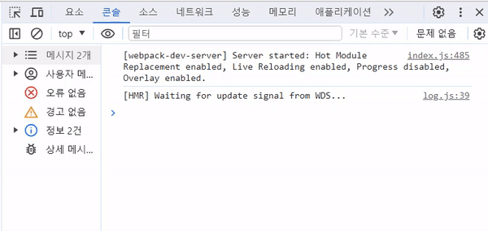
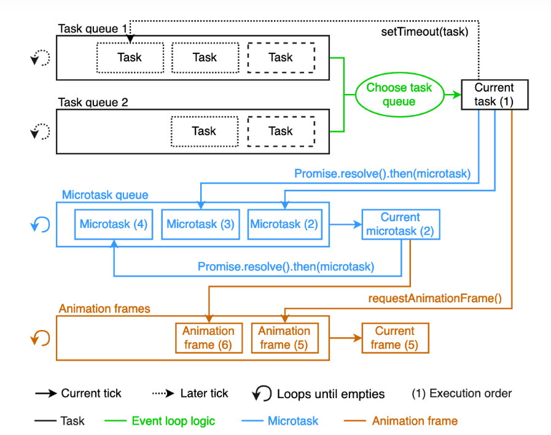

> [JBEE: 스크롤 이벤트 최적화](https://jbee.io/web/optimize-scroll-event/) 글을 바탕으로 작성한 글이다.

# 1. 스크롤 이벤트

의도한 건 아닌데 어쩌다가 [스크롤 이벤트 최적화에 대한 포스팅](https://jbee.io/web/optimize-scroll-event/)보게 되었고, 처음에는 이해하지 못해 애써 무시하다가, 어느 순간 갑자기 이해가 되서 이렇게 글로 다시 정리한다.

```js
const handleScroll = () => {
  console.log('scroll')
}

window.addEventListener('scroll', handleScroll)
```



스크롤처럼 연속적으로 발생하는 이벤트에 대해 리스너를 달 경우, 함수가 ~~미친듯이~~ 정말 많이 실행된다. 위 예시야 간단하게 콘솔만 출력하니까 부담이 덜 하겠지만, 요소의 `transform`을 계산해서 옮기는 등의 무거운 작업이 실행한다면 오버헤드가 발생할 것이다.

이에 대해 두가지 해결책이 있다. **각각의 방법에 특장점이 다르니 상황에 맞게 사용**하면 된다.

# 2. throttle

`throttle`은 함수 실행의 오버헤드를 막기 위한 방법이다. 무거운 함수가 필요 이상으로 자주되는 상황을 방지하는데 효과적이다.

## 2.1. 동작 원리

`throttle`은 특정 함수를 재실행하는 **최소 주기를 설정**한다. 자바스크립트 **클로저 개념**을 바탕으로 함수가 실행되 가장 마지막 시간에 대한 정보를 기억하고, 설정한 시간 이상이 지나야지만 다시 실행한다. `debounce`가 함수를 재실행하는 **최소 시간 간격을 설정**하는 것과 살짝 다르다.

`lodash` 라이브러리에 `throttle`함수가 있지만, `lodash` 라이브러리 자체가 굉장히 크기 때문에 쓰로틀 기능 만을 위해 설치하는 것은 추천하지 않는다. 그럼에도 쓰겠다면 **웹팩 트리쉐이킹이 잘 동작하도록 아래와 같이 임포트**해야 한다.

```js
import throttle from 'lodash/throttle'

// 아래 코드는 웹팩 5버번 기준, 트리쉐이킹이 이뤄지지 않아 빌드 결과물의 크기가 지나치게 커진다.
// import { throttle } from 'lodash'
```

## 2.2. 타입스크립트 코드

`loadash`라이브러리 대신 아래와 같이 간단하게 `throttle` 함수를 구현할 수 있다. 만일 타입 에러가 발생다면 아래 2가지를 체크해보길 바란다.

```js
/**
 * 함수의 최소 실행 주기를 설정
 * @param cb 실행하고자 하는 콜백 함수
 * @param delay 최소 실행 주기 (ms)
 * @returns
 */
export default function throttle(cb: (...args: any[]) => void, delay: number) {
  if (!cb) {
    throw Error('Invalid required arguments')
  }

  let lastTime = 0 // 자유변수로 마지막 함수 실행시각 기억

  return function (...args: any[]) {
    // 현재 시간과 비교하여 delay만큼의 시간이 지난 경우에만 실행
    const now = new Date().getTime()
    if (now - lastTime > delay) {
      cb.apply(this, args)
      lastTime = now // 마지막 함수 실행시각 업데이트
    }
  }
}
```

바인딩 하는 `this`의 타입이 유동적이기 때문에 `tsconfig.json` 파일을 아래와 같이 설정해야한다. 만일 프로젝트에서 `this` 사용할 일이 전혀 없다면, 그냥 위 코드에서 `cb.apply(this, args)`를 `cb()`로 바꿔서 제거해도 무관하다.

```json
// tsconfig.json
{
  "noImplicitThis": false
}
```

만약 eslint를 사용하고 있다면 아마 아래 규칙을 추가해야 할 것티다. 콜백함수가 어떤인자를 받을지 몰라 `any[]`로 선언해주었기 때문에 명시적인 `any`선언을 허용해야한다.

```js
module.exports = {
  ...,
  rules: {
    '@typescript-eslint/no-explicit-any': 0,
  },
}
```

## 2.3. 사용 예시

```js
import throttle from './throttle.ts'

const handleScroll = () => {
  console.log('scroll')
}

const throttledHandleScroll = throttle(handleScroll, 100) // 최소 100ms 주기로 실행

window.addEventListener('scroll', throttledHandleScroll)
```

# 3. requestAnimationFrame

`requestAnimationFrame`은 이름처럼 함수의 실행을 화면주사율에 맞춰 최적화는 방법이다. 따라서 실행하려는 함수가 화면 렌더링과 관련있을 때 가장 적합하다.

## 3.1. 동작 원리



알다시피 자바스크립트는 싱글스레드 언어이기 때문에 이벤트루프를 이용해서 비동기 함수를 처리한다. 이때 실행할 콜백함수가 큐에서 대기한다고 하는데, 실제로는 위와 같이 **다중 큐**에서 대기한다. 그리고 그림의 가장 아래에 보면 Animation frames라는 별도의 큐가 있다. `requestAnimation`으로 실행되는 콜백함수들이 바로 이 큐에서 별도로 관리된다.

**Animation Frames에 있는 콜백함수는 브라우저 주사율에 맞춰 실행된다.** 만약에 화면 주사율이 60Hz라면 콜백함수들이 1초에 60번, 그것도 화면 렌더링에 맞춰 실행되는 것이다.

## 3.2. 타입스크립트 코드

아래는 타입스크림트로 구현한 함수이다. 만일 타입 에러가 발생다면 그 아래 2가지를 체크해보길 바란다.

```js
/**
 * 콜백함수 실행 주기를 브라우저 프레임 주사율에 동기화
 * @param cb 실행하려는 콜백함수
 * @param dismissCondition 선택인자: 콜백함수 전에 실행되어 콜백함수 실행중지 여부를 조절 가능
 * @param triggerCondition 선택인자: 콜백함수 전에 실행되어 콜백함수 실행 여부를 조절 가능
 * @returns
 */
export default function toFrame(
  cb: (...args: any[]) => void,
  dismissCondition: (...args: any[]) => boolean = () => false,
  triggerCondition: (...args: any[]) => boolean = () => true
) {
  if (!cb) {
    throw Error('Invalid required arguments')
  }

  let isQueue = false // 현재 콜백함수가 큐(대기열)에 있는지를 기억

  return function (...args: any[]) {
    // 이전 콜백함수가 대기열에 있다면
    if (isQueue) return // 현재 콜백 함수를 파기

    // 이전 콜백함수가 대기열에 없다면
    isQueue = true // 대기 상태를 True로 변경하고, requestAnimationFrame으로 현재 콜백함수를 등록

    return requestAnimationFrame(() => {
      isQueue = false // 콜백함수가 실행되었으므로 대기상태를 False

      // 실행중지 조건에 걸렸을 경우, 그냥 종료
      if (dismissCondition()) {
        return
      }

      // 실행 조건에 걸렷을 경우, 실제 로직 콜백함수 실행
      if (triggerCondition()) {
        return cb.apply(this, args)
      }
    })
  }
}
```

바인딩 하는 `this`의 타입이 유동적이기 때문에 `tsconfig.json` 파일을 아래와 같이 설정해야한다. 만일 프로젝트에서 `this` 사용할 일이 전혀 없다면, 그냥 위 코드에서 `cb.apply(this, args)`를 `cb()`로 바꿔서 제거해도 무관하다.

```json
// tsconfig.json
{
  "noImplicitThis": false
}
```

만약 eslint를 사용하고 있다면 아마 아래 규칙을 추가해야 할 것티다. 콜백함수가 어떤인자를 받을지 몰라 `any[]`로 선언해주었기 때문에 명시적인 `any`선언을 허용해야한다.

```js
module.exports = {
  ...,
  rules: {
    '@typescript-eslint/no-explicit-any': 0,
  },
}
```

## 3.3. 사용 예시

```js
import toFrame from './toFrame.ts'

const handleScroll = () => {
  console.log('scroll')
}

const animationedHandleScroll = toFrame(handleScroll) // 브라우저 프레임 주기에 맞춰 실행

window.addEventListener('scroll', animationedhandleScroll)
```

# 4. 참고자료

- [JBEE: 스크롤 이벤트 최적화](https://jbee.io/web/optimize-scroll-event/)
- [Inpa Dev: 애니메이션 최적화 requestAnimationFrame 가이드](https://inpa.tistory.com/entry/%F0%9F%8C%90-requestAnimationFrame-%EA%B0%80%EC%9D%B4%EB%93%9C)
