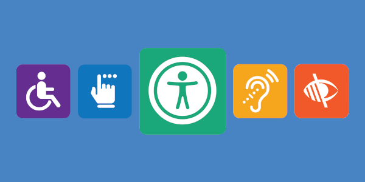
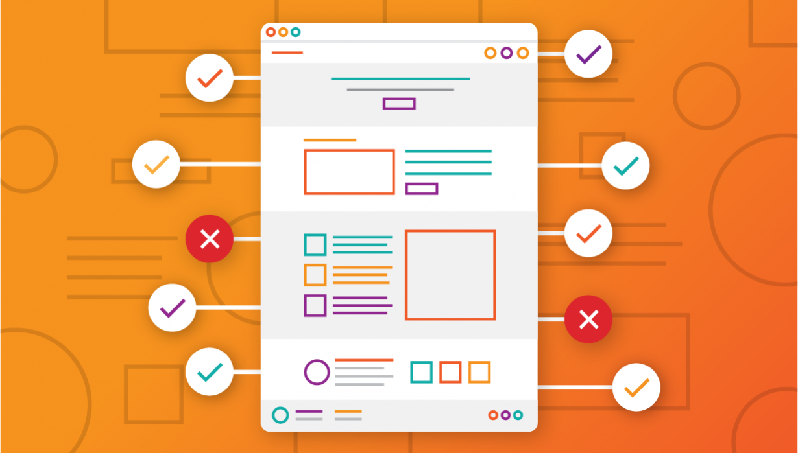
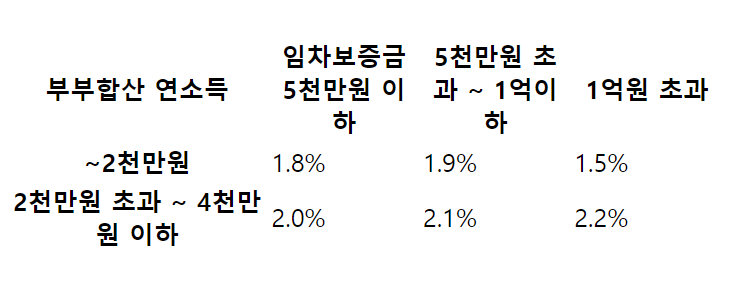
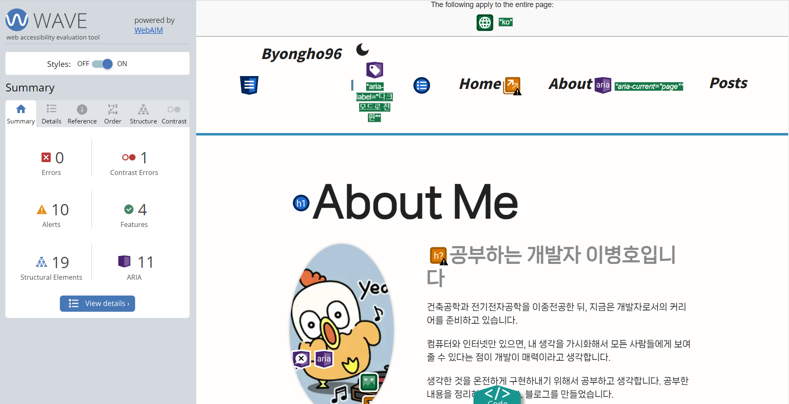
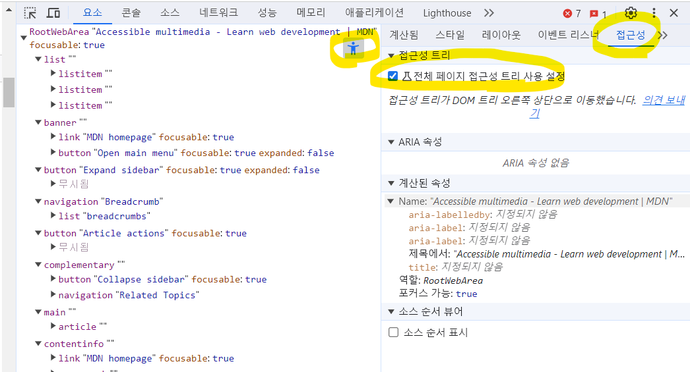
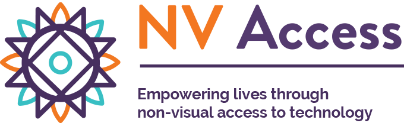

# 1. 웹 접근성



## 1.1. 웹 접근성이란?

웹 접근성이란 **다양한 배경의 사람들이 차별없이 웹 콘텐츠에 접근할 수 있도록 보장하는 것**을 말한다. 다양한 배경이라 함은 신체적 장애, 상황적 장애, 사회경제적 제한을 의미한다. 따라서 보통 웹 접근성이라 하면 신체적 장애를 떠올리지만, 실제로는 훨씬 더 포괄적인 개념이다.

예컨데 모바일 기기밖에 없는 상황적 장애를 가진 사람들을 위해 반응형 UI를 만드는 것, 느린 네트워크 속도의 사회적 제한을 가진 사람들을 위해 CSS 파일을 HTML에서 분리하고, JS파일 크기를 줄이는 것 등도 웹 접근성의 일환이다.

웹 접근성은 W3C에서 발표하는 [WCAG(웹 콘텐츠 접근 가이드)](https://www.w3.org/WAI/standards-guidelines/wcag/#versions)에 의해 표준안이 지정된다. 우리나라에서도 자체적으로 [한국형 웹 콘텐츠 접근성 지침](http://www.websoul.co.kr/accessibility/WA_guide21.asp)을 발표하고 있따. 이러한 웹 접근성은 단순 권고사항을 넘어 법적으로([장애인 차별금지법 21조](<http://www.kwacc.or.kr/Accessibility/Law#:~:text=%EC%A0%9C21%EC%A1%B0(%EC%A0%95%EB%B3%B4%ED%86%B5%EC%8B%A0,%EC%88%98%EB%8B%A8%EC%9D%84%20%EC%A0%9C%EA%B3%B5%ED%95%B4%EC%95%BC%20%ED%95%9C%EB%8B%A4.)>)) 제재되는 사항이기 때문에 기업에서 준수하고자 노력한다.

## 1.2. 고려해야할 사항

웹 접근성은 포괄적인 개념이자 행동강령이기 때문에 모든 것을 고려하기는 어렵다. 하지만 다음 사항을 염두에 둠으로써 웹 접근성의 많은 부분을 실천할 수 있다.

- **시각적 요소**  
   시각 자료에 대해서 대체 텍스트를 제공한다.

- **청각적 요소**
  청각 자료에 대해서 시각 보조 자료를 제공한다.

- **키보드 접근성**  
   모든 기능 및 콘텐츠를 키보드로 접근할 수 있도록 한다.

# 2. 구체적인 방법들



## 2.0. 시멘틱 태그

적절한 시멘틱 태그를 사용하면, 스크린 리더와 같은 보조기술이 웹을 더 쉽게 이해할 수 있다.

- [시멘틱 태그에 대해 정리한 블로그 글](https://byongho96.github.io/TIL/posts/Language/HTML/semantic_tag/)

## 2.1. 페이지 언어

`<html>`의 페이지 언어 `lang`속성을 설정함으로써, 스크린리더와 같은 보조기술이 해당 문서를 어떤 언어로 읽을지 선택할 수 있다.

```html
<html lang="en">
  ...
  <body>
    <p>한글</p>
  </body>
</html>
```

📢 한글 쎄이 한 한글 쎄이 글

```html
<html lang="ko">
  ...
  <body>
    <p>한글</p>
  </body>
</html>
```

📢 한글

## 2.2. 탭 인덱스

`tabindex`속성을 통해 키보드를 통한 포커싱을 조절할 수 있다.

- **tabindex = "-1"**  
   원래 상호작용하는 요소에 포커스가 잡히지 않도록 한다.

  ```html
  <button tabindex="-1">제출</button>
  ```

- **tabindex = "0"**  
   원래 상호작용하지 않는 요소에 포커스가 잡히도록 한다.
  ```html
  <div tabindex="0">연락처</div>
  ```
- **tabindex = "양수"**  
   요소들 간 포커스가 잡히는 순서를 강제로 변경할 수도 있다. 양수로 지정된 요소가 여러 개라면, `tabindex="1" -> tabindex="2" -> tabindex="3" -> ... -> tabindex="0"` 순으로 포커스가 이동한다.

  ```html
  <input type="text" name="이름" /> <!--세 번째 -->

  <input type="password" name="비밀번호" tabindex="2" /> <!--두 번째 -->

  <input type="email" name="이메일" tabindex="1" /> <!--첫 번째 -->
  </p>
  ```

## 2.3. 이미지

```html

```

📢 이미지

```html

```

📢 빨간 사과 이미지

## 2.4. 버튼

### 2.4.1. 단독 사용

`<button>`은 기본적으로 '버튼'이라는 음성을 출력한다. `aria-label`속성이 있으면 해당 속성을 읽고, 없으면 내부 컨텐츠를 읽는다.

```html
<button>+</button>
```

📢 플러스 버튼

```html
<button aria-label="장바구니 추가 버튼">+</button>
```

📢 장바구니 추가 버튼 버튼

```html
<button aria-label="장바구니 추가">+</button>
```

📢 장바구니 추가 버튼

### 2.3.2. 중첩 사용

```html
<button>
  
</button>
```

📢 장바구니 이모티콘 그래픽 버튼

```html
<button>
  
</button>
```

📢 장바구니 추가 그래픽 버튼

```html
<button aria-label="장바구니 추가">
  
</button>
```

📢 장바구니 추가 버튼

## 2.5. 링크

### 2.5.1. 단독 사용

`<a>`은 기본적으로 '링크'이라는 음성을 출력한다. `aria-label`속성이 있으면 해당 속성을 읽고, 없으면 내부 컨텐츠를 읽는다.

```html
<a href="#">다음</a>
```

📢 다음 링크

```html
<a href="#" aria-label="다음 포스트 보기">다음</a>
```

📢 다음 포스트 보기 링크

```html
<p>
  더 자세한 사항을 보려면
  <a href="#">여기</a>를 클릭하세요.
</p>
```

📢 여기 링크

### 2.5.2. 중첩 사용

```html
<a href="#">
  
</a>
```

📢 오른쪽 화살표 그래픽 링크

```html
<a href="#" aria-label="다음 포스트 보기">
  
</a>
```

📢 다음 포스트 보기 링크

## 2.7. 표

해당 항목은 [카카오페이 테크 블로그](https://tech.kakaopay.com/post/accessibility-stories-for-everyone/#%EA%B0%9C%EB%B0%9C-%EB%B3%B4%EC%A1%B0-%EB%8F%84%EA%B5%AC)의 글을 보고 정리했다. 실제 NVDA 스크린 리더를 사용했을 때는 별다른 차이점을 찾을 수 없었다.

- **\<caption> 태그 사용**  
   표의 제목을 `<caption>`으로 제공할 수 있다. 사용자는 제목을 통해 표 콘텐츠를 확인할지, 넘어갈지 결정할 수 있다. 주의해야 할 점은 `display:none` 혹은 `visibility:hidden`으로 `<caption>`을 숨기면 스크린 리더도 요소를 읽을 수 없다.

- **scope 속성 사용**  
   `<th>`요소를 제목 셀로 사용할 때, 열의 제목이라면 `scope="col"`, 행의 제목이라면 `scope="row"`를 추가해서 구분할 수 있다.



```html
<table>
  <caption>
    <span style="opacity: 0"
      >부부합산 연소득과 임차보증금 기준 구간별 일반가구 상품 대출 금리</span
    >
  </caption>
  <colgroup>
    <col width="166px" />
    <col width="95px" />
    <col width="95px" />
    <col width="95px" />
  </colgroup>
  <thead>
    <tr>
      <th scope="col">부부합산 연소득</th>
      <th scope="col">임차보증금 5천만원 이하</th>
      <th scope="col">5천만원 초과 ~ 1억이하</th>
      <th scope="col">1억원 초과</th>
    </tr>
  </thead>
  <tbody>
    <tr>
      <th scope="row">~2천만원</th>
      <td>1.8%</td>
      <td>1.9%</td>
      <td>1.5%</td>
    </tr>
    <tr>
      <th scope="row">2천만원 초과 ~ 4천만원 이하</th>
      <td>2.0%</td>
      <td>2.1%</td>
      <td>2.2%</td>
    </tr>
  </tbody>
</table>
```

## 2.8. 모달

`<dialog>`의 `showModal()`메서드로 모달 기능을 구현하면 다음 이점을 얻을 수 있다.

- **자동 포커싱**  
  모달이 뜨는 즉시, 내부 컨텐츠를 자동 포커싱한다.

- **접근성 트랩**  
  모달이 떠 있는 동안, 포커싱이 모달 내부로 제한된다.

```html
<dialog>
  <button autofocus>Close</button>
  <p>This modal dialog has a groovy backdrop!</p>
</dialog>
<button>Show the dialog</button>
```

```js
const dialog = document.querySelector('dialog')
const showButton = document.querySelector('dialog + button')
const closeButton = document.querySelector('dialog button')

// "Show the dialog" button opens the dialog modally
showButton.addEventListener('click', () => {
  dialog.showModal()
})

// "Close" button closes the dialog
closeButton.addEventListener('click', () => {
  dialog.close()
})
```

## 2.9. 라이브 메시지

`aria-live`속성을 통해 요소가 가진 턴텐츠가 바뀌었을 때, 이를 실시간으로 사용자에게 알려줄 수 있다.

- **`aria-live="off"`**  
  기본 속성으로 내부 콘텐츠가 바뀌어도 읽지 않는다.

- **`aria-live="polite"`**  
  현재 스크린 리더가 읽고있는 작업이 끝난 후, 바뀐 콘텐츠를 읽는다.

- **`aria-live="off"`**  
  바뀐 컨텐츠 내용을 즉시 읽는다.

```html
<div>
  <input type="text" name="이름" />
  <p arial-live="assertive">실시간으로 변하는 에러 메시지</p>
</div>
```

# 3. 도구

개발과정에서 사용자 접근성을 테스트하기 위해서 다음 도구들을 사용할 수 있다.

- **[WAVE(Web Accessibility Evaluatioin Tool)](https://wave.webaim.org/extension/)**  
  웹 페이지에 대한 접근성 준수 여부 테스트할 수 있다.  
   
- **Chrome DevTools: Accessibility**  
   크롬 개발자 도구에서 접근성 트리를 활성화 시킴으로써, 보조 기기에 어떻게 컨텐츠가 전달 될 지 확인할 수 있다.
  

- **[NVDA](https://www.nvaccess.org/download/)**  
   무료 스크린 리더 프로그램이다.
  

# 참고자료

- [카카오페이 기술 블로그: 모두를 위한 접근성 이야기](https://tech.kakaopay.com/post/accessibility-stories-for-everyone/)
- [Inpa Dev: 웹 표준 & 웹 접근성 이란?](https://inpa.tistory.com/entry/WEB-%F0%9F%93%9A-%EC%9B%B9-%ED%91%9C%EC%A4%80%EC%9D%98-%EC%9D%B4%ED%95%B4)
- [DaleSeo: HTML의 tabindex 속성과 키보드 포커스](https://www.daleseo.com/html-tabindex/)
- [boostcourse: 적절한 링크 텍스트](https://m.boostcourse.org/web344/lecture/35121)
- [10분 테코톡: 해온, 첵스의 웹접근성 & 웹표준](https://www.youtube.com/watch?v=6p0lZaSAW3A)
- [10분 테코톡: 블링의 웹 접근성](https://www.youtube.com/watch?v=yLZZi5E7NTU)
