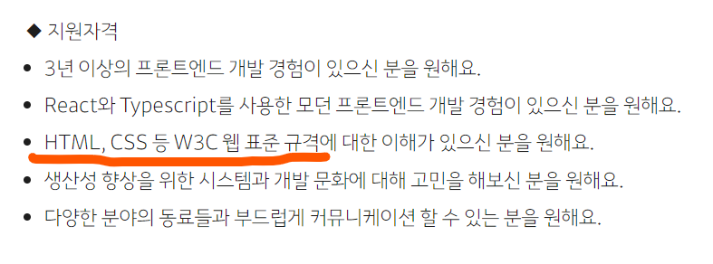
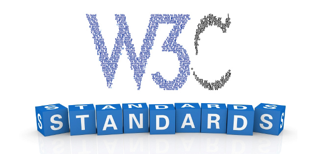
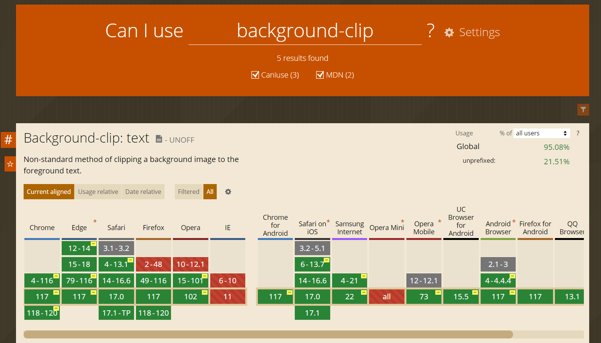
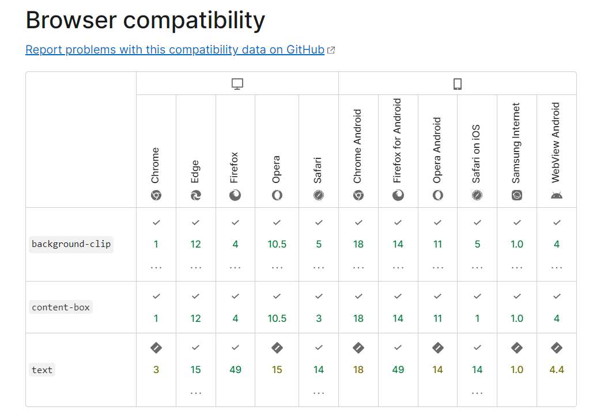

# 1. 개요

<figure>
    
    <figcaption>카카오페이 프론트직무 채용공고 일부</figcaption>
</figure>

취업 시즌을 맞아 채용공고가 많이 올라온다. 그 중 프론트 채용공고에서는 **W3C 웹 표준**이 자주 언급된다. 항상 크게 개의치 않고 넘겼는데, 어느 날 문득 생각해보니 웹표준에 대해 아는 바가 전혀 없었다. HTML, CSS처럼 기초적인 내용과 묶일 정도면 상당히 중요한 것 같은데 말이다. 그래서 망신당하지 않기 위해 빠르게 학습해보기로 했다.

# 2. 웹 표준

## 2.1. 정의

웹 표준에 대한 명확한 정의는 없었다. W3C에서는 웹 표준을 <b>"조화로운 디지털 연결 사회를 만들기 위한 청사진"</b>이라고, MDN에서는 <b>"웹사이트를 만들 때 쓰이는 기술들에 대한 긴 명세서"</b>라고 정의한다. 이쯤 되면 정의가 맞는지도 의심스럽다.

> Web standards are blueprints –or building blocks– of a consistent and harmonious digitally connected world. [[W3C: Web Standards]](https://www.w3.org/standards/#:~:text=Web%20standards%20are%20blueprints%20%E2%80%93or,our%20experience%20on%20the%20web.)

> Web standards are the technologies we use to build websites. These standards exist as long technical documents called specifications. [[MDN: The web and web standards]](https://developer.mozilla.org/en-US/docs/Learn/Getting_started_with_the_web/The_web_and_web_standards)

## 2.2. 웹의 역사

하지만 웹의 역사를 돌이켜 볼 때, **웹 표준의 추상적인 정의는 당연**한 것이다. 아니 당연할 뿐 아니라 오히려 값진 것이라고 말할 수 있겠다. 팀 버너스-리가 창시한 웹은 **중립적이고 개방적인 생태계를 지향**했다. 그리고 지금의 웹은 그 가치를 지키기 위해 수많은 사람들이 노력한 결과이다.

웹의 역사를 알면, 웹 표준을 더 정확하게 이해할 수 있다. 예를 들어 [HTML, CSS, JS로 문서를 구성하는 것](https://www.w3.org/wiki/The_web_standards_model_-_HTML_CSS_and_JavaScript)도 웹 표준을 따르는 것이다. 지금은 너무 당연하기 때문에 '엥?'이라고 생각할 수 있지만, 아무것도 없던 시절 누군가(팀 버너스-리 외 다수)가 노력하였기 때문에 당연해진 것이다.

간혹 웹 표준과 웹 접근성을 동일시하는 경우가 있었다. 비록 (개발 과정에서) 웹 접근성이 웹 표준의 많은 부분을 차지하지만, **웹 접근성은 웹 표준의 일부**일 뿐이다.

- **1960년대 후반**
  - 미국 군대가 ARPANET(ARPA Network)이라는 통신 네트워크를 개발.
  - ARPANET은 패킷 스위칭을 기반으로 하며, 최초로 TCP/IP 프로토콜을 구현했다.

- **1980년**
  - CERN(유럽 입자 물리 연구소)의 팀 버너스-리(Tim Berners-Lee)가 ENQUIRE라는 노트북 프로그램을 작성.
  - ENQUIRE는 노드들 간의 링크 개념을 포함했다.

- **1989년**
  - 팀 버너스-리가 CERN에서 ['Information Management: A Proposal'](https://www.w3.org/History/1989/proposal.html)과 'HyperText'를 작성.
  - 이 두 출판물이 웹의 작동 방식에 대한 밑바탕을 제공했다.

- **1990년**
  - 팀 버너스-리가 웹의 최초 버전을 실행하기 위한 모든 요소를 개발.
  - HTTP, HTML, WorldWideWeb(첫 번째 웹 브라우저, 이후 Nexus로 개명)

- **1993년**
  - CERN이 WWW의 로열티를 포기함으로써 개방적인 웹 생태계의 형성을 지원
  - 미국 NCSA가 최초 PC용 웹브라우저 ‘모자이크’를 발표 및 공개.

- **1994년**
  - 팀 버너스-리가 World Wide Web Consortium (W3C)를 설립.
  - W3C는 다양한 기술 회사 대표들을 모아 웹 기술 명세의 개발을 위해 협력하는 조직으로 시작되었다.

- **이후**
  - CSS(1996)와 JavaScript(1995)와 같은 다른 기술들이 등장하면서 웹은 현재의 모습으로 점차 발전함.

## 2.2. 효과

웹 표준을 따르면 웹의 가치를 지키는데 공헌할 수 있을 뿐 아니라, **실질적인 부가가치를 창출한다.**

* **브라우저 호환성 향상**   
    브라우저가 웹 표준을 지키려고 노력하기 때문에, 웹 표준에 맞춰 개발한 사이트는 여러 브라우저에서 일관되게 동작한다.

* **검색 엔진 최적화 (SEO)**    
    웹 표준을 준수하면 검색 엔진이 웹 페이지를 더 잘 이해하고 색인화할 수 있다. 이로 인해 검색 엔진 순위가 향상되고 검색 결과에 노출될 가능성이 높아진다.

* **접근성 향상**  
    웹 표준을 준수하면 웹 콘텐츠의 접근성을 향상시킬 수 있다. 다양한 시각, 청각, 운동 능력을 가진 사용자 그룹에게 콘텐츠를 차별없이 제공할 수 있다.

* **유지 관리성 향상**  
    표준 준수 코드는 예측이 더 용이하기 때문에, 새로운 기능 추가나 버그 수정이 효율적으로 이루어질 수 있다.

* **보안 향상**  
    웹 표준은 다양한 케이스를 고려하여 만들어진 권고안이다. 따라서 표준 준수 방식으로 개발된 웹 사이트는 일반적으로 보다 안전하며 취약점이 적게 발생한다.

## 2.3. 표준 문서 모음

웹 표준의 실체는 표준 문서들의 집합이다. 다음은 대표적인 웹 표준 문서들이다.

- [W3C 표준 문서 모음](https://www.w3.org/TR/)
  - W3C에서 제공하는 다양한 웹 기술에 대한 명세이다. 대표적으로 CSS와 WCAG(웹 콘텐츠 접근성 지침)의 표준을 정한다.
  - [CSS 표준 명세](https://www.w3.org/TR/CSS/)
  - [웹 접근성 표준 명세](https://www.w3.org/WAI/standards-guidelines/wcag/)
  - [SVG 표준 명세](https://www.w3.org/TR/SVG2/)
  - [webRTC 표준 명세](https://www.w3.org/TR/webrtc/)

- [HTML Living Standard]( https://html.spec.whatwg.org/multipage/)
  - WHATWG에서 제공하는 HTML과 웹 API에 대한 표준 명세이다.

- [ECMAScript 2021](https://tc39.es/ecma262/)
  - ECMAScript는 JavaScript의 표준을 정한다.

- [HTTP/2 표준 명세](https://datatracker.ietf.org/doc/html/rfc7540)
  - IETF는 HTTP 프로토콜의 개발 및 표준화를 주관한다.

- [Khronos 표준 문서 모음](https://www.khronos.org/developers)
  - Khronos는 3D그래픽 관련 기술에 대한 표준을 정한다.

# 3. 구체적인 방법들

그래서 웹 표준을 준수하려면 위에 나열된 문서들을 따르면 된다. 그런데 문서의 양이 방대할 뿐 아니라, 대부분은 실제 개발과는 다소 거리가 있는 내용들이다. 따라서 실제로 웹 표준을 준수하며 개발하기 위한 몇가지 방법들을 정리해보았다.

## 3.1. 유효한 HTML 및 CSS 사용

[서울특별시의 웹 표준 준수 가이드](https://news.seoul.go.kr/gov/archives/47485)에서는 W3C의 표준 HTML과 CSS 문법 검사를 통과할 것을 권고한다.

- [W3C HTML 문법 검사](http://validator.w3.org/)
- [W3C CSS 문법 검사](http://validator.w3.org/)

## 3.2. 크로스 브라우징 테스트

일단 크로스 브라우징 테스트 툴이 있기는하다. 대표적으로 BrowserStack이라는 툴이 있는데 유료다.

- [BrowserStack: 크로스 브라우징 테스트 툴](https://www.browserstack.com/)

회사 같은데서 개발하면 테스트 툴을 지원해줄 것 같지만, 나 같은 백수가 개인 프로젝트를 위해서 출혈을 감내하는 것은 목숨이 위태로운 일이다. 따라서 대안으로 내가 사용하려는 채신 기술들을 아래 사이트에서 하나하나 확인해볼 수 있다. 원래 돈이 없으면 몸이 고생하는 법이다.

- [can i use](https://caniuse.com/)  
  

- [mdn](https://developer.mozilla.org/ko/)  
  

## 3.3. 시멘틱 태그

의외로 시멘틱 태그는 HTML5(2014)에 도입된 비교적 최근 문법이다. 시멘틱 태그를 사용함으로써 이러한 태그들은 **웹 페이지의 구조와 콘텐츠의 의미를 더 명확하게 정의**할 수 있다. HTML5의 시멘틱 태그 예시로는 `<header>`, `<nav>`, `<main>`, `<article>`, `<section>`, `<aside>`, `<footer>` 등이 있다.

- [시멘틱 태그에 대해 정리한 블로그 글](https://byongho96.github.io/TIL/posts/Language/HTML/semantic_tag/)

## 3.4. 웹 접근성

웹 접근성은 한 마디로 **다양한 시각, 청각, 운동 능력을 가진 사람들이 차별없이 웹 콘텐츠에 접근**하기 위한 방법들이다. **스크린 리더**와 **키보드 접근성**이 대표적인 웹 접근성의 구현체이다.

- [웹 접근성에 대해 정리한 블로그 글](https://byongho96.github.io/TIL/posts/Knowledge/Web/web_accessibility/)

# 참고자료
- [MDN: The web and web standards](https://developer.mozilla.org/en-US/docs/Learn/Getting_started_with_the_web/The_web_and_web_standards)
- [서울특별시: 정보통신접근성 및 웹 표준 준수 가이드 안내](https://news.seoul.go.kr/gov/archives/47485)
- [Inpa Dev: 웹 표준 & 웹 접근성 이란?](https://inpa.tistory.com/entry/WEB-%F0%9F%93%9A-%EC%9B%B9-%ED%91%9C%EC%A4%80%EC%9D%98-%EC%9D%B4%ED%95%B4)
