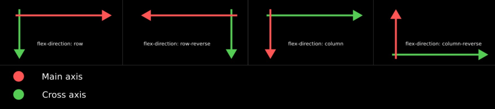
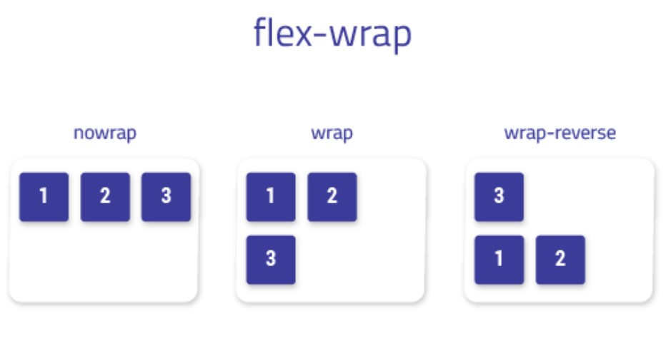
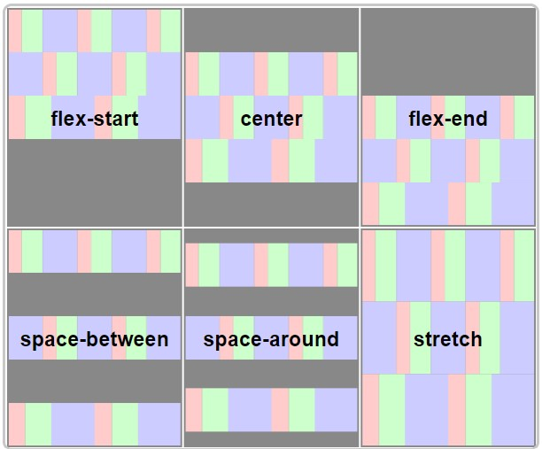
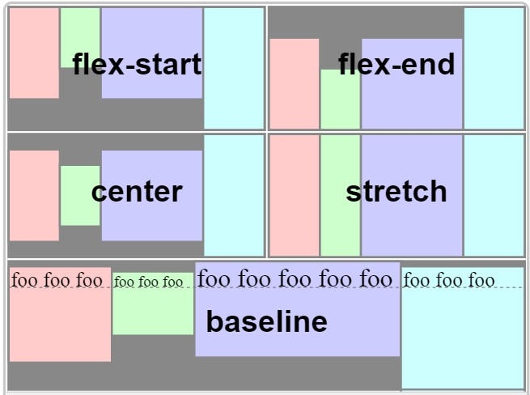
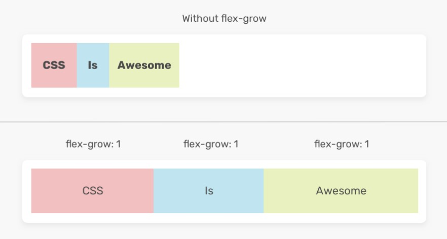
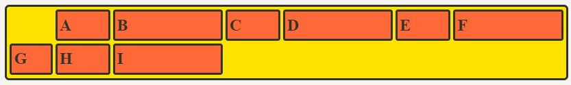

- [1. Float](#1-float)
- [2. Flexbox](#2-flexbox)
  - [2.1. Declaration](#21-declaration)
  - [2.2. From Definition](#22-from-definition)
    - [2.2.1. flex-direction](#221-flex-direction)
    - [2.2.2. flex-wrap](#222-flex-wrap)
    - [2.2.3. flex-flow](#223-flex-flow)
  - [2.3. Align](#23-align)
    - [2.3.1. justify-content](#231-justify-content)
    - [2.3.2. justify-items](#232-justify-items)
    - [2.3.3. justify-self](#233-justify-self)
    - [2.3.4. align-content](#234-align-content)
    - [2.3.5. align-items](#235-align-items)
    - [2.3.6. align-self](#236-align-self)
  - [2.4. Width](#24-width)
    - [2.4.1. flex-basis](#241-flex-basis)
    - [2.4.2. flex-grow](#242-flex-grow)
    - [2.4.3. flex-shrink](#243-flex-shrink)
    - [2.4.4. flex](#244-flex)
- [3. Grid](#3-grid)
  - [3.1. Declaration](#31-declaration)
  - [3.2. Shape Definition](#32-shape-definition)
    - [3.2.1. grid-template-columns/rows](#321-grid-template-columnsrows)
    - [3.2.2. grid-auto-columns/rows](#322-grid-auto-columnsrows)
    - [3.2.3. grid-auto-flow](#323-grid-auto-flow)
    - [3.2.4. gap](#324-gap)
  - [3.3. Cell Placement](#33-cell-placement)
    - [3.3.1. grid-column/rows-\*](#331-grid-columnrows-)
    - [3.3.2. grid-template-areas](#332-grid-template-areas)
  - [3.4. Align](#34-align)
    - [3.4.1. justify-content](#341-justify-content)
    - [3.4.2. justify-items](#342-justify-items)
    - [3.4.3. justify-self](#343-justify-self)
    - [3.4.4. align-content](#344-align-content)
    - [3.4.5. align-items](#345-align-items)
    - [3.4.6. align-self](#346-align-self)
- [4. 가상 선택자](#4-가상-선택자)
- [5. 애니메이션](#5-애니메이션)
- [6. 사용자 지정 속성](#6-사용자-지정-속성)

---

# 1. Float

[CSS Float Mozilla](https://developer.mozilla.org/ko/docs/Web/CSS/float)

# 2. Flexbox

[flexbox에 관한 블로그 글](https://studiomeal.com/archives/197)

## 2.1. Declaration

컨테이너에 `display: flex`를 적용한다.

- **width**는 content 크기만큼 차지한다.
- **height**는 container 높이만큼 늘어난다.

```css
.container {
  display: flex;
  display: inline-flex; /* 컨테이너 자체가 inline-block */
}
```

## 2.2. From Definition

### 2.2.1. flex-direction

main axis의 방향을 결정한다.

```css
.container {
  display: flex;
  flex-direction: row; /*default*/
  flex-direction: row-reverse;
  flex-direction: column;
  flex-direction: column-reverse;
}
```



### 2.2.2. flex-wrap

줄바꿈 속성을 결정한다.

```css
.container {
  display: flex;
  flex-wrap: nowrap; /*default*/
  flex-wrap: wrap;
  flex-wrap: wrap-reverse;
}
```



### 2.2.3. flex-flow

flex-direction과 flex-wrap을 한 번에 지정한다.

```css
.container {
  flex-flow: row nowrap;
}
```

## 2.3. Align

### 2.3.1. justify-content

메인축 방향으로 컨텐츠 배열방식 지정

```css
.container {
  justify-content: flex-start;
  justify-content: flex-end;
  justify-content: center;
  justify-content: space-between;
  justify-content: space-around;
  justify-content: space-evenly;
}
```


### 2.3.2. justify-items

flex에서는 쓰이지 않음

### 2.3.3. justify-self

flex에서는 쓰이지 않음

### 2.3.4. align-content

`flex-wrap: wrap;`인 상태에서 행이 2줄 이상일 때, 수직축 방향으로 컨텐츠 배열방식 지정

```css
.container {
  align-content: flex-start;
  align-content: flex-end;
  align-content: center;
  align-content: space-between;
  align-content: space-around;
  align-content: space-evenly;
}
```



### 2.3.5. align-items

한 개의 열에서 컨텐츠들의 수직 정렬을 지정한다.

```css
.container {
  align-items: stretch;
  align-items: flex-start;
  align-items: flex-end;
  align-items: center;
  align-items: baseline;
}
```



### 2.3.6. align-self

한 개의 열에서 개별 컨텐츠의 수직 정렬을 지정한다.

```css
.container {
  align-self: stretch;
  align-self: flex-start;
  align-self: flex-end;
  align-self: center;
  align-self: baseline;
}
```

## 2.4. Width

### 2.4.1. flex-basis

아이템의 기본(최소)너비를 설정한다.

```css
.item {
  flex-basis: auto; /* 기본값 */
  flex-basis: 0;
  flex-basis: 50%;
  flex-basis: 300px;
  flex-basis: 10rem;
  flex-basis: content;
}
```

### 2.4.2. flex-grow

한 행을 채우도록하는 컨텐츠 너비를 분배방식을 지정

**flex-basis를 제외한 여백 부분**을 flex-grow에 지정된 숫자의 비율로 아이템이 나누어 가진다. 따라서 원하는 비율대로 너비를 나누기 위해서는 flex-basis를 0으로 설정한다.

```css
.item {
  flex-grow: 1;
  /* flex-grow: 0; */ /* 기본값 */
}
```



### 2.4.3. flex-shrink

아이템이 flex-basis보다 작아질 수 있는지를 결정합니다.

**기본값이 1이기 때문에 아이템의 크기는 flex-basis보다 작아질 수 있다.** flex-shrink가 0일 경우, 아이템의 크기가 flex-basis보다 작아지지 않는다.

### 2.4.4. flex

flex-grow, flex-shrink, flex-basis를 한 번에 쓸 수 있는 축약형 속성.

```css
.item {
  flex: 1;
  /* flex-grow: 1; flex-shrink: 1; flex-basis: 0%; */
  flex: 1 1 auto;
  /* flex-grow: 1; flex-shrink: 1; flex-basis: auto; */
  flex: 1 500px;
  /* flex-grow: 1; flex-shrink: 1; flex-basis: 500px; */
}
```

# 3. Grid

[Grid System에 관한 블로그 글](https://studiomeal.com/archives/533)  
[Grid System Youtube](https://www.youtube.com/watch?v=9zBsdzdE4sM)

## 3.1. Declaration

Grid 컨테이너에 `display: grid;`를 선언한다.

```css
.container {
  display: grid;
  display: inline-grid; /* 컨테이너 자체가 inline-block */
}
```

## 3.2. Shape Definition

### 3.2.1. grid-template-columns/rows

```css
.container {
  grid-template-columns: 200px 200px 500px;
  /* grid-template-columns: 1fr 1fr 1fr */
  /* grid-template-columns: repeat(3, 1fr) */
  /* grid-template-columns: 200px 1fr */
  /* grid-template-columns: 100px 200px auto */

  grid-template-rows: 200px 200px 500px;
  /* grid-template-rows: 1fr 1fr 1fr */
  /* grid-template-rows: repeat(3, 1fr) */
  /* grid-template-rows: 200px 1fr */
  /* grid-template-rows: 100px 200px auto */
}
```

- **repeat(반복횟수, 반복값)**
- **minmax(최소, 최대)**
  ```css
  .container {
    grid-template-columns: repeat(3, 1fr);
    grid-template-rows: repeat(3, minmax(100px, auto));
  }
  ```
- **auto-fill**
  - 설정된 너비가 허용하는 최대한 컬럼 생성
    ```css
    .container {
      grid-template-columns: repeat(auto-fill, minmax(20%, auto));
    }
    ```
- **auto-fit**
  - 설정된 너비가 허용하는 최대한 컬럼 생성하고, 남는 공간을 채움

### 3.2.2. grid-auto-columns/rows

지정하지 않은 column, row에 대한 값을 설정

- **grid-auto-columns**
  ```css
  .container {
    grid-template-columns: 50px;
    grid-auto-columns: 1fr 2fr;
  }
  .item:nth-child(1) {
    grid-column: 2;
  }
  .item:nth-child(2) {
    grid-column: 3;
  }
  .item:nth-child(3) {
    grid-column: 4;
  }
  .item:nth-child(4) {
    grid-column: 5;
  }
  .item:nth-child(5) {
    grid-column: 6;
  }
  .item:nth-child(6) {
    grid-column: 7;
  }
  ```
  
- **grid-auto-rows**
  ```css
  .container {
    /* 1 ~ 3 행 */
    grid-template-rows: repeat(3, minmax(100px, auto));
    /* 4 ~ 행 */
    grid-auto-rows: minmax(100px, auto);
  }
  ```

### 3.2.3. grid-auto-flow

[grid-auto-flow Mozilla](https://developer.mozilla.org/en-US/docs/Web/CSS/grid-auto-flow)

아이템이 배치되는 순서를 설정

### 3.2.4. gap

셀 사이의 간격을 설정

```css
.container {
  row-gap: 10px;
  /* row의 간격을 10px로 */
  column-gap: 20px;
  /* column의 간격을 20px로 */
}
```

```css
.container {
  gap: 10px 20px;
  /* row-gap: 10px; column-gap: 20px; */
  gap: 20px;
  /* row-gap: 20px; column-gap: 20px; */
}
```

## 3.3. Cell Placement

### 3.3.1. grid-column/rows-\*

해당 셀의 그리드 시작 라인과 끝 라인 을 지정

```css
.item:nth-child(1) {
  grid-column-start: 1;
  grid-column-end: 3; /* -1일 경우 가장 끝 라인 */
  grid-row-start: 1;
  grid-row-end: 2; /* -1일 경우 가장 끝 라인 */
}
```

```css
.item:nth-child(1) {
  grid-column: 1 / 3;
  grid-row: 1; /* end를 생략하면 1칸 */
}
```

```css
.item:nth-child(1) {
  /* 1번 라인에서 2칸 */
  grid-column: 1 / span 2;
  /* 1번 라인에서 3칸 */
  grid-row: 1 / span 3;
}
```

### 3.3.2. grid-template-areas

셀의 각 영역에 이름을 붙이고, 해당 영역을 요소에서 `grid-area`속성의 값을 준다.

```css
.container {
  grid-template-areas:
    'header header header'
    '   a    main    b   '
    '   .     .      .   '
    'footer footer footer';
}

/* 속성 값에 따옴표 생략 */
.header {
  grid-area: header;
}
.sidebar-a {
  grid-area: a;
}
.main-content {
  grid-area: main;
}
.sidebar-b {
  grid-area: b;
}
.footer {
  grid-area: footer;
}
```

## 3.4. Align

### 3.4.1. justify-content

**Grid 아이템들의 너비를 모두 합한 값이 Grid 컨테이너의 너비보다 작을 때,** 모든 아이템을 가로 방향으로 정렬.

```css
.container {
  justify-content: stretch;
  /* justify-content: start; */
  /* justify-content: center; */
  /* justify-content: end; */
  /* justify-content: space-between; */
  /* justify-content: space-around; */
  /* justify-content: space-evenly; */
}
```

### 3.4.2. justify-items

컨텐츠를 각 셀 안에서, 가로축 방향으로 정렬

```css
.container {
  justify-items: stretch;
  /* justify-items: start; */
  /* justify-items: center; */
  /* justify-items: end; */
}
```

### 3.4.3. justify-self

개별 아이템의 셀 안에서, 가로축 방향으로 정렬

```css
.item {
  justify-self: stretch;
  /* justify-self: start; */
  /* justify-self: center; */
  /* justify-self: end; */
}
```

### 3.4.4. align-content

**Grid 아이템들의 높이를 모두 합한 값이 Grid 컨테이너의 높이보다 작을 때**, 모든 아이템을 세로 방향으로 정렬

```css
.container {
  align-content: stretch;
  /* align-content: start; */
  /* align-content: center; */
  /* align-content: end; */
  /* align-content: space-between; */
  /* align-content: space-around; */
  /* align-content: space-evenly; */
}
```

### 3.4.5. align-items

컨텐츠를 각 셀 안에서, 세로축 방향으로 정렬

```css
.container {
  align-items: stretch;
  /* align-items: start; */
  /* align-items: center; */
  /* align-items: end; */
}
```

### 3.4.6. align-self

개별 아이템의 셀 안에서, 세로축 방향으로 정렬

```css
.item {
  align-self: stretch;
  /* align-self: start; */
  /* align-self: center; */
  /* align-self: end; */
}
```

# 4. 가상 선택자

[YouTube part1](https://www.youtube.com/watch?v=zGiirUiWslI)
[YouTube part2](https://www.youtube.com/watch?v=xoRbkm8XgfQ)

# 5. 애니메이션

[YouTube](https://www.youtube.com/watch?v=YszONjKpgg4&t=731s)

# 6. 사용자 지정 속성

[MDN Docs](https://developer.mozilla.org/ko/docs/Web/CSS/Using_CSS_custom_properties#%EA%B8%B0%EB%B3%B8_%EC%82%AC%EC%9A%A9%EB%B2%95)
