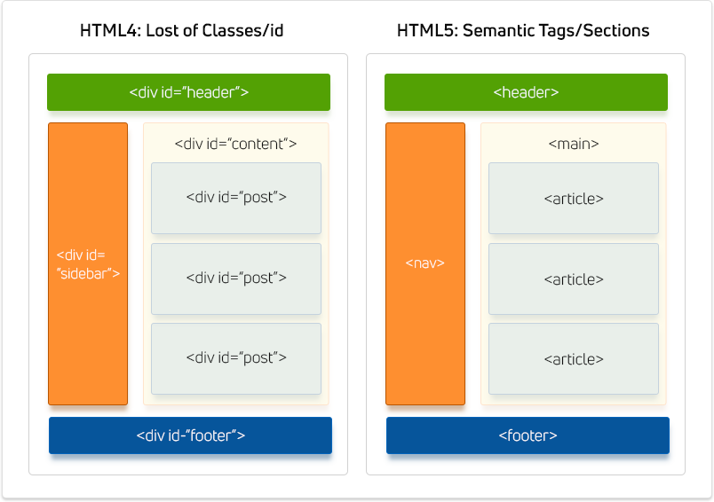

# 1. 시멘틱 태그란?



시멘틱 태그는 **웹 페이지의 구조와 콘텐츠 의미를 더 명확하게 설명**하기 위해 사용되는 HTML5 부터 도임된 문법이다.

- **코드 가독성 향상**  
    시멘틱 태그는 HTML 코드에 의미를 부여한다. 이로 인해 코드의 가독성이 향상되며, 개발자 간 협업이 용이해질 수 있다.
    
- **웹 접근성 향상**  
    시멘틱 태그는 스크린 리더 및 다른 보조 기술을 사용하는 사용자에게 웹 페이지 이해를 돕는다.

- **검색 엔진 최적화(SEO)**  
    검색 엔진은 시멘틱 태그를 통해 웹 페이지의 콘텐츠와 구조를 더 잘 이해하고 색인화할 수 있다.

- **브라우저 호환성**  
    시멘틱 태그는 최신 웹 표준에 따라 구현되어 있으므로 다양한 웹 브라우저에서 일관된 방식으로 렌더링한다.

# 2. 시멘틱 태그 구성 요소


## 2.1. \<header>

`<header>`는 문서에 대한 **도입 컨텐츠나 네비게이션 링크를 담는 요소**이다. 일반적으로 다음과 같은 내용을 포함한다

- 하나 이상의 제목 요소(h1 ~ h6)
- 로고나 아이콘
- 저자 정보

💡 하나의 문서가 여러 개의 `<header>`를 가질 수 있다. 하지만 `<header>`가 `<footer>`, `<address>`나 다른 `<header>`내부에 선언될 수는 없다.

```html
<header>
  <h1>Main page heading here</h1>
  <p>Posted by John Doe</p>
</header>
```

## 2.2. \<main>

`<main>`는 **문서의 핵심 컨텐츠를 담는다.** `<main>`가 담고 있는 내용은 문서 전체에서 유일해야한다. 즉 `<main>` 내부 내용이 사이드바, 내비게이션 등에서 중복되어서는 안된다.

💡 `<main>`는 **문서에서 유일**해야 한다. 또한  `<article>`, `<aside>`, `<footer>`, `<header>`, or `<nav>`등의 내부에 선언될 수 없다.

```html
<main>
  <h1>Most Popular Browsers</h1>
  <p>Chrome, Firefox, and Edge are the most used browsers today.</p>
  <article class="browser">
    <h2>Google Chrome</h2>
    <p>Google Chrome is a web browser developed by Google, released in 2008. Chrome is the world's most popular web browser today!</p>
  </article>
  <article class="browser">
    <h2>Mozilla Firefox</h2>
    <p>Mozilla Firefox is an open-source web browser developed by Mozilla. Firefox has been the second most popular web browser since January, 2018.</p>
  </article>
  <article class="browser">
    <h2>Microsoft Edge</h2>
    <p>Microsoft Edge is a web browser developed by Microsoft, released in 2015. Microsoft Edge replaced Internet Explorer.</p>
  </article>
</main>
```

## 2.3. \<footer>

`<footer>`는 문서의 바닥글을 가리킨다. 일반적으로 다음 내용을 포함한다.

- 저자 정보
- 저작권 정보
- 연락처 정보
- 사이트맵 & 관련 문서
- 연관

💡 `<footer>`내의 연락처 정보는 `<address>` 내부에 표기한다.

```html
<footer>
  <p>Author: Hege Refsnes</p>
  <address><a href="mailto:hege@example.com">hege@example.com</a></address>
</footer>
```


## 2.4. \<aside>

`<aside>`는 주변 컨텐츠와 비교적 관련성이 적은 컨텐츠를 담는다. 또한 `<aside>`는 일반적으로 문서 사이드에 배치된다.

💡 브라우저가 `<aside>`를 특별히 다르게 렌더링 하지는 않지만, CSS 선택자로 `<aside>`를 선택할 수 있다.

```html
<p>My family and I visited The Epcot center this summer. The weather was nice, and Epcot was amazing! I had a great summer together with my family!</p>

<aside>
<h4>Epcot Center</h4>
<p>Epcot is a theme park at Walt Disney World Resort featuring exciting attractions, international pavilions, award-winning fireworks and seasonal special events.</p>
</aside>
```

## 2.5. \<nav>

`<nav>`은 네비게이션 링크 집합을 정의한다. 문서의 모든 링크를 `<nav>`내부에 정의할 필요는 없다. `<nav>`에는 주요 링크만을 포함하는걸 권장한다.

💡 스크린 리더에서는 `nav`의 초기 렌더링 생략 여부를 설정할 수 있다.

```html
<nav>
  <a href="/html/">HTML</a> |
  <a href="/css/">CSS</a> |
  <a href="/js/">JavaScript</a> |
  <a href="/python/">Python</a>
</nav>
```

## 2.6. \<article>

`<article>`는 독립적인 하나의 컨텐츠를 가리킨다. `<article>` 내부 내용만으로 독립적인 별도의 문서를 만들 수 있어야 한다. 보통 `<article>`은 다음 내용을 포함한다.

- 블로그 게시글
- 뉴스 스토리

💡 브라우저가 `<article>`를 특별히 다르게 렌더링 하지는 않지만, CSS 선택자로 `<article>`를 선택할 수 있다.

```html
<article>
<h2>Google Chrome</h2>
<p>Google Chrome is a web browser developed by Google, released in 2008. Chrome is the world's most popular web browser today!</p>
</article>

<article>
<h2>Mozilla Firefox</h2>
<p>Mozilla Firefox is an open-source web browser developed by Mozilla. Firefox has been the second most popular web browser since January, 2018.</p>
</article>

<article>
<h2>Microsoft Edge</h2>
<p>Microsoft Edge is a web browser developed by Microsoft, released in 2015. Microsoft Edge replaced Internet Explorer.</p>
</article>
```

## 2.7. \<section>

`<section>`은 문서의 구획을 구분짓는다.

💡 `<section>`과 `<article>`은 명시적인 중첩관계를 가지지 않는다. 용도에 따라 `<section>`내부에 `<article>`을 사용할 수도 있고, 반대로 `<article>`내부에 `<section>`을 사용할 수도 있다.

```html
<section>
<h2>WWF History</h2>
<p>The World Wide Fund for Nature (WWF) is an international organization working on issues regarding the conservation, research and restoration of the environment, formerly named the World Wildlife Fund. WWF was founded in 1961.</p>
</section>

<section>
<h2>WWF's Symbol</h2>
<p>The Panda has become the symbol of WWF. The well-known panda logo of WWF originated from a panda named Chi Chi that was transferred from the Beijing Zoo to the London Zoo in the same year of the establishment of WWF.</p>
</section>
```

## 2.8. \<address>

`<address>`는 작성자나 소유자에 대한 연락처 정보를 담는다. 연락처 정보란 다음 내용을 포함한다.

- 이메일 주소
- URL
- 지리적 주소
- 휴대폰 번호
- 소셜 미디어

💡 `<address>`는 보통 이탤릭체로 렌더링되며, 브라우저는 항상 `<address>`앞 뒤로 줄바꿈을 추가한다.

```html
<address>
Written by <a href="mailto:webmaster@example.com">Jon Doe</a>.<br>
Visit us at:<br>
Example.com<br>
Box 564, Disneyland<br>
USA
</address>
```


## 2.9. \<figure> & \<figcaption>

`<figure>`은 일러스트, 다이어그램, 사진, 코드 목록과 같은 독립적인 콘텐츠를 가리킨다. `<figure>`의 내용은 주요 문맥과 관련이 있지만, 그 위치가 문맥과 독립적이어야 하고, 제거된 경우에도 문맥에 영향을 끼치지 않아야 한다.


💡 `<figcaption>`은 `<figure>` 요소에 캡셔을 추가하는데 쓰이며, `<figure>`의 첫 번째 또는 마지막 자식으로 배치한다.

```html
<figure>
  
  <figcaption>Fig.1 - Trulli, Puglia, Italy.</figcaption>
</figure>
```

## 2.10. \<details> & \<summary>

`<details>` 사용자가 열고 닫을 수 있는 추가 정보를 지정한다. 디폴트로 위젯은 닫혀 있고, 열면 위젯이 확장되면서 내부 콘텐츠를 보여준다. [MDN 문서 defaults 태그 예시 링크](https://developer.mozilla.org/en-US/docs/Web/HTML/Element/details)

💡 `<summary>`는 `<details>`이 닫혀 있을 때의 제목을 정의한다. `<summary>`는 `<details>`의 첫 번째 자식 요소여야 한다. [MDN 문서 summary 태그 예시 링크](https://developer.mozilla.org/en-US/docs/Web/HTML/Element/summary)

```html
<details>
  <summary>Epcot Center</summary>
  <p>Epcot is a theme park at Walt Disney World Resort featuring exciting attractions, international pavilions, award-winning fireworks and seasonal special events.</p>
</details>
```

# 참고자료
- [W3 Schools: HTML Semantic Elements](https://www.w3schools.com/html/html5_semantic_elements.asp)
- [Inpa Dev: HTML 시맨틱(Semantic) 태그의 쓰임새](https://inpa.tistory.com/entry/HTML-%F0%9F%93%9A-%EC%8B%9C%EB%A7%A8%ED%8B%B1-%ED%83%9C%EA%B7%B8-%EB%A0%88%EC%9D%B4%EC%95%84%EC%9B%83%EC%9D%84-%EC%A7%80%EC%A0%95)
