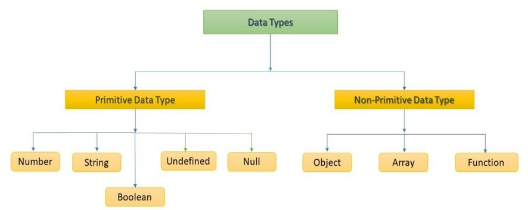

- [1. Intro](#1-intro)
  - [1.1. What is JavaScript?](#11-what-is-javascript)
  - [1.2. The History of JavaScript](#12-the-history-of-javascript)
  - [1.3. Write to HTML Script](#13-write-to-html-script)
  - [1.4. When to Run JS](#14-when-to-run-js)
    - [1.4.1. Synchronous execution](#141-synchronous-execution)
    - [1.4.2. DOMContentLoaded](#142-domcontentloaded)
    - [1.4.3. load](#143-load)
    - [1.4.4. aysnc / defer](#144-aysnc--defer)
- [2. Data Type and Operators](#2-data-type-and-operators)
  - [2.1. Semicolon](#21-semicolon)
  - [2.2. Comment](#22-comment)
  - [2.3. Indentifier](#23-indentifier)
  - [2.4. Variable Declaration Keywords](#24-variable-declaration-keywords)
  - [2.5. Data Types](#25-data-types)
  - [2.6. Operators](#26-operators)
    - [2.6.1. Assignment Operators](#261-assignment-operators)
    - [2.6.2. Relational Operators](#262-relational-operators)
    - [2.6.3. Equality Operators](#263-equality-operators)
    - [2.6.4. Identity Operators](#264-identity-operators)
    - [2.6.5. Logical Operators](#265-logical-operators)
    - [2.6.6. Ternary Operators](#266-ternary-operators)
- [3. Control Statements](#3-control-statements)
  - [3.1. Conditional Statements](#31-conditional-statements)
    - [3.1.1. if](#311-if)
    - [3.1.2. switch](#312-switch)
  - [3.2. Loop](#32-loop)
    - [3.2.1. while](#321-while)
    - [3.2.2. for](#322-for)
    - [3.2.3. for ... in](#323-for--in)
    - [3.2.4. for ... of](#324-for--of)
- [4. Function](#4-function)
  - [4.1. First-class Fucntion](#41-first-class-fucntion)
  - [4.2. Fucntion Declaration](#42-fucntion-declaration)
  - [4.3. Fucntion expression](#43-fucntion-expression)
  - [4.4. Arguments](#44-arguments)
    - [4.4.1. The Number of Arguments](#441-the-number-of-arguments)
    - [4.4.2. Default Arguments](#442-default-arguments)
    - [4.4.3. Rest Parameters](#443-rest-parameters)
  - [4.5. Arrow Function](#45-arrow-function)
  - [4.6. IIFE](#46-iife)
- [5. Array](#5-array)
  - [5.1. Array](#51-array)
    - [5.2. Methods](#52-methods)
  - [5.3. Array Helper Methods](#53-array-helper-methods)
  - [5.4. Array Loop](#54-array-loop)
- [6. Object](#6-object)
  - [6.1. Object](#61-object)
  - [6.2. ES6 Grammer](#62-es6-grammer)
    - [6.2.1. Property Initializer Shorthand](#621-property-initializer-shorthand)
    - [6.2.2 Concise Method](#622-concise-method)
    - [6.2.3. Computed Property Name](#623-computed-property-name)
    - [6.2.4. Destructing Assignment](#624-destructing-assignment)
    - [6.2.5. Unpacking Parameters](#625-unpacking-parameters)
  - [6.3. JSON](#63-json)

---

# 1. Intro

[MDN JavaScript Docs](https://developer.mozilla.org/ko/docs/Web/JavaScript)

## 1.1. What is JavaScript?

**The base language for the front-end web programming**

- The language that makes HTML documents look more dynamic
- Also the language being used in various areas, thanks to node.js
  - sever programming, mobile service, block chain, etc...

## 1.2. The History of JavaScript

- 1993, Mosaic Web Browser
  - GUI web browser
- 1994, Netscape Navigator
  - accounts for 80% of the market
- Netscape made a Script language for dynamic webpage
  - Mocha -> LiveScript -> JavaScript
- 1995, Inernet Explorer with JScript
  - JavaScript, JScript
- 1996-2000, ECMA proposed a standard of Script language
  - ECMAScript
  - MS didn't follow the standard cause its market share was high
- 2001-2004, Firefox with ActionScript3 and etc...
  - jQuery library is for transcripting the code to fit each browser engine
- 2008, Chrome with V8
  - V8 translates JavaScript very fast
- 2015, ECMAScript6, the standard made with Chrome

## 1.3. Write to HTML Script

The JS code can be written in \<script> tags.

- **Internal**
  ```html
  <body>
    <script>
      console.log('hello, javascript')
    </script>
  </body>
  ```

* **External**
  ```html
  <html>
    <body>
      <script src="hello.js"></script>
    </body>
  </html>
  ```

## 1.4. When to Run JS

[참고한 블로그 글](https://velog.io/@kim_unknown_/JavaScript-DOM-Defer-Async)

### 1.4.1. Synchronous execution

HTML documents are executed sequentially from the top. Therefore, if the script that takes a long time to load is at the top, the entire page loading time is increased.

```js
<!DOCTYPE html>
<html lang="en">
  <head>
    <meta charset="UTF-8" />
    <script src="app.js"></script>
  </head>
  <body>
    <div id="hello">hello</div>
  </body>
</html>
```

### 1.4.2. DOMContentLoaded

It is an event that occurs in the `document` **when the DOM is constructed**. However the event doesn't wait for CSS, img source and Subframes loading.

```html
<script>
  function ready() {
    alert('DOM이 준비되었습니다!')

    // 이미지가 로드되기 전에 실행된다.
    alert(`이미지 사이즈: ${img.offsetWidth}x${img.offsetHeight}`)
  }

  document.addEventListener('DOMContentLoaded', ready)
</script>


```

### 1.4.3. load

The load event of a window object is executed **when all resources such as style and image are loaded.** The load evnet can be modified by overriding `onload` property.

```html
<script>
  window.onload = function () {
    alert('페이지 전체가 로드되었습니다.')

    // 이미지까지 모두 로드된 후에 실행
    alert(`이미지 사이즈: ${img.offsetWidth}x${img.offsetHeight}`)
  }
</script>


```

### 1.4.4. aysnc / defer

- **async**
  Load scripts asynchronously in the background. When the load is complete, the script is executed.

- **defer**

Load scripts asynchronously in the background. When the DOM is constructed, all the loaded scripts are executed in order.


# 2. Data Type and Operators

**Style Guide**
[Airbnb Style Javascript Guide](https://github.com/airbnb/javascript)

## 2.1. Semicolon

Technically, semicolons should be inserted, but **ASI(Automatic Semicolon Insertion)** inserts semicolons automatically.

## 2.2. Comment

- **One-line**

  - //

- **multiple-lines**

  - /\* \*/

## 2.3. Indentifier

**The variable name to distinguish variables**

- **Naming Rules**

  - Starts with `characters, $, _`
  - Case-sensitive
  - **Notation**
    - **camelCase**: variable, instance, function
    - **PascalCase**: class
    - **SNAKE_CASE**: constant

## 2.4. Variable Declaration Keywords

- **var**

  - The default keyword
  - Re-declaration, Re-assignment
  - Function scope
  - <mark>Hoisting, not recommended</mark>

- **let**

  - Re-assignment
  - Block scope

- **const**

  - Block scope

## 2.5. Data Types



- <mark>All the non-primitive types are Objects</mark>

* **Number**

  - `Infinity`
    - a very large number
  - `NaN` (Not a Number)
    - When the variable can't be read as a number
      - `Number(undefined)`
    - Imaginary number
      - `Math.sqrt(-1)`
    - When an operand is NaN
      - `7 * NaN`
    - The result can't be defined
      - `0 * Infinity`
    - Containing a string for the calculation which is not addition
      - `'A' * 3`

* **String**

  - Both `'` and `"` can be used
  - Strings can be combined with `+`
  - Template literals (`` ` ``)
    - multi-line strings
    - string interpolation
      - `` `My name is ${name}` ``

* **Empty Value**

  - **null**
    - Specified by developer
    ```js
    console.log(typeof null) // object, BUT IT'S PRIMITIVE DATA TYPE
    ```
  - **undefined**
    - Specified by engine

* **Boolean**
  - `true`
  - `false`

## 2.6. Operators

### 2.6.1. Assignment Operators

```javascript
let c = 0

c += 10 // 10
c -= 3 // 7
c *= 10 // 70

// not recommended
c++ // 71
c-- // 70
```

### 2.6.2. Relational Operators

```javascript
3 > 2 // true
3 < 2 // false

// UNICODE
'A' < 'B' // true
'Z' < 'a' // true
```

### 2.6.3. Equality Operators

Automatic type casting occurs, so should not be used frequently

```javascript
const a = 1
const b = '1'

console.log(a == b) // true
console.log(a == true) // true
```

### 2.6.4. Identity Operators

```javascript
const a = 1
const b = '1'

console.log(a === b) // false
console.log(a === Number(b)) // true
```

### 2.6.5. Logical Operators

```javascript
true && false // false
true && true // true

false || true // true
false || false // false

!true // false
```

### 2.6.6. Ternary Operators

```javascript
true ? 1 : 2 // 1
false ? 1 : 2 // 2

result = Math.PI > 4 ? 'Yes' : 'No' // No
```

# 3. Control Statements

## 3.1. Conditional Statements

### 3.1.1. if

```javascript
const name = 'Park'

if (name == 'Kim') {
  console.log('Welcome Kim')
} else if (name == 'Lee') {
  console.log('Welcome Lee')
} else {
  console.log(`Welcome ${name}`)
}
```

### 3.1.2. switch

```javascript
const name = 'Park'

switch (name) {
  case 'Kim': {
    console.log('Welcome Kim')
    // break
  }
  case 'Park': {
    console.log('Welcome Park')
    // break
  }
  default: {
    console.log(`Welcome ${name}`)
  }
}
// Welcome Park
// Welcome Park
// the 'break' should be used appropriately
```

## 3.2. Loop

### 3.2.1. while

```javascript
let i = 0

while (i < 6) {
  console.log(i)
  i += 1
}
```

### 3.2.2. for

```javascript
// i is re-assgined, so it should be declared with 'let'
for (let i = 0; i < 6; i++) {
  console.log(i)
}
```

### 3.2.3. for ... in

**The loop for Object**

```javascript
const fruits = { a: 'appple', b: 'banana' }

for (const key in fruits) {
  console.log(key) // a, b
  console.log(fruits[key]) // apple, banana
}
```

### 3.2.4. for ... of

**The loop for Array, Set, String**

```javascript
const numbers = [5, 1, 4, 7]

for (const number of numbers) {
  console.log(number) // 5, 1, 4, 7
}
```

# 4. Function

## 4.1. First-class Fucntion

**Assigning a function to a variable**

```js
const foo = () => {
  console.log('foobar')
}
foo() // Invoke it using the variable
// foobar
```

**Passing a function as an argument**

```js
function sayHello() {
  return 'Hello, '
}
function greeting(helloMessage, name) {
  console.log(helloMessage() + name)
}
// Pass `sayHello` as an argument to `greeting` function
greeting(sayHello, 'JavaScript!')
// Hello, JavaScript!
```

**Returning a function**

```js
function sayHello() {
  return () => {
    console.log('Hello!')
  }
}
```

## 4.2. Fucntion Declaration

<mark>Not recommended</mark>, becuase of the hoisting

```javascript
function add(num1, num2) {
  return num1 + num2
}

add(2, 7)
```

## 4.3. Fucntion expression

**Recommended**

```javascript
const add = function (num1, num2) {
  return num1 + num2
}

add(2, 7)
```

```javascript
//Just for debugging purposes
const add = function numAdd(num1, num2) {
  return num1 + num2
}

add(2, 7)
numAdd(2, 7) // ReferenceError
```

## 4.4. Arguments

### 4.4.1. The Number of Arguments

```javascript
const noArgs = function () {
    return 0
}

noArgs(1, 2, 3)     // 0

const twoArgs = fucntion (arg1, arg2) {
    return [arg1, arg2]
}

twoArgs(1, 2, 4)    // [1, 2]

const threeArgs = fucntion (arg1, arg2, arg3) {
    return [arg1, arg2, arg3]
}

twoArgs(1)          // [1, undefined, undefined]
```

### 4.4.2. Default Arguments

```javascript
const greeting = function (name = 'Anonymous') {
  return `Hi, ${name}`
}

greeting() // Hi, Anonymous
```

### 4.4.3. Rest Parameters

Get the undefined number of arguments as an **Array**

```javascript
const restOpr = function (arg1, arg2, ...restArgs) {
  return [arg1, arg2, restArgs]
}

restArgs(1, 2, 3, 4, 5) // [1, 2, [3, 4, 5]]
restArgs(1, 2) // [1, 2, []]
```

## 4.5. Arrow Function

```javascript
const greeting = function (name) {
  return `Hi ${name}`
}
```

- **Procedure**

  1. `function` keyword can be omitted
     ```js
     // Step 1.
     const greeting = (name) => {
       return `Hi ${name}`
     }
     ```
  2. <mark>Not Recommended</mark>. If there's only one parameter, `()` can be omitted.

     ```js
     // Step 2.
     const greeting = (name) => {
       return `Hi ${name}`
     }
     ```

  3. If the content of the function is one-line, `return` and `{}` can be omitted

     ```js
     // Step 3.
     const greeting = (name) => `Hi ${name}`
     ```

     However if the return value is **Object**, `return` and `{}` can't be omitted or `()` should be added

     ```javascript
     let returnObject = () => {
       return { key: 'vluae' }
     }

     returnObject = () => ({ key: 'value' })
     ```

## 4.6. IIFE

**Immediately Invoked Function Expression** is excuted at the same moment when it's declared. It can't be called again

```javascript
;(function (num) {
  return num ** 3
})(2) // 8
;((num) => num ** 3)(2) // 8
```

# 5. Array

## 5.1. Array

Array contains various data types in order.  
Each data can be reached with the index, but there isn't negative index.

```js
const numbers = [1, 2, 3, 4, 5]

console.log(numbers[0]) // 1
console.log(numbers[-1]) // undefined
console.log(numbers.length) // 5
console.log(nunbers[numbers.length - 1]) // 5
```

### 5.2. Methods

**reverse**

```js
const numbers = [1, 2, 3, 4, 5]

numbers.reverse() // [5, 4, 3, 2, 1]
```

**push, pop**

```js
const numbers = [1, 2, 3, 4, 5]

numbers.push(100) // [1, 2, 3, 4, 5, 100]
numbers.pop() // [1, 2, 3, 4, 5]
```

**includes**

```js
const numbers = [1, 2, 3, 4, 5]

result = numbers.includes(1) //  true
result = numbers.includes(100) //  false
```

**indexOf**

```js
const numbers = [1, 2, 3, 4, 5]

result = numbers.indexOf(3) // 2
result = numbers.indexOf(100) // -1
```

**join**

```js
const numbers = [1, 2, 3, 4, 5]

number.join() // 1,2,3,4,5
numbers.join('') // 12345
numbers.jojin(' ') // 1 2 3 4 5
```

## 5.3. Array Helper Methods

Methods below travel elements of an Array, and get a function as the first parameter.

- `callback(currentValue[, index[, array]])`
  - element: element
  - index: index
  - array: the array (it doesn't change during the loop)

**forEach**  
The forEach() method executes a provided function once for each array element.

```js
const colors = ['R', 'G', 'B']

// 1.
printFunc = function (color) {
  console.log(color)
}
colors.forEach(printFunc)

// 2.
colors.forEach(function (color) {
  console.log(color)
})

// 3.
colors.forEach((color) => {
  return console.log(color)
})
```

**map**  
The map() method creates **a new array** populated with the results of calling a provided function on every element in the calling array.

```js
const colors = [1, 2, 3]

// 1.
const doubleFunc = function (color) {
  return number * 2
}

const doubleNumbers = numbers.map(doubleFunc)
console.log(doubleNumbers) // [2, 4, 6]

// 2.
const doubleNumbers = numbers.map(function (number) {
  return number * 2
})
console.log(doubleNumbers) // [2, 4, 6]

// 3.
const doubleNumbers = numbers.map((number) => {
  return number * 2
})
console.log(doubleNumbers) // [2, 4, 6]
```

**filter**  
The filter() method creates **a shallow copy** of a portion of a given array, filtered down to just the elements from the given array that pass the test implemented by the provided function.

```js
const colors = [
  { name: 'cucumber', type: 'vegetable' },
  { name: 'banana', type: 'fruit' },
  { name: 'carrot', type: 'vegetable' },
  { name: 'apple', type: 'fruit' },
]

// 1.
const fruitFilter = function (product) {
  return product.type === 'fruit'
}

const fruits = products.fitler(fruitFilter)
console.log(fruits) // [{ name: 'banana', type: 'fruit'}, { name: 'apple', type: 'fruit'}]

// 2.
const fruits = products.filter(function (product) {
  return product.type === 'fruit'
})

// 3.
const fruits = products.filter((product) => {
  return product.type === 'fruit'
})
```

**reduce**  
The reduce() method executes a user-supplied "reducer" callback function on each element of the array, in order, passing in the return value from the calculation on the preceding element.

`reduce(callback()[, initialValue])`

```js
const tests = [90, 90, 80, 77]

// 1.
const sum = tests.reduce(function (total, x) {
  return total + x
}, 0) // 337

// 2.
const sum = tests.reduce((total, x) => total + x, 0)
```

**find**  
The find() method returns **the first element** in the provided array that satisfies the provided testing function. If no values satisfy the testing function, `undefined` is returned.

```js
const people = [
  { name: 'Tony', age: 45 },
  { name: 'Steve', age: 32 },
  { name: 'Tony', age: 40 },
]

// 1.
const people = people.find(function (person) {
  return person.name === 'Tony'
}) // { name: 'Tony', age: 45 }

// 2.
const people = people.find((person) => {
  return person.name === 'Tony'
})
```

**some**  
The some() method tests whether **at least one element** in the array passes the test implemented by the provided function.

```js
const arr = [1, 2, 3, 4, 5]

// 1.
const result = arr.some((ele) => {
  return ele % 2 === 0
}) // true
```

**every**
The every() method tests whether **all elements** in the array pass the test implemented by the provided function.

```js
const arr = [1, 2, 3, 4, 5]

// 1.
const result = arr.every((ele) => {
  return ele % 2 === 0
}) // false
```

## 5.4. Array Loop

| method   | characteristics                                    |
| -------- | -------------------------------------------------- |
| for      | approach by index<br>`break`,`continue` O          |
| for...of | approach by element<br>`break`,`continue` O        |
| forEach  | approach by element, index<br>`break`,`continue` X |

# 6. Object

## 6.1. Object

Object is a collection of data expressed with pairs of key and value. The value can be approacehd with the key.

- **key**
  - <mark>String<mark>
  - `'` or `"` can be omitted, if there's no space in the name
- **value**
  - Any Data type

```js
const me = {
    name: 'jack',
    phone: '01012345678',
    'samsung products': {
        buds: 'buds pro',
        galaxy: 's22',
    },
}

console.log(me.name)                        // jack
console.log(me['name'])                     // jack
console.log(me.['samsung products'])        // {buds: 'buds pro', galaxy: 's22',}
console.log(me.samsung products)            // Error
console.log(me.['samsung products'].buds)   // buds pro
```

## 6.2. ES6 Grammer

### 6.2.1. Property Initializer Shorthand

If the name of the value varibale is the same to the name of key, it can be shortened

```javascript
const books = ['book1', 'book2']
const magazines = ['magazine1', 'magazine2']

const bookShop = {
  books,
  magazines,
}

console.log(bookShop)
// {
//     books: ['book1', 'book2']
//     magazines: ['magazine1', 'magazine2']
// }
```

### 6.2.2 Concise Method

The `function` keyword can be omitted, when the function is assgined with the same name of its key.

```javascript
const obj = {
  greeting() {
    console.log('Hi!')
  },
}

obj.greeting() // Hi!
```

### 6.2.3. Computed Property Name

The name of the key can be assigned dynamically

```javascript
const key = 'country'
const value = ['Korea', 'America']

const myObj = {
  [key]: value,
}

console.log(myObj) // { country: ['Korea', 'America'] }
console.log(myObj.country) //  ['Korea', 'America']
```

### 6.2.4. Destructing Assignment

The value of an object can be assigned to the variables which has the same name to the key

```javascript
const person = {
  name: 'Kim',
  id: 'asdf1234',
  phone: '01012345678',
}

const { name } = person
const { id } = person
const { phone } = person

const { name, id, phone } = person
```

### 6.2.5. Unpacking Parameters

Objects passed into function parameters can also be unpacked into variables, which may then be accessed within the function body. As for object assignment, the destructuring syntax allows for the new variable to have the same name

```javascript
const user = {
  id: 42,
  displayName: 'jdoe',
  fullName: {
    firstName: 'Jane',
    lastName: 'Doe',
  },
}

function userId({ id }) {
  return id
}

console.log(userId(user)) // 42
```

You can also define the name of the unpacked variable. Here we unpack the property named displayName, and rename it to dname for use within the function body.

```javascript
function userDisplayName({ displayName: dname }) {
  return dname
}

console.log(userDisplayName(user)) // `jdoe`
```

Nested objects can also be unpacked. The example below shows the property fullname.firstName being unpacked into a variable called name.

```javascript
function whois({ displayName, fullName: { firstName: name } }) {
  return `${displayName} is ${name}`
}

console.log(whois(user)) // "jdoe is Jane"
```

## 6.3. JSON

```js
const jsObject = {
  coffee: 'Americano',
  iceCream: 'Choco',
}

// Object -> JSON
const objToJson = JSON.stringify(jsObject)

console.log(objToJson) // { coffee: 'Americano', iceCream: 'Choco', }
console.log(typeof objToJson) // string

// JSON -> Object
const jsonToObj = JSON.parse(objToJson)

console.log(jsonToObj) // { coffee: 'Americano', iceCream: 'Choco', }
console.log(typeof jsonToObj) // object
```
