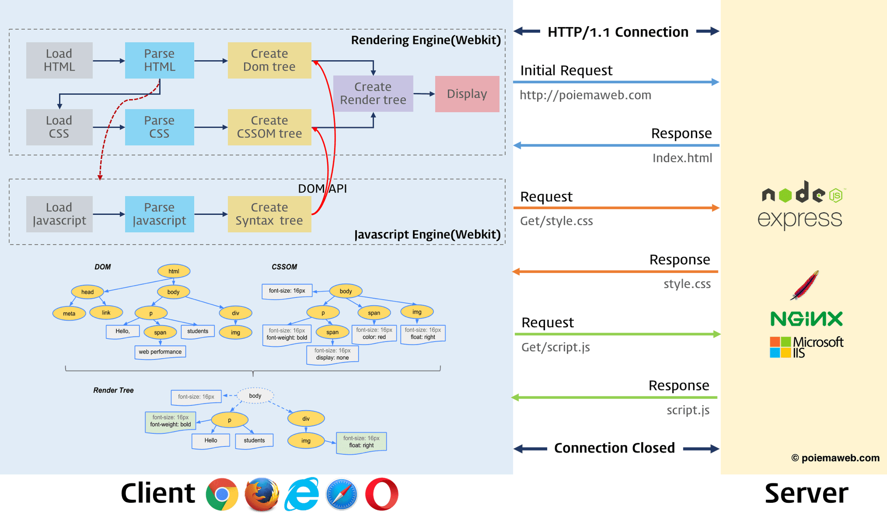

# 1. 핵심 내용

<figure>
    
    <figcaption>From 모던 자바스크립트 Deep Dive. By 이웅모.</figcaption>
</figure>

1. 브라우저는 HTML, CSS, JS 등 렌더링에 필요한 리소스르르 요청하고 서버로부터 응답받는다.
2. 브라우저 렌더링 엔진이 HTML과 CSS를 파싱하역 각각 DOM과 CSSOM을 생성한다. 그리고 이들을 결합하여 렌더 트리를 생성한다.
3. 브라우저 자바스크립트 엔진은 JS를 파싱하여 AST -> 바이트코드를 새성하고 실행한다. 코드 실행과정에서 DOMAPI를 통해 DOM과 CSSOM을 변경할 수 있다.
4. 렌더 트리를 기반으로 HTML요소를 배치(Layout) -> 색칠(Paint) -> 합성(Composite)한다.

# 2. DOM

## 2.1. DOM이란?

HTML 문서를 파싱하여 DOM을 만든다. DOM(Document Object Model)이란 HTM문서를 분석하여 **JavaScrpt언어로 접근할 수 있도록 만드 계층적인 트리 자료구조**이다. DOM은 노드 객체로 이루어져 있다. 말 그대로 객체이기 때문에 자바스크립트의 Object를 상속하며, 우리가 보통 사용하는 HTML요소의 경우, `HTMLElement`에 해당한다.

<figure>
    
    <figcaption>From 모던 자바스크립트 Deep Dive. By 이웅모.</figcaption>
</figure>

## 2. DOM 생성

브라우저 렌더링엔진이 HTML으로부터 DOM을 생성하는 과정은 다음과 같다.

1. 브라우저는 서버로부터 HTML 문서를 **바이트(2진수)** 형태로 응답받는다.
2. HTML문서의 meta태그 charset 어트리뷰트에 지정된 인코딩 방식(예:UTF-8)에 따라 **문자열**로 변환한다.
3. 문자열로 변환된 HTML문서를 파싱하여, 문법적 의미의 최소 단위인 <b>토큰(token)</b>으로 파싱한다.
4. 각 토큰드을 객체로 변환하여 **노드(node)**를 생성한다. 토큰의 내용에 따라 Document, Element, Attr 등의 노드가 생성된다.
5. HTML요소 중처 관계에 따라 **트리 자료구조**를 만든다.

# 3. CSSOM

HTML이 DOM으로 변환된 것과 마차가지로, CSS파일을 CSSOM(CSS Object Model)으로 변환한다. DOM과 마찬가지로 CSS요소를 프로그래밍적으로 조작하는 데 사용되는 자료구조이다.

1. HTML 파일을 해석하는 중, link 태그를 만나면 DOM생성을 이시 중지하고 CSS파일을 요청한다.
2. 브라우저는 서버로부터 CSS파일을 받아 HTML과 동일하게 **바이트(2진수) -> 자열 -> 토큰(token) -> 노드(node) -> 트리 자료구조**의 과정으로 변환한다.

# 4. 렌더 트리

DOM과 CSSOM을 결합하여 렌더 트리(render tree)를 생성한다. 렌더링을 위한 자료구조이기 때문에 렌더링되지 않는 노드들은 표현되지 않는다. 예를 들어 meta태그, script태그, `disaplay: none`에 해당하는 노드들이 제외된다.

# 4. The Pixel Pipeline

브라우저 렌더링은 다음 5가지의 주요 절차를 거친다. 변경되는 CSS 스타일에 따라 일부 절차를 생략할 수 있으며, 이는 [CSS Triggers](https://csstriggers.com/) 사이트에서 확인할 수 있다.

- **JavaScript**  
  JavaScript 코드가 실행되며 UI요소를 바꿀 수 있다. 예를 들어 요소를 추가하거나 선택자를 바꾸거나 CSS 애니메이션을 실행시킬 수 있다.
- **Style Caculation**  
  대응하는 선택자의 CSS 규칙을 적용하는 과정이다. 적용된 스타일 규칙을 기반으로 각 요소에 대한 최종 스타일을 계산한다
- **Layout**  
  요소를 화면에 배치하는 과정이다. 요소가 화면에서 차지하는 공간의 크기나 기준 위치가 바뀔 때마다 실행된다.
- **Paint**  
  말 그대로 픽셀을 채우는 과정이다. 텍스트, 색상, 이미지, 테두리 및 그림자를 그리는 것을 포함하며, 기본적으로 요소의 모든 시각적 부분을 색칠한다.
- **Composite**  
  페이지의 여러 레이어를 올바른 순서로 화면에 그리는 과정이다. 요소가 서로 겹치는 부분에 대해서 이 과정이 중요하다.

## 4.1. 리플로우 (Reflow)

앞 선 모든 과정을 거치는 경우로, **가장 많은 계산**이 이뤄진다. 일반적으로 **요소의 크기나 위치**를 바꾸는 속성들이 리플로우를 발생시킨다.

- position, left, top, right, botoom
- width, height, margin, padding
- border, border-width
- display, float, overflow
- font-family, font-size, font-weight
- text-align, vertical-align...

## 4.2. 리페인트 (Repaint)

앞 선 과정 중에서 Layout 절차가 생략된다. 일반적으로 요소의 위치를 고정한 채, **시각적인 스타일**을 바꾸는 속성들이 리페인트를 발생시킨다.

- backgrond, box-shadow
- border-raius, border-style
- color, outine, text-decoration

## 4.3. 컴포지트 (Composite)

앞 선 모든 과정 중에서 Layout과 Paint 절차가 생략되며, **가장 적은 계산**이 이뤄진다. 다음 두가지 CSS 속성이 대표적이다.

- transform
- opacity

# 5. 자바스크립트

자바스크립트는 DOM과 CSSOM을 통해 렌더트리를 수정할 수 있다. 따라서 브라우저 렌더링을 더 깊이 이해하기 위해서는, HTML과 CSS뿐만 아니라 자바스크립트 또한 어떻게 실행되는지 알아야 한다.

## 5.1. 자바스크립트 파싱

브라우저 렌더링 엔진이 HTML문서를 해석하다가 script 태그를 만나면, DOM 생성을 일시 중단하고 **자바스크립트 엔진에 제어권**을 넘긴다. 제어권을 넘겨받은 자바스크립트 엔진은 **코드를 파싱해서 실행한 뒤 다시 제어권을 돌려준다**. 브라우저 렌더링 엔진이 제어권을 넘겨 받으면 HTML 파싱이 중단된 지점부터 다시 DOM 생성을 재개한다.

자바스크립트 파싱과정은 다음과 과정을 따른다. 이 때 AST(Abstract Syntax Tree)는 자바스크립트 인터프리터 뿐 아니라, 타입스크립트 컴파일러나 Babel 트랜스파일러 등에서도 사용되는 중요한 자료구조이다. 다양한 목적을 위한 AST 생성을 [AST Explorer](https://astexplorer.net/)웹사이트에서 확인할 수 있다.

<figure>
    
    <figcaption>From 모던 자바스크립트 Deep Dive. By 이웅모.</figcaption>
</figure>

1. 문자열 자바스크립트 코드를 어휘 분석하여, 문법저 의미의 최소단위인 토큰(token)으로 분해한다.
2. 토큰들의 집합을 구문 분석하여, AST(추상 구문 트리)를 생성한다.
3. AST는 인터프리터가 해석할 수 있는 바이트코드로 변한되어 실행된다. 참고로 V8엔진은 터보팬이라 불리는 컴파일러에 의해 최적화된 머신코드로 컴파일 되는 과정을 추가로 거친다.

## 5.2. HTML 파싱 중단

앞서 말했다시피 HTML 문서를 파싱하다 script태그를 만나면, 자바스크립트 엔진에 제어권이 넘어가고 HTML 파싱이 중단된다. 하지만 보통 **HTML 파싱이 JavaScript 실행보다 더 중요**하다. 일단 HTML은 화면 렌더링을 위한 필수요소이기 때문이다. CRA 프로젝트에서는 JavaScript의 중요도가 그 못지 않지만, 여전히 다음의 이유로 HTML이 더 중요하다. JavaSCript가 DOM API를 사용하기 위해서는 HTML 파싱이 선행되어야 한다. 즉 DOM이 만들어지지 않으면 CRA 프로젝트의 JavaScript코드도 정상 동작할 수 없다.

이러한 문제를 해결하기 위해 HTML5부터 script태그에 `async`와 `defer`어트리뷰트가 추가되었다. 둘 다 **자바스크립트 엔진에 제어권을 넘기는 시점을 지연**시킨다는 공통점이 있다.

- **async 어트리뷰트**  
    
  HTML 파싱과 자바스크립트의 로드가 비동기적으로 동시 진행된다. 자바스크립트 파싱은 **파일이 로드된 직후** 진행된다.

- **defer 어트리뷰트**  
    
  HTML 파싱과 자바스크립트의 로드가 비동기적으로 동시 진행된다. 자바스크립트 파싱은 **DOM 생성이 완료된 직후** 진행된다.

# 참고자료

- 이웅모: 모던 자바스크립트 Deep Dive, 38장 브라우저의 렌더링 과정
- [10분 테코톡: 체프의 브라우저 렌더링](https://www.youtube.com/watch?v=sJ14cWjrNis)
- [제주코딩베이스캠프: 브라우저는 어떻게 화면을 렌더링할까?](https://www.youtube.com/watch?v=z1Jj7Xg-TkU)
- [Paul Lewis: Rendering Performance](https://web.dev/rendering-performance/)
- [CSS triggers](https://csstriggers.com/)
