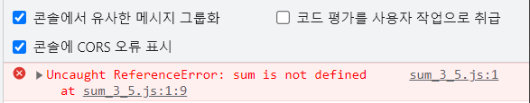

> [Chullin: 웹팩(3/4); JS모듈화 역사 돌아보기(1)](https://medium.com/@chullino/%EC%9B%B9%ED%8C%A9-3-4-js%EB%AA%A8%EB%93%88%ED%99%94-%EC%97%AD%EC%82%AC-%EB%8F%8C%EC%95%84%EB%B3%B4%EA%B8%B0-1-9df997f82002)글을 많이 참고했습니다

JavaScript(자바스크립트)를 배운 지 1년도 채 되지 않았다. 따라서 나한테는 지금의 자바스크립트가 전부이자 변함없는 언어라고 느껴지지만, 실상을 파헤쳐보면 자바스크립트만큼 파란만장했던 언어도 없을 것이다. 심지어 그러한 변화는 아직도 현쟁진행 중이다.

# 1. JavaScript 모듈

## 1.1. 모듈의 부재

JavaScript는 과거 인터넷 브라우저 회사였던, Netscape(넷스케이프)의 Brendan Eich(브렌던 아이크)에 의해 만들어졌다. 처음 "Mocha"라는 이름으로 개발되었으며, 나중에 "LiveScript" -> "JavaScript"로 이름이 변경되었다.

그런데 Eich가 처음 자바스크립트를 만들 때, 이를 [웹 디자이너와 **파트타임 개발자**가 소통할 수 있는 언어](https://webdevelopmenthistory.com/1995-the-birth-of-javascript/)정도로 여겼다고 한다. 따라서 자바스크립트가 진정한 프로그래밍 언어로 거듭나기 위해서는 부족한 부분을 채워나가야했는데, 그 중 하나가 바로 모듈 시스템이다.

> Eich saw JavaScript at the time as “a ‘glue language’ for the Web designers and part time programmers who were building Web content from components such as images, plugins, and Java applets.”

## 1.2. 모듈의 필요성

프로젝트의 확장성을 위해서는 모듈 시스템이 필요하다. 따라서 대부분의 언어는 모듈 기능을 기자고 있다. (C언어는 `#include` 자바와 파이썬은 `import`)

1. **전역 스코프 관리**

   모듈시스템이 없으면 변수가 전역스코프에 선언된다. 따라서 아래 예시처럼 나중에 <mark>변수명이 중복될 경우,</mark> 나중에 선언된 변수가 이전 변수를 덮어씌운다.

   ```html
   <!DOCTYPE html>
   <html>
     <head>
       <script src="./foo.js"></script>
       <script src="./bar.js"></script>
       <script>
         console.log('x =', x)
       </script>
     </head>
     <body>
       ...
     </body>
   </html>
   ```

   ```js
   // foo.js
   var x = 'foo'
   ```

   ```js
   // bar.js
   var x = 'bar'
   ```

   

2. **의존성 관리**

   어찌저찌 엄청난 설계로 모듈이름이 한번도 중복되지 않았다고 한들, 모듈간 의존성 관계에 따라 로드하는 순서를 맞춰줘야한다.

   ```html
   <!DOCTYPE html>
   <html>
     <head>
       <script src="./sum_3_5.js"></script>
       <script src="./sum.js"></script>
     </head>
     <body>
       ...
     </body>
   </html>
   ```

   ```js
   // sum_3_5.js
   console.log('3 + 5 =', sum(3, 5))
   ```

   ```js
   // sum.js
   function sum(a, b) {
     return a + b
   }
   ```

   

## 1.3. 모듈의 조건

바로 윗절의 이유들을 바탕으로 모듈의 조건을 정의하면 아래와 같다. 이제부터 설명할 모듈 시스템은 모두 아래 조건을 만족한다.

1. 각 모듈은 **독립적인 스코프**를 가져야 한다. 즉 전역스코프를 오염해선 안된다.
2. **모듈 간의 의존성**이 관리되어야한다. 즉 하나의 모듈이 다른 모듈을 참조할 때, 모듈들의 로드 순서가 보장되어야 한다.
3. 시멘틱하게 임포트할 수 있어야 한다. 즉 모듀를 로드할 때 이름을 새롭게 지을 수 있어야 한다.

# 2. commonJS

## 2.1. 역사

가장 먼저 시작된 모듈 시스템은 commonJS이다. 어느 날, Mozilla의 개발자 Kevin Dangoor가 [JavaScript 서버 사이드 언어가 되기 위해서 필요한 것(What Server Side JavaScript needs)](https://www.blueskyonmars.com/2009/01/29/what-server-side-javascript-needs/)들을 정리해서 게시했다. 이에 많은 이들이 동참하여 첫 JavaScript 모듈시스템을 만든다. JavaScript의 표준을 정의하는 ECMASCript와 연계하지 않고 진행되었기 때문에 JavaScript 언어 자체가 지원하는 모듈 시스템이 아니다. 하지만 Node.js라는 범용성 있는 JavaScript 런타임 환경이 commonJS 명세를 따랐기 때문에 오랜기간 사실상 표준(de facto standard)으로 작용했다.

## 2.2. 문법

- **모듈 선언**

  하나의 모듈(파일)은 하나의 객체로 묶여서 export 된다. 다음 두가지 방법으로 객체의 프로퍼티를 지정할 수 있다.

  ```js
  // 한 개 객체 내보내기
  const math = {
    num: 1,
    sum: function (a, b) {
      console.log(a + b)
    },
    sub: function (a, b) {
      console.log(a - b)
    },
  }

  module.exports = math
  ```

  ```js
  // 각각의 프로퍼티 내보내기
  exports.num = 1
  exports.sum = function (a, b) {
    console.log(a + b)
  }
  exports.sub = function (a, b) {
    console.log(a - b)
  }
  ```

- **모듈 사용**

  전체 객체를 특정 변수에 할당할 수도 있고, destruct해서 사용할 수도 있다.

  ```js
  const obj = require('./bar.js')

  console.log(obj.num) // 1
  obj.sum(1, 2) // 3
  obj.sub(1, 2) // -1
  ```

  ```js
  const { num, sum, sub } = require('./foo.js')

  console.log(num) // 1
  sum(1, 2) // 3
  sub(1, 2) // -1
  ```

## 2.3. 한계점

**commonJS는 동기적으로 모듈을 로드한다.**

[Kevin Dangoor가 쓴 글](https://www.blueskyonmars.com/2009/01/29/what-server-side-javascript-needs/)의 제목에서부터 알 수 있다시피 <b>서버 사이드(server-side)</b>를 위한 모듈 시스템이다. 처음 이름조차 원래 commonJS가 아닌 serverJS였다고 한다. 그로 인한 발생한 한계점이 바로 모듈을 동기적으로 로드한다는 것이다.

서버사이드의 경우 모듈이 정의된 함수가 보통 파일시스템에 존재한다. 컴퓨터에서 파일을 읽는 것도 I/O작업에 포함되지만, 네트워크 통신보다야 훨씬 빠르다. 또한 서버측의 프로세스는 한 번 실행되면 오랫동안 메모리에 머무른다. 반면 클라이언트측은 브라우저를 새로고침할때마다 모듈을 다시 받아와야한다. 이러한 맥락에서 동기적인 모듈로딩은 클라이언트측 JavaScript에게 적합하지 않았다.

# 3. AMD

## 3.1. 역사

AMD(Asynchronous Module Definition)는 commonJS에서 비동기 모듈 로딩에 대한 합의점을 찾지 못한 사람들이 만든 JavaScript 모듈 시스템이다. 이름에서처럼 **비동기 모듈 로딩을 지원**한다.

AMD 모듈 시스템을 사용하기 위해서는 **별도의 라이브러리를 사용**해야한다. ECMAScript와 Node.js 모두 공식적으로 AMD를 지원하지 않기 때문이다. 그 중 <b>가장 대표적인 것이 [requireJS](https://requirejs.org/)</b>이다. 아래 예시 코드를 보면 모듈을 선언하고 사용하는데 `define()`과 `require()`함수를 사용한다 (이 때 require는 commonJS의 require가 아니다). 그 말인 즉슨 해당 함수들이 전역적으로 어딘가에 선언되어 있어야 한다는 말이다. 그리고 해당 함수들은 AMD 스펙에 따라 구현한 라이브러리 중 하나가 requireJS이다.

## 3.2. 문법

- **모듈 선언**

  AMD는 모듈을 선언할 때 의존하는 모듈을 비동기적으로 로드한다.

  ```js
  // 의존성이 없을 경우
  define([], function () {
    return {
      sum: function (a, b) a + b,
    }
  })
  ```

  ```js
  // 의존성이 있을 경우
  define(['sum'], function (sum) {
    return {
      sub: function (a, b) {
        return sum.sum(a, -b)
      },
    }
  })
  ```

- **모듈 사용**

  모듈을 사용할 때 사용하고자 하는 모듈을 비동기적으로 로드한다.

  ```js
  require(['sub'], function (sub) {
    console.log(sub.sub(5, 2))
  })
  ```

- **html 예시**

  앞서 말한 것처럼 AMD 모듈을 사용하기 위해서는 이를 구현한 라이브러리를 전역적으로 선언해줘야 한다.

  ```html
  <!DOCTYPE html>
  <html lang="en">
    <head>
      <meta charset="UTF-8" />
      <meta name="viewport" content="width=device-width, initial-scale=1.0" />
      <title>Document</title>
      <!-- requireJS 라이브러리  -->
      <script src="https://cdnjs.cloudflare.com/ajax/libs/require.js/2.3.6/require.min.js"></script>
      <!-- AMD 방식의 모듈 사용 -->
      <script>
        require(['./sub'], function (sub) {
          console.log(sub.sub(5, 2))
        })
      </script>
    </head>
    <body></body>
  </html>
  ```

  

## 3.3. 한계점

**공식적으로 지원하는 환경이 없다**

앞서 말했듯이 ECMAScript나 Node.js모두 AMD를 공식적으로 지원하지 않기 때문에 AMD를 사용하기 위해서는 requireJS와 같은 라이브러리를 사용해야한다.

**이미 대부분의 라이브러리가 commonJS로 작성되었다**

commonJS가 이미 JavaScript의 모듈시스템을 선점한 뒤 나온터라, 2010년 즈음 등장한 npm은 많은 라이브러리들이 이미 commonJS로 설계되었다. 따라서 해당 라이브러리들을 브라우저에서 사용하기 위해서는 개발자들이 AMD 형식으로 다시 한번 선언해줘야하는 번거로움을 감수해야했다.

# 4. UMD

## 4.1. 역사

UMD(Universal Module Definition)는 개발자 커뮤니티에서 채택된 **모듈 선언 패턴**으로, 다양한 **모듈시스템 간 호환**해서 사용할 수 있다. 아래 코드를 보면 알겠지만 새로운 모듈시스템이 아니다.

## 4.2. 문법

- **모듈 선언**  
   UMD 패턴은 <mark>즉시 실행 함수</mark>로 구현할 수 있다. 모듈이 로드되는 시점에 실행환경의 모듈시스템을 분기하는 `if` 조건문을 실행한다. 그리고 분기된 조건에 맞는 모듈시스템으로 모듈을 선언한다.

  ```js
  /* prettier-ignore */

  // 즉시 실행 함수
  // 첫번째 인자로 전역 객체, 두번째 인자로 실제 코드 내용을 받는다
  (function (root, factory) {
    if (typeof define === 'function' && define.amd) {
      // AMD 환경
      define(['./sum'], factory)
    } else if (typeof exports === 'object') {
      // CommonJS 환경
      module.exports = factory(require('./sum'))
    } else {
      // 브라우저 환경
      root.sub = factory(root.sum)
    }
  })(typeof self !== 'undefined' ? self : this, function (sum) {
    // 실제 코드 내용
    function sub(a, b) {
      return sum.sum(a, -b)
    }
  
    return {
      sub: sub,
    }
  })
  ```

# 5. ESM

## 5.1. 역사

2015년 6월, ES6와 함께 ESM(ECMAScript Modules)이 등장했다. (2022년부터 프로그래밍을 배운 나에게는 너무 당연한 ESM이었는데, 실제 역사가 굉장히 짧았다는 사실이 놀라웠다)

ECMAScript의 위엄에 힘입어 현재 모든 브라우저가 지원하며, Node.js 또한 14버전부터 공식적으로 ESM을 지원하기 시작했다. 앞으로 ESM이 표준 모듈시스템으로 자리잡을 것이라는 전망이 우세하다. 어떻게 보면 나는 쓰잘데기없는 내용들을 정리한 것이다.

## 5.2. 문법

- **모듈 선언**

  하나의 모듈(파일)은 하나의 객체로 묶여서 export 된다. 다음 두가지 방법으로 객체의 프로퍼티를 지정할 수 있다.

  ```js
  // 한 개 객체 내보내기
  const math = {
    num: 1,
    sum: function (a, b) {
      console.log(a + b)
    },
    sub: function (a, b) {
      console.log(a - b)
    },
  }

  export default math
  ```

  ```js
  // 각각의 프로퍼티 내보내기
  export const num = 1
  export function sum(a, b) {
    console.log(a + b)
  }
  export function sub(a, b) {
    console.log(a - b)
  }
  ```

- **모듈 사용**

  전체 객체를 특정 변수에 할당할 수도 있고, destruct해서 사용할 수도 있다.

  ```js
  import obj from './foo.mjs'

  console.log(obj.num) // 1
  obj.sum(1, 2) // 3
  obj.sub(1, 2) // -1
  ```

  ```js
  import { num, sum, sub } from './bar.mjs'

  console.log(num) // 1
  sum(1, 2) // 3
  sub(1, 2) // -1
  ```

## 5.3. 동적 로딩

ESM은 commonJS처럼 동적 모듈 로딩(dynamic import) 기능을 지원한다. 때때로 어떤 글에서는 esm이 동적 모듈 로딩를 지원하지 않는다고 하는데, 거기서 말하는데 동적로딩은 다른걸 의미하는건지 잘 이해가 안간다.

아래 코드처럼 `import()`함수는 Promise객체를 반환하고, 성공적으로 로드시 로드된 모듈을 then 체이닝의 인자로 반환한다.

```js
import('./myModule.js')
  .then((module) => {
    const result = module.someFunction()
    console.log(result)
  })
  .catch((error) => {
    console.error(error)
  })
```

# 8. 참고자료

- [Chullin: 웹팩(3/4); JS모듈화 역사 돌아보기(1)](https://medium.com/@chullino/%EC%9B%B9%ED%8C%A9-3-4-js%EB%AA%A8%EB%93%88%ED%99%94-%EC%97%AD%EC%82%AC-%EB%8F%8C%EC%95%84%EB%B3%B4%EA%B8%B0-1-9df997f82002)
- [짐코딩: 자바스크립트 모듈 시스템 | ES 모듈 | CommonJS 모듈](https://www.youtube.com/watch?v=5NXEXkIrkAk)
- [Kevin Dangoor: what-server-side-javascript-needs](https://www.blueskyonmars.com/2009/01/29/what-server-side-javascript-needs/)
- [blog.rhostem.com: UMD(Universal Module Definition) 패턴](https://blog.rhostem.com/posts/2019-06-23-universal-module-definition-pattern)
