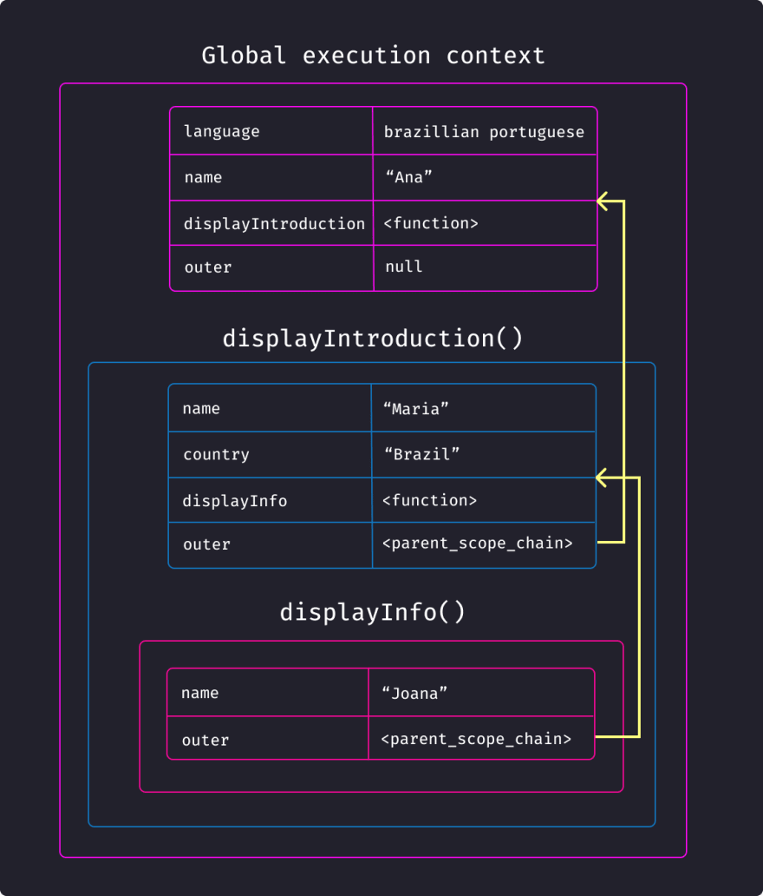

> [10분 테코톡: 하루의 실행 컨텍스트](https://www.youtube.com/watch?v=EWfujNzSUmw) 영상을 참조해서 작성한 글이다
>
> 우테코는 도대체 무슨 짓을 꾸미고 있는 것일까... 여기 테코톡은 매번 볼 때마다 놀랍다. 특히 이번 영상은 감탄마저 나올 정도였다👍

# 1. 실행 컨텍스트(Execute Context)

실행 컨텍스트야말로 자바스크립트의 핶씜 개념이라고 할 수 있다. 실행 컨텍스트 하나로 다른 중요 개념들(Hoisting, Scope, Closure)도 설명할 수 있다. 그야말로 핵심 중의 핵심, 기본 중의 기본, 원조 중의 원조라고 할 수 있다.

이렇게 듣도보도 못한 개념이 중요하다고 등장하면, 마치 세상이 나를 상대로 몰래카메라를 찍는 것만 같다.

## 1.1. 실행 컨텍스트의 구성

- **Variable Environment**  
  함수 최초 실행 시점에 정의되고 변하지 않는다. 이를 복사해서 Lexical Scope를 만든다. 스냅샷 정보를 유지하기 위한 목적으로 사용된다는데, 정확한 사용처는 모르겠다.

  - Environment Record (snapshot)
    - 매개변수 식별자
    - 함수 자체
    - 함수 내부의 식별자
  - OuterEnvironment Reference (snapshot)
    - 외부 스코프 참조값

- **Lexical Environment**  
  Variable Environment를 복사해서 만들며, 실시간으로 변경사항이 반영된다. 실질적으로 코드 실행을 위해서 참조되는 구성요소이다.

  - Environment Record
    - 매개변수 식별자
    - 함수 자체
    - 함수 내부의 식별자
  - OuterEnvironment Reference
    - 외부 스코프 참조값

- **This Binding**
  - 함수 내의 `this`가 바라봐야할 객체를 저장한다.

## 1.2. 실행 컨텍스트의 동작

실행컨텍스트는 **콜 스택(call stack)**과 동일하게 동작한다. 함수가 호출되는 시점이 실행 컨텍스트가 생성되어 콜 스택에 쌓이고, 함수가 종료되는 시점에 해당 실행 컨텍스트가 콜 스택에서 제거된다.


# 2. 호이스팅(Hoisiting)

호이스팅은 실행 컨텍스트의 Environment Record와 관련이 있다.

## 2.1. 호이스팅이란?

**변수/함수 선언이 함수 스코프의 최상단에 끌어올려진 것"처럼" 보이는 현상**을 말한다. 왜 이러한 현상이 일어나는지는 실행컨텍스트의 관점에서 나중에 확인해 볼 예정이다.

## 2.2. 변수 호이스팅

변수를 `var`키워드를 선언하면, 선언문 이전에도 변수를 undefined값으로 참조할 수 있다.

```js
var foo = 'Hello'

function inner() {
  console.log(foo) // undefined
  var foo = 'Hi'
  console.log(foo) // Hi
}

inner()
```

```js
let foo = 'Hello'

function inner() {
  console.log(foo) // Reference Error
  let foo = 'Hi'
  console.log(foo) // Hi
}

inner()
```

```js
const foo = 'Hello'

function inner() {
  console.log(foo) // Reference Error
  const foo = 'Hi'
  console.log(foo) // Hi
}

inner()
```

## 2.3. 함수 호이스팅

`function`키워드와 함께 함수 선언식을 사용하면, 선언문 이전에도 함수를 그대로 참조할 수 있다.

```js
study() // I'm studying

function study() {
  console.log("I'm studying")
}
```

```js
study() // Type Error

var study = () => {
  console.log("I'm studying")
}
```

```js
study() // Reference Error

const study = () => {
  console.log("I'm studying")
}
```

## 2.4. 호이스팅의 원인

JavaScript가 변수/함수를 참조할 때는 Lexical Environment의 Environment Record를 사용한다. **즉 호이스팅의 원인은 Environment Record에 있다.**

Environment Record는 다음 두가지 단계를 거쳐 생성되고 수정된다. 호이스팅의 원인은 **생성 단계**에서 발생한다.

- **생성 단계(Creation Phase)**  
  선언문만 실행해서 Environment Record에 기록한다. <mark>`var`키워드로 선언된 변수는 `undefined`로 초기화한다. `function`키워드로 선언된 함수 표현식은 해당 함수로 바로 초기화한다.</mark>

- **실행 단계(Creation Phase)**  
  선언문 외의 나머지 코드를 순차 실행하며 Environment Record를 업데이트 한다.

즉, `var`와 `function`키워드에 대해서 **Envrionment Record가 자동으로 초기화된 값을 사용**하기 때문에 호이스팅이 발생한다. `let`과 `const`의 경우, 이러한 자동 초기화가 없기 때문에 선언문 이전에 값을 참조하려고 하면 Rererence Error가 발생한다.

# 3. 스코프(Scope)

스코프(Scope)는 한마디로 **변수/함수에 접근할 수 있는 범위**를 말한다.

## 3.1. 블록 레벨 스코프

`let`과 `const`는 블록 레벨 스코프로 동작한다. 이는 대부분의 프로그래밍 언어가 동작하는 방식과 유사하다.

```js
const foo = 'Hi'

function inner() {
  const foo = 'Hello'
  if (true) {
    const foo = 'Morning'
    console.log(foo) // Morning
  }
  console.log(foo) // Hello
}

inner()
console.log(foo) // Hi
```

## 3.2. 함수 레벨 스코프

`var`는 함수 레벨 스코프로 동작한다.

```js
var foo = 'Hi'

function inner() {
  var foo = 'Hello'
  if (true) {
    var foo = 'Morning'
    console.log(foo) // Morning
  }
  console.log(foo) // Morning
}

inner()
console.log(foo) // Hi
```

## 3.2. 스코프 체이닝 & 렉시컬 스코프

스코프 체이닝이란, **현재 스코프에 원하는 함수/변수를 찾을 수 없을 경우, 상위 스코프에서 탐색을 시도**하는 것을 말한다. 이러한 시도는 가장 상위 객체(`window`, or `global`)에 도달할 때까지 반복된다.

그런데 상위 스코프의 기준이 무엇일까? 자바스크립트에서 상위 스코프를 결정지을 때, **렉시컬 스코프(정적 스코프)를 따른다**. 즉, 함수가 호출되는 시점이 아닌 선언되는 시점을 기준으로 상위 스코프를 평가한다. 아래 예시코드를 통해서 렉시컬 스코프를 확인할 수 있다.

```js
const foo = 'foo'

const func1 = () => {
  const foo1 = 'foo1'
  console.log(foo, foo1) // foo foo1
  console.log(foo2) // Reference Error
}

const func2 = () => {
  const foo2 = 'foo2'
  const func3 = () => {
    const foo3 = 'foo3'
    console.log(foo, foo3) // foo foo3
    console.log(foo2) // foo2
  }
  func1()
  return func3
}

const func3 = func2()
func3()
```

- func2가 func1을 호출했지만, func1 내부에서는 func2의 변수를 참조하지 못한다.
- func3가 전역 스코프에서 호출했음에도, func3 내부에서 func2의 변수를 참조할 수 있다.

## 3.3. 스코프 체이닝의 원리

JavaScript가 스코프 체이닝을 위해 상위 스코프를 찾을 때, Lexical Environment의 Outer Environment Reference를 사용한다. **즉 Outer Environment Reference에 상위 스코프에 해당하는 실행컨텍스트 값을 저장한다.**

헷갈리지 말아야 할 것이, 실행 컨텍스트가 콜스택 방식으로 쌓인다고해서 Outer Environment Reference가 자신을 호출한 컨텍스트를 가리키는게 아니라는 것이다. 계속 얘기한 것처럼 Outer Environment Reference는 렉시컬 스코프 방식으로 결정된다.



# 4. 클로져(Closure)

**클로저는 함수와 그 함수가 선언됐을 때의 렉시컬 환경(Lexical environment)과의 조합이다.** 좀 더 풀어서 설명하면, 어떤 함수가 반환되었을 때 그 함수는 자신의 렉시컬 스코프를 기억하고 있다.

```js
const func0 = () => {
  const year = '2023'
  const func1 = () => {
    const month = '9'
    const func2 = () => {
      const day = '20'
      const func3 = () => {
        console.log(year + '.' + month + '.' + day)
      }
      return func3
    }
    return func2()
  }
  return func1()
}

const today = func0()
today() // 2023.9.20
```

## 4.1. 클로져의 원리

클로져는 말 그대로 함수가 자신의 Lexical Scoope를 기억하기 때문이다. 실행컨텍스트가 콜 스택에서 제거되었더라도, **Lexical Scoope는 내부함수에 의해 참조되는 한 계속 유효하다.**

그리고 이 Lexcial Scope에는 Environment Record와 OuterEnvironment Reference가 포함되기 때문에, 클로져는 자기 내부의 변수/함수는 물론이고 스코프 체이닝이 가능하다. 위의 예시코드의 `today`를 콘솔 찍으면 스코프 체이닝을 확인할 수 있다.

```js
console.dir(today)
```


# 참고자료

- [10분 테코톡: 하루의 실행 컨텍스트](https://www.youtube.com/watch?v=EWfujNzSUmw)
- [10분 테코톡: 엘라의 Scope & Closure](https://www.youtube.com/watch?v=PVYjfrgZhtU)
- [Ung-mo Lee: 클로저](https://poiemaweb.com/js-closure?source=post_page-----9ffeec528eb7--------------------------------)
- [황준일: 자바스크립트 실행 컨텍스트](https://junilhwang.github.io/TIL/Javascript/Domain/Execution-Context/#_5-this)
